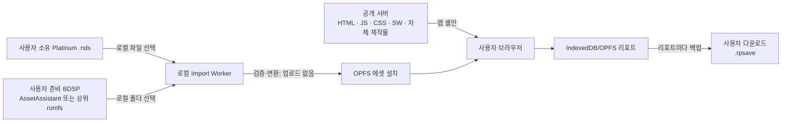
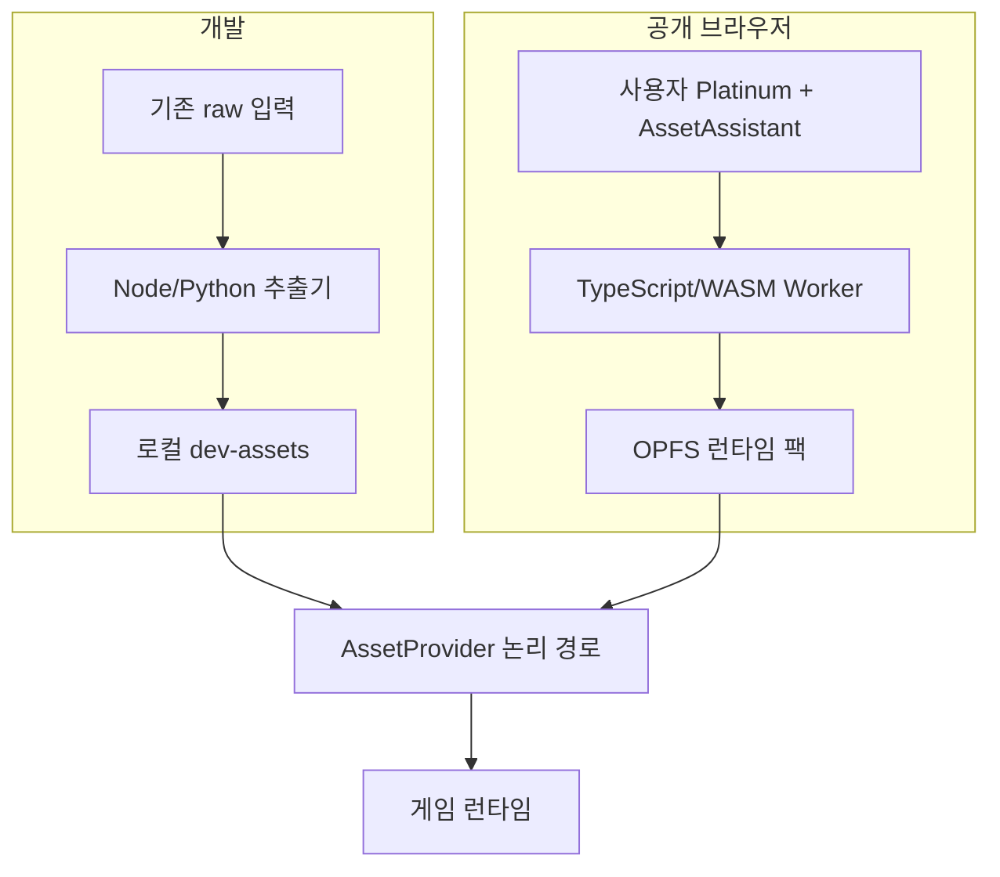

# 저작권·배포·브라우저 로컬 Import 정책

> 상태: **2026-08-10 확정안**. 이전의 “앱 셸 + 원본 유래 에셋 CDN” 결정은 폐기한다.
> 구현·사용자 안내는 [IMPORT.md](IMPORT.md), 데이터 변환 규격은 [DATA.md](DATA.md),
> 작업 순서는 [PLAN.md](PLAN.md)를 따른다.

이 문서는 프로젝트 오너가 택한 배포 정책과 위험 수용 범위를 기록한다. 법률 자문이나
권리자의 허락을 대신하지 않는다.

---

## 1. 최종 결정

Radiant Platinum은 **비공식·비영리 Pokémon 팬게임**으로 계속 만든다. 3D화와 원작
정합성이라는 정체성도 유지한다. 다만 공개 서버가 원본 또는 원본에서 변환한 게임
데이터를 배포하는 구조는 사용하지 않는다.

공개판은 다음처럼 동작한다.

1. 서버는 HTML·JavaScript·CSS·서비스 워커·자체 제작 아이콘 등 **앱 셸만** 제공한다.
2. 사용자는 자신이 적법하게 보유하고 준비한 호환 Pokémon Platinum `.nds` 파일을
   브라우저에서 선택한다.
3. 사용자는 자신이 적법하게 보유한 Pokémon Brilliant Diamond에서 이미 추출해 둔
   `Data/StreamingAssets/AssetAssistant/` 폴더 또는 그 상위 `romfs` 폴더를 선택한다.
4. 검증·추출·변환은 전부 브라우저의 Worker에서 수행하고 결과는 같은 브라우저
   오리진의 OPFS에만 저장한다.
5. 원본 파일·파일명·해시·폴더 목록·변환 결과는 서버로 전송하지 않는다.
6. 리포트는 브라우저 저장소에 남기면서 **매번 휴대용 `.rpsave` 다운로드를 함께
   시도**한다. 사용자는 그 파일을 다시 불러올 수 있다.

이 구조는 원본 유래 파일을 프로젝트가 직접 호스팅·전송하는 위험을 크게 낮춘다.
그러나 팬게임 자체의 2차적저작물성, Pokémon 표지 사용, 권리자의 삭제 요청 가능성은
없애지 못한다. **“안전하다”거나 “삭제를 피한다”는 보장은 없다.**

---

## 2. 데이터와 신뢰 경계



| 위치 | 허용 | 금지 |
|---|---|---|
| 공개 서버·배포 ZIP | 앱 셸, 자체 제작 UI·아이콘, 변환 코드, 비표현적 호환성 메타데이터 | ROM, romfs, AssetBundle, 대사·음악·모델·텍스처·맵·변환 GLB/PNG/JSON |
| 사용자 입력 | 호환 Platinum `.nds`, 이미 추출된 BDSP `AssetAssistant` 계열 폴더 | 다운로드 URL 입력, NSP/NCA, 키 파일, 암호화 우회 입력 |
| 브라우저 로컬 | 변환된 런타임 팩, 설치 매니페스트, 리포트 | 서버 동기화, 분석·오류 보고용 자동 업로드 |
| 개발자 로컬 `raw/` | 보유 원본, 추출물, 참조·중간물 | Git 추적, 프로덕션 빌드 포함, 정적 파일 서버 노출 |

“업로드”라는 UI 표현은 사용하지 않는다. 브라우저의 파일 선택기가 파일을 서버로
보낸다는 오해를 낳기 때문이다. 사용자 문구는 **“이 기기에서 선택”**, **“브라우저
안에서 변환”**, **“서버로 전송하지 않음”**으로 통일한다.

---

## 3. 무엇이 줄고 무엇이 남는가

| 위험 | 이 구조의 효과 | 남는 위험 |
|---|---|---|
| 원본 ROM·추출 에셋 직접 배포 | **줄었다.** 이 리포의 `raw/`·`public/data/`·`public/models/` 산출물이 `dist/`에 없다 — 매 빌드 재검사 + 브라우저에서 요청 0건 실측 | ⚠️ **"게임 유래 데이터 0"은 아직 아니다.** `@pkmn/sim`의 제3자 게임 데이터 8.5MB가 배포 JS에 남아 있고(DEPLOY.md §4), 과거 Git 히스토리도 그대로다 (§9) |
| 불법 복제물 취득을 돕는 행위 | 취득 링크와 우회 절차를 제공하지 않아 감소 | 사용자가 입력을 실제로 적법하게 준비했는지는 프로젝트가 보증할 수 없음 |
| 2차적저작물·캐릭터·스토리 이용 | 거의 줄지 않음 | 게임의 표현과 정체성이 Pokémon에 의존 |
| 상표·출처 혼동 | 비공식 표기로 일부 완화 | 제목과 화면에서 Pokémon 표지를 계속 사용 |
| 테이크다운·호스팅 중단 | 원본 유래 CDN이 없어 영향 범위가 줄어듦 | 권리자는 앱 셸·저장소·도메인에도 삭제를 요구할 수 있음 |
| 비영리성 | 상업성 위험을 낮춤 | 침해 여부를 자동으로 없애는 면책이 아님 |

현실적인 평가는 **실무 위험 중간**이다. 기존 CDN 안보다 낫지만, Renegade
Platinum 같은 패치 배포와 동일하지도 않다. 이 프로젝트는 독립 실행되는 3D
재구현이며 원작 표현을 폭넓게 사용하기 때문이다.

---

## 4. 공개 Importer가 받는 것과 받지 않는 것

### 받는 입력

- Pokémon Platinum의 지원 지역판 `.nds` 파일
- BDSP에서 이미 추출된 `AssetAssistant/` 폴더
- 사용 편의를 위해 `romfs/`, `Data/`, `StreamingAssets/` 같은 상위 폴더를
  선택해도 앱이 아래에서 `AssetAssistant/`를 탐색할 수 있다
- 추가 언어를 설치하려는 경우 그 언어의 호환 Platinum ROM을 별도로 선택할 수 있다

검증은 파일 크기 하나로 끝내지 않는다. 로컬에서 헤더·파일시스템 구조·필수 엔트리·
지원 버전 지문을 확인한다. 지문과 파일 목록은 서버로 보내지 않는다.

### 받지 않는 입력

- NSP·NCA·XCI 같은 배포 컨테이너
- `prod.keys`, `title.keys` 또는 다른 키 파일
- 암호화 해제·보호조치 우회가 필요한 입력
- 원본이나 추출물을 받는 URL
- 제3자가 만든 “미리 추출된 팩”
- 브라우저에서 만든 런타임 에셋 팩의 내보내기·공유

웹사이트는 폴더 선택, 예상 구조, 호환성 판정, 저장공간, 진행률, 오류 복구를 자세히
설명한다. ROM 다운로드, 콘솔 개조, 키 획득, NSP/NCA 복호화·추출 방법은 설명하거나
링크하지 않는다. 사용자가 `AssetAssistant`를 아직 준비하지 못했다면 Importer는
“지원되는 추출 폴더가 필요하다”에서 멈춘다.

---

## 5. 개발용 `raw/` 정책

현재 `raw/`는 약 10GB 규모이며 다음 종류가 이미 나뉘어 있다.

- `raw/roms/`: 개발자가 보유한 Platinum 입력
- `raw/extracted/`: 지역판별 Platinum 선추출물
- `raw/decomp/`, `raw/decomp-derived/`: 포맷 대조용 참조와 파생 표
- `raw/bdsp/`: BDSP 원천 하위 집합, 중간물, 변환 전 번들
- `raw/models/`: 개발용 모델 작업물

그러나 `raw/bdsp/` 안에는 공개 사용자가 선택할 원천 폴더와 개발 중간물·변환물이
섞여 있다. **기존 파일을 자동 이동·삭제·이름 변경하지 않는다.** 어댑터
(`tools/raw/sources.cjs`)가 현재 경로를 그대로 읽고, 아래 논리 구획으로
점진적으로 정리한다.

⚠️ **어댑터는 파일 이름에 기대지 않는다.** 여태 추출기 여럿이
`raw/roms/Pokemon Platinum (US).nds`를 통째로 적어 두었는데, 그 이름은 개발자가
자기 기계에서 붙인 것이다. 폴더의 `.nds`를 열어 **헤더의 게임 코드**로 찾는다 —
공개 Importer가 하는 판정과 같은 것이고, 지문 표
(`src/import/platinum/supported.json`)도 한 파일을 나눠 쓴다.

덮어쓰려면 Git이 무시하는 `raw.sources.local.json`을 둔다
(예시는 추적하는 `raw.sources.example.json`).

```text
raw/
  sources/                 # 사용자가 공개 Importer에 넣는 것과 동등한 원천
    platinum/<locale>.nds
    bdsp/AssetAssistant/...
  references/              # decomp 등 검증 전용; 런타임 입력 아님
  work/                    # 재생성 가능한 중간물
  dev-assets/              # 로컬 게임이 읽는 변환 결과
  legacy/                  # 검증 후 옮길 수 있는 기존 호환 경로
```

정리 전후 모두 지켜야 할 불변식:

- `raw/` 전체는 Git에서 무시한다.
- 원본과 키·컨테이너·중간물은 일반 `pnpm dev` 정적 서버가 제공하지 않는다.
- 개발 모드는 `raw`를 직접 URL로 노출하지 않고, 로컬 추출 결과를
  `DevAssetProvider`로 읽는다.
- 공개 Importer가 요구하는 입력은 `sources/`와 동일한 계약으로 검증한다.
- 민감한 개발 보관물은 정상 추출 체인의 입력으로 참조하지 않는다.
- 이동이 필요할 때는 복사 → 개수·크기·지문 검증 → 어댑터 전환 → 원본 보존 순서로
  한다. 문서 작업에서는 실제 파일을 옮기지 않는다.

---

## 6. 개발과 공개판의 동일 계약



두 경로는 같은 논리 파일명·스키마·콘텐츠 지문을 내야 한다. 공개 변환기가 아직
Python/UnityPy 결과와 동등하지 않으면 해당 기능은 배포 완료로 표시하지 않는다.

⚠️ **`.gitignore`는 이걸 못 막는다.** Vite는 Git 추적 여부를 아예 안 보고
`public/`을 통째로 `dist/`로 복사한다 — 리포에 한 바이트도 없는
`public/data`(64MB)와 `public/models`(581MB)가 그렇게 나가 있었다.
실측 `dist` 642.0MB · 파일 7,110개.

지금은 **허용 목록으로 뒤집었다.** `copyPublicDir: false`로 복사를 끄고
`tools/distribution/appShell.mjs`의 목록만 손으로 옮긴다 — 금지 목록은 새 폴더가
생길 때마다 뚫리지만 허용 목록은 안 뚫린다. 지금 `dist`는 11.9MB · 파일 27개다.

`tools/distribution/check.mjs`가 빌드 **앞뒤로** 선다. 뒤 검사는 계획이 아니라
**실제로 나온 파일 목록을 다시 훑는다**:

- 뿌리의 `data/`·`models/` 나무
- ROM·SDAT·AssetBundle·변환 결과 확장자(`.nds` `.narc` `.glb` `.ktx2` `.bin` …)
- 경로 어디에든 든 `raw`·`romfs`·`AssetAssistant`·`decomp` 같은 이름
- 시험 자산(`*.test-*` · `*.testkit-*`)과 프로덕션 소스의 시험 도구 import
- 에셋을 받아 오는 바깥 오리진과 `VITE_ASSET_BASE`

⚠️ 오리진 검사를 "바깥 주소가 하나라도 있으면 실패"로 짰다가 위반 10,988건이
나왔다. 거의 전부가 라이브러리 오류 문구의 문서 링크였다(`react.dev` ·
`jcgt.org` · `www.shadertoy.com`) — 그런 글자는 네트워크를 안 탄다. 잡아야
하는 것은 **에셋을 받아 오는 뿌리**이므로, 주소 뒤에 곧바로 `data/`·`models/`가
붙었거나 호스트가 오브젝트 스토리지 모양인 것만 센다.

### 앱 셸은 파일 단위 allowlist다

⚠️ 한때 목록이 `{ kind: 'dir', path: 'assets' }` 한 줄이었다. 폴더는 허용
목록처럼 보이지만 **그 아래에 대해서는 아무것도 안 거른다** — `public/assets`에
무엇을 떨어뜨리든 심사 없이 실렸다. 지금은 파일 다섯 개를 출처와 함께 적고,
목록에 없는 파일이 그 나무에 있으면 `boundary:pre`가 선다. 근거는
`docs/APP_SHELL.md`.

### 번들 **안**은 경로 검사가 못 본다

⚠️ 위 검사는 전부 파일 이름과 자리만 본다. `dist/assets/battle-sim-*.js`는 둘 다
통과하면서 6.55MB이고, 그 안의 8,673kB가 `@pkmn/sim`의 종족·기술·습득기술 표였다.
MIT 패키지라는 사실과 거기 담긴 게임 데이터를 우리가 배포해도 되는지는 다른
질문이다. 빌드가 청크별 출처를 남기고(`pnpm provenance`) 그 결과가 미해결
release blocker로 잡힌다 — `docs/DEPLOY.md` §4.

### `src/` 안의 자료 표도 심사한다

⚠️ 같은 이유로 `src/**/*.json`도 경로 검사가 못 본다 — 소스 나무 안이라
`public/data` 규칙에 안 걸리고 이름도 `.json`이다. 목록은
`tools/distribution/dataTables.mjs`이고 **없으면 빌드가 선다.** 표마다 무엇이
들었는지와 배포물에 들어가는지를 적고, "안 들어간다"는 빌드 뒤에 실제로
`dist/`를 뒤져 확인한다. 지금 두 개가 있고 하나(`textBanks.json`)가 미해결이다 (§9).

### 없앤 것

- `assets-manifest.json` 추적 — 원본 유래 산출물 7,086개의 목차였다 (§9)
- `assets:pull`과 `PT_ASSET_ORIGIN` — 서버가 원본 유래 산출물을 내려 주는 경로
- `VITE_ASSET_BASE` — 바깥 에셋 오리진. 설정돼 있으면 `boundary:pre`가 선다

`public/data`·`public/models`는 개발 기계에 그대로 둔다. 옮기는 대신 **배포물에
안 실리는 것**을 매 빌드 검증한다 — `copyPublicDir: false` + 파일 allowlist +
실제 `dist/` 재검사.

⚠️ **`pnpm dev`는 배포 수단이 아니다.** 개발 서버는 `public/` 전체(645MB)를 준다.
공개 주소에 띄우면 안 된다 (`docs/DEPLOY.md` §2).

---

## 7. 리포트·백업·개인정보

리포트와 Import 에셋 캐시는 저장소와 삭제 UI를 분리한다. “에셋 다시 설치”나
“에셋 캐시 비우기”가 리포트를 지우면 안 된다. “모두 지우기”는 별도의 강한 확인과
기존 리포트 다운로드를 먼저 요구한다.

휴대용 `.rpsave`에는 다음만 둔다.

- 포맷 버전과 게임 빌드 호환 범위
- 설치된 Platinum 지역판·콘텐츠 계약의 비가역 식별자
- 세이브 payload
- payload 체크섬
- 선택적 표시 정보(주인공 이름, 플레이 시간, 저장 시각)

원본 에셋 바이트, 원본 파일명, 로컬 경로, ROM 전체 해시는 넣지 않는다. JSON이
TypedArray를 깨뜨리는 현재 문제를 피하기 위해 명시적 binary/base64 codec을 쓰고,
불러올 때 Zod 스키마·체크섬·버전 마이그레이션을 거친다.

리포트 성공 흐름은 **IndexedDB/OPFS 원자적 기록 → 읽기 검증 → `.rpsave` 다운로드
시도 → 성공/실패를 각각 안내** 순서다. 브라우저가 자동 다운로드를 막아도 내부
리포트 성공을 취소하지 않으며, “백업 파일 받기” 버튼을 항상 남긴다.

가져오기 전에 현재 리포트를 자동 다운로드하고, 충돌 시 덮어쓸지 묻는다. 손상되거나
미지원 버전인 파일은 기존 리포트를 건드리지 않는다. 앱 업데이트는 이전 버전을
조용히 “없는 세이브”로 처리하지 않고 마이그레이션하거나, 불가능하면 먼저 원본
`.rpsave`를 돌려준다.

오류 보고 기능을 붙일 경우에도 세이브나 진단 자료를 자동 업로드하지 않는다.
사용자 동의 후 별도 진단 JSON을 만들 수 있지만 원본 경로·파일명·해시는 제거한다.

---

## 8. 비영리·표시·운영 원칙

- 광고, 후원, Ko-fi, Patreon, 유료 다운로드, 유료 우선 접근을 붙이지 않는다.
- 첫 화면과 저장소 설명에 비공식 팬 프로젝트이며 Nintendo·The Pokémon Company와
  제휴·승인 관계가 없다고 표시한다.
- 상표와 원작의 권리는 각 권리자에게 있음을 표시한다.
- 면책 문구를 법적 허락으로 취급하지 않는다.
- 원본 파일이나 추출 에셋을 요청·수집·보관하는 고객 지원 절차를 만들지 않는다.
- 권리자 또는 호스팅 사업자의 통지가 오면 문제의 배포를 우선 중단하고, 범위와
  근거를 보존한 뒤 대응한다. 다른 미러로 즉시 재업로드하는 것을 기본 대응으로
  삼지 않는다.

---

## 9. 남아 있는 저장소 조치

현재 작업 트리에서 `raw/`, `public/data/`, `public/models/`는 Git 무시 대상이다.
`assets-manifest.json`은 **HEAD에서 제거했다.** 원본 유래 산출물 7,086개의
경로·크기·짧은 해시가 들어 있었다 — 목차도 목록이다. 지금은
`raw/work/assets-manifest.local.json`에만 굽고 `.gitignore`가 두 이름을 다 막는다.
`assets:pull`과 `PT_ASSET_ORIGIN`도 없앴다: 서버가 원본 유래 산출물을 내려 주는
경로는 공개 모델과 정면으로 어긋난다.

남은 것은 **과거 히스토리**다. `.gitignore`는 과거를 못 지운다.

### 실측 (`pnpm audit:history`)

| 경로 | 커밋 | 블롭 | 크기 |
|---|---:|---:|---:|
| `public/data` | 33 | 2,572 | 14.1MB |
| `assets-manifest.json` | 12 | 11 | 3.6MB |
| `public/models` | 0 | 0 | — |
| `raw` | 0 | 0 | — |
| `dist` | 0 | 0 | — |

히스토리 블롭 전체는 4,306개 · 55.5MB고 그중 지워야 할 것이 2,583개 · 17.7MB다.
**리모트는 아직 없다** — 지금이 정리하기 가장 싼 때다.

### 이름 말고 내용으로도 훑는다

⚠️ **위 표는 우리가 *기억하는* 자리다.** 같은 산출물이 다른 이름으로 들어갔으면
경로 목록은 그것을 통째로 못 본다. 그래서 감사는 히스토리의 **모든 블롭을 열어**
머리 몇 바이트로 종류를 가린다 — PNG·GLB·KTX2·NARC·SDAT·NCLR·NCGR·NSBMD와
64KB 이상의 JSON. 우리가 그린 앱 셸 이미지는 뺀다.

그렇게 해서 나온 것:

| 종류 | 블롭 | 크기 | 무엇 |
|---|---:|---:|---|
| JSON표 | 35 | 8.9MB | `public/data/**` · `assets-manifest.json` · **`src/data/textBanks.json`** |
| PNG | 1,149 | 1.4MB | `public/data/**`의 아이콘·도트·NPC |

`src/data/textBanks.json`이 여기서 처음 보였다. 경로 규칙은 이것을 영영 못 찾는다
— `src/` 안이고 이름도 `.json`이다. 안에 든 것은 뱅크 697개의 이름·상수·**롬 뱅크
헤더 +2에서 읽은 u16 복호화 키**·지역별 인덱스·엔트리 수다.

지금 상태와 남은 판단:

- **배포물에는 안 들어간다.** 트리 셰이킹으로 빠지는 것을 `dist/`를 실제로
  뒤져 확인했고, 그 검사를 `boundary:post`에 넣어 가정이 조용히 깨지지 않게 했다
  (`tools/distribution/dataTables.mjs`)
- **리포와 히스토리에는 있다.** `key`는 자리나 개수가 아니라 롬에서 읽은
  값이라 §2의 "비표현적 메타데이터"에 그대로 들지 않는다
- 지우려면 `tools/extract/textbanks.js`가 (키, 엔트리 수) 쌍으로 ko·ja 인덱스를
  확정하는 근거와 `textBanks.test.ts`의 유일성 검사를 대신할 것이 있어야 한다.
  판단이 필요한 자리라 **아직 안 지웠다**

### 절차 (별도 승인 아래)

1. 백업 — `git bundle create ../radiant-platinum-backup.bundle --all`
2. 작업 트리가 깨끗한지, 다른 워크트리가 없는지 확인
3. `git filter-repo --invert-paths --path public/data --path assets-manifest.json`
4. `pnpm audit:history`를 다시 돌려 전부 ✓ 인지 확인
5. **그 뒤에** 처음으로 리모트를 만든다. 다시 쓰기 전에 push하면 소용없다

히스토리 재작성은 모든 기존 클론을 무효화할 수 있으므로 이 문서 수정만으로
실행하지 않는다.

---

## 10. 법적·운영 참고

- 대한민국 저작권법의 사적이용 복제 조항은 범위와 조건이 있으며 공개 배포를
  일반적으로 허용하는 조항이 아니다:
  [저작권법 제30조](https://www.law.go.kr/LSW/lsLinkCommonInfo.do?chrClsCd=010202&lsJoLnkSeq=1029423199)
- 프로그램 역분석·보존 관련 조항도 목적과 범위 제한이 있다:
  [저작권법 제101조의4·제101조의5](https://law.go.kr/lsLinkCommonInfo.do?chrClsCd=010202&lsJoLnkSeq=1025203515)
- 기술적 보호조치 무력화에는 별도 제한이 있다:
  [저작권법 제104조의2](https://www.law.go.kr/LSW/lsLinkCommonInfo.do?chrClsCd=010202&lsJoLnkSeq=1029423063)
- Nintendo의 온라인 콘텐츠 가이드라인은 게임 플레이 영상·스크린샷에 관한 것이며,
  팬게임 배포 허락으로 해석하지 않는다:
  [Nintendo 온라인 콘텐츠 공유 가이드라인](https://www.nintendo.co.jp/networkservice_guideline/ko/index.html)
- Nintendo는 ROM과 우회 장치에 관한 자체 입장을 별도로 밝히고 있다:
  [Nintendo IP/Piracy FAQ](https://en-americas-support.nintendo.com/app/answers/detail/a_id/55888/)

의문이 생기면 “기술적으로 가능하므로 허용된다”가 아니라, 공개 서버가 무엇을
보유·전송하는지와 사용자가 어떤 준비를 직접 해야 하는지를 다시 점검한다.
