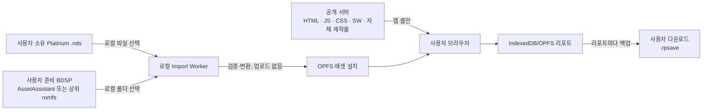
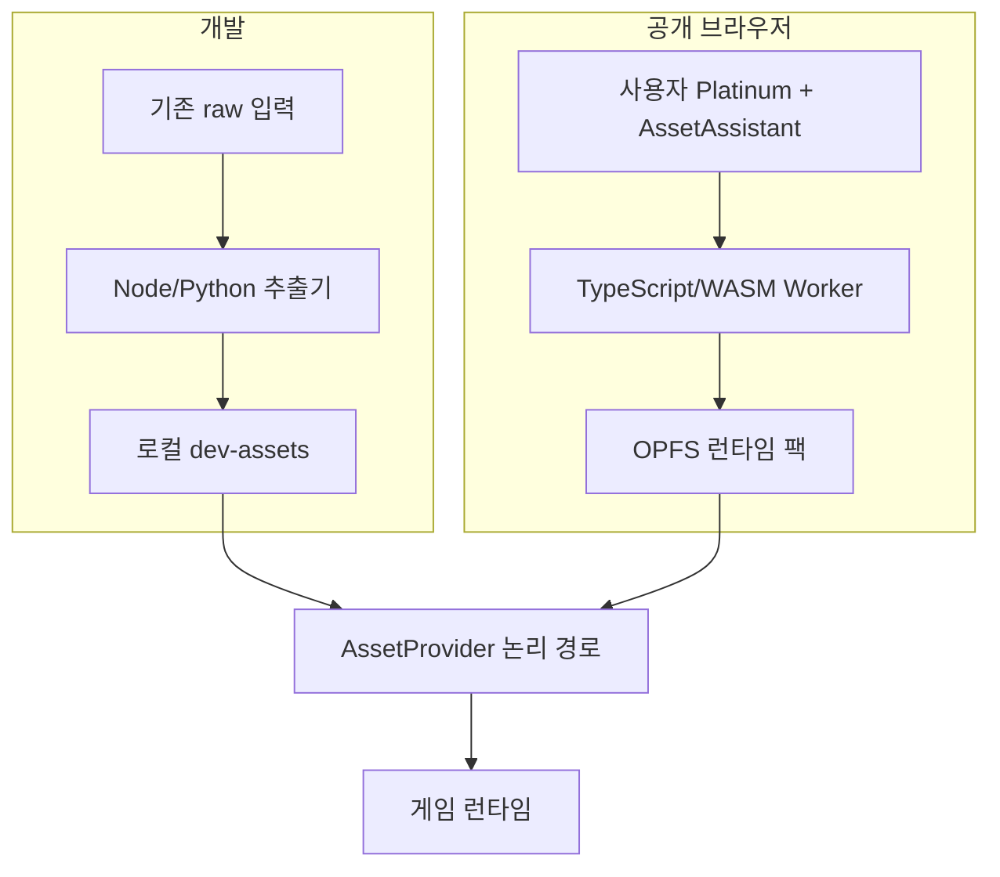

# 저작권·배포·브라우저 로컬 Import 정책

> 상태: **2026-08-10 확정안**. 이전의 “앱 셸 + 원본 유래 에셋 CDN” 결정은 폐기한다.
> 구현·사용자 안내는 [IMPORT.md](IMPORT.md), 데이터 변환 규격은 [DATA.md](DATA.md),
> 작업 순서는 [PLAN.md](PLAN.md)를 따른다.

이 문서는 프로젝트 오너가 택한 배포 정책과 위험 수용 범위를 기록한다. 법률 자문이나
권리자의 허락을 대신하지 않는다.

---

## 1. 최종 결정

Radiant Platinum은 **비공식·비영리 Pokémon 팬게임**으로 계속 만든다. 3D화와 원작
정합성이라는 정체성도 유지한다. 다만 공개 서버가 원본 또는 원본에서 변환한 게임
데이터를 배포하는 구조는 사용하지 않는다.

공개판은 다음처럼 동작한다.

1. 서버는 HTML·JavaScript·CSS·서비스 워커·자체 제작 아이콘 등 **앱 셸만** 제공한다.
2. 사용자는 자신이 적법하게 보유하고 준비한 호환 Pokémon Platinum `.nds` 파일을
   브라우저에서 선택한다.
3. 사용자는 자신이 적법하게 보유한 Pokémon Brilliant Diamond에서 이미 추출해 둔
   `Data/StreamingAssets/AssetAssistant/` 폴더 또는 그 상위 `romfs` 폴더를 선택한다.
4. 검증·추출·변환은 전부 브라우저의 Worker에서 수행하고 결과는 같은 브라우저
   오리진의 OPFS에만 저장한다.
5. 원본 파일·파일명·해시·폴더 목록·변환 결과는 서버로 전송하지 않는다.
6. 리포트는 브라우저 저장소에 남기면서 **매번 휴대용 `.rpsave` 다운로드를 함께
   시도**한다. 사용자는 그 파일을 다시 불러올 수 있다.

이 구조는 원본 유래 파일을 프로젝트가 직접 호스팅·전송하는 위험을 크게 낮춘다.
그러나 팬게임 자체의 2차적저작물성, Pokémon 표지 사용, 권리자의 삭제 요청 가능성은
없애지 못한다. **“안전하다”거나 “삭제를 피한다”는 보장은 없다.**

---

## 2. 데이터와 신뢰 경계



| 위치 | 허용 | 금지 |
|---|---|---|
| 공개 서버·배포 ZIP | 앱 셸, 자체 제작 UI·아이콘, 변환 코드, 비표현적 호환성 메타데이터 | ROM, romfs, AssetBundle, 대사·음악·모델·텍스처·맵·변환 GLB/PNG/JSON |
| 사용자 입력 | 호환 Platinum `.nds`, 이미 추출된 BDSP `AssetAssistant` 계열 폴더 | 다운로드 URL 입력, NSP/NCA, 키 파일, 암호화 우회 입력 |
| 브라우저 로컬 | 변환된 런타임 팩, 설치 매니페스트, 리포트 | 서버 동기화, 분석·오류 보고용 자동 업로드 |
| 개발자 로컬 `raw/` | 보유 원본, 추출물, 참조·중간물 | Git 추적, 프로덕션 빌드 포함, 정적 파일 서버 노출 |

“업로드”라는 UI 표현은 사용하지 않는다. 브라우저의 파일 선택기가 파일을 서버로
보낸다는 오해를 낳기 때문이다. 사용자 문구는 **“이 기기에서 선택”**, **“브라우저
안에서 변환”**, **“서버로 전송하지 않음”**으로 통일한다.

---

## 3. 무엇이 줄고 무엇이 남는가

| 위험 | 이 구조의 효과 | 남는 위험 |
|---|---|---|
| 원본 ROM·추출 에셋 직접 배포 | **크게 감소.** 서버와 배포물에 해당 바이트가 없다 | 빌드 실수·과거 Git 히스토리·로그 유출은 별도 통제가 필요 |
| 불법 복제물 취득을 돕는 행위 | 취득 링크와 우회 절차를 제공하지 않아 감소 | 사용자가 입력을 실제로 적법하게 준비했는지는 프로젝트가 보증할 수 없음 |
| 2차적저작물·캐릭터·스토리 이용 | 거의 줄지 않음 | 게임의 표현과 정체성이 Pokémon에 의존 |
| 상표·출처 혼동 | 비공식 표기로 일부 완화 | 제목과 화면에서 Pokémon 표지를 계속 사용 |
| 테이크다운·호스팅 중단 | 원본 유래 CDN이 없어 영향 범위가 줄어듦 | 권리자는 앱 셸·저장소·도메인에도 삭제를 요구할 수 있음 |
| 비영리성 | 상업성 위험을 낮춤 | 침해 여부를 자동으로 없애는 면책이 아님 |

현실적인 평가는 **실무 위험 중간**이다. 기존 CDN 안보다 낫지만, Renegade
Platinum 같은 패치 배포와 동일하지도 않다. 이 프로젝트는 독립 실행되는 3D
재구현이며 원작 표현을 폭넓게 사용하기 때문이다.

---

## 4. 공개 Importer가 받는 것과 받지 않는 것

### 받는 입력

- Pokémon Platinum의 지원 지역판 `.nds` 파일
- BDSP에서 이미 추출된 `AssetAssistant/` 폴더
- 사용 편의를 위해 `romfs/`, `Data/`, `StreamingAssets/` 같은 상위 폴더를
  선택해도 앱이 아래에서 `AssetAssistant/`를 탐색할 수 있다
- 추가 언어를 설치하려는 경우 그 언어의 호환 Platinum ROM을 별도로 선택할 수 있다

검증은 파일 크기 하나로 끝내지 않는다. 로컬에서 헤더·파일시스템 구조·필수 엔트리·
지원 버전 지문을 확인한다. 지문과 파일 목록은 서버로 보내지 않는다.

### 받지 않는 입력

- NSP·NCA·XCI 같은 배포 컨테이너
- `prod.keys`, `title.keys` 또는 다른 키 파일
- 암호화 해제·보호조치 우회가 필요한 입력
- 원본이나 추출물을 받는 URL
- 제3자가 만든 “미리 추출된 팩”
- 브라우저에서 만든 런타임 에셋 팩의 내보내기·공유

웹사이트는 폴더 선택, 예상 구조, 호환성 판정, 저장공간, 진행률, 오류 복구를 자세히
설명한다. ROM 다운로드, 콘솔 개조, 키 획득, NSP/NCA 복호화·추출 방법은 설명하거나
링크하지 않는다. 사용자가 `AssetAssistant`를 아직 준비하지 못했다면 Importer는
“지원되는 추출 폴더가 필요하다”에서 멈춘다.

---

## 5. 개발용 `raw/` 정책

현재 `raw/`는 약 10GB 규모이며 다음 종류가 이미 나뉘어 있다.

- `raw/roms/`: 개발자가 보유한 Platinum 입력
- `raw/extracted/`: 지역판별 Platinum 선추출물
- `raw/decomp/`, `raw/decomp-derived/`: 포맷 대조용 참조와 파생 표
- `raw/bdsp/`: BDSP 원천 하위 집합, 중간물, 변환 전 번들
- `raw/models/`: 개발용 모델 작업물

그러나 `raw/bdsp/` 안에는 공개 사용자가 선택할 원천 폴더와 개발 중간물·변환물이
섞여 있다. **기존 파일을 자동 이동·삭제·이름 변경하지 않는다.** 먼저 새
`RawSourceAdapter`가 현재 경로를 읽게 하고, 이후 아래 논리 구획으로 점진적으로
정리한다.

```text
raw/
  sources/                 # 사용자가 공개 Importer에 넣는 것과 동등한 원천
    platinum/<locale>.nds
    bdsp/AssetAssistant/...
  references/              # decomp 등 검증 전용; 런타임 입력 아님
  work/                    # 재생성 가능한 중간물
  dev-assets/              # 로컬 게임이 읽는 변환 결과
  legacy/                  # 검증 후 옮길 수 있는 기존 호환 경로
```

정리 전후 모두 지켜야 할 불변식:

- `raw/` 전체는 Git에서 무시한다.
- 원본과 키·컨테이너·중간물은 일반 `pnpm dev` 정적 서버가 제공하지 않는다.
- 개발 모드는 `raw`를 직접 URL로 노출하지 않고, 로컬 추출 결과를
  `DevAssetProvider`로 읽는다.
- 공개 Importer가 요구하는 입력은 `sources/`와 동일한 계약으로 검증한다.
- 민감한 개발 보관물은 정상 추출 체인의 입력으로 참조하지 않는다.
- 이동이 필요할 때는 복사 → 개수·크기·지문 검증 → 어댑터 전환 → 원본 보존 순서로
  한다. 문서 작업에서는 실제 파일을 옮기지 않는다.

---

## 6. 개발과 공개판의 동일 계약



두 경로는 같은 논리 파일명·스키마·콘텐츠 지문을 내야 한다. 공개 변환기가 아직
Python/UnityPy 결과와 동등하지 않으면 해당 기능은 배포 완료로 표시하지 않는다.

현재 `public/data/`와 `public/models/`는 로컬 개발 산출물이지만 Vite가
`public/`을 `dist/`로 그대로 복사한다. `.gitignore`는 이를 막지 못한다.
따라서 전환 첫 단계에서 산출물을 `public/` 밖의 로컬 전용 위치로 옮기고,
프로덕션 빌드 전에 다음을 검사해 하나라도 있으면 실패시킨다.

- `public/data/`, `public/models/`, `dist/data/`, `dist/models/`
- ROM·SDAT·AssetBundle·런타임 팩 확장자와 알려진 원천 디렉터리
- 원본 유래 파일을 가리키는 외부 에셋 오리진 설정
- `raw/` 문자열을 포함한 프로덕션 정적 자산 목록

`assets-manifest.json`, `assets:pull`, `VITE_ASSET_BASE`와 R2 배포 계획은
**레거시 개발 장치**로 분류하고 공개 배포 경로에서는 제거한다.

---

## 7. 리포트·백업·개인정보

리포트와 Import 에셋 캐시는 저장소와 삭제 UI를 분리한다. “에셋 다시 설치”나
“에셋 캐시 비우기”가 리포트를 지우면 안 된다. “모두 지우기”는 별도의 강한 확인과
기존 리포트 다운로드를 먼저 요구한다.

휴대용 `.rpsave`에는 다음만 둔다.

- 포맷 버전과 게임 빌드 호환 범위
- 설치된 Platinum 지역판·콘텐츠 계약의 비가역 식별자
- 세이브 payload
- payload 체크섬
- 선택적 표시 정보(주인공 이름, 플레이 시간, 저장 시각)

원본 에셋 바이트, 원본 파일명, 로컬 경로, ROM 전체 해시는 넣지 않는다. JSON이
TypedArray를 깨뜨리는 현재 문제를 피하기 위해 명시적 binary/base64 codec을 쓰고,
불러올 때 Zod 스키마·체크섬·버전 마이그레이션을 거친다.

리포트 성공 흐름은 **IndexedDB/OPFS 원자적 기록 → 읽기 검증 → `.rpsave` 다운로드
시도 → 성공/실패를 각각 안내** 순서다. 브라우저가 자동 다운로드를 막아도 내부
리포트 성공을 취소하지 않으며, “백업 파일 받기” 버튼을 항상 남긴다.

가져오기 전에 현재 리포트를 자동 다운로드하고, 충돌 시 덮어쓸지 묻는다. 손상되거나
미지원 버전인 파일은 기존 리포트를 건드리지 않는다. 앱 업데이트는 이전 버전을
조용히 “없는 세이브”로 처리하지 않고 마이그레이션하거나, 불가능하면 먼저 원본
`.rpsave`를 돌려준다.

오류 보고 기능을 붙일 경우에도 세이브나 진단 자료를 자동 업로드하지 않는다.
사용자 동의 후 별도 진단 JSON을 만들 수 있지만 원본 경로·파일명·해시는 제거한다.

---

## 8. 비영리·표시·운영 원칙

- 광고, 후원, Ko-fi, Patreon, 유료 다운로드, 유료 우선 접근을 붙이지 않는다.
- 첫 화면과 저장소 설명에 비공식 팬 프로젝트이며 Nintendo·The Pokémon Company와
  제휴·승인 관계가 없다고 표시한다.
- 상표와 원작의 권리는 각 권리자에게 있음을 표시한다.
- 면책 문구를 법적 허락으로 취급하지 않는다.
- 원본 파일이나 추출 에셋을 요청·수집·보관하는 고객 지원 절차를 만들지 않는다.
- 권리자 또는 호스팅 사업자의 통지가 오면 문제의 배포를 우선 중단하고, 범위와
  근거를 보존한 뒤 대응한다. 다른 미러로 즉시 재업로드하는 것을 기본 대응으로
  삼지 않는다.

---

## 9. 남아 있는 저장소 조치

현재 작업 트리에서 `raw/`, `public/data/`, `public/models/`는 Git 무시 대상이다.
하지만 과거 히스토리에 원본 유래 블롭이 남아 있을 수 있고, 추적 중인
`assets-manifest.json`에는 원본 유래 산출물의 경로·크기·짧은 해시가 있다.

공개 원격을 연결하기 전에 별도 승인 아래 다음 감사를 한다.

1. `git rev-list --objects --all`로 과거 경로와 대형 블롭 목록 생성
2. 자체 제작물·코드와 원본 유래 산출물 분류
3. 저장소 백업
4. 필요한 경우 히스토리 재작성
5. 새 복제본에서 금지 파일·빌드·테스트 재검증

히스토리 재작성은 모든 기존 클론을 무효화할 수 있으므로 이 문서 수정만으로
실행하지 않는다.

---

## 10. 법적·운영 참고

- 대한민국 저작권법의 사적이용 복제 조항은 범위와 조건이 있으며 공개 배포를
  일반적으로 허용하는 조항이 아니다:
  [저작권법 제30조](https://www.law.go.kr/LSW/lsLinkCommonInfo.do?chrClsCd=010202&lsJoLnkSeq=1029423199)
- 프로그램 역분석·보존 관련 조항도 목적과 범위 제한이 있다:
  [저작권법 제101조의4·제101조의5](https://law.go.kr/lsLinkCommonInfo.do?chrClsCd=010202&lsJoLnkSeq=1025203515)
- 기술적 보호조치 무력화에는 별도 제한이 있다:
  [저작권법 제104조의2](https://www.law.go.kr/LSW/lsLinkCommonInfo.do?chrClsCd=010202&lsJoLnkSeq=1029423063)
- Nintendo의 온라인 콘텐츠 가이드라인은 게임 플레이 영상·스크린샷에 관한 것이며,
  팬게임 배포 허락으로 해석하지 않는다:
  [Nintendo 온라인 콘텐츠 공유 가이드라인](https://www.nintendo.co.jp/networkservice_guideline/ko/index.html)
- Nintendo는 ROM과 우회 장치에 관한 자체 입장을 별도로 밝히고 있다:
  [Nintendo IP/Piracy FAQ](https://en-americas-support.nintendo.com/app/answers/detail/a_id/55888/)

의문이 생기면 “기술적으로 가능하므로 허용된다”가 아니라, 공개 서버가 무엇을
보유·전송하는지와 사용자가 어떤 준비를 직접 해야 하는지를 다시 점검한다.
