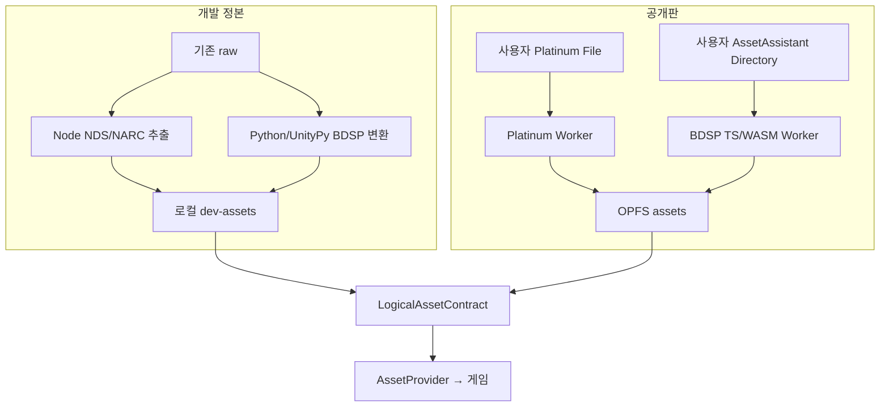

# 롬 데이터 지도 · 추출 설계

> **배포 경계 (2026-08-10):** 이 문서의 포맷 실측은 유지하지만, 공개판은 아래
> 데이터를 서버에서 받지 않는다. 사용자가 선택한 Platinum `.nds`와 이미 추출된
> BDSP `AssetAssistant/`를 브라우저가 변환해 OPFS에 설치한다. Node/Python
> 추출기는 기존 `raw/`를 쓰는 **개발 정본**으로 유지한다.
>
> ⚠️ 두 경로가 같은 것을 내야 한다. 지금 그것을 바이트로 확인한 그룹은
> `moves` 하나다 (`src/import/platinum/convert.test.ts`) — 나머지는 아직
> 노드 쪽만 있다. 무엇이 왜 안 옮겨졌는지는 `convert.ts`의 `GROUPS` 표에 있다.
>
> 사용자 단계는 [IMPORT.md](IMPORT.md), 정책은 [COPYRIGHT.md](COPYRIGHT.md),
> 구현 우선순위는 [PLAN.md](PLAN.md)를 따른다.

플래티넘 롬에서 무엇을 어떻게 꺼내는지에 대한 정본. [PLAN.md](PLAN.md)가 "무엇을 만들 것인가"라면 이 문서는 "원본이 어떻게 생겼는가"다.

**원칙: 포맷은 추측하지 않고 실측으로 확정한다.** 크기 합·값 분포·원작 대조·독립 자료 교차검증 중 최소 하나로 검증되지 않은 구조는 "미확정"으로 표시한다. 이 프로젝트에서 이미 세 번, 그럴듯한 가설이 데이터에 반박당했다(charmap 오프바이원, BDSP 채널 매핑, 풀숲 타일 값).

---

## 1. 현황 요약

| 데이터 | 위치 | 상태 |
|---|---|---|
| 텍스트 지역판 | `msgdata/pl_msg.narc` | ✅ 개발 raw 3지역판 대조 · 공개판은 설치 지역판만 (PLAN §12.2) |
| **맵 헤더 표** | arm9 `0xea01c` | ✅ 593개 × 24B, 전 필드 확정 (날씨·카메라·`battleBG`·통행 플래그까지) |
| 맵 행렬 | `fielddata/mapmatrix/map_matrix.narc` | ✅ 289개 전부 |
| 맵 청크 | `fielddata/land_data/land_data.narc` | ✅ 666개 전부 |
| 타일 거동 | land_data의 `perm` | ⚠️ 94종 중 풀숲·물 확정 · 워프 무리 유력 (§2.2) |
| 워프 | `zone_event`의 12B 구역 | ✅ 1213개, 그래프 정합 1207 |
| NPC 배치 | `zone_event`의 32B 구역 | ✅ 디컴프 `ObjectEvent`와 필드 일치 (§2.3) |
| 간판·트리거 | `zone_event`의 20B·16B 구역 | ✅ `BgEvent`·`CoordEvent`와 필드 일치 (§2.3) |
| 야생 인카운터 | `fielddata/encountdata/pl_enc_data.narc` | ✅ 183개 × 424B, 전 필드 |
| 종족 데이터 | `poketool/personal/pl_personal.narc` | ✅ 508개 × 44B |
| 진화 | `poketool/personal/evo.narc` | ✅ 508개, 246분기 |
| 레벨업 기술 | `poketool/personal/wotbl.narc` | ✅ 508개, 6753항목 |
| 기술 데이터 | `poketool/waza/pl_waza_tbl.narc` | ✅ 471개 × 16B |
| 트레이너 | `poketool/trainer/trdata` + `trpoke` | ✅ 928명 × (20B + 가변), AI 플래그 포함 |
| 이벤트 스크립트 | `fielddata/script/scr_seq.narc` | ✅ **포맷 확정** — 1124개를 디컴프 원본과 바이트 대조 (§2.10) |
| 대사 | `msgdata/pl_msg.narc` | ✅ 뱅크 450개 — 미국 685개가 디컴프 원문과 완전 일치 (§2.11) |
| 아이템 | `itemtool/itemdata/pl_item_data.narc` | ✅ 468종 — 디컴프 446개와 필드 대조, 불일치 0 (§2.12) |
| 상점 재고 | ROM ARM9 정적 바이너리 | ✅ 파일시스템 밖이지만 롬 안이다 (§2.13) |
| **오버월드 NPC 스프라이트** | `data/mmodel/mmodel.narc` | ✅ 470칸 순서 확정 · 텍스처 이름 396/396 (§2.16) — **필드에 서 있다** |
| **포켓몬 배틀 그림** | `poketool/pokegra/pl_pokegra.narc` | ✅ 암호 풀림 — 1808/1812 (§2.17). **배틀에 493종이 선다** |
| 높이 지오메트리 | land_data의 `BDHC` 구역 | ✅ 포맷 확정 (§2.2) — 발밑 높이를 이것이 잡는다 (`engine/map/height`) |
| 소리 | `data/sound/pl_sound_data.sdat` | ✅ 곡 1013 · 악기 뱅크 521 · 파형 874. **울린다** — BGM · 효과음 · 울음소리 493종 (§2.18) |
| 캐릭터 모델·애니메이션 | 사용자의 `AssetAssistant` | ✅ 브라우저가 굽는다 — 무대 g001이 개발 추출기와 픽셀까지 같다 (IMPORT.md §12) |

---

## 2. 확정된 포맷

### 2.1 map_matrix — 청크를 맵으로 조립

```
u8   width, height
u8   hasHeaders, hasHeights
u8   nameLen;  char name[nameLen]
u16  headers[w*h]    // hasHeaders일 때. 값 = 맵 헤더 id
u8   heights[w*h]    // hasHeights일 때
u16  maps[w*h]       // land_data 파일 인덱스. 0xFFFF = 빈칸
```

289개 전부 크기 합이 정확히 일치한다. **#0이 신오 오버월드 30×30**(청크 468칸). 나머지 288개는 실내·던전이며 헤더 표가 실제로 참조하는 것은 269개다.

### 2.2 land_data — 청크 하나

```
u32 permSize (항상 2048), objSize, modelSize, bdhcSize
u8  perm[permSize]      // 32×32 타일 × u16
u8  objects[objSize]    // 48B 단위 건물 배치
u8  model[modelSize]    // NSBMD ("BMD0")
u8  bdhc[bdhcSize]      // 높이 지오메트리 ("BDHC")
```

666개 전부 크기 합 일치, 전원 `BMD0` + `BDHC` 보유.

**타일 u16**: 최상위 비트(`0x8000`)가 통행 불가, 하위 비트가 거동.

어휘 크기는 무엇을 세느냐로 갈린다 — 세 숫자를 헷갈리면 안 된다:

| 세는 것 | 개수 |
|---|---|
| 오버월드(행렬 0)의 원시 u16 | **54** |
| 오버월드의 거동값 (`& 0x7fff`) | **47** |
| 헤더가 참조하는 행렬 전부의 거동값 | **94** |

실내·던전에만 나오는 값이 47종 더 있다. 청크 666개를 전부 훑어도 94종에서 안 늘어난다 — 행렬이 안 쓰는 청크에도 새 어휘는 없다.

| 값 | 의미 | 근거 |
|---|---|---|
| `0x0000` | 통행 가능 평지 | 최다 빈도(40744칸) |
| `0x8000` | 통행 불가 | 건물·절벽 윤곽과 일치 |
| `0x0002` | **풀숲(육상 인카운터)** | 아래 교차검증. 오탐 0 · 누락 0 |
| `0x0015` | **넓은 수면** | 수로(W) 존을 채운다. W231에만 6912칸 |
| `0x0010` | **작은 물(연못)** | 13개 존에 1114칸. 떡잎마을 연못이 여기 |
| `0x5e`~`0x6f` | **워프 칸(문·계단·동굴 입구)** — 유력, 미확정 | 아래 |
| 나머지 | 미확정 | 원시값으로 보존 |

**워프 무리 `0x5e`~`0x6f` — 유력하지만 0/0이 아니다.** 검증된 워프 1213개(§2.3)를 독립 자료로 대조했다. 값별 워프 밀도가 무리 안에서는 900~1300‰인데 **무리 밖 80여 종은 전부 0‰**이다. 분리는 절대적이다.

다만 풀숲처럼 오탐 0·누락 0은 아니다:

- 워프 칸 877개(중복 제거) 중 **835개(95.2%)**가 무리 안. 나머지 42개는 평지(`0x0000`) 40개 + `0x2c` 2개인데 **체육관과 D32에 몰려 있다** — 체육관 바닥 퍼즐·엘리베이터처럼 스크립트가 옮기는 자리라 원작에도 문 타일이 없다
- 무리 안 1118칸 중 283칸은 워프가 아니다. 그중 130칸은 워프 칸에 **붙어** 있다(문이 두 칸 넓이인데 출발점은 한 칸만 등록된다). 남은 153칸(대부분 `0x65`·`0x6e`·`0x67`·`0x69`)은 아직 설명이 없다 — land_data 청크가 여러 행렬에서 재사용되는 것이 유력한 가설이다

세부값이 무엇으로 갈리는지는 아직 모른다. `0x5e`/`0x5f`, `0x62`/`0x63`, `0x6c`/`0x6d`가 개수까지 쌍을 이루는 것으로 보아 방향(오르막/내리막)이나 안팎일 가능성이 있다. `0x69`는 192칸 전부 통행 불가인데 워프 참조는 177개 — 벽에 난 문이다.

`tools/spike/map-behavior.js`가 이 수치를 다시 낸다.

> ⚠️ **풀숲을 두 번 틀렸다가 교차검증으로 잡았다.** 처음엔 `0x0015`를 풀숲으로 봤다 — 빈도 2위(24343칸)에 넓은 덩어리 분포라는 이유였다. 인카운터 표가 나온 뒤 "육상 인카운터가 있는 존 ⟺ 그 타일이 있는 존"을 대조했더니 67개 중 33:34로 깨졌다. 231번**수로**에 그 타일이 6912칸인데 육상 출현률이 0이고, 217번도로는 출현률 30인데 하나도 없었다. 물이었다.
>
> 같은 대조를 35종 전부에 돌리니 **`0x0002`가 오탐 0·누락 0으로 완전 일치**했다. 빈도와 분포 모양은 의미의 근거가 되지 못한다. 독립된 두 자료의 대조만이 근거다.

> ⚠️ **그리고 물도 반만 맞았다.** 위 발견의 부산물로 `0x0015`를 물이라고 적었는데, 화면에 떡잎마을 연못이 파랗게 렌더되지 않아 들켰다. 그 연못은 **`0x0010`**이다.
>
> 파도타기 표와 다시 대조하니: `0x0015`는 오탐 11(수면은 있는데 표가 없는 존), `0x0010`은 오탐 0이지만 누락 23. **둘을 합쳐야** 파도타기 36개 존 중 35개를 덮고 누락이 1로 떨어진다. 하나를 찾았다고 그게 전부라고 볼 근거는 없었다 — `isWater()`가 둘을 함께 본다.

> ⚠️ 그 전엔 타일당 u8로 읽어 체커보드 패턴이 나왔다. **u8/u16 착각의 전형적 증상**이니 다른 격자 데이터에서도 먼저 의심할 것.

#### 모델 — 청크의 진짜 지오메트리

`model` 토막이 NSBMD(`BMD0`)다. 여기에 신오의 땅이 통째로 들어 있다 — 길·계단·
물가·나무·건물 윤곽까지. 타일 거동값으로 상자를 쌓던 블록아웃을 이것으로 바꿨다.

NSBMD는 정점 배열이 아니라 **NDS GPU의 디스플레이 리스트**를 그대로 담는다.
"지금부터 사각형 띠, 정점 (x,y,z), 정점 …" 하는 명령 흐름이라 GPU 명령을
해석해야 삼각형이 나온다. 명령은 **네 개씩 묶여** 오고, 그 묶음 규칙을 모르면
첫 명령부터 어긋난다.

정점 명령이 다섯 가지다 — 16비트 셋, 10비트 하나, 두 축만 바꾸는 것 셋, 그리고
**직전 정점에서의 차이**(`VTX_DIFF`). 마지막 것 때문에 상태를 들고 가야 한다.

> ⚠️ 그 상태를 타일 단위로 바꿔서 들고 갔다가 화면이 무너졌다. 차이가 원시
> 좌표 기준이라 단위를 섞으면 그 뒤 정점이 전부 어긋난다. 개수는 그대로 맞아서
> 검증은 통과했고, **그림을 굽고 나서야** 삼각형이 가시처럼 찢어진 것이 보였다.

**검증 — 666/666.** MDL0 헤더가 정점·삼각형·사각형 수를 적어 둔다. 명령 폭을
하나만 잘못 알아도 그 뒤가 전부 밀리므로 우연히 맞을 수 없다:

```
청크 666개 / 헤더 수치와 일치 666개 / 어긋남 0개
정점 1066987 · 삼각형 599389 · 28.4MB (평균 44KB)
```

**SBC — 재질과 폴리곤을 짝지어 준다.** 짧은 명령 목록인데 ⚠️ **순서대로 1:1이
아니다.** 청크 0은 재질 4가 폴리곤 13을, 재질 0이 폴리곤 9를 그린다. 번호로
짝지으면 땅에 아스팔트가 깔린다.

**재질 44바이트.** 머리 둘(`itemTag`·`size`)이 **u16**이다 — u32로 읽으면 크기가
21억으로 나오고 그 뒤 필드가 통째로 밀린다.

좌표 단위는 **타일이 아니라 유닛**이고 16유닛이 한 타일이다(청크 하나가
−256~+256 유닛 = 32타일로 딱 떨어진다). 이동 동작 표의 "거리 × 프레임 = 16"과
같은 눈금이다.

#### 텍스처 — 영역마다 한 벌

맵 모델은 텍스처를 자기 안에 안 갖고 있다. `area_map_tex/map_tex_set.narc`에
BTX0로 74벌 들어 있고, 맵 헤더의 `area` → `area_data.narc` → `mapTextureArchiveID`가
가리킨다. 재질은 그림 이름과 팔레트 이름을 **따로** 갖는다 — 같은 그림을
팔레트만 바꿔 여러 번 쓴다.

형식 일곱 가지 중 맵이 쓰는 것은 다섯이다:

| 형식 | 뜻 | 장수 |
|---|---|---|
| 3 | 16색 팔레트 (4bpp) | 2269 |
| 2 | 4색 팔레트 (2bpp) | 599 |
| 1 | A3I5 — 색인 5비트 + 알파 3비트 | 198 |
| 6 | A5I3 — 색인 3비트 + 알파 5비트 | 40 |
| 4 | 256색 팔레트 (8bpp) | 24 |

전부 3130장이고 자료 블록 밖으로 나가는 것이 하나도 없다. 청크 재질이 쓰는
(그림, 팔레트) 조합은 1179개이며, 묶음별로 이름이 다 있는 것만 펴면 2736장이다.

싣는 형태는 **묶음당 시트 한 장**(`tex/<묶음>.png`, 평균 8KB)이다. 텍스처마다
파일을 두면 2736번 왕복인데, 반복(repeat) 때문에 아틀라스를 그대로 샘플링할
수는 없으므로 **받은 뒤 잘라서** 각각 텍스처로 만든다 — 왕복은 한 번, 반복은
정확하게.

#### 소품 — 집은 청크에 없다

집·간판은 청크 모델에 안 들어 있다. `build_model.narc`에 **590개**가 따로 있고,
48바이트 배치 기록의 `modelId`가 그 번호를 곧바로 가리킨다(실측 3~587).

청크 모델과 달리 **자기 텍스처를 들고 있다** — 590개 중 **568개**가 MDL0 옆에
TEX0를 같이 갖는다. 나머지 22개만 영역의 건물 텍스처 묶음(`areabm_texset`)을 쓴다.

정점 89253 · 삼각형 50935 · 2.5MB, 헤더 수치와 590/590 일치.

청크 모델(28MB)과 소품(2.5MB), 맵 텍스처(0.6MB)는 휴대용 리포트에 넣지 않는다.
개발판은 raw에서 재생성하고 공개판은 사용자의 Platinum 입력에서 브라우저가 OPFS에 만든다.

**건물 배치 (48B)** — 20.12 고정소수점, `/65536`이 곧 타일 단위:

```
i32 modelId
i32 x, y, z        // 청크 중심 기준
i32 rotX, rotY, rotZ
i32 scaleX, scaleY, scaleZ   // 4096 = 1.0
i32 ?, ?           // 미확정
```

**BDHC (높이) — 확정.** 신오는 평면이 아니다. 다리 밑을 지나가고(216번도로) 계단을 오르고 동굴은 지면보다 낮다. 그 높이가 전부 여기 있다.

```
char[4] "BDHC"
u16 points, normals, constants, plates, strips, accessList
BDHCPoint  { fx32 x, z }                     × points        8B
VecFx32    { fx32 x, y, z }                  × normals      12B
fx32       상수 d                             × constants     4B
BDHCPlate  { u16 p1, p2, normal, constant }  × plates        8B
BDHCStrip  { fx32 scanline, u16 n, u16 i }   × strips        8B
u16        접근 목록                          × accessList    2B
```

**666개 청크 전부 크기 합이 한 바이트도 안 틀린다.** 구조는 [pokeplatinum `include/overlay005/bdhc.h`](https://github.com/pret/pokeplatinum/blob/main/include/overlay005/bdhc.h)와 [`docs/maps/bdhc.md`](https://github.com/pret/pokeplatinum/blob/main/docs/maps/bdhc.md)에서 읽었다.

> ⚠️ 디컴프의 `BDHCHeader`는 카운트를 `int`로 적어 두었지만 **파일에는 u16이다.** 로더가 읽으면서 넓힌다. int32로 읽으면 카운트가 통째로 쓰레기가 되고(9,021,563,468 같은 값), 매직 4바이트를 빼먹은 것까지 겹치면 왜 틀렸는지 안 보인다.

판(plate)은 사각형 + 평면 방정식이다. 점 $P$의 높이는 $P_y = -(n_x P_x + n_z P_z + d) / n_y$. 같은 자리를 덮는 판이 여럿일 수 있고(다리와 그 밑), 그때는 **지금 높이에 가장 가까운 것**을 고른다. 스트립은 z 스캔라인별 판 목록이라 매 프레임 전수 검사를 피하는 색인이다.

실측 — 판 8974개 · 법선 1275개(평평 667 / 기울어짐 608) · 점 15464개. 높이는 타일 단위로 −6 ~ +30이고 대부분 정수(0:2063 · 1:1818 · −2:1041 · 2:814 …)에 0.5 단계가 섞인다. 좌표는 20.12 고정소수점이고 `/65536`이 타일 단위인 것은 건물 배치와 같다.

#### 나무는 사각형 한 장이다

원작 필드의 나무에는 **입체가 없다.** 정점 4개짜리 판 하나에 그림을 붙였을
뿐이다. 떡잎마을 청크 하나에 271그루가 있고 한 그루를 떼어 보면 이렇다:

```
정점 4개 · 삼각형 2개 · 단면
법선 (0.00, 0.82, 0.57) — 수평에서 35° 기울어 남(+Z)을 본다
```

오버월드 전체에 **30,847장**이 있고 기울기는 30~50°에 93%가 몰린다.
**방향은 3만 장이 전부 +Z다 — 예외가 0건이다.**

⚠️ **빌보드로 세우면 안 된다.** 그림이 나무를 *위에서 내려다본* 모양이라(잎
뭉치 아래로 그루터기가 보인다) 카메라 쪽으로 세우면 잎 원반이 서 있는 꼴이 된다.

⚠️ **판 단위로 세도 안 된다.** 숲 벽 하나가 판 넉 장이 겹쳐 쌓인 것이다:

```
x -14~-6, z 14~16   conttree_b  y 1.06~1.06 (평평) · 1.45~2.67
                    conttree_t  y 2.15~3.23 · 2.86~3.64
```

판마다 세우면 같은 자리에 네 줄이 겹쳐 브로콜리가 되고(실측 삼각형 244만),
높이 0인 평평한 판은 *위에서 본 숲 지붕*이라 걸러 두면 땅에 그림으로 남는다.
그래서 **잎이 덮은 땅을 1타일 격자로 칠하고 두 칸마다 한 그루씩** 세운다 —
몇 겹이든 눕든 서든 저절로 합쳐진다. 같은 창에서 **61만**으로 줄었다 — 둘 다
오프라인 렌더러가 창 5×5 청크에서 잰 값이다.

⚠️ 그 61만과 게임 화면 오버레이의 17.5만이 **3배 어긋난다.** 어느 쪽이 틀렸는지
아직 모른다 — PLAN.md §16.4가 이것을 최적화의 첫 항목으로 잡고 있다.

**나무 크기를 이 판 더미의 두께가 정한다.** 홀로 선 나무는 판 한 장이라 세로로
1.08타일이고 숲 벽은 넉 장이 쌓여 2.58타일이다. 그 차이를 잎 반지름 `r`로 옮기면
숲은 크게 자라 서로 닿아 벽이 되고 길가 나무는 작게 남는다.

**나무 좌표계는 밑동이 원점이고 단위가 `r` 배수다.** 잎 한가운데를 원점으로 두고
줄기 길이만 타일 단위로 두면, `r`이 0.95~1.52로 흔들릴 때마다 나무가 제 줄기에서
떠오르거나 파묻힌다. 밑동을 잡으면 나무가 통째로 한 덩어리로 자라고, 카메라 앞을
비울 때 배율만 줄여도 저절로 땅에 붙은 채 작아진다.

잎 아래끝까지의 줄기는 `1.0 r`이다 — **그만큼 나무가 원작보다 높아진다.** 원작
판은 35° 누워 있어서 세로 1.08타일밖에 안 차지하는데 잎 무리만 해도 1.52 r이라
줄기 자리가 안 남는다. 판을 세운 그림(잎 밑에 줄기가 그려져 있다)이 원작이 의도한
모습이라 그쪽을 따랐다. 값은 3인칭 카메라가 정한다: 카메라가 플레이어 뒤 8·위 4라
시선이 1:2로 내려오고, 잎이 제 밑을 **0.86 r**까지 가린다(잎 겉면의 점마다
`y − 0.5 × 가로거리`를 잰 최솟값이다). 1.0이면 그 위로 남고 그보다 짧으면 잎에
통째로 먹힌다.

⚠️ **조각을 합칠 때 색인을 먼저 풀어야 한다.** `CylinderGeometry`는 정점 12개에
색인 30개(삼각형 10개)다. 색인을 버리고 정점만 이어 붙이면 연속 3개씩 묶여
**수평 조각 4개**가 되고, 그 넷이 각각 잎 속과 땅속에 묻혀 화면에서 줄기가 통째로
사라진다. 잎(`IcosahedronGeometry`)은 색인이 없어 멀쩡했기 때문에 증상이 "줄기만
안 보인다"로 나왔고, 눈으로는 거기까지밖에 알 수 없었다. `plates.test`가 줄기
삼각형의 **개수 48 · 법선이 눕는지 · 바깥을 보는지 · 넓이**를 직접 센다.

##### 폴리곤 티를 걷어내는 것은 세분이 아니라 법선이다

잎 덩이를 면 법선으로 그리면 20면이 20개의 평면으로 또렷이 갈려 보인다 —
주사위에 초록을 칠한 것과 같다. 법선을 **덩이 중심에서 뻗은 방향**으로 갈아
끼우면 같은 삼각형 수로 빛이 공처럼 흐르고 각진 것은 윤곽에만 남는다
(`ballNormals`). three.js 계열 스타일라이즈드 나무가 쓰는 길이다
([douges.dev](https://douges.dev/blog/threejs-trees-1) ·
[Codrops](https://tympanus.net/codrops/2025/01/27/fractals-to-forests-creating-realistic-3d-trees-with-three-js/)).
덩이도 셋에서 여섯으로 늘렸다 — 셋이면 어느 각도에서든 큰 원호 세 개로 읽힌다.
색은 덩이 안에서 **위아래로 섞는다**: 원작 그림에서 뽑은 색 사이를 잇는 것뿐이라
새 색이 안 생기고, 통짜 한 색일 때의 플라스틱 느낌이 사라진다.

##### 줄기 굵기는 원작이 그려 놓았다 — 1.20타일

나무 그림 한 장에는 **위에서 내려다본 그루터기**가 같이 들어 있다(`tree01`의
오른쪽 위 칸이 나이테까지 그려진 밑동이다). 그 갈색 덩이가 `tree01` ·
`tree2_01` · `tree04_2` 셋 다 **18×18텍셀**이고, 그 판이 실측으로 전부
2.0×1.88타일(`tree01` 평평한 판 2,317장이 하나도 안 어긋난다)이라 한 텍셀이
0.067타일 — 그루터기가 **1.20타일**이다. 예전 줄기는 `0.315 r`이라 홀로 선
나무에서 0.30타일, 곧 원작의 절반이었다.

⚠️ **그래서 줄기는 인스턴스 메시가 따로다.** 굵기가 타일 값이라 나무 크기를
따라가면 안 된다 — 잎과 같은 배율로 키우면 숲 벽(`r` = 1.4)에서 줄기가 1.8타일이
되어 두 칸 간격의 이웃과 맞닿는다. 나무가 아니라 통나무 담이 된다. 가로만
`TRUNK_R`로 고정하고 세로는 나무 높이를 그대로 쓴다. 가지 셋도 같은 메시에 있다.

##### 나무 밑 바닥 타일은 안 깐다

원작 나무 그림 한 장에는 **위에서 내려다본 밑동**이 같이 들어 있고(`tree01`의
오른쪽 위 칸이 초록 타원 위의 그루터기다), 그 그림을 붙인 평평한 판이 나무 밑에
깔려 있었다. 한동안 그 판을 그루마다 다시 깔아 줬다 — **위에서 내려다본 나무를,
입체로 세운 나무 밑에 또 붙이는 일**이다. 세 가지가 어긋났다:

1. 타원이 **잔디색**이라 모랫길·눈밭 위에서는 초록 스티커가 됐다.
2. 카메라가 가까워 나무가 줄어들면(`nearScale`) 판은 안 줄어서, 그려 둔
   그루터기가 줄기 밖으로 삐져나왔다.
3. 진짜 그림자와 접지 그늘(`CONTACT_R`) 위에 **하드한 동그라미**가 하나 더 겹쳤다.

**걷어내도 발밑은 안 뚫린다.** 잎 칸을 메우는 것은 이 판이 아니라 `floorPatch`고,
오버월드 잎 칸 110,703개가 한 칸도 안 남는다(§2.2의 그 0). 판은 그 위에 덧깔려
있었을 뿐이다. 남는 것은 입체 줄기와 그림자, 그리고 그 자리의 진짜 땅이다.

##### 밑동은 걸어 다니는 칸을 밟으면 안 된다

밑동은 타일 **모서리**에 선다(실측: 자리값이 전부 정수다). 굵기가 원작이 그린
그루터기 그대로 1.2타일이라, 모서리에 서면 **네 칸에 각각 0.6타일씩** 들어간다.
사람 반지름이 0.3이므로 그중 하나라도 통행 가능한 칸이면 몸이 줄기 속을 지나간다.

사방이 다 열린 자리는 예전부터 아예 안 세웠다(길 한복판, 923그루). 문제는 길가로,
"서 있어도 몸이 안 지나간다"며 남겨 둔 자리다 — 오버월드 26,199그루 중 **869그루**가
그렇고 열린 칸이 1개 91 · 2개 644 · 3개 134다.

**축마다 막힌 쪽으로 반 칸 민다**(`trunkNudge`). 밑동 한가운데가 모서리가 아니라
막힌 칸 한가운데로 가서, 열린 칸에 남는 것이 0.6−0.5 = **0.1타일**이 된다. 밀 축이
없는 것은 막힌 칸 둘이 **대각으로** 놓인 3그루뿐이다(869 = 866 + 3).

**무엇이 잎인지는 잰 값으로 거른다.** 기울기와 크기만 보면 경사로·계단
(`c3_slope1` · `gate_step1` · `gym08_step`)이 같은 조건에 걸려 지형이 지워진다.
가르는 것은 **텍스처의 투명 픽셀**이다:

| | 투명 비율 |
|---|---|
| 오려 낸 그림 (`tree01` 41.7% · `conttree_t` 56.4% · `imped` 45.3% · `cont_35` 85.9%) | **31.9% ~ 85.9%** |
| 지형 (`c3_slope1` · `gate_step1` · `criffp` · `hamabe` · `dun08_shin_c`) | **전부 정확히 0.0%** |

겹치는 값이 하나도 없다. 그중 나무인지 울타리·바위인지는 잴 수가 없어 롬이
붙인 이름을 쓴다(`tree*` · `conttree*`) — 이 규칙이 놓치는 것은 실측으로
`bf_ueki01`(화단, 96장)과 `bf_zou`(4장)뿐이다.

##### 판때기인 것이 나무만이 아니다 — 바위와 화분

물가의 바위도 사각형 한 장이다. 실측이 딱 갈라 준다: `searock` **1,001장이
1,001장 다 45.0°**고 **1,001장 다 2.0×1.41×1.41타일**이다(`dun_srock` 2장도
같다). 그대로 세우면 새까만 달걀이 물 위에 늘어선다 — 양지시티 해안이 그랬다.
나머지 바위 이름은 세울 것이 아니다: `c3_iwa_s` 48장·`c3_grand` 75장이 전부
90°(땅에 깔린 무늬), `c3_iwa_l` 11장이 전부 60.3°, `m_4ten_iwa` 21장은
11°~57°로 흩어져 있다.

⚠️ **이름으로 다 가를 수는 없다.** 축복시티 `imped`(64×64) **한 장**에 흰
울타리 두 줄 · 바위 한 덩이 · 화분 둘 · 자갈 둘이 같이 들어 있다. 같은
서브메시고 같은 텍스처인데, 울타리는 세우는 것이 맞고 바위와 화분은 세우면
액자가 된다 — 인도 위에 회색 판이 떠 있던 것이 그 화분이다.

가르는 것은 **그 판이 쓰는 그림 칸의 좌우 끝**이다. 담은 옆으로 이어지므로
칸의 왼쪽 끝과 오른쪽 끝이 둘 다 불투명하고, 덩이는 칸 안에 떠 있어서 한쪽이
비어 있다. 오버월드 45° 사각형 4,651개를 이 잣대로 세면 **담 3,808 · 덩이 843**이고
겹치는 칸이 없다 — `imped`의 울타리 칸(u 0.00~1.00 · 0.50~0.62, v 0.00~0.25)은
전부 담이고 아래쪽 칸(v 0.50~1.00)은 전부 덩이다.

덩이는 입체로 세운다(`scene/Rocks.tsx`). 자리는 판 상자의 한가운데, 폭은 판의
가로, **색은 그 그림 칸의 가로줄 평균을 밑에서 위로** 싣는다 — 많이 쓰인 색을
고르면 화분이 통째로 초록 공이 되지만, 줄 평균이면 화분은 밑이 회색이고 위가
초록으로 남는다. 판이 45°로 누워 있어 그림의 아래가 물건의 아래다.

높이만 우리 것이다: 판이 45°이고 실루엣이 세로 2.0타일인데 그 길이가
`(높이 + 깊이) × cos45°`이므로, 둥근 바위라 깊이를 폭과 같다고 두면
2.0/0.707 − 2.0 = **0.83타일**이 나온다. 깊이를 폭으로 둔 것 하나가 우리가 넣은
가정이다.

세우는 형태는 원작에 없으므로 **우리가 만든 것**이다(`scene/Foliage.tsx`).
다만 서는 자리는 잎이 덮고 있던 칸, 크기는 그 자리 판 더미의 두께, 색은 그
그림에서 실제로 제일 많이 쓰인 색이다. 그래서 지역마다 다른 원작 색조가 남고
나무가 가리던 것을 그대로 가린다.

⚠️ **쪼갠 지오메트리의 그룹 번호는 서브메시 번호여야 한다.** three가 그 값으로
재질 배열을 색인하는데 그 배열은 서브메시 순서다. 롬의 재질 번호를 넣으면
**청크 666개 중 647개**에서 둘이 어긋나 있어서(청크 0은 서브메시 0이 재질 4다)
땅이 나무 그림으로 그려진다.

#### 긴 풀은 바닥 그림이다

풀숲도 세운다(`scene/Grass.tsx`). **어디가 풀숲인지는 그림이 아니라 거동값
`0x0002`가 말한다** — 인카운터 표와의 교차검증으로 확정된 값이라(§2.2 `Behavior`)
텍스처 이름으로 고를 때처럼 잔디(`lgreen`)가 딸려 오지 않는다. 창 하나에 드는
풀숲 칸이 전 오버월드 최대 1,056개고 칸마다 세 포기라 삼각형 31,680개다.

> 브라우저 없이 확인하려고 `tools/preview/`에 소프트웨어 렌더러를 두었다.
> 같은 규칙을 옮겨 적은 것이라 여기서 맞다고 게임에서 맞는 것은 아니다 —
> 모양과 크기를 눈으로 재는 용도다.

#### 갈색 턱은 한쪽으로만 지난다

통행 불가 타일을 모양별로 가르면 셋이 남는다. 셋 다 **자기만 막혀 있고 양옆은
걸을 수 있는** 유일한 값들이고, 셋 다 `allpeak` 그림을 쓴다:

| 거동값 | 칸 | 모양 | 양옆 통행 | 그림 UV | 뛰는 쪽 |
|---|---|---|---|---|---|
| `0x3b` | 305 | 가로줄 (가로이음 243 · 세로이음 0) | 300 | u→+X · **v→+Z** | 남 |
| `0x39` | 21 | 세로줄 | 21 | u→+Z · **v→−X** | 서 |
| `0x38` | 15 | 세로줄 | 15 | u→+Z 반대 · **v→+X** | 동 |

`0x3b`이 남쪽으로 뛰는 턱인 것은 화면으로 확인했다. 그러면 **판에 얹힌 그림의
v축이 곧 뛰는 쪽**이고, 같은 규칙으로 나머지 둘이 서·동으로 갈린다. 두 세로 턱의
UV가 서로 정확히 거울이라 동·서 한 쌍이라는 것도 맞아떨어진다.

북쪽으로 뛰는 턱은 없다 — 원작에도 없다.

#### 소품은 면이 없다 — 뚫린 것이 아니라 안 만들어져 있다

집은 나무와 달리 진짜 입체다. 주인공 집이 삼각형 219개에 5.76×5.67×3.88타일이고
앞·좌·우·지붕이 다 있다. 다만 **−Z를 보는 면이 0개, −Y를 보는 면이 0개**다.
여섯 방향에서 렌더해 보면 뒤가 완전히 비어 있다 — 구멍이 아니라 뒷면 자체가 없다.
원작 카메라가 고정 각도라 만들 이유가 없었다.

⚠️ **면적 벡터로는 이걸 못 잰다.** 한 번 그렇게 접근했다가 접었다. 경계 고리를
부채꼴로 덮으면 면적 벡터는 130종 중 75종에서 0에 수렴하는데, **그 수치가
속는다** — 문틀·창틀 같은 안쪽 테두리를 덮고 정작 뚫린 쪽은 그대로 두고도 합이
맞는다. 렌더해 보고서야 알았다.

⚠️ **"그쪽을 보는 면이 몇 개냐"로도 못 잰다.** 그것으로 세면 769건이 나오는데
**틀린 수다.** 지붕처럼 비스듬한 면도 옆에서 보면 넓이를 보태므로, 개수로는
"있다"인데 실루엣의 절반만 덮는 경우가 있고 그 반대도 있다.

**뚫렸는지는 덮어 보고 안다.** 방향마다 그쪽에서 본 실루엣을 64×64 격자로
래스터라이즈하고, 그쪽을 보는 면이 그 칸을 다 덮는지 본다. 한 칸이라도 남으면
뚫린 것이다. 실측 **444건**:

| 방향 | 뚫린 소품 |
|---|---|
| **−Z** 뒤 | 335 |
| **−X** 왼쪽 | 45 |
| **+X** 오른쪽 | 40 |
| **+Z** 앞 | 17 |
| **+Y** 위 | 7 |

바닥(−Y)은 안 센다 — 건물 밑은 볼 자리가 없다.

메우는 방법은 고리를 고르지 않는다. **삼각형을 전부 그쪽 판으로 눌러 붙인다** —
눌러 붙인 것들의 합집합이 곧 그 방향에서 본 실루엣이라, 어느 고리가 진짜 구멍인지
고를 일이 없어진다(`scene/shell.ts`).

⚠️ **그림이 없는 서브메시는 고장이 아니다.** 원작 DS는 텍스처 없이 정점 색만으로
그리는 폴리곤을 쓴다 — 오버월드 소품 서브메시 442개 중 둘이 `tex: null`이다.
그걸 "아직 못 만든 것"(자홍색)으로 돌리면 무쇠시티 프렌들리숍 문틀에 **자홍색
선**이 그어진다. 실제로 그렇게 나와 있었다. 진짜로 못 찾는 것은 소품 0개 ·
청크 2,552개 중 0개다(`atlas.test`).

⚠️ **폴리곤 알파만 보면 반투명한 것이 통째로 잘려 나간다.** DS는 텍스처 자체가
알파를 나르는 형식(A3I5·A5I3)을 쓰고, 그때는 폴리곤 알파가 31(불투명)이어도
하드웨어가 텍셀마다 섞는다. 우리는 폴리곤 알파만 보고 `alphaTest: 0.5`로 잘랐다 —
천관산 빛기둥(`dun_light`)은 그림이 순백색이고 알파가 0~**123**(48%)으로만 오르는
그라데이션이라, 문턱 0.5에 **전부** 걸려 한 텍셀도 안 그려졌다. 그 뒤에 있던 천장
구멍 판(`dun_dhole2`, 알파 0/255)만 남아서 흰 판때기가 공중에 뜬 것으로 보였다.

그래서 **그림이 중간 알파를 쓰면 자르지 않고 섞는다**(`softAlpha`). 실측으로
청크 그림 2,736개 중 39개, 소품 1,102개 중 40개가 여기 걸리고, 이름이 그대로
무엇인지 말한다: `lake` · `puddle` · `dun_light` · `bf_light` · `c1_lamp01` ·
`kemuri`(연기) · `mag_smoke01` · `taki_top`(폭포) · `c09_ice` · `warp1b`.

⚠️ **면을 채워도 3인칭에서는 집이 화면을 덮는다.** 카메라가 플레이어 뒤
8타일·위 4타일에 있어서 그 사이에 벽이 들어온다 — 원작 DS 카메라는 고정
부감이라 없던 일이다. 나무처럼 비켜 주게 한다: 카메라에서 플레이어까지 그은
선을 막고 선 소품을 흐려서 지운다(`scene/PropFade.tsx`).

⚠️ **카메라까지의 거리로 재면 안 된다.** 그렇게 했다가 집은 사라지고 **문짝만
남았다** — 문은 집과 별개의 배치라(오버월드 배치 501개 중 50개가 문짝 한 장이다)
상자가 따로인데 집 앞벽보다 조금 멀어서 덜 흐려진 것이다. 재야 할 것은 거리가
아니라 **가리고 있는가**다. 그리고 카메라에서 그 상자까지가 카메라에서
플레이어까지보다 멀면 가릴 수가 없으므로 아예 안 건드린다 — 이 조건이 빠지면
플레이어가 마주 보고 선 집이 42%로 비친다.

⚠️ **흐리게 하는 것은 덮어쓰기가 아니라 곱하기다.** 불투명도를 그냥 대입했더니
롬이 정해 둔 반투명이 사라졌다. 소품 590종 1,333개 재질 중 **279개(21%)가
불투명이 아니고**, 그중 **146개가 집 밑에 까는 그림자**(`h_kage`, 알파 9/31 =
29%)다. 그것이 1.0으로 그려져서 마을마다 집 밑에 **새까만 판때기**가 깔려
있었다 — 화면 픽셀이 정확히 #000000이었다. 게다가 재질 배열을 그릴 때마다 새로
만들고 있어서 `useEffect`의 정리 함수가 매 그림마다 돌았다: 원래 값으로
되돌린다는 그 정리가 곧 롬 값을 지우는 일이었다.

⚠️ **오려 낸 그림이라고 빼면 안 된다.** 한동안 "투명한 픽셀이 5% 넘는 서브메시는
판을 안 만든다"였다 — 판 한 장짜리 울타리·간판을 눌러 붙이면 없던 널판이 생긴다는
이유였다. 그 잣대에 **창이 뚫린 벽과 여백이 남은 그림이 다 걸려서** 590종 중
189종이 뚫린 채로 남았다(실루엣 칸 1,368,413개 중 469,175개). 빼지 않으면 남는
것이 **1종 6칸**이다. 널판 걱정은 실제로는 안 일어난다 — 판 한 장짜리는 어느
축으로 봐도 경계 상자가 납작해서 위 표에 아예 안 오르고, 잣대를 지운 전후로 판을
만드는 소품이 350개로 같다.

⚠️ **이걸 시험이 못 잡았다.** 색을 손으로 만들어 넘겼기 때문이다 — 그러면 저
판단을 한 번도 안 지난다. 지금은 롬 그림을 그대로 물려서 잰다.

⚠️ **판을 아틀라스 한 장으로 칠하면 안 된다.** 드로우콜을 하나로 줄이려고 판의
UV를 시트 좌표로 옮겨 썼는데, 원작 UV는 **칸마다 0~1이고 반복**한다
(`sliceTexture`가 `wrapS/T`로 흉내 낸다). 아틀라스는 반복을 못 하니 소수부만
남기게 되고, 그러면 칸 경계를 걸친 삼각형이 **거꾸로 뒤집힌다** — u가 0.98과
1.02인 두 꼭짓점이 0.98과 0.02가 되어, 폭 0.04짜리 띠여야 할 것이 그림 전체를
거꾸로 훑는 폭 0.96짜리가 된다. 판 삼각형 29,922개 중 **7,405개(24.7%)**가
그랬고 판을 만드는 소품 350종 중 277종이 그런 삼각형을 갖고 있었다. 최근접으로
뽑는 시트라 그 결과가 넓은 색 띠로 남아서, 뒤로 돌아가면 벽 텍스처의 검은 줄눈이
절반을 덮은 **검은 줄무늬 판때기**가 서 있었다.

지금은 판에 **서브메시 그룹**을 달고 소품이 쓰는 그 재질 배열을 그대로 물린다.
반복도 알파도 원작 그대로고, 값은 드로우콜이 소품 하나에 중앙값 2개 느는 것뿐이다.

- **두께 0.02타일 안에 담는다.** 한 평면에 완전히 눕히면 겹친 삼각형끼리 깊이가
  같아 깜빡인다. 바깥 끝에서 안으로 담으면 그 방향에서 볼 때 원작의 제일 바깥면이
  앞에 온다 — 뒤에서 보는 박공은 지붕이 아니라 벽으로 보여야 맞다. 거울로 뒤집거나
  통째로 밀어 붙이는 방법은 소품이 두 배로 커져 길을 막는다.
- **그쪽을 보게 다시 감는다.** 원작 감는 방향을 물려받으면 면은 다 있는데 그
  방향에서 하나도 안 보인다 — 실제로 처음에 그렇게 나왔다(덮은 칸 0/1631).
- **모로 선 면은 버린다.** 그쪽에서 보면 선이라 실루엣에 아무것도 안 보탠다.
  주인공 집 뒤판은 219개 중 110개다.
- **그림은 옆벽을 높이별 한 색으로 접은 띠에서 온다.** 눌러 붙인 삼각형이 제 UV를
  들고 가면 앞벽의 문과 창이 뒤에 찍힌다 — 뒷벽 자리에 있어야 할 그림은 옆벽이
  갖고 있다. 다만 **옆벽의 그림 칸을 판 가로에 옮기는 방법은 전부 틀렸다**:
  법선 방향 기울기를 0으로 두면 판의 가로가 통째로 한 값이 되고, 옆벽의 길이
  방향으로 바꿔 넣으면 값이 그림 칸을 벗어나고, 칸을 눈금대로 되풀이하면
  **일정 간격의 세로 줄무늬**가 된다. 셋째가 오래 남아 있었다 — 원작 벽 그림
  한 장은 널판만 든 타일이 아니라 **조각 모음**이라(`t1_h01` 64×64 한 칸에
  지붕·널판벽·창·문, 그리고 맨 아랫줄에 기단 색 견본이 늘어서 있다) 되풀이하면
  창도 견본도 같이 되풀이된다. 축복시티 건물이 통째로 그렇게 나와 있었다.
- **그래서 가로를 아예 없앤다** (`wallStrip`). 옆벽이 그 높이에서 제일 많이
  보여 주는 색 하나를 골라 **폭 1텍셀짜리 띠**로 세우고, 판은 높이로만 읽는다.
  평균이 아니라 **최빈**인 것은, 평균은 원작에 없는 흙탕색을 만들지만 최빈은 늘
  원작이 실제로 칠한 색이기 때문이다 — 견본 한 칸이 섞여도 널판 열 칸을 못 이긴다.
  남는 것은 높이 방향 결(아래에 기단, 그 위에 널판, 꼭대기에 처마 색)이고, 세로
  줄무늬는 애초에 원작에 없던 것이다. ⚠️ **드로우콜은 안 준다** — 방향 넷이 띠
  재질 하나로 모이지만 소품마다 따로 들므로 떡잎마을 247 · 축복시티 283 그대로다.
- **삼각형 하나만 골라 그 칸을 쓰면 안 된다.** 제일 넓은 것도 세로로 제일 긴 것도
  둘 다 **모서리 기둥**을 집어서 뒷벽이 통짜 검정으로 깔렸다 — 기둥은 높이가
  벽과 같고 그림칸이 어두운 한 줄이다. 서브메시가 쓰는 칸 전체를 쓴다.
- **채우는 방향은 옆벽 고르기에 안 쓴다.** 벽에서 가져오는 것이 높이별 색뿐이라
  어느 벽이든 답이 같다 — 방향마다 다른 벽을 고르면 한 집의 뒤와 옆이 서로 다른
  색으로 칠해진다.
- **정점 색은 원작이 구워 둔 것을 그대로 쓴다.** 시트를 못 받았을 때만 그림
  평균색으로 떨어진다. 그림과 평균색을 **둘 다** 걸면 같은 그림을 두 번 곱하는
  꼴이라 뒷면이 앞면의 3분의 2 밝기가 된다 (주인공 집 벽 평균 #a5a28f = 0.63).
- **오려 낸 그림과 한 장짜리는 건너뛴다.** 울타리·간판에 없던 널판이 생긴다.
  두께가 0인 축은 붙일 뒤가 없고 양면으로 그리면 그것이 곧 뒷면이다 — 590종에서
  111건이 여기 해당한다.

**검증은 실루엣으로 한다.** 넓이가 아니라 "그 방향에서 보이는 칸이 그 방향을 보는
면으로 다 막혔는가"다 — 문틀을 덮는 것으로는 못 속는 잣대다. **소품 590종 ×
다섯 방향 전수에서 뚫린 칸 0.** 오버월드 배치 501개 기준 삼각형이 55,511 →
93,221로 **68% 는다**.

⚠️ 시험은 구현과 따로 짠 래스터라이저로 재지만 **격자와 문턱은 구현에서 가져다
쓴다.** 눈금이 다르면 칸 한가운데를 찍는 자리가 어긋나서 버그가 아닌 표본 차이로
결과가 갈린다 — 48 대 64에서 446칸(0.011%)이 실제로 그렇게 갈렸다.

### 2.3 zone_event — 워프·NPC·간판·트리거

```
u32 countA; u8 A[countA * 20]   간판·숨은아이템?  682개
u32 countB; u8 B[countB * 32]   NPC              3555명
u32 countC; u8 C[countC * 12]   워프             1213개
u32 countD; u8 D[countD * 16]   스크립트 트리거     186개
```

엔트리 크기 조합 `[20, 32, 12, 16]`은 **534개 전부를 정확히 소진하는 유일한 해**다(8~36B 후보 4096조합 탐색).

**워프 (12B) — 확정**

```
u16 x, z      // 행렬 타일 좌표 (오버월드는 전역, 실내는 그 행렬 안)
u16 to        // 목적지 맵 헤더 id
u16 anchor    // 목적지 맵의 몇 번째 워프로 나오는지
u16 0, 0      // 1213개 전부 0
```

확정 방법: `x, z`를 전역 타일 좌표로 보고 떡잎마을의 청크 상자(x 96\~127, z 864\~895)와 맞췄더니 **이벤트 파일 #390 하나만** 워프 4개가 전부 상자 안에 들어갔다. 그 4개의 목적지가 412/414/416/417인데 `mapname.bin` #412가 `T01R0101` — 떡잎마을의 집 내부다. 좌표와 목적지가 동시에 맞아떨어지는 배치는 이것뿐이다.

전수 검증: 1213개 중 **1207개가 유효**(목적지 맵 실재 + 앵커가 그 맵 워프 수 안). 나머지 6개는 목적지 id가 593을 넘는 더미다. 앵커 범위 초과는 0건. 문으로 들어갔다 나오면 정확히 제자리로 돌아온다(테스트로 고정).

**NPC (32B) — 디컴프 구조체와 일치**

`include/map_header_data.h`의 `ObjectEvent`가 그대로다:

| 오프셋 | 이름 | 범위 |
|---|---|---|
| +0 | localID | 0~63 |
| +2 | graphicsID | 1~262 (`/data/mmodel` 470개 범위 안) |
| +4 | movementType | 0~54 |
| +6 | trainerType | 0~10 |
| +8 | hiddenFlag | 0~65535 (**서 있으면 숨는다**, 0xFFFF는 조건 없음) |
| +10 | script | 0~1339, 0xFFFF는 말을 걸 수 없음 |
| +12 | dir | 0~3 |
| +14 | data[3] | |
| +20, +22 | movementRangeX, Z | |
| +24, +26 | **x, z** | 1~923 |
| +28 | y | fx32(20.12). 한 타일이 16단위라 **위쪽 16비트가 곧 타일 높이**다 |

구조체를 찾기 전에는 값 분포로 이름을 붙였고 **script와 hiddenFlag가 서로 바뀌어
있었다.** 떡잎마을 8명이 그 자리에서 갈린다 — 구조체대로면 말을 거는 NPC가
6명(3·5·6·7·8·9)이고, 바꿔 읽으면 1명뿐이다. 전수로는 **NPC 3555명의 script가
전부 자기 맵의 진입점 범위 안**에 들어간다(테스트로 고정). 좌표는 구조체를 찾기
전에 값으로 먼저 확정했었고(오버월드 1184명 중 1143명이 자기 존 상자 안, 차점
후보 3.7%) 구조체와 일치한다.

필드를 잘못 읽어도 자료를 잃지 않게 원시 16워드를 `raw`에 함께 싣는다. 실제로
`data[3]`이 그 길로 쓰인다 — 간판이면 `data[0]`이 판에 붙는 그림 번호이고
(§2.21) 트레이너면 눈이 닿는 칸 수다.

#### 이동 유형 68가지 — 사람이 혼자 하는 짓

`movementType`은 **말을 안 걸어도 매 프레임 도는 것**이다. 스크립트가 거는 걸음
(`ApplyMovement`, §2.10)과 표가 다르다. 이걸 안 돌리면 신오가 마네킹이고,
스크립트가 4,374번 외치는 `LockAll`이 **멈출 것을 못 찾는다**.

표는 디컴프에서 기계로 뽑는다 (`tools/extract/movement-table.js` → `scripts.json`).
파일 셋을 이어 읽어야 한다: 유형 이름표, 유형 번호 → 행동 구조체
(`src/unk_020EDBAC.c`의 `Unk_020EE3A8`), 그 구조체의 시작 함수가 넘기는 인자
(`src/unk_0206450C.c`).

| 갈래 | 유형 | NPC | 하는 일 |
|---|---|---|---|
| `look` | 11 | 290 | 16·32·48·64프레임 중 하나를 기다렸다 정해진 방향 중 아무 쪽이나 본다 |
| `wander` | 4 | 349 | 기다렸다 아무 쪽이나 골라 한 칸 걷는다. 막히면 돌기만 한다 |
| `pace` | 1 | 38 | 시작 방향으로 걷다 막히면 시작 칸까지 되돌아온다 |
| `route` | 24 | 33 | 방향 넷을 차례로 돈다 |
| `rotate` | 2 | 7 | 24프레임마다 시계/반시계로 한 칸 돈다 |
| `face` | 4 | 655 | 한 쪽만 보고 선다 — 굴릴 것이 없다 |
| `other` | 22 | 2,183 | 가만히 있는 것 2,051 + 아직 안 옮긴 132 |

**이름이 표를 검산한다.** `WALK_NORTH_EAST_WEST_SOUTH`가 [0,3,2,1]이 아니면
어딘가 어긋난 것이다 — 이름은 사람이 붙였고 표는 기계가 읽었으니 독립된 두
출처다. 40개 중 39개가 글자 그대로 맞고, `WALK_NORTH_WEST_EAST_SOUTH` 하나만
같은 고리를 한 칸 옮겨 적었다(도는 길은 같다). 추출기가 이 검산을 통과 못 하면
멈춘다.

⚠️ **범위(`movementRangeX/Z`)는 안 쓴다.** 배치표에 있고 원작에도 검사가 있는데
(`sub_0206489C`), 백금에서 그 검사를 켜는 인자가 **어느 유형에도 안 들어간다** —
배회 유형 셋이 전부 0을 넘긴다. 그래서 원작에서도 배회를 가두는 것은 벽이다.

⚠️ **걸음을 거는 프레임에는 안 걷는다.** `MapObject_Move`가 한 프레임에 유형을
굴리거나 동작을 굴리거나 둘 중 하나만 하므로, 한 칸이 8프레임이 아니라 **9프레임**이다.

아직 안 옮긴 132명은 나무 열매 밭 118곳(자란 단계에 따라 모습이 바뀐다)과
변장한 트레이너 11명, 따라오는 파트너 3명이다.

**간판 (20B) — `BgEvent`**

```c
u16 script, type;   // type: 0 방향 · 1 벽 간판 · 2 숨은 도구
int x, z, y;        // 타일 그대로. 고정소수점이 아니다
u16 playerFacingDir;  u8 padding[2];
```

`playerFacingDir`이 `BG_EVENT_DIR_ALL`이 아니면 **그 방향으로 보고 있을 때만**
반응한다. 682개의 분포가 그 열거형에 정확히 들어간다 — type은 0/1/2뿐(418·2·262),
방향은 0~6뿐이고 최다값이 `ALL`(404)과 `NORTH`(248)다. 북쪽이 많은 것이 배치와
맞는다: 벽에 붙은 간판은 남쪽에 서서 북쪽을 보고 읽는다.

숨은 도구는 scriptID가 도구와 플래그를 한 수에 담는다 —
플래그 = `HIDDEN_ITEM_FLAGS_START`(730) + (scriptID − 8000).

**트리거 (16B) — `CoordEvent`**

```c
u16 script, x, z, width, length, y, value, var;
```

상자 안에 발을 들이고 **`var`의 값이 `value`와 같을 때** 스크립트가 돈다.
조건 변수가 있어서 같은 자리를 여러 번 지나도 이야기가 한 번만 돈다.

#### 전량 대조 — 534/534

디컴프가 이벤트 파일 534개를 **JSON 원본으로** 갖고 있다(`res/field/events/`).
그래서 스크립트 때와 같은 방식으로 확정했다: 원본을 읽어 롬에서 꺼낸 것과 필드
하나하나 맞춘다 (`pnpm verify:events`). **간판 682 · NPC 3555 · 워프 1213 ·
트리거 186 전부 불일치 0.**

빌드 스크립트(`tools/jsoncnv/event.py`)가 그 자체로 명세다. 거기서 세 가지가
드러났다:

- `localID`는 JSON의 `id`가 아니라 **배열 순서**다(`clone_id`가 있으면 그것)
- NPC의 `y`는 `타일 × 0x10000`이라 **위쪽 16비트가 곧 타일 높이**다
- NPC의 `script`가 트레이너 이름이면 **3000 + 번호 − 1**로 바뀐다(더블은 5000).
  트레이너전이 걸리는 방식이 이것이다

##### ⚠️ 옆 맵에서 베껴 온 사람은 세 자리가 다른 뜻이다

경계에 걸친 맵은 옆 맵의 사람이 시야에 들어온다. 그 사람은 이쪽 배치표에도 한 줄
들어가는데 **원본이 아니라 사본**이라, 같은 32바이트가 다르게 읽힌다:

| 자리 | 원본 | 사본 |
|---|---|---|
| `script` | 진입점 번호 | **`0xFFFF`** — 이것이 사본이라는 표시다 |
| `hiddenFlag` | 숨김 플래그 | **원본이 있는 맵의 헤더 번호** |
| `localID` | 이 맵의 번호 | **저쪽 맵에서의 번호** |

마지막 줄이 조용한 함정이다. 201번 도로의 5번은 **마박사**인데, 잔모래마을에서
베껴 온 간판도 5번으로 들어 있다. 번호로 사람을 찾을 때 사본을 안 걸러 내면
`AddObject LOCALID_PROF_ROWAN`이 간판을 보고 "이미 서 있다"며 그냥 돌아간다 —
컷신 대사 예순 줄이 다 지나가도 **박사가 끝까지 안 나타난다.** 실제로 그랬고,
시험은 전부 초록이었다.

원작이 이걸 처리하는 자리가 둘이다 (`src/map_object.c`):

- **세울 때** (`sub_020620C4`) — `HasNoScript(objectEvent) || !CheckFlag(hiddenFlag)`.
  사본은 플래그를 **안 보고 무조건** 세운다
- **번호로 찾을 때** (`sub_020631A4`) — `HasNoScript == FALSE && GetLocalID == localID`.
  사본은 **건너뛴다**

우리 쪽은 `engine/map/world`의 `isCloneNpc` · `hideFlagOf` · `npcByLocalID` 셋이
그 자리다. 배치표의 `flag`를 직접 읽으면 안 된다 — 반드시 `hideFlagOf`로 읽는다.

### 2.4 맵 헤더 표 — 모든 것의 등뼈

arm9 안 절대 오프셋 **`0xea01c`**, 24바이트 × 593개. NARC 파일이 아니라 코드 영역이라 주소로 찍어야 한다.

```
+0  u8  areaData, u8 ?
+2  u16 matrixId        어느 행렬에 있는가
+4  u16 scripts         scr_seq 파일 번호
+6  u16 initScripts
+8  u16 msgArchive      pl_msg 뱅크 번호
+10 u16 musicDay
+12 u16 musicNight
+14 u16 encounters      pl_enc_data 인덱스, 0xFFFF = 야생 없음
+16 u16 events          zone_event 파일 번호
+18 u8  label           지역명 인덱스 (location_names 126개)
+19 u8  labelWindow
+20 u8  weather         날씨
+21 u8  camera          카메라 종류
+22 u16 비트필드         mapType:7 · battleBG:5 · 자전거·달리기·탈출로프·하늘을날기 각 1
```

뒤 넷은 디컴프의 `MapHeader` 구조체가 그대로 적어 두고 있다. **`battleBG`가
배틀 무대를 고르는 열쇠다** — 593개 맵이 열여덟 가지를 쓴다:

| 번호 | 맵 수 | 대표 |
|---|---|---|
| 6 | 232 | 실내 (`C01FS0101` 프렌들리숍 · `C01GYM0101` 체육관 · `C01PC0101` 포켓몬센터) |
| 7 | 73 | 집 안 (`C01R0101`) |
| 11 | 59 | `D17R` 계열 |
| 10 | 51 | 동굴 안 (`D05R`) |
| 8 | 35 | `C02R` 계열 |
| 0 | 28 | 동굴 (`D02`·`D03`·`D04`) |
| 3 | 27 | 지하 (`UG`) |
| 9 | 21 | `D01` |
| 2 | 18 | 도시 (`C01`~`C04`) |
| 4 | 18 | `D05R`·`D16` |
| 17 | 12 | `D33R`·`D34R` |
| 5 | 8 | `C09` |
| 1 | 6 | 물가 (`R213`·`W220`·`W223`) |
| 12~16 | 각 1 | `C10R0103`~`C10R0111` |

⚠️ **아직 무대를 안 가른다.** 우리 무대는 BDSP `g001` 한 벌뿐이라 어디서 싸워도
같은 풀밭이다 (PLAN §16.2). 번호는 `maps.json`에 실어 두었고, 무대를 여러 벌
구울 때 이 값이 고르는 열쇠가 된다. BDSP 쪽 무대는 `arenas/ground/`에 **102벌**이
뽑혀 있다(`Environments/bg/arenas/ground`) — 굽는 일이지 만드는 일이 아니다.

**주소를 어떻게 찾았나 — 추측이 아니라 역산이다:**

1. 워프 좌표가 오버월드 전역 타일 좌표임을 알아냈다 (§2.3).
2. 그 좌표를 67개 존의 경계 상자와 맞춰 **(맵 id → 이벤트 파일) 쌍 56개**를 확정했다.
3. 그 56쌍을 전부 만족하는 24B 스트라이드 표는 **롬 전체에 단 하나**뿐이었다.

검증 (추출기가 매 실행마다 다시 확인한다):

- `events` 필드가 [0, 534)에 **정확히 전단사** — 593개 맵이 534개 파일을 빠짐없이 덮는다
- 오버월드 존 **67개 전부** `matrixId == 0`
- `encounters`가 전부 [0, 183) 또는 0xFFFF
- 떡잎마을(#411): 행렬 0 · 이벤트 390 · 지역명 "떡잎마을". 그 집(#412): 행렬 126 · 이벤트 391 · **지역명도 "떡잎마을"** · 인카운터 없음

마지막 항목이 특히 강한 증거다 — 마을과 그 집 내부가 같은 지역명을 갖는 건 원작 표시 동작 그대로이고, 필드를 잘못 짚으면 나올 수 없는 일치다.

> ⚠️ 이 표를 찾기까지 네 번 실패했다. 실패한 시도의 공통점: **판별력 없는 서명**이었다. "matrixId < 289 이고 encounters < 183"류는 0으로 채운 영역이 전부 통과한다(후보 960개). "행렬 0인 존 집합과 일치"는 고유 행렬을 가진 비오버월드 존이 6개뿐이라 퇴화한다(후보 147250개). **거의 전단사인 필드**를 찾는 것만이 통했다.

### 2.5 pl_personal — 종족 데이터 (508개 × 44B)

모부기(#387) 전 필드를 원작과 대조해 확정했다.

| 오프셋 | 필드 | 모부기 |
|---|---|---|
| 0~5 | HP, 공격, 방어, **스피드**, 특공, 특방 | 55/68/64/31/45/55 |
| 6~7 | 타입1, 타입2 | 12, 12 (풀) |
| 8 | 포획률 | 45 |
| 9 | 기초 경험치 | 64 |
| 10~11 | EV 수득 (2비트×6, 같은 순서) | 공격 1 |
| 12~15 | 야생 소지 아이템 ×2 | 없음 |
| 16 | 성비 | 31 (수컷 87.5%) |
| 17 | 부화 사이클 | 20 |
| 18 | 기초 친밀도 | 70 |
| 19 | 성장 곡선 | 3 (Medium Slow) |
| 20~21 | 알그룹 ×2 | 괴수, 식물 |
| 22~23 | 특성 ×2 | 65 (심록), 없음 |
| 24 | 대습지 도주율 | 0 |
| 25 | 색·반전 | 3 |
| 28~43 | 기술머신 학습 비트필드 (128비트) | — |

⚠️ **스탯 순서가 HP/공/방/스피드/특공/특방이다** — 스피드가 4번째인 4세대 내부 순서다. 추출기가 이름 붙인 객체로 바꿔 내보내므로 이후로는 착각할 수 없다. 팬텀(특공 130 / 스피드 110 / 특방 75)과 딱구리(방어 160 / 스피드 70)로 회귀 테스트를 걸어 뒀다 — 순서가 뒤집히면 반드시 걸린다.

#### 신오도감 순서는 따로 있다

전국 번호로 늘어놓으면 안 된다. 신오도감은 **1번이 모부기**다. 표가 롬에 두 벌
있고 서로의 역이다:

| 파일 | 크기 | 뜻 |
|---|---|---|
| `poketool/pl_pokezukan.narc` | 988B = **494칸** | 종족 번호 → 신오 번호 (0이면 없음) |
| `poketool/shinzukan.narc` | 422B = **211칸** | 신오 번호 → 종족 번호 |

211칸인 것은 0번을 비워 두기 때문이고, 그래서 신오도감은 210마리다. 추출기가
**두 표가 서로의 역인지** 210칸 전부 확인한다 — 한 칸만 밀려도 역이 깨지므로
이것으로 확정된다.

### 2.6 evo · wotbl — 진화와 레벨업 기술

**evo (44B)**: `{u16 method, u16 param, u16 to}` × 7 + 2B 패딩. 508개 전부 꼬리 2B가 0.
**wotbl (가변)**: u16 패킹 — 하위 9비트 기술, 다음 7비트 레벨, `0xFFFF` 종료. 6753항목 전부 범위 안.

원작 대조: 모부기 L18→수풀부기→L32→토대부기 · 피카츄 천둥의돌(아이템 83)→라이츄 · **이브이 7갈래**(친밀도 낮/밤 + 돌 3종 + 이끼/얼음바위 → 134/135/136/196/197/470/471) · 모부기 레벨업 L1 몸통박치기 / L5 껍질에숨기 / L9 흡수 / L13 잎날가르기 / L17 저주.

주요 method: 1 친밀도 · 2 낮 · 3 밤 · 4 레벨 · 5 통신교환 · 6 도구교환 · 7 도구사용 · 20 기술습득(7종) · 25/26 이끼·얼음바위.

### 2.7 pl_waza_tbl — 기술 데이터 (471개 × 16B)

```
+0  u16 effect         배틀 스크립트 id
+2  u8  category       0 물리 · 1 특수 · 2 변화
+3  u8  power
+4  u8  type
+5  u8  accuracy       0 = 필중 (127개)
+6  u8  pp
+7  u8  effectChance
+8  u16 target
+10 i8  priority
+11 u8  flags          0x01 접촉 · 0x02 방어 · 0x04 매직코트 · 0x08 가로챔 · 0x10 흉내내기 · 0x20 킹스록
+12 u8  콘테스트 어필
+13 u8  콘테스트 타입   값이 정확히 5종(0~4)
+14 u16 0              471개 전부 0
```

배치 확정은 우선도로 못 박았다: b10이 443개가 0이고 범위가 -7~+5인 데다, **전광석화 +1 · 신속 +1(4세대) · 방어 +3 · 페인트 +1 · 울부짖기 -6**이 전부 일치한다. 분류 분포 192/109/170은 4세대 물리·특수 분리와 맞는다.

### 2.8 pl_enc_data — 야생 인카운터 (183개 × 424B)

424가 어떻게 떨어지는지가 곧 구조의 증명이다:

```
+0    u32 육상 출현률                                  4
+4    {u32 level, u32 species} × 12                   96   → 100
+100  u32 무리[2] · 낮[2] · 밤[2] · 탐지기[4] · ?[6] · 듀얼슬롯[10]  104 → 204
+204  {u32 rate, {u8 max, u8 min, u16 0, u32 species} × 5} × 5   220 → 424
      (파도타기 · ? · 낡은/좋은/대단한 낚싯대)
```

다른 조합으로는 424가 나오지 않는다. 전수 검증에서 종족 번호·레벨 이탈 0건.

원작 대조 — **201번도로**: 출현률 30, 찌르꼬 L2 / 비버니 L2 / 찌르꼬 L3 / 귀뚤뚜기 L3, 낮 찌르꼬·비버니, 밤 귀뚤뚜기·비버니, 무리 두두, 탐지기 니드런♂♀. **떡잎마을**: 육상 0인데 파도타기 10(고라파덕 L20~30) — 마을 연못이다.

출현률은 0/5/10/15/30/35 여섯 값뿐이다. 슬롯 확률표(육상 20/20/10/10/10/10/5/5/4/4/1/1)는 롬에 없고 코드에 박혀 있던 값이라 우리 코드에서도 상수다 — 디컴프의 `GetGroundEncounterSlot`이 같은 경계값을 쓴다.

**출현률은 걸음당 확률이 아니다.** 원작 `ShouldGetRandomEncounter`([pokeplatinum `src/overlay006/wild_encounters.c`](https://github.com/pret/pokeplatinum/blob/main/src/overlay006/wild_encounters.c))는 관문을 셋 세운다:

| | 관문 | 통과 |
|---|---|---|
| ① | 조우·맵이동 직후 유예 구간이면 `rand(100) < 5` | 5% |
| ② | 평평한 관문 `rand(100) < 40` (긴 풀숲·자전거면 70) | 40% |
| ③ | 표의 출현률 `rand(100) < rate` | rate% |

유예 길이는 `8 - ((rate<<8)/10 >> 8)`걸음이다 — **출현률이 높은 곳일수록 짧다.** 조우가 성립하면 0으로 되돌아간다.

②를 빠뜨리면 실효 확률이 2.5배가 된다. 여섯 출현률에 대해 잰 평균 걸음 수:

| 출현률 | 5 | 10 | 15 | 30 | 35 |
|---|---|---|---|---|---|
| 유예 | 8 | 7 | 7 | 5 | 5 |
| 평균 걸음 | 55.4 | 31.1 | 22.7 | **12.8** | 11.4 |

### 2.9 trdata · trpoke — 트레이너 928명

두 아카이브가 같은 번호 축을 쓴다. `trdata`는 전부 20B 고정, `trpoke`는 가변이다.

```
trdata (20B)
+0   u8   type      비트0 = 기술 지정, 비트1 = 도구 지정
+1   u8   class     분류 0~104 (실제 101종)
+2   u8   sprite    디컴프의 이름. 928개 전부 0이라 플래티넘은 안 쓴다(그림은 분류에서 고른다)
+3   u8   count     파티 1~6
+4   u16 × 4        배틀 중 쓰는 가방 도구
+12  u32  ai        AI 비트필드
+16  u32  double    0 또는 2
```

```
trpoke (개체당 8~18B, NARC가 4B 경계로 패딩)
+0   u8   ivs       난이도 0~255. 실제 개체값은 ivs × 31 / 255
+1   u8   ?         1878마리 중 하나(전진의 에레키블)만 9, 나머지 0
+2   u16  level
+4   u16  species   하위 10비트 종족 · 나머지 폼
+6   u16  item      type 비트1일 때만
+..  u16 × 4 moves  type 비트0일 때만
+..  u16  seal      볼 캡슐 씰
```

**크기 합이 배치를 확정한다.** 위 계산으로 928개 중 927개가 한 바이트도 안 틀린다(나머지는 파티 0인 0번 자리표시자). 비트 의미를 반대로 읽는 가설은 **203건**, 꼬리 2B가 없다는 가설(DP 문서 그대로)은 **531건**에서 깨진다.

**폼은 10비트로 끊는다.** 11비트 가설도 종족값 자체는 맞게 나오지만, 그러면 트레이너 203이 데리고 있는 도롱충이 두 마리가 서로 다른 종이 되어 버린다. 10비트로 끊으면 같은 412번의 폼 1·2가 되고 그게 원작이다. 폼이 붙은 것은 도롱충이·도가스·깝질무·트리토돈 열 마리뿐이다.

원작 대조 — **#250 동관(체육관 관장)**: 자철석 L37 / 강철톤 L38 / 바리톱스 L41(자당열매). **#267 난천(챔피언)**: 화강돌 58 / 로즈레이드 58 / 토게키스 60 / 루카리오 60 / 밀로틱 58 / 한카리아스 62. 여섯 마리가 다 맞는다는 것은 가변 길이 누적이 끝까지 안 밀렸다는 뜻이다.

**AI 플래그는 아홉 가지 값뿐이다** (하위 6비트만 쓴다). 비트 이름은 pret/pokeplatinum의 `generated/ai_flags.txt` 순서다:

| 비트 | 이름 | 하는 일 |
|---|---|---|
| `0x01` | BASIC | 헛수 거르기 |
| `0x02` | EVAL_ATTACK | 데미지·마무리 노리기 |
| `0x04` | EXPERT | 기술별 세부 판단 |
| `0x08` | SETUP_FIRST_TURN | 첫 턴 셋업 |
| `0x10` | RISKY | 도박수 선호 |
| `0x20` | PRIORITIZE_EXTREMES | 변덕스러운 위력 선호 |

실제로 나오는 조합과 인원:

| 값 | 인원 | 조합 |
|---|---|---|
| `0x01` | 580 | BASIC |
| `0x07` | 226 | BASIC + EVAL_ATTACK + EXPERT |
| `0x05` | 57 | BASIC + EXPERT |
| `0x21` | 47 | BASIC + PRIORITIZE_EXTREMES |
| `0x23` | 6 | 위 + EVAL_ATTACK |
| `0x0f` | 6 | `0x07` + SETUP_FIRST_TURN |
| `0x11` | 4 | BASIC + RISKY |
| `0x03` | 1 | BASIC + EVAL_ATTACK |
| `0x00` | 1 | 0번 자리표시자 |

**여섯 가지 거동만 구현하면 게임 전체가 덮인다** (PLAN §7.7). 같은 분류라도 트레이너마다 플래그가 다르므로(101종 중 25종이 여러 값을 쓴다) 분류가 아니라 트레이너 단위로 들고 다녀야 한다.

기술 효과 번호(`moves.json`의 `effect`)는 디컴프의 `BATTLE_EFFECT_*` 열거형과 색인이 정확히 같다 — 대폭발 7 · 뿔드릴 38 · 씨뿌리기 84 · 잠자기 37. 원작 AI 스크립트의 효과 표를 번역 없이 옮길 수 있는 이유가 이것이다.

더블 배틀은 `+16`이 0이 아닌 28명이고, **28명 전부 파티가 정확히 2마리다** — 나머지 900명의 파티 크기가 1~6으로 퍼져 있는 것과 대비된다. 그것이 이 필드가 더블 플래그라는 근거다.

**분류별 상금 배수는 NARC에 없다.** 105바이트 표가 배틀 오버레이(**#16, +0x359e0**)에 그대로 박혀 있다. 자리는 "그 105바이트가 오버레이 전체에서 딱 한 군데"로 확정했고, 추출기가 매번 다시 세어 본다 — 두 군데 이상이면 우연히 맞은 것일 수 있다는 뜻이라 거기서 멈춘다.

상금은 `마지막 포켓몬 레벨 × 4 × 배수`다(더블·부적금화는 각각 두 배). 원작에서 난천은 12400엔, 강석은 4920엔을 주는데 이 공식과 표로 두 값이 정확히 나온다.

**영어 트레이너 이름은 못 읽는다.** 미국 롬의 뱅크 618은 928칸 중 43칸만 차 있고 나머지는 0이다(복호화 실패가 아니라 데이터가 비어 있다). 한국어·일본어 뱅크는 928개가 온전하다. 목표 로케일이 한국어라 지금은 문제가 아니다.

---

### 2.10 scr_seq — 이벤트 스크립트 (1124개)

NPC 대화, 트레이너전 진입, 스타터 이벤트, 체육관, 상점 — 필드에서 벌어지는 일은
전부 여기 있다. **바이트코드**이고, 명령이 840개다.

**포맷을 추측으로 뚫지 않았다.** [pokeplatinum 디컴프](https://github.com/pret/pokeplatinum)가
스크립트 1124개를 전부 어셈블러 원본으로 갖고 있고, 명령 표(`asm/macros/scrcmd.inc`)도
기계가 읽을 수 있는 형태다:

```
.macro Message messageID       →  opcode 0x2C 뒤에 u8 하나
.short SCRCMD_MESSAGE
.byte \messageID
.endm
```

그래서 표를 손으로 옮기지 않고 매크로 파일에서 뽑는다(`tools/extract/scrcmd-table.js`,
840/840). 손으로 옮기면 반드시 틀리고, 틀려도 티가 안 난다 — 폭이 하나 어긋나면
그 뒤가 전부 밀리는데 대개 다음 바이트가 우연히 유효한 명령으로 읽힌다.

#### 파일 구조

```
+0   s32  진입점 0        목적지 = (이 필드 주소 + 4) + 값
+4   s32  진입점 1
...
     u16  0xFD13          표 끝 (ScriptEntryEnd)
     ...  코드            u16 opcode + 피연산자
```

실행도 같다 (`src/script_manager.c`):

```c
scriptPtr  = base + offsetID * 4;
scriptPtr += ScriptContext_ReadWord(ctx);   // 읽고 나면 포인터는 이미 4 지나 있다
```

맵 이벤트가 들고 있는 `script` 번호에서 **1을 빼면** 진입점 번호다. 2000 이상은
맵이 아니라 공용 스크립트 구역이고(`SCRIPT_RANGE_TABLE`, 30개), 큰 값부터 내려오며
처음 걸리는 구역이 답이다.

#### 조심할 것 셋

**① 1124개 중 549개는 코드가 아니다.** 맵에 들어올 때·재개할 때·매 프레임 돌 것을
고르는 작은 표(`InitScriptEntry`)다. 구조가 전혀 다른데 **코드로 읽어도 예외 없이
통과한다** — 실제로 그렇게 읽고 "1124개 전부 해독 성공"이라는 결과를 받았었다.
디컴프 원본이 `InitScriptEntry`를 쓰는지로 가른다. 그 표의 형식과 우리가 그것을
어떻게 도는지는 아래 "맵마다 스크립트 파일이 둘이다"에 있다.

**② 명령 여섯 개는 길이가 고정이 아니다.** 첫 피연산자 값에 따라 뒤에 붙는 것이
달라진다(비밀의 힘·플래시·안개제거의 필드기술 함수, 유니온룸, TV, 신비한 선물).
이걸 빠뜨리면 그 명령을 만나는 순간 그 뒤 전체가 밀린다.

**③ 끝 표시(`0xFD13`)에 기대면 안 된다.** 원본이 `ScriptEntryEnd`를 빠뜨린 파일이
셋 있다. 게임은 `base + offsetID * 4`로 곧장 들어가니 없어도 돌아간다. 표의 끝은
**가장 앞선 목적지**로 정한다 — 코드가 시작되는 자리보다 뒤에 진입점은 없다.

#### 검증 — 1124/1124 바이트 일치

"디스어셈블이 오류 없이 끝났다"는 증거가 되지 못한다(①이 그 반례다). 그래서
반대로 했다: **디컴프 원본을 조립해서 롬에서 꺼낸 바이트와 맞춰 본다**
(`tools/extract/scrasm.js` + `pnpm verify:scripts`). 폭이 하나만 틀려도 그 지점부터
전부 어긋나므로, 1124개가 전부 일치하면 표에 구멍이 없다는 뜻이다.

GNU as 전체가 아니라 이 파일들이 실제로 쓰는 것만 구현한다. 그 과정에서 드러난
문법이 다섯 가지 있다:

| 문법 | 왜 필요했나 |
|---|---|
| 공백으로 나뉘는 인자·매개변수 | `DrawSignpostInstantMessage \messageID SIGNPOST_TYPE_MAP` — 쉼표가 없다 |
| `&&`·`\|\|`·비교·비트 연산 | `SetVar`가 두 번째 인자가 변수 ID 범위인지 보고 다른 명령이 된다 |
| 인자 있는 `#define` | `RGB(0, 0, 0)` |
| C 열거형 | `PADDING_MODE_ZEROES`가 `#define`이 아니라 `enum` 안에 있다 |
| `.ifnb` | 안 넘긴 인자를 보는 조건 (TV 방송) |

값 쪽에서도 하나 걸렸다. `generated/*.txt` 열거형은 보통 줄 번호가 값인데 **넷은
비트마스크**다(`generated/meson.build`의 `'type': 'mask'`). 이걸 모르면
`SetPlayerState`에 8이 들어갈 자리에 3이 들어간다 — **길이가 같아서 조립은 통과하고
동작만 틀린다.** 롬과 바이트로 맞춰 보지 않았으면 못 잡았을 종류의 오류다.

마지막 하나는 정렬이다. 원본 파일 하나가 `.balign 0`으로 끝나는데(무시된다),
롬 쪽은 1바이트가 더 길다. NARC가 **멤버를 4바이트에 맞춰 채우기** 때문이다 —
1124개 전부 4의 배수다.

#### 싣는 형태

**바이트코드를 그대로 싣는다.** 전부 288KB, brotli 71KB다. 우리 쪽 표현으로 옮기면
반드시 뭔가 흘리는데(조건부 길이, 도달 불가 코드, 정렬) 그럴 만큼 얻는 것이 없다.
VM이 원본 바이트를 그대로 돌면 DS와 같은 것을 한다.

`scripts.json`에는 그것을 읽는 데 필요한 것만 담는다 — 파일 경계, 명령 840개의
피연산자 폭, scriptID 라우팅 표 30개. 폭이 있으면 **아직 구현 안 한 명령도 정확한
길이로 건너뛸 수 있다**. 그게 중요하다.

#### 이동은 또 다른 언어다

`ApplyMovement`가 가리키는 것은 스크립트 바이트코드가 아니다. `{u16 동작, u16 횟수}`가
이어지다 `MOVEMENT_ACTION_END`(254)로 끝나는 목록이고, 동작 번호가 157개다.

이 표도 손으로 안 옮긴다. 세 파일을 이어 읽어 기계로 뽑는다
(`tools/extract/movement-table.js` → `scripts.json`의 `movements`):

```
generated/movement_actions.txt   이름 → 번호
src/unk_020EDBAC.c               번호 → 함수 배열
src/unk_020655F4.c               함수 배열 → 첫 단계 → MovementAction_Init* 호출
```

`InitWalk(방향, 프레임당 거리, 프레임 수)`가 실제 값이다. 한 타일이 16단위라
**거리 × 프레임 = 16**이 걸음 하나고, 뽑아 보면 걸음 40개가 전부 정확히 한 칸이다:
느림 1×16 · 보통 2×8 · 빠름 4×4. 이 규칙성이 표를 제대로 읽었다는 증거다.

155~253번은 이름조차 없다(끝 표시가 254라 그 사이가 빈다). 자리를 메우면 번호가
밀리므로 구멍을 구멍으로 둔다.

#### 트레이너전이 걸리는 방식

NPC의 `script`가 트레이너 이름이면 빌드가 **3000 + 번호 − 1**로 바꾼다(더블은 5000).
그 번호는 `SCRIPT_RANGE_TABLE`의 배틀 구역에 걸려서 공용 파일 `scripts_battles`의
진입점이 되고, 거기 있는 흐름이 돈다:

```
GetTrainerID VAR_0x8004        scriptID에서 번호를 되뽑는다
GoToIfDefeated VAR_0x8004, …   이미 이겼으면 다른 대사로
PrintTrainerDialogue …         싸움 전 대사
StartTrainerBattle VAR_0x8004
CheckWonBattle VAR_RESULT
SetTrainerFlag VAR_0x8004      플래그 = TRAINER_DEFEATED_FLAGS_START(1360) + 번호
```

대사는 `poketool/trmsg`에 있다. `trtbl` 멤버 0이 `{u16 트레이너, u16 종류}` 쌍
2497개고 `trtblofs` 멤버 0이 트레이너마다 그 표에서 시작하는 바이트 위치인데,
**쌍의 번호(offset/4)가 곧 `TEXT_BANK_NPC_TRAINER_MESSAGES`의 항목 번호**다.
836명이 대사를 갖고 있고 쌍 2497개가 빠짐없이 들어간다(추출기가 그 합을 검사한다).

#### 건너뛰면 안 되는 명령이 둘 있다 — 공용 스크립트

안 만든 명령은 표의 폭으로 건너뛴다. 대개는 그래도 된다 — 소리가 안 나거나
연출이 빠질 뿐이다. **`CallCommonScript`는 다르다. 건너뛰면 하는 일이 통째로
사라진다.**

포켓몬센터 간호사가 그 자리다. 그 맵 스크립트는 세 명령이 전부다:

```
SetVarFromValue VAR_0x8007, 3
CallCommonScript 2002          ← CommonScript_PokecenterNurse
End
```

건너뛰면 말을 걸어도 창조차 안 뜬다. 겉으로는 **말이 안 걸리는 것**으로 보여서
말 걸기 판정을 아무리 봐도 안 나온다. 실측으로 NPC 스크립트 **3306개 중 770개
(23.3%)** 가 이 명령을 거친다.

원작은 스크립트 문맥을 하나 더 만들어 돌리고 부모는 그것이 끝날 때까지 선다
(`ScrCmd_CallCommonScript` → `ScriptContext_WaitSubContext`). 관리자가 매 프레임
문맥 전부를 돌리지만 부모는 서 있으므로 실제로 나아가는 것은 자식 하나뿐이라,
우리도 자식만 밟는다.

`ReturnCommonScript`는 원작이 **깃발만 내리고 다음 명령을 계속 밟는다.** 우리는
그 자리에서 문맥을 끝낸다 — 디컴프에 이 명령이 41곳 있고 **41곳 전부** 바로 뒤가
`End`라, 밟을 다음 명령이 어차피 그것뿐이다. 이렇게 두면 부모와 자식이 같이
도는 상태가 아예 안 생긴다.

#### 구역마다 글 뱅크가 다르다

`ScriptContext_Load`가 스크립트 파일과 글 뱅크를 **같이** 갈아 끼운다. 공용
스크립트 안의 `Message 3`은 맵의 3번이 아니라 그 구역 뱅크의 3번이다.

| 걸리는 것 | 구역 | 읽는 뱅크 |
|---|---|---|
| 포켓몬센터 간호사·상점 점원 등 | 2000~ | `common_strings` (us#213) |
| 책장·쓰레기통·마트 진열대 (간판 292개 중 **262개**) | 2500~ | `bg_events` (us#17) |
| 트레이너전 | 3000~ · 5000~ | `common_strings` |
| 숨은 도구 · 보이는 도구 | 8000~ · 7000~ | `hidden_items` · `visible_items` |

안 갈면 **같은 번호의 엉뚱한 문장**이 찍힌다. 글자는 나오므로 눈으로는
"번역이 이상한가" 싶은 채로 지나간다.

번호는 `scripts.json`의 구역 표에 실어 둔다(`ranges[].msg`, 미국 번호). 이름만
싣고 번호를 안 실으면 앱이 111KB짜리 로케일 대응표를 통째로 들고 있어야 그
번호를 알 수 있다.

#### VM 검증 — 진입점 4079개 전량 실행

명령을 다 만들지 않고도 전량 검증이 된다. 안 만든 명령을 표의 폭으로 건너뛰므로
진입점 하나를 `End`까지 돌릴 수 있고, 폭이 하나라도 틀리면 그 자리에서 모르는
opcode나 파일 밖 접근으로 터진다. 4079개 전부 **해독 오류 0**이다.

끝까지 못 가는 진입점은 세어서 못 박아 둔다 — 목록 메뉴·통신처럼 바깥 세계의 답을
기다리는 명령을 아직 건너뛰어서 조건이 영영 안 바뀌는 자리들이다. 예/아니오에
"아니오"로 답하면 37개, "예"로 답하면 40개. 양쪽 답을 다 훑는 이유는 한쪽만 보면
반대편 가지를 한 번도 안 밟기 때문이다.

**이 숫자가 늘 줄기만 하는 것은 아니다.** 명령을 만들면 스크립트가 전에는 못 가던
가지로 더 깊이 들어가고 거기서 또 다른 미구현 명령을 만나기도 한다. 중요한 것은
해독 오류가 0이라는 쪽이고, 이 숫자는 **얼마나 멀리 가는가**의 눈금이다.

#### 얼마나 도는가 — 닿는 자리의 96.3%

"몇 개를 만들었나"(218/840)는 눈금이 못 된다. 안 쓰이는 명령이 태반이라서다.
쓰는 눈금은 **스크립트가 실제로 밟는 자리**다.

세는 방법이 중요하다. **진입점 4,079개에서 출발해 제어 흐름을 따라간다** —
분기(`GoTo*`·`Call*`)의 대상까지 따라 들어가고, 이미 밟은 자리는 다시 안 센다.
아무 데서나 바이트를 읽으면 자료 구간을 명령으로 잘못 읽는데, 진입점에서
출발하면 그럴 여지가 없다. 그 진입점 전부가 **해독 오류 0으로** 끝까지 간다는
것은 같은 파일의 다른 시험이 붙들고 있다.

| | 자리 |
|---|---|
| 닿는 명령 자리 | 55,463 |
| 그중 도는 것 | **53,411 (96.3%)** |
| 안 도는 것 | 2,052 (서로 다른 명령 516종) |

⚠️ **문서에만 적어 두면 낡는다.** 명령을 붙일 때마다 조용히 바뀌므로 이 세 수를
`script/vm.test.ts`가 못 박는다 — 값이 바뀌면 시험이 서고, 왜 바뀌었는지 설명한
뒤에 여기도 같이 고친다.

⚠️ **늘 오르기만 하지 않는다.** 명령을 만들면 전에는 못 가던 가지로 더 깊이
들어가고, 거기서 또 다른 미구현 명령을 만나 분모가 함께 는다.

#### 그리고 **끝나야** 한다

도는 것만으로는 모자란다. 스크립트가 도는 동안 주인공은 발이 묶이므로
(`scriptSystem`), 안 끝나는 스크립트 하나가 게임을 그 자리에 영영 세운다.
밖에서 보면 대사도 걸음도 없어서 **벽에 막힌 것과 구별이 안 된다** — 자동
검사가 실제로 그것을 "운이 나빠 못 닿았다"로 읽고 있었다.

그래서 `script/terminates.test.ts`가 오프닝이 지나가는 맵의 스크립트를 하나씩
걸고 정해진 프레임 안에 끝나는지를 센다 — 사람·밟기·간판·매 프레임 표 전부다.
안 끝나면 **그때 돌던 명령 이름**까지 적는다.

⚠️ **바깥 일감은 다 채워 준다.** 재려는 것이 "안 붙여서 서는가"가 아니라
"다 붙여도 스크립트가 안 끝나는가"이기 때문이다. 안 붙여서 서는 자리는
`story.test.ts`가 따로 잡는다.

⚠️ **프레임 고리를 동기로 돌리면 안 된다.** 글 뱅크가 약속으로 오는데 양보를
안 하면 그 약속이 안 풀려 스크립트가 한 발도 못 뗀다 — 처음에 그렇게 짜서 맵
여덟 개가 통째로 빨갛게 나왔다. 게임이 아니라 시험이 틀린 것이었다. 그리고
**아무것도 안 걸고 초록으로 끝나는 것**도 막는다(걸린 수와 돈 프레임을 함께 센다).

남은 자리는 거의 전부 **우리에게 그 계통이 없는** 것들이다: 배틀타워
(`CallBattleTowerFunction` 121) · 모험노트(`CreateJournalEvent` 47) · 소지금 창
(`HideMoney` 46) · 포켓치(43) · 통신(`GetUnionRoomMessage` 등 90) · TV 인터뷰(22) ·
게임 기록(22). 전부 v1.0 범위 밖이다 (PLAN.md §1.2).

⚠️ **그 2,223개 중 이야기를 막는 것은 몇 개 안 되고, 자리 수로는 안 보인다.**
개수로 줄을 세우면 범위 밖의 것들이 위를 다 차지하는데, 정작 걸려 있는 것은
아래쪽의 한 자리짜리들이다:

| 명령 | 자리 | 막는 것 |
|---|---|---|
| ~~`GivePokedex`~~ | **1** | ✅ 붙였다 |
| ~~`OpenPokemonNamingScreen`~~ | 5 | ✅ 붙였다. 인트로의 이름 입력과 같은 방식이다 |
| `StartLegendaryBattle` | 13 | 기라티나·디아루가·전설 조우 |
| 폼 바꾸기 (`SetPartyGiratinaForm`·`SetRotomForm`·`ChangeDeoxysForm` 등) | 30 | 오리진 폼·로토무 여섯 |
| 자전거 (`SetPlayerBike`·`ForceBicycling`·`CheckPlayerOnBike`) | 12 | 스크립트가 태우는 자리 |
| 명예의 전당 (`OpenPCHallOfFameScreen` 등) | 3 | 엔딩 |

`GivePokedex` 하나가 자리 하나인데 그 뒤가 통째로 걸린다 — **자리 수는 무게가
아니다.** 반대로 트레이너 시선(`GetApproachingTrainerID` 14 등)은 안 만들어도
막히지 않는다. 그쪽은 스크립트가 아니라 엔진이 판정하기 때문이다(`actor/sight`).

#### 맵마다 스크립트 파일이 둘이다 — 초기화 표

⚠️ **이걸 안 읽으면 오프닝이 한 걸음도 안 나간다.** 맵 헤더에 스크립트 파일이
두 개 걸려 있다. 하나는 말을 걸면 도는 바이트코드고, 다른 하나가 `scripts_init_*`
— 대개 10~40바이트짜리 **작은 표**다. 표가 정하는 것은 넷이다
(`constants/init_script_types.h`):

| 값 | 언제 | 어떻게 돈다 |
|---|---|---|
| 1 | 매 프레임 | 변수 조건이 맞으면 그 스크립트를 **건다** |
| 2 | 맵에 들어설 때 | 한 프레임에 **끝까지** 돌린다 |
| 3 | 배틀·메뉴에서 돌아올 때 | 〃 |
| 4 | 맵이 다 올라온 뒤 | 〃 |

머리 항목은 종류에 관계없이 **5바이트 고정**이다 — 1+2+2(스크립트 번호)이거나
1+4(매 프레임 표의 오프셋)라 폭이 같다. 0바이트가 표의 끝이다. 매 프레임 표는
`{u16 왼쪽, u16 오른쪽, u16 스크립트}`가 이어지고 왼쪽이 0이면 끝이다.

떡잎마을 집 2층의 표 20바이트가 그대로 읽힌다:

```
02 05 00 00 00      맵에 들어설 때 5번
01 01 00 00 00      매 프레임 표 — 이 4바이트 **뒤에서** 1바이트 지난 자리
00                  머리 끝
f9 40 00 00 03 00   VAR_PLAYER_HOUSE_SPECIAL_PROGRAM_STATE(0x40F9)가 0이면 3번
00 00               표 끝
```

⚠️ **오프셋 기준이 그 4바이트 바로 뒤다** (`.long \name-.-4`). 앞으로 잡으면 4바이트
어긋난 자리를 표로 읽는데 거기도 숫자가 있어서 예외가 안 나고 **엉뚱한 스크립트가
걸린다.** 그래서 시험이 두 겹으로 본다 — 위 20바이트를 손으로 푼 것 하나, 그리고
`scripts.bin`의 초기화 파일 549개 전부를 읽어 매 프레임 표 207줄의 왼쪽이 **하나도
예외 없이** 0x4000 이상(=진짜 변수)인지 보는 것 하나.

바이트에서 센 개수가 디컴프 원본에서 센 개수와 그대로 맞는다:

| | 우리가 바이트에서 | `scripts_init_*.s`에서 |
|---|---|---|
| 맵에 들어설 때(2) | 244 | 244 |
| 돌아올 때(3) | 36 | 36 |
| 다 올라온 뒤(4) | 46 | 46 |
| 매 프레임 표(1) | 105 | 105 |
| 그 표의 줄 | 207 | 207 |

초기화 파일은 549개고 그중 251개는 빈 표다(들어서도 아무것도 안 돈다). 이름이
`scripts_init_`인 파일은 550개인데 하나(`scripts_init_new_game`)만 표가 아니라
보통 바이트코드다.

**순서가 뜻을 가진다.** 맵에 들어설 때 도는 스크립트는 `SetObjectEventPos`로
배치표를 고치는데, 그건 **사람을 세우기 전에** 돌아야 한다. 예진호수의 마박사가
그 예다 — 이야기 단계에 따라 (46,50) · (46,51) · (50,37) 셋 중 하나에 선다.
롬의 기본 자리(53,39)에 그냥 서 있어도 화면은 멀쩡하고, 다만 좌표 트리거가 안
걸려서 이야기가 안 나간다.

매 프레임 표는 **좌표 트리거가 아니다.** 조건은 변수 하나뿐이고 어디에 서 있든
걸린다 — 방에서 일어나 라이벌이 뛰어드는 장면, 예진호수에서 마박사가 돌아보는
장면이 전부 이 길이다. 걸린 스크립트가 **스스로 그 변수를 바꾸므로** 한 번만 돈다.
원작도 이것을 다른 무엇보다 먼저 본다(`FieldInput_Process`의 첫 줄).

#### 인자 폭은 시험이 지킨다 (`argWidth.test`)

⚠️ 실제로 이렇게 썼다가 트레이너·간호사·기타리스트가 한꺼번에 죽었다:

```ts
soundOf(ctx)?.playEffect(ctx.readVar())
```

소리가 안 붙어 있으면 `?.`가 **오른쪽을 아예 계산하지 않는다.** 읽기 위치가 안
움직이니 다음 옵코드 자리에 인자(1500)가 와서 거기서 터진다. 그래서 시험이
**바깥 세계를 하나도 안 붙이고** 명령을 하나씩 밟아 보고, 읽기 위치가 표에 적힌
폭만큼 움직였는지만 본다. 서비스가 없는 상태가 제일 위험하기 때문이다.

그 시험이 오래된 버그도 하나 잡았다 — `CheckFlagFromVar`는 인자가 **둘**이고
답이 `comparisonResult`가 아니라 변수로 들어가는데(`GetVarPointer`를 두 번 부른다)
하나만 읽고 있었다. 훑기가 그 명령에 못 닿아서(`IDLE_COMMANDS`) 안 걸려 있었다.

---

### 2.11 pl_msg — 대사

맵 헤더의 `msg` 번호가 텍스트 뱅크를 가리키고, 스크립트의 `Message n`이 그 뱅크의
n번째 글을 띄운다. 그 두 고리를 잇는 것이 여기다.

**뱅크 이름 표는 디컴프에 있다.** `generated/text_banks.txt` 724줄이고 **줄 번호가
곧 미국 롬의 뱅크 번호**다. 확정 근거는 두 겹이다 — 손으로 확인해 둔 이름표 뱅크
9개가 전부 맞고, 그보다 결정적으로 **디컴프 원문과 글까지 대조해서 685개가 완전
일치**한다 (`pnpm verify:dialogue`).

#### 로케일마다 뱅크 번호가 다르다 — 키가 이름을 확정한다

미국 724 · 한국 714 · 일본 709. 몇 개가 빠져 있어서 번호가 밀린다(같은 뱅크가
미국 647, 한국 637).

**뱅크 헤더 +2에 암호화 키가 들어 있고, 디컴프의 `res/text/*.json`에 그 키가
그대로 적혀 있다.** (키, 항목 수) 쌍은 디컴프 685개 안에서도 세 롬 안에서도
겹치는 것이 하나도 없다. 곧 이름이 추정이 아니라 확정된다.

빌드가 만들어내는 뱅크(종족·기술·아이템 이름/설명)는 `res/text`에 파일이 없는
대신 `tools/dataproc/src/*proc.c`의 `textbank_template`에 키가 박혀 있다.
둘을 합치면 **724개가 전부 짚힌다.**

| | 결과 |
|---|---|
| us 뱅크에 이름 붙음 | 724 / 724 |
| ko·ja를 (키, 항목 수)로 확정 | 1407 |
| 항목 수가 달라 키만으로 확정 | 14 |
| ko에 아예 없음 | 11 |
| ja에 아예 없음 | 16 |

없는 11개는 전부 `_with_articles`·`_plural`·`_uppercase`다 — 관사도 복수형도
대소문자도 없는 언어라 그 뱅크가 실리지 않았다. `null`이지 못 찾은 것이 아니다.

**예전 방식은 추정이었고 두 군데가 틀렸다.** 항목 수 LCS 정렬로는 9개밖에 못
짚었는데, 다 짚어 놓고 비교하니 이렇게 갈렸다:

- `ability_names_uppercase`(124칸)는 한국어 롬에 **없다**. 정렬은 같은 124칸인
  ko#606을 짝지었는데 그건 `ability_descriptions`다 — 이름 자리에 설명이 들어온다
- `greetings_es`는 한국어판이 인사말을 하나 더 끼워 넣어(ko#657) 한 칸 밀린다.
  셋 다 3칸이라 항목 수로는 못 가른다

나머지 722곳은 두 방식이 일치한다. 그리고 **한국어 롬의 맵 헤더 표**라는 세 번째
독립 자료가 있다 — 미국 표에서 msg 열만 뺀 13046바이트가 한국어 롬 전체에 딱 한
군데만 있었고(`0xEAAA4`, 나머지 필드 593/593 일치), 그 표의 msg 열이 이 표와
**593/593 일치**한다.

#### 제어 코드를 뭉개면 안 된다

이름표용 디코더는 제어 코드를 `{103:2}`처럼 코드와 인자 **개수**만 남기고 값을
버렸다. 이름에는 제어 코드가 안 들어가서 문제가 안 됐지만 대사는 다르다:

```
{STRVAR_1 3, 0, 0}   주인공 이름
{STRVAR_1 3, 1, 0}   라이벌 이름       (미국판)
{STRVAR_1 3, 1, 6}   라이벌 이름 + 조사 (한국판)
```

셋 다 `{103:2}`가 된다. 문장은 여전히 읽혀서 눈으로는 안 잡힌다. **한국판은 셋째
인자가 조사 선택자**라 이걸 버리면 "이/가"를 영영 못 고른다.

`tools/extract/message.js`가 디컴프의 `MessagesDecoder.cpp`와 같은 규칙으로 푼다.
STRVAR 계열은 명령 코드의 **아래 바이트가 첫 인자**다(`0x0103` → `STRVAR_1 3`).
이 규칙을 모든 명령에 적용하면 안 된다 — 0xFF01(SIZE)이 0xFF00(COLOR)으로 읽힌다.

줄바꿈도 셋이 다르다: `
` 줄바꿈 · `
` 스크롤(입력 대기) · `` 새 쪽.
하나로 뭉치면 대화창 연출을 복원할 수 없다.

#### 문자표는 디컴프 것을 안 쓴다

디컴프의 `charmap.txt`는 한글 구역 `0x400~0x40F`가 **한 칸 밀려 있다**. 미국·일본
롬용이라 한국어 표가 권위가 아니다. 실측으로 갈랐다 — 가디안(282)이 우리 표로는
`가디안`, 디컴프 표로는 `각디안`이 된다.

함수 코드 19개는 값이 같지만 **이름 둘이 달랐다**. 디컴프의 `constants/charcode.h`가
열거형으로 못 박아 둔 쪽을 따른다: `0x0200`은 위 화면을 가리키는 표시자(`{SCREEN}`),
`0x0202`는 인쇄 도중 부르는 콜백(`{CALLBACK}`)이다.

#### 조사는 셋째 인자다

`{STRVAR_1 종류, 칸, 조사}`의 **칸**이 `StringTemplate`의 몇 번째 자리인지다
(`CharCode_FormatArgParam(c, 0)`). 첫 인자는 명령 코드의 아래 바이트라 칸이 아니다.
칸 수는 스크립트가 8개(`StringTemplate_New(8, 64, HEAP_ID_FIELD2)`), 배틀프런티어의
출전 금지 목록만 19개(`BATTLE_FRONTIER_BANLIST_SIZE + 1`)인데 **코퍼스에 나오는 최대
칸 번호가 정확히 그 둘의 경계와 맞는다** — 0~7이 전부고 그 넷의 뱅크(304·311·312·313)
에서만 18까지 간다.

셋째 인자는 한국어판에만 있다. 미국판은 4392개가 전부 0이고 한국어판만 0~7과 18이
나온다. 디컴프는 미국 롬이라 표가 없어서, **뒤에 오는 글로 뜻을 정했다**:

| 값 | 조사 | 근거가 된 글 |
|---|---|---|
| 1 | 은/는 | `{아이템}\n지니게 할 수 없습니다!` |
| 2 | 을/를 | `{아이템}\n어떻게 할까요?` |
| 3 | 이/가 | `안에는 {기술}\n기록되어 있다!` |
| 4 | 와/과 | `{이름} 콘테스트에 대해 이야기 한 적` |
| 5 | 으/∅ | `{아이템}로 교환하시겠습니까?` — 14개 중 12개가 바로 뒤에 `로` |
| 6 | 이/∅ | `{이름}구나!` `{이름}가` `{이름}에게` — 받침 있는 이름 뒤 접미사 |
| 7 | 아/야 | `빛나: {이름}!\n포켓몬 잡고 있어?` |

5번만 ㄹ 받침을 받침 없는 것처럼 다룬다(`몬스터볼로`지 `몬스터볼으로`가 아니다).

18(0x12)은 12개뿐인데 **전부** `{…}{COLOR 0} 손에 넣었다!` 꼴이다. 아래 4비트가
2(을/를)이고 0x10은 조사를 **다음 제어 부호 뒤로** 민다 — 그래야 이름만 색이 들어가고
조사는 본문 색으로 남는다.

#### 싣는 형태

맵이 쓰는 404개 + 공용 스크립트가 쓰는 것 + 이름 짓기 표 + 트레이너 대사 + 메뉴 화면
글(시작 메뉴·가방·주머니 이름·포켓몬·도감·전역 목록 메뉴) + 도감 알맹이(분류·설명문·키·몸무게), 합쳐 **441개 뱅크**를
`dialogue/{로케일}/{미국번호}.json`에 하나씩 둔다. 맵 하나가 쓰는 것은 몇 KB뿐이라
필요할 때 받는다(PLAN §11). 전부 합치면 한국어 186KB(brotli)인데 첫 대화 한 번에
그걸 다 받을 이유가 없다.

번호를 **미국 기준**으로 쓴다 — 맵 헤더가 그 번호이고, 로케일이 바뀌어도 같은
파일 이름을 가리켜야 하기 때문이다.

#### 언어 설치 — 개발은 3개, 공개판은 선택한 지역판만

현재 개발 raw에는 미국·한국·일본 지역판 자료가 있어 KO·EN·JA 세 결과를 나란히
대조할 수 있다. 이것은 charmap과 뱅크 정렬을 검증하는 개발 자산으로 계속 쓴다.

공개판은 사용자가 선택한 Platinum 한 지역판에서 그 언어의 대사·이름·설명만 만든다.
다른 언어를 원하면 사용자가 해당 지역판을 추가로 선택한다. 따라서 물리 산출물은
`dialogue/{installedLocale}/...`만 있어도 정상이며, 설정 화면은
`install.json.availableLocales`를 본다.

현재 `src/state/optionsStore.ts`의 고정 3언어 배열과 일부 영어 라벨 직접 요청은
전환 대상이다. 뱅크의 의미 이름과 로케일별 인덱스 계약은 유지하되, 설치되지 않은
언어를 요청하면 HTTP 404가 아니라 명시적 `LocaleNotInstalled` 오류를 낸다.


### 2.12 pl_item_data — 아이템 468종

`itemtool/itemdata/pl_item_data.narc`. 파일 하나가 아이템 하나고 **전부 34바이트**다.

34는 `include/item.h`의 `ItemData`를 비트필드까지 세면 나오는 값이다 — 앞 14바이트
(값·효과·주머니)에 `ItemPartyParam` 20바이트가 붙는다. **파일 크기가 정확히 그
값이라는 것 자체가 구조체를 제대로 읽었다는 증거다.**

```c
u16 price;  u8 holdEffect;  u8 effectParam;
u8 pluckEffect;  u8 flingEffect;  u8 flingPower;  u8 naturalGiftPower;
u16 naturalGiftType:5, preventToss:1, canRegister:1, fieldPocket:4, battlePocket:5;
u8 fieldUseFunc;  u8 battleUseFunc;  u8 partyUse;  u8 padding;
ItemPartyParam partyUseParam;   // 20바이트
```

비트필드 하나에 여섯 개가 들어가고 순서는 선언 순서대로 하위부터다. 뒤집으면
주머니가 통째로 어긋나 가방이 엉뚱하게 나뉜다 — 그래도 값 자체는 그럴듯해서
눈으로는 안 잡힌다.

**파일 446개, 열거형 468개.** 차이 22개는 전부 `ITEM_UNUSED_*`이고, 디컴프의
`has_data()`가 걸러내는 것과 정확히 같다. 446 = 468 − 22이 맞아떨어진다.

#### 전량 대조 — 446/446

디컴프에 `res/items/data/*.json` 446개가 있다. `pnpm extract:items`가 롬에서 읽은
값과 필드별로 맞대 본다:

```
디컴프 아이템 446개와 대조 / 불일치 0개
아이템 468종 (자료 446개) → public/data/items.json
```

열거형 이름(`POCKET_MEDICINE`, `HOLD_EFFECT_NONE`, `TYPE_GRASS`)은 디컴프의
`constants/items.h`와 `generated/*.txt`에서 읽어 값으로 옮긴다. `naturalGiftType`이
`null`인 것은 5비트를 전부 세운 31이다(`~0 & 0x1f`).

`ItemPartyParam` 40칸은 0이 아닌 것만 싣는다. 그대로 실으면 435KB인데 아이템 하나가
실제로 쓰는 칸은 두세 개뿐이다 — 상처약은 `hpRestored: 20` 하나다.

#### 배틀 가방은 주머니가 다르다 — 그리고 **넷**이다

필드 주머니(`pocket`, 8칸)와 배틀 주머니(`battlePocket`, 5비트)는 별개다. 도구
하나가 배틀 갈래 여럿에 걸릴 수 있다 — 회복약은 `12`(HP|상태)다.

그런데 **비트는 다섯인데 화면 갈래는 넷이다.** `battle_bag_utils.c`의
`sBattlePocketIndexes`가 다섯 비트를 네 탭으로 접는다:

| 비트 | `BATTLE_POCKET_MASK_*` | 탭 (`enum BattlePocketIndex`) | 종수 |
|---|---|---|---|
| 0 | POKE_BALLS 1 | 볼 (2) | 16 |
| 1 | BATTLE_ITEMS 2 | 배틀용 (3) | 10 |
| 2 | RECOVER_HP 4 | **회복** (0) | 14 |
| 3 | RECOVER_STATUS 8 | 상태 (1) | 23 |
| 4 | RECOVER_PP 16 | **회복** (0) | 5 |

PP 도구는 따로 있는 게 아니라 회복 칸에 같이 들어간다. 한 쪽에 여섯
(`BATTLE_POCKET_ITEMS_PER_PAGE`), 주머니 하나에 서른여섯(`BATTLE_POCKET_SIZE`).

`battleUseFunc`는 필드의 `ITEM_USE_FUNC_*`와 **다른 열거형**이다. 배틀 갈래가
있는 68종은 넷으로만 갈린다: `0` 배틀용·나무열매 21종, `1` 볼 16종, `2` 회복·상태·PP
28종, `3` 도망(삐삐인형·에나비꼬리) 2종.

#### 회복량 칸의 255·254·253은 개수가 아니다

`BattleSystem_UseBagItem`이 `switch (param)`으로 가른다:

| `hpRestored` | 뜻 | 그 값을 쓰는 것 |
|---|---|---|
| 255 | 최대 HP 전부 | 풀회복약 · 회복약 · 기력의덩어리 · 부활초 |
| 254 | 절반 (0이 되면 1) | 기력의조각 |
| 253 | ¼ (0이 되면 1) | 자뭉열매 |

`ppRestored`도 같은 자리에 표지가 있다 — **127이 "그 칸을 가득"**이다(PP회복 ·
PP맥스). 나머지는 그냥 개수고, 체력도 PP도 넘치는 만큼은 안 들어간다
(`Pokemon_IncreaseValue`가 최대치에서 멈춘다).

⚠️ **되살리기와 체력회복은 서로 배타다.** `hpRestore`가 선 도구는 `revive`가
같이 서 있으면 체력이 **0일 때만**, 아니면 **0보다 클 때만** 듣는다. 그래서
쓰러진 애에게 상처약도, 서 있는 애에게 기력의조각도 안 들어간다.

⚠️ **랭크·급소·혼란·헤롱헤롱은 나와 있는 한 마리에게만** 걸린다 (원본의
`selectedSlot == partySlot || targetSlot == partySlot`). 배틀 개체에만 있는
값이라 벤치에는 자리가 없다. 이펙트가드만 예외다 — 흰안개는 진영에 걸린다
(`SIDE_CONDITION_MIST` 5턴). 크리티컬커터는 기합의띠와 **같은 칸**을 세운다
(`VOLATILE_CONDITION_FOCUS_ENERGY`).

친밀도는 지금 값이 구간을 고른다(100 미만 · 200 미만 · 그 이상)에 각각 다른 칸이
있고, **앞에서 뭐라도 했을 때만** 붙는다(`&& result == TRUE`). 힘의가루가 −5/−5/−10,
부활초가 −15/−15/−20, 배틀용 도구가 +1/+1(높은 구간 칸은 없다). 올라갈 때는
보정 셋이 더 붙는다 — 럭셔리볼 +1, 알을 받은 자리 +1, `HOLD_EFFECT_FRIENDSHIP_UP`
×1.5. **그 홀드 효과를 가진 것은 평온의방울(#218) 하나뿐이다** (PLAN §7.8.6).

⚠️ **금제(`MOVE_EMBARGO` #373)가 걸린 마리에게는 아무 도구도 못 쓴다.** 가방
화면과 파티 화면 두 군데에 같은 검사가 있고, 빠져나가는 것은 이펙트가드(진영에
거는 것)와 도망 도구 둘뿐이다.

#### 아이콘

`item_icon.narc`에 **NCGR 328장 + NCLR 381장**. 팔레트가 더 많은 것은 기술머신처럼
그림 하나를 색만 바꿔 돌려쓰기 때문이다(`tm.NCGR` + `tm_<타입>.NCLR` 17장).
어느 아이템이 어느 파일을 쓰는지는 아이템 JSON의 `icon.sprite`/`icon.palette`가
`res/items/item_icon.order`(711줄, 아카이브 순서와 같음)를 가리켜 확정된다.

- NCGR 560B = 헤더 0x30 + 512. 4bpp라 512바이트가 픽셀 1024개, 곧 **32×32**
- NCLR 552B = 헤더 0x28 + 512. 색 256칸짜리지만 실제로 쓰는 것은 앞 16개뿐이다
  (뒤 240칸이 전부 0이고 타일 데이터에 15보다 큰 번호가 안 나온다)

번호가 밀렸는지는 자원 종류로 확인한다 — 446개 전부 `icon`이 `RGCN`, `palette`가
`RLCN`이어야 한다. 한 칸만 밀려도 절반이 어긋난다.

468칸을 24×20 격자로 굽고(768×640, **88.6KB**) 자료 없는 22칸은 `none` 아이콘으로
채운다. 빈칸을 남기면 잘못 그렸을 때 "원래 빈 칸"과 구분이 안 된다.

### 2.13 상점 재고 — 파일시스템 밖, ARM9 안

상점 재고는 NARC에 없다. `Shop_Start(…, shopItems, …)`에 넘기는 배열이 **코드에
박힌 표**라서 FNT에도 FAT에도 이름이 없다.

⚠️ **그것을 “롬에 없다”고 적어 두었던 것은 틀렸다.** 코드에 박혀 있다는 말은
**ARM9 정적 바이너리 안에 있다**는 뜻이지 롬 밖이라는 뜻이 아니다. 헤더의
`arm9RomOffset`(0x20)·`arm9RamAddress`(0x28)·`arm9Size`(0x2c)로 찾아가면 그대로 있다.

| gameCode | 언어 | 일반 표 | 지역 포인터 표 |
|---|---|---:|---:|
| `CPUE` | en | `0xEBAFC` | `0x100B1C` |
| `CPUK` | ko | `0xEC584` | `0x1019F8` |
| `CPUJ` | ja | `0xEB18C` | `0xFFF10` |

자리는 **ARM9 시작 기준 상대**다. 파일 오프셋은 `arm9RomOffset`(셋 다 실측 0x4000)을
더해 구한다. RAM 주소도 셋 다 0x02000000이었지만 값을 박지 않고 헤더에서 읽는다.

- 일반 표: `{ u16 아이템, u16 계단 }` × 19
- 지역 표: little-endian u32 ARM 포인터 × 20 → 파일 자리는
  `arm9RomOffset + (포인터 − arm9RamAddress)`. 각 배열은 u16을 `0xFFFF`까지 읽는다

브라우저 쪽 구현은 `src/import/platinum/marts.ts`고, 세 지역판 모두 노드 산출물
(`public/data/marts.json`)과 **바이트로 같다**. 노드 추출기(`tools/extract/marts.js`)는
아직 디컴프 헤더를 읽는다 — 같은 값을 내는 오라클로 남겨 둔 것이다.

포켓몬센터 옆 상점(`PokeMartCommon`)은 재고가 뱃지 수로 늘어난다. 표에 적힌
`requiredBadges`는 **뱃지 개수가 아니라 계단 번호**고, 그 계단은
`ScrCmd_PokeMartCommon`이 뱃지 수에서 만든다:

```
뱃지 0개 → 1 · 1~2 → 2 · 3~4 → 3 · 5~6 → 4 · 7 → 5 · 8 → 6
```

이 사다리를 잘못 옮기면 첫 상점에 회복약이 다 깔리는데, 화면은 멀쩡해 보이고
어떤 계산도 안 틀린다. 확인되는 지점은 하나다 — **뱃지 0개면 파는 것이 딱 네
가지**(몬스터볼·상처약·해독제·마비회복)이고 원작 첫 상점이 그렇다. 슈퍼볼은
뱃지 셋, 하이퍼볼은 다섯부터다.

백화점처럼 물건이 고정인 상점(`PokeMartSpecialties`)은 20곳이 저마다 목록을 갖고,
번호는 `generated/mart_specialties_id.txt`의 줄 순서다.

상점 UI 글은 따로 뱅크가 없다 — `TEXT_BANK_BAG`(us#7)이 갖고 있다.
"몇 개 파시겠습니까?"·"용돈"·"예/아니오"가 전부 거기 있다.

### 2.14 인트로 — 스크립트가 아니라 응용 프로그램이다

마박사의 말부터 이름 짓기까지는 **필드 스크립트가 아니다.** 따로 도는 프로그램이라
(`applications/rowan_intro/rowan_intro_app.c`) 바이트코드가 없고 상태 기계를 옮겨야
한다. 글은 전부 `rowan_intro` 뱅크(us#389, 45줄)에 있다.

원작 상태 이름을 코드에 남겨 뒀다(`RI_STATE_…`). 무엇을 빠뜨렸는지 대조할 수
있어야 한다.

**덜어낸 것이 셋이다:**

| 뺀 것 | 왜 |
|---|---|
| 조작 설명 4·5번 | DS 터치스크린 이야기다. 2·3번(십자키·메뉴)은 우리에게도 맞아서 쓴다 |
| 볼에서 나오는 이어롭 | `SPECIES_BUNEARY`인데 포켓몬 그림을 아직 못 뽑았다. 볼과 빛만 돈다 |
| 성별 초상 | 원작은 남녀 그림을 놓고 고르게 한다. 초상이 없어 글로 묻는다 |

원작 글은 **고쳐 쓰지 않는다.** 안 맞는 줄을 빼기만 한다.

#### 새 게임 상태는 원작 스크립트가 세운다

`FieldSystem_InitNewGameState`가 `SCRIPT_ID(INIT_NEW_GAME, 0)`을 끝까지 한 번에
돌린다. 그 스크립트가 하는 일은 **아직 안 나온 NPC 130여 명을 숨기는 플래그를
세우는 것**이다 — 안 돌리면 마박사도 라이벌도 처음부터 길에 서 있다.

우리는 그 바이트코드를 이미 싣고 있으므로 **표를 손으로 옮기지 않고 돌린다**
(`engine/script/field.ts`의 `initNewGame`). 확인은 개수로 한다 — 원본
`scripts_init_new_game.s`에 `SetFlag`가 112줄, `SetVar`가 3줄, `ClearFlag`는
없다. 돌린 뒤 선 플래그가 정확히 112개다.

⚠️ **그 스크립트가 다 하지는 않는다.** 새 판을 여는 C 코드가 세 가지를 더
세운다(`game_start.c`의 `StartNewSave`): 시작 자리 · 소지금 3000 · 그리고
`FLAG_BAG_ACQUIRED`다. 가방 플래그를 스크립트에서 찾으면 `GiveBag`이 나오기는
하는데 그 자리는 떡잎마을 집 1층의 `…_Unused2` 안이라 **어느 진입점에서도 안
닿는다.** 안 세우면 시작 메뉴에 가방이 영영 안 뜬다.

#### 시작 자리

`src/location.c`의 `sPlayerStartLocation`이 그대로 준다:

```c
.mapHeaderID = MAP_HEADER_TWINLEAF_TOWN_PLAYER_HOUSE_2F,
.x = 4, .z = 6, .faceDirection = FACE_UP,   // FACE_UP = 0 = 우리 DIR.north
```

맵 번호는 디컴프의 `map_headers.txt` 줄 순서와 우리 표가 411~418에서 그대로
겹쳐 확정된다 (411 T01 = TWINLEAF_TOWN, **415 T01R0202 = PLAYER_HOUSE_2F**,
행렬 129). 전멸했을 때 돌아가는 자리와 공중날기로 내리는 자리는 `spawn_locations.c`의
`sSpawnLocations` 스무 줄이 들고 있다 (§4.6).

⚠️ 좌표와 방향은 **우리 단위로 옮겨 적는다.** 우리 좌표는 칸의 가운데를
가리키고(워프도 `x + 0.5`로 세운다) `facing`은 라디안이라 0이 남쪽이다. 그대로
베끼면 주인공이 칸 모서리에 서서 문 쪽을 보고 시작한다.

#### 파트너 고르는 화면도 프로그램이다

`StartChooseStarterScene`이 여는 것 역시 스크립트가 아니라 따로 도는 프로그램이다
(`choose_starter/choose_starter_app.c`, 1,768줄). 스크립트는 그것을 열고
`ScriptContext_WaitForApplicationExit`으로 선 다음, 다음 명령
`SaveChosenStarter`로 결과만 받는다.

글은 뱅크 **360**에 여덟 줄이 있다. 디컴프도 이름을 못 붙인 뱅크라
(`TEXT_BANK_UNK_0360`) 번호로 부른다:

| 자리 | 무엇 |
|---|---|
| 0 | "몬스터볼이다! 안에 포켓몬이 들어 있다" — **버튼을 안 기다린다.** 다 찍히면 저절로 7번으로 갈린다 |
| 1·2·3 | 고른 볼의 분류와 이름. 커서 자리(왼·가운데·오른쪽)를 더해 읽는다 |
| 4·5·6 | 아래 화면 이름표. 롬에 **공백만** 들어 있다 |
| 7 | "자! 어떤 포켓몬으로 할지 선택하거라" |

커서 자리와 종은 `GetSelectedSpecies`가 정한다 — 왼쪽 모부기 · 가운데 불꽃숭이 ·
오른쪽 팽도리이고, 글 뱅크 1·2·3번도 같은 순서다. 뒤집혀도 그림과 글이 다 나오므로
눈으로는 안 걸린다. 그래서 시험이 **글 안의 이름**과 종족 이름표를 맞춰 본다
(`ui/field/starterChoice.test.ts`).

고른 것은 세이브에 새 칸을 만들지 않는다 — `SystemVars_SetPlayerStarter`가 그냥
스크립트 변수 `VAR_PLAYER_STARTER`(0x4030)에 넣는다. 라이벌과 반대 성별 주인공의
파트너는 **저장하지 않고 계산한다**(라이벌은 내 것에 강한 쪽, 반대 성별은 남은 하나).

#### 그 장면의 3D는 롬에서 나온다

`graphic/ev_pokeselect.narc` 열여덟 칸 중 여섯이 NSBMD, 넷이 NSBCA다. 어느 칸이
무엇인지는 `Make3DGraphics`가 번호로 적어 준다:

| 칸 | 무엇 | 정점 | 삼각형 | 짝 애니 |
|---|---|---|---|---|
| 1 | 덮인 서류가방 | 2430 | 1644 | 0 `psel_all` 41프레임 · 노드 12 |
| 8 | 열린 서류가방 | 1450 | 828 | — |
| 3·5·7 | 몬스터볼 셋 | 328 | 272 | 2·4·6 `psel_mb_a/b/c` 73프레임 · 노드 4 |
| 9 | 바닥판 | 62 | 48 | — |

여섯 개가 여섯 개 다 헤더 정점 수와 맞고, 소품과 같은 형식(`PT3C`)으로 굽는다 —
138KB라 읽는 쪽이 하나면 된다(`tools/extract/starterScene.js`).

⚠️ **구운 모델은 타일이고 자리 상수는 DS 유닛이다 — 16배 어긋난다.** 소품·청크와
같은 길로 굽는데(`chunks.js`) 그쪽이 마지막에 `pos / unitsPerTile`로 타일로 바꿔
놓는다. 반면 아래 자리·카메라는 원작 소스에서 그대로 옮긴 DS 유닛이다. 안 맞추면
무대가 16분의 1로 서서 **화면에서 사라진다** — 실제로 그랬다. 잰 값이 근거다:

| | 열린 가방 | 볼 셋 자리 |
|---|---|---|
| 구운 그대로 (타일) | x ±4.8 · z −1.6~7.3 | x −44 · 0 · 38 |
| ×16 (DS 유닛) | x ±76.8 · z −25.6~116.8 | 같음 |

곱해야 볼 셋이 가방 **안**에 들어간다. 화면으로도 갈린다 — 고르는 카메라에서
볼 하나가 20.5픽셀인데, 안 곱하면 1.28픽셀로 점 하나도 안 된다.

⚠️ 카메라 시험(아래)은 **상수끼리만** 견주므로 이 어긋남을 못 본다. 구운 파일을
열어 재는 시험이 따로 있어야 잡힌다.

**자리도 카메라도 우리가 안 정한다.** 볼 셋은 `MakeSelectionMatrices`가
(−44,−4,32)·(0,−4,62)·(38,−4,26), 바닥판은 (0,−28,40)에 크기 (3.5,1,3.5) ·
y 반 바퀴, 카메라는 `SetupCamera`가 목표 (0,0,0) · 거리 300 · 내려보기 30°로
시작해 `StartCameraMovement`가 6프레임에 걸쳐 목표 (0,0,36) · 거리 200 ·
내려보기 50°로 옮겨 간다.

⚠️ **화각 22°는 반각이다.** 이건 갈림길이라 재서 확인했다. NitroSDK
`G3_Perspective`가 `cot = cos/sin`을 세로 배율로 쓰므로 22°가 화면 절반이고,
three의 `PerspectiveCamera.fov`는 전각이라 44를 넣어야 한다. 근거는 원작이
커서 스프라이트를 놓는 화면 좌표(`otherSelectionMatrix`)다 — 볼 셋의 3D 자리를
카메라로 풀면

| | 볼 0 | 볼 1 | 볼 2 |
|---|---|---|---|
| 원작 커서 x | 78 | 130 | 172 |
| 반각으로 풀면 | 77.2 | 128.0 | 171.1 |
| 전각으로 풀면 | 22.3 | 128.0 | 217.6 |

자유 변수가 없는 잣대다(`ui/field/starterScene.test.ts`).

⚠️ **관절 애니(JNT0)는 아직 곡선을 안 굽는다.** 가방이 열리는 동작과 고른 볼이
흔들리는 동작이 거기 있다. 대신 **길이는 읽는다** — 헤더가 `"J\0AC"` ·
`u16 프레임 수` · `u16 노드 수`라 거기까지만 봐도 나온다. 그래서 41프레임 동안
덮인 모델을 두었다가 열린 모델로 갈아 끼운다. 박자는 원작과 같고 도중의 움직임만
없다.

### 2.15 배틀 연출 — 순서와 길이가 스크립트에 적혀 있다

sim은 한 턴을 통째로 계산해 사건을 0ms에 전부 내놓는다. 그대로 화면에 접으면
두 마리의 체력이 동시에 깎이고 "몸통박치기!"보다 게이지가 먼저 움직인다.
원작의 순서는 배틀 스크립트가 그대로 적어 두고 있다
(`res/battle/scripts/subscripts/subscript_pursuit.s`):

```
Call BATTLE_SUBSCRIPT_UPDATE_HP              ← 게이지가 먼저 움직이고
Call BATTLE_SUBSCRIPT_CRITICAL_HIT           ← "급소에 맞았다!"는 그 뒤
Call BATTLE_SUBSCRIPT_MOVE_FOLLOWUP_MESSAGE  ← "효과가 굉장했다!"도 뒤
```

쇼다운은 `|-crit|`·`|-supereffective|`를 `|-damage|`보다 **먼저** 보내므로 그 둘만
붙잡아 뒀다가 데미지 뒤로 민다 (`engine/battle/playback.ts`).

기다리는 길이도 자료가 준다:

| 값 | 근거 |
|---|---|
| 글 하나 30프레임 | `PrintMessage / Wait / WaitButtonABTime 30` |
| 체력바 빠지기 7프레임 | `HEALTHBOX_SCROLL_OUT_OFFSET 160 / HEALTHBOX_SCROLL_SPEED 24` |
| 게이지 속도 | 아래 |

게이지는 `Task_UpdateHPGauge`가 프레임마다 한 번씩 `UpdateGauge`를 부른다. 칸이
`HEALTHBOX_HP_CELL_COUNT(6) × HEALTHBOX_NAME_BLOCK_COUNT_X(8)` = **48**이고:

- 최대 HP ≥ 48 → `*temp -= fillOffset` — 프레임당 1
- 최대 HP < 48 → `*temp -= max × 256 / 48` — 프레임당 max/48

그래서 최대 HP가 48 미만이면 게이지 전체가 **늘 48프레임**이고, 48 이상이면 깎인
HP 수만큼 프레임이 걸린다. 한 줄로 `|Δ| × 48 / min(maxHP, 48)`이 둘 다 맞는다.

⚠️ **기술 연출은 아직 없다.** 원작은 글을 찍은 뒤 `PlayMoveAnimation`이 도는 동안
게이지가 기다린다. 우리는 그 자리가 비어 있어서 기술 이름을 띄운 채로 곧장
게이지로 넘어간다 — 순서는 같고 그 사이의 시간만 없다.

`WaitButtonABTime`이라 **A를 안 눌러도 스스로 넘어간다.** 배틀이 저 혼자 흘러가고
A는 빨리 감기일 뿐이다.

#### 원작이 느리다는 말은 사실이고, 어디가 느린지는 재 보면 나온다

DP가 특히 악명 높았고 Pt는 그걸 고치려고 배틀을 빠르게 한 판이다. 그래도 지금
기준으로는 느리다. 한 턴을 재 보면:

| | 원작 기본 (보통 · 원작대로) | 그중 글 |
|---|---|---|
| 초반 (HP 22 · 피해 7 · 글 4줄) | 7.2초 | 6.7초 |
| 중반 (HP 90 · 피해 35 · 글 5줄) | 10.3초 | 9.2초 |
| 후반 (HP 190 · 피해 80 · 글 6줄) | 13.7초 | 11.0초 |

**게이지가 아니라 글이다.** 후반 13.7초 중 게이지는 2.7초뿐이고, 나머지는 글자를
찍는 시간과 줄마다 30프레임씩 머무는 시간이다.

그래서 손잡이를 둘 뒀다. `playback.ts`가 내는 프레임 수는 **원작 그대로 두고**,
화면에 접을 때만 곱한다:

| | 초반 | 중반 | 후반 |
|---|---|---|---|
| 보통 · 원작대로 | 7.2초 | 10.3초 | 13.7초 |
| **빠름 · 빠르게** (기본) | 3.1초 | 4.5초 | 6.0초 |
| 즉시 · 아주 빠르게 | 1.6초 | 2.3초 | 3.1초 |

기본을 한 칸씩 당겨 뒀다. 글자 속도 셋은 원작이 내놓는 값이라 무엇을 기본으로
삼든 지어낸 속도는 아니고, "배틀 진행"은 우리가 연 자리라 설정에서 **원작대로**로
되돌리면 위 표의 첫 줄이 그대로 나온다.

### 2.16 mmodel — NPC 그림은 표 세 개를 이어야 나온다

NPC 배치가 들고 있는 `sprite` 번호에서 `mmodel.narc`의 파일 번호로 가는 길은
산술이 아니라 **찾아보기 표**다. 규칙을 지어내려다 세 번 틀렸던 자리다.

```
sprite 번호            generated/object_events_gfx.txt 의 줄 번호
   ↓ Unk_ov5_021FC9B4  (src/overlay005/ov5_021FAF40.c)
<이름>_nsbtx
   ↓ field_sprites.order 의 줄 번호   ← nitroarc --files-from 이 이 순서로 넣는다
mmodel.narc 파일 번호
```

`.order`가 **470줄**이고 롬의 `mmodel.narc`도 **470개**다. 그리고 같은 폴더의
`meson.build`이 파일마다 nsbtx 안에 들어갈 텍스처 이름을 적어 둔다
(`npc/lass.png` → `girl1`). 그 이름을 롬에서 꺼내 맞대면:

| 롬 | 대조한 칸 | 이름 일치 | 어긋남 |
|---|---|---|---|
| 한국 | 396 | 396 | **0** |
| 미국 | 396 | 396 | **0** |

배치 3555건 중 **3128건**이 이 표로 바로 떨어진다. 나머지 427건은 사람이 아니다:

| 남는 것 | 배치 | 어떻게 정해지나 |
|---|---|---|
| 열매밭 `BERRY_SOIL` | 118 | 자란 정도에 따라 `BerryPatchGraphics`가 고른다 (같은 표의 열매 192줄) |
| 간판·우편함·책 7종 | 219 | 3D 프롭이다. `Unk_ov5_021FB51C`가 간판을 Z로 −2 내려 세운다 |
| `VAR_0`…`VAR_F` | 62 | **실행 중에 변수에서 읽는다** (아래) |
| 눈덩이·문·벽 | 28 | 저마다 전용 렌더러 |

#### ⚠️ 그림 번호가 자리표시자인 사람이 있다

`OBJ_EVENT_GFX_VAR_0`~`VAR_F`(101~116)에는 **그림이 없다.** 무엇이 설지는 맵
초기화 스크립트가 변수에 넣고, 객체를 만들 때 한 번 풀린다:

```c
// map_object.c — MapObject_GetFieldSystemGraphicsID
if (graphicsID >= OBJ_EVENT_GFX_VAR_0 && graphicsID <= OBJ_EVENT_GFX_VAR_F) {
    graphicsID -= OBJ_EVENT_GFX_VAR_0;
    graphicsID = FieldSystem_GetGraphicsID(fieldSystem, graphicsID);
}
// script_manager.c — FieldSystem_GetGraphicsID
return FieldSystem_TryGetVar(fieldSystem, OBJ_GFX_VARS_START + graphicsVarID);
```

`OBJ_GFX_VARS_START`는 **0x4020**이다. `generated/vars_flags.txt`를
`VARS_START = 16384`부터 세면 지역 변수 32개 뒤가 여기고, 다시 열여섯 뒤가
`VAR_PLAYER_STARTER`인데 그 값이 따로 0x4030으로 확정되어 있어 자리가 되짚어진다.

제일 눈에 띄는 자리가 **201번 도로의 광휘/빛나**다 — 파트너를 고르는 그 장면이다:

```
Route201_OnTransition:
  GetPlayerGender …
  SetVar VAR_OBJ_GFX_ID_0, OBJ_EVENT_GFX_PLAYER_F   (내가 남자면)
  SetVar VAR_OBJ_GFX_ID_0, OBJ_EVENT_GFX_PLAYER_M   (내가 여자면)
```

즉 **내가 아닌 쪽 주인공**이 박사 옆에 선다. 안 풀면 `data/npc/101.png`를 받으러
가고 그런 파일이 없으니 **사람 하나가 통째로 사라진다.** 실제로 그랬다.

⚠️ **나타나는 길이 둘이다.** 맵에 들어올 때 세우는 `spawnNpcs`와 컷신 도중의
`AddObject`인데, 광휘는 **뒤쪽으로 온다**(`ClearFlag FLAG_HIDE_ROUTE_201_COUNTERPART`
다음이 `AddObject`다). 그래서 `addNpc`도 변수를 받아야 한다 — 한쪽만 고치면
"맵에 들어올 때 서 있는 사람은 보이는데 컷신에서 나타나는 사람만 안 보인다"가 된다.

#### 걷는 그림은 텍스처를 갈아 끼운다

모델은 32×32 판때기 하나(`generic_32x32.nsbmd`)뿐이고, 방향과 걸음은 **nsbtx 안의
텍스처를 바꿔 가며** 만든다. `ninja_boy.nsbtx`에 텍스처가 16장 있고
`BillboardAnim`이 0–15 / 16–31 / 32–47 / 48–63을 북·남·서·동에 준다 — 방향마다
4장, 한 장에 4틱이다.

프레임 차례는 `generic_walk.bin`(68바이트)이 준다. 뒤쪽 16바이트가

```
0 8 9 10 11 12 13 14 15 1 2 3 4 5 6 7
```

인데, nsbtx 사전이 이름을 글자순으로 담아서 `.1 .10 .11 … .16 .2 .3 …` 순인 것을
이 차례로 집으면 **정확히 .1 .2 .3 … .16**이 된다. 표가 맞다는 것을 표 자신이
증명한다.

#### 크기는 원작 판때기에서 잰다

`generic_32x32.nsbmd`가 32×32유닛이고 한 타일이 16유닛이니 **정확히 2×2타일**이다.
16×16짜리는 1타일, 64×64짜리는 4타일 — 세 판이 다 떨어진다. 모델의 y가 0에서
32까지라 **원점이 발밑**이고, 우리도 그렇게 세운다(키가 제각각이라 가운데를
맞추면 큰 사람이 땅에 파묻힌다).

#### 방향은 카메라가 돌면 같이 돌아야 한다

원작은 카메라가 늘 북쪽을 보므로 **동작 번호 = 방향 번호**였다. 우리는 1인칭이
있어서 시선이 돈다 — 마주 보고 선 사람은 뒤통수가 아니라 얼굴이어야 한다.

`DIR_*`가 북0·남1·서2·동3이라 나침반 차례가 아니다. 그냥 더하면 옆모습이 나온다.
나침반 차례로 갈아탔다가 사분면을 빼고 다시 돌아온다.

어느 동작이 어느 쪽인지는 **그림을 뽑아 눈으로 확인했다.** 닌자꼬마의 0번 장은
뒤통수, 4번은 얼굴, 8번과 12번은 서로 거울인 옆모습이다 — `DIR_NORTH=0,
SOUTH=1, WEST=2, EAST=3`과 그대로 맞는다.

#### 뽑아 낸 것

배치에 실제로 쓰이는 **156벌**만 아틀라스로 낸다(PNG 218KB, 표 33KB). 한 벌이
가로로 이어 붙인 한 줄이고 씬은 UV만 옮긴다.

인스턴싱을 안 쓴다 — 사람마다 텍스처가 다르고 장도 따로 논다. 한 맵에 서 있는
사람이 많아야 수십이라 판때기를 따로 세우는 편이 싸다.

#### 붙는 사람은 BDSP 모델로 세운다

판때기는 1인칭으로 옆에 서면 종잇장이 되고, 주인공만 등신 모델이라 같은 화면의
사람 둘이 다른 세계에서 온 것으로 보인다.

**모델을 새로 만들지 않는다.** BDSP는 같은 신오를 3D로 다시 만든 것이라 같은
사람들이 들어 있고, 그림 이름(`BUG_CATCHER`)과 번들 안 텍스처 이름
(`tr1006_00_bugcatcher_body_col`)이 **같은 낱말**을 쓰는 것만 잇는다. 그럴듯한
짝은 안 만든다 — 붙는 것이 배치 3,555개 중 **777개(21.9%)**고 나머지는 판때기로
남는다. 못 붙는 것 중 제일 큰 것들은 사람이 아니다(`ROCK_SMASH` 591 ·
`POKEBALL` 331 · `CUT_TREE` 49).

⚠️ **짝이 맞은 수가 아니라 실제로 구워진 수를 센다.** 번들이 끊겨 못 구운 갈래가
있으면 그 그림은 판때기로 서는데, 짝 기준으로 세면 안 선 사람까지 "선다"로 잡힌다 —
`idol` 11건이 그렇게 끼어 21.9%가 22.2%로 보였다. 변수 자리로 함께 굽는 주인공
둘(`hero`·`heroine`)은 정적 배치가 0이라 분모에서도 뺀다.

이름이 안 겹쳐서 손으로 적은 짝 중 하나가 **용식**이다. BDSP는 라이벌을
`friend`라 부른다 — 배틀 쪽 `tr0001_00`=champion(난천) 다음이 `tr0002_00`=friend고,
필드 쪽은 `fc0001`=hero · `fc0002`=heroine · `fc0003`=friend로 **오프닝의 셋**이
나란히 있다. 번들 안 텍스처도 `tr0002_00_friend_Hair_col`처럼 이름을 달고 있고,
두 뭉치를 통틀어 `friend`는 이 하나뿐이다.

⚠️ **갈래를 둘 든 번들이 있다.** 옷만 다른 번들이 여럿일 때 이름순 첫 번째를
쓰는데, `pc0001_12`가 `["hero","heroine"]`이라 `heroine`의 첫 번째로 뽑혔다 —
남주 옷 번들에 여주 텍스처가 섞여 든 것이라 **구우면 터진다.** 갈래를 하나만
든 번들(`pc0002_00`)이 그 사람 본체다. 그래도 한 번들에 걸지 않는다: 갈래를
하나만 든 것을 앞에 두고 **순서대로 굽다가 실패하면 다음 것으로 넘어간다.**
`waitress`가 그 자리다 — 첫 번째(`tr1026_00`)는 재질이 같은 폴더에 없는 CAB을
가리켜 끊기고, `tr0053_00`에서 구워진다.

⚠️ **굽는 쪽이 바뀌면 다시 굽는다.** 번들 날짜만 비교하면 `bdspGlb.py`를 고쳐도
마흔넷이 전부 "그대로 둔 것"이 되어 낡은 glb가 남는다. `npcModels.mjs`가 굽는
스크립트의 날짜도 함께 본다.

⚠️ **배치표만 보면 못 찾는 사람이 있다.** `OBJ_EVENT_GFX_VAR_*` 자리(아래)는
`n.sprite`로 안 걸리므로, 거기 설 수 있는 주인공 둘을 굽는 쪽에서 따로 적어
둔다. 안 적으면 컷신에서 나타나는 사람 하나만 판때기로 서서 옆 사람과 다르다.

⚠️ **그냥 구우면 못 싣는다.** 한 명이 5.07MB고 마흔둘이면 213MB다:

| | 크기 |
|---|---|
| 그대로 | 5.07MB |
| 텍스처 긴 변 256 | 2.58MB |
| + 애니메이션 클립 없이 | **1.06MB** |

절반이 클립인데 **걷기는 `actor/locomotion`이 뼈를 직접 돌려서 만든다**(주인공도
그렇다). 그래서 안 싣는다 — 대신 **서 있는 사람도 `updateLocomotion`을 돌려야**
한다. 안 돌리면 바인드 포즈, 즉 팔을 벌린 T 자세로 선다. 마흔네 종에 41.6MB고,
한 맵이 쓰는 서로 다른 그림이 중앙값 셋이라 맵 하나에 3MB쯤이다.

⚠️ **키를 우리가 정하지 않는다.** 사람마다 같은 키로 맞추면 어린아이가 어른과
같아진다. **주인공이 원본 키에서 줄어든 배수 하나**를 BDSP 원본 키에 곱하면
사람 사이 크기 차이가 원작 그대로 남는다 — 꼬맹이 0.98 · 곤충소년 1.26 ·
신사 1.76 · 일꾼 1.95다.

⚠️ **그 배수를 `dawn.glb`에서 재면 안 된다.** 주인공만 `.dae`를 거쳐 오고
(`dawn_to_glb.py`) 나머지는 번들에서 바로 굽는데(`bdspGlb.py`) **두 길의 단위가
다르다.** three가 재는 바인드 포즈 키가 `dawn.glb` 2.5095, 같은 사람을 번들에서
바로 구운 `pc0002_00` 1.4725다. 앞의 것을 분모로 쓰면 배수가 0.598이 되어
**신사가 1.05m로 선다** — 1.5m인 주인공보다 작다. 실제로 그렇게 서 있었다.
분모는 1.4725고, 그래서 BDSP 단위 하나가 우리 타일 1.019다
(`engine/model/normalize`).

⚠️ 스킨드 메시는 `Object3D.clone()`으로 복제하면 안 된다 — 뼈가 원본을 가리켜서
여럿이 **같은 자세로 함께** 움직인다. `SkeletonUtils.clone`이 뼈까지 새로 짓는다.

⚠️ **정점 하나에 뼈가 넷이라고 두면 안 된다.** 메시마다 다르다 — 주인공의
손목시계(`pc0001_00_watchSkin`)는 **둘**이고 나머지는 넷이다. `reshape(-1, 4)`로
접으면 정점 둘이 한 줄로 겹쳐서 `JOINTS_0`이 정점 수의 **절반**(178 대 89)이 된다.

| 메시 | POSITION | JOINTS_0 |
|---|---|---|
| `pc0001_00_baseSkin` | 5727 | 5727 |
| `pc0001_00_watchSkin` | 178 | **89** |

파일은 멀쩡히 열린다. 터지는 곳은 화면이다 — three가 짧은 배열 밖을 읽어 **없는
번호의 뼈**를 집고 `Box3.setFromObject`가 매 프레임 던진다
(`applyBoneTransform`: `skeleton.bones[boneIndex].matrixWorld`). 그러면 그 사람만
안 서는 것이 아니라 **NPC 모델 회전 전체가 프레임마다 끊긴다** — 광휘도 용식도
그래서 화면에 없었다. 이걸 "가중치 합이 1이 아닌 정점 89개"로 잘못 읽고 한 번
지나쳤다. 지금은 굽는 쪽이 실제 폭을 읽어 넷으로 채우고, 검산이 **프리미티브 안
속성 길이가 서로 같은지**를 본다(`bdspGlb.py` · `scene/npcSkin.test.ts`).

번들 하나(`idol`, tr1085_00)는 같은 폴더에 없는 CAB을 가리켜 못 구웠다. 그
열한 명은 판때기로 선다.

### 2.17 pl_pokegra — 배틀 그림은 암호가 걸려 있다

`RGCN`(NCGR) 헤더 뒤 **0x30**부터가 픽셀이고, 그 구간이 16비트 LCG로 XOR돼 있다.
앞에서 뒤로 간다:

```
key = 첫 u16
for each u16:  값 ^= key;  key = (key * 0x4E6D + 0x6073) & 0xFFFF
```

첫 낱말이 자기 자신과 XOR돼 0(배경)이 되는 것이 이 방향이 맞다는 표시다.

| | 그대로 | 앞으로 | 뒤로 |
|---|---|---|---|
| 배경(색 0) 비율 | 6.4% | **64%~86%** | 7.8% |

그림 1812장 중 **1808장**이 배경 30%를 넘는다. 못 넘는 넷은 0–3번, 종족 0번의
빈 칸이다. 한국·미국 롬이 같은 값을 낸다.

⚠️ 처음에 실패한 이유를 적어 둔다 — **하필 0번 파일로 시험했다.** 그 하나가
스프라이트가 아닌 자리라 어느 방향으로 풀어도 노이즈였고, 알고리즘이 틀렸다고
결론지었다. 표본 하나로 판단하면 안 된다.

픽셀은 **타일이 아니라 선형**이다. 160×80이고 80×80짜리 두 장이 나란히 있다.
팔레트(`RLCN`)에는 암호가 없다.

한 종족이 6칸을 쓴다: 그림 4장(뒤 수·뒤 암·앞 수·앞 암) + 팔레트 2장(보통·색이
다른). 2964 ÷ 6 = **494종**. 암수 구분이 없는 종은 그 칸이 0바이트다.

**게임에 붙였다** — 배틀에 캡슐 대신 이 그림이 선다(`scene/battle/monSprite.ts`).
0번(빈 칸)을 뺀 **493종 전부**에서 앞뒤가 다 나온다. 3.8MB.

이름이 다른 자료(`names/species.ko.json`)에서 오므로 대조가 된다 — 이상해씨·파이리·
꼬부기·피카츄·모부기·불꽃숭이·팽도리·루카리오 여덟을 뽑아 그림과 맞대 보니 다 맞다.

**판 한 변을 고정하고 그림은 80×80 전체를 쓴다.** 상자에 맞춰 늘리면 잉어킹과
딱구리가 같은 덩치가 된다 — 원작 그림이 80×80을 종마다 다르게 채우는 것이 곧
덩치 차이다(실측: 제일 작은 것 40픽셀 미만, 제일 큰 것 70픽셀 초과). 대신 칠해진
자리의 아래끝이 발판에 오도록 판을 올린다.

도트라 확대 보간을 끈다. 켜면 흐려져서 4세대 화풍이 통째로 사라진다.

⚠️ **지금 배틀에는 이 그림이 안 선다.** 3D 모델을 못 받은 종에만 남는 대비책이다
(§2.17.2). 도감·상태 화면은 여전히 이 그림이다.

#### 2.17.2 배틀에 서는 포켓몬은 BDSP의 3D 모델이다

4세대 배틀 자체는 도트 한 장이었고 오래 그렇게 세워 왔다. **무대를 BDSP의 진짜
3D로 갈아 끼우고 나서는 그 한 장만 화면에서 튀었다** — 앞쪽에 선 내 포켓몬이
픽셀 덩어리로 크게 떴다. 공식 리메이크가 같은 493마리를 3D로 다시 만들어 두었다.

```
Pokemon Database/pokemons/battle/pm0387_00_00      16KB  프리팹 · 재질 · 뼈대
                          battle/animations/…            동작
                          common/pm0387_00          519KB **메시**
                          common/pm0387_00_00        40KB **텍스처**
```

⚠️ **번들이 셋이다.** 인물(`tr####`)은 한 벌이 자급자족인데 포켓몬은 아니다 —
셋을 한 환경에 같이 올려야 풀린다. 배틀 것만 열면 메시가 208바이트짜리 껍데기로
보이고, 그대로 구우면 빈 glb가 나온다.

| | 실측 |
|---|---|
| 종 | **493** (판이 여럿인 열둘은 판 번호가 11부터라 그 첫 판을 쓴다) |
| 한 마리 | 0.7~1.1MB · 삼각형 3.8k(모부기) · 뼈 29 · 동작 8 |
| 모두 | **424.0MB** — 배틀이 열릴 때 두 마리만 받는다 |
| 동작 | `ba01` 등판 · `ba02` 울음 · `ba10` 대기 · `ba20` 물리 · `ba21` 특수 · `ba30` 피격 |

배틀에 안 쓰는 다섯(아미티광장에서 좋아하기 셋 · 싫어하기 · 포핀 먹기 · 필드
걷기)은 안 싣는다 — 애니 데이터의 36%다.

##### 크기는 롬이 정한다

모델은 **실측 크기**로 구워져 있어서 개굴닌자가 0.097m, 레쿠쟈가 10.9m다. 한
화면에 같이 세울 수가 없다. BDSP는 종마다 배율을 따로 적어 두었고
(`PokemonInfo.Catalog.BattleScale` — 모부기 1.98 · 잠만보 0.89 · 강철톤 0.43)
그걸로 화면에 드는 키를 **0.2~7.3m, 중앙값 1.17m**로 좁힌다.

⚠️ **그 배율을 한 번 더 곱하면 안 된다.** 프리팹의 자세가 이미 담고 있다 —
자세를 먹인 뒤의 키가 모부기 0.79 = 0.40×1.98, 잠만보 1.81 = 2.03×0.89,
강철톤 0.85 = 1.66×0.51로 정확히 맞아떨어진다. 처음에 곱해서 네 배가 됐다.

##### ⚠️ 오일러 커브를 빼먹으면 뼈가 100m 밖으로 날아간다

동작을 실어 보니 **화면에 아무것도 안 나왔다.** 스킨은 멀쩡했다(파이썬으로 정점을
직접 먹여 보면 제자리에 선다). 원인은 클립을 읽는 쪽이었다.

유니티 클립의 커브 번호는 바인딩을 훑으며 **폭만큼 더해 가는 자리 번호**다.
`Transform` 바인딩의 속성은 1 위치(3) · 2 회전(4) · 3 크기(3) · **4 오일러(3)**
인데, 우리는 오일러를 모르는 값으로 보고 1만 더하고 있었다. 대기 동작 하나에
바인딩 97개 중 오일러가 여섯이라 **그 뒤의 모든 채널이 두 칸씩 밀렸다.**

찾는 데 걸린 이유가 도구에 있었다 — 광선을 어디에 쏴도 무대만 맞으니
**안 붙은 것인지 딴 데 선 것인지**를 못 갈랐다. `pnpm shot --tree`가 무대 위
메시를 늘어놓고 `getVertexPosition`으로 **정점 하나가 실제로 어디에 그려지는지**를
찍는다. 딱구리가 (−97, 0, 47)이었다.

##### ⚠️ 몸이 한가운데를 세로로 갈려 있었다 — UV 배율과 거울 반복

**증상.** 387·388·389의 몸이 큰 색 조각으로 갈렸다 — 등딱지가 연둣빛이고 머리가
초록·갈색·자줏빛 쐐기로 나뉘며, 잎 둘 중 하나만 초록이었다. 뒤에서 보면 정확히
**한가운데를 세로로** 갈라 좌우가 서로 다르게 칠해져 있었다.

⚠️ **모부기만 그런 것이 아니었다.** 한동안 "49종 중 셋만 깨졌다"고 적어 두었는데
그건 배틀 화면을 눈으로 견준 결과였다. **오프라인으로 앞·뒤·옆을 나란히 찍어
보니 불꽃원숭이도 정확히 같은 자리에서 갈라져 있다** — 몸 색이 온통 주황이라
이음매가 안 보였을 뿐이다. 493종이 다 그랬다.

**원인은 둘이 겹쳐 있었다.** 둘 다 번들이 값으로 적어 둔 것을 안 읽은 것이다:

| | 값 | 안 읽으면 |
|---|---|---|
| `_Col0Tex_ST` 배율 | **(2, 1)** — 493종 전부 | u가 절반만 훑는다 |
| 그림의 U 반복 방식 | **Mirror** (V는 Repeat) | 오른쪽이 그림 반대편을 읽는다 |

**UV가 좌우로 접혀 있다.** 서브메시마다 재 보면 왼쪽 반과 오른쪽 반이 정확히
u = 0.5를 축으로 마주 본다 — 왼쪽 최댓값 + 오른쪽 최솟값이 **1.000**이다:

| 서브메시 | 왼쪽 u | 오른쪽 u |
|---|---|---|
| 머리 | 0.002 ~ 0.496 | 0.504 ~ 0.998 |
| 등딱지 | 0.011 ~ 0.227 | 0.773 ~ 0.989 |
| 몸·다리 | 0.009 ~ 0.489 | 0.511 ~ 0.991 |
| 잎 | 0.301 ~ 0.399 | 0.601 ~ 0.699 |

두 반쪽의 v는 **완전히 같다**(짝지은 삼각형 647개 중 533개가 Δv = 0.000). 즉
좌우가 같은 그림을 나눠 쓰라고 접어 둔 것이고, `배율 2 + 거울 반복`이 그 둘을
같은 자리에 겹친다: 왼쪽 u에서 2u, 오른쪽 1−u에서 2−2u고 거울이 그것을 다시 2u로
접는다. 배율만 먹이고 반복을 그냥 두면 오른쪽이 1−2u를 읽어 **그림 반대편**이 나온다.

그래서 굽는 쪽에서 **UV에 재질의 배율·오프셋을 먹이고, 그림의 랩 모드를 glTF
샘플러로 같이 내보낸다**(`bdspGlb`). 인물·트레이너는 배율 (1, 1)에 Repeat이라
아무 일도 안 일어난다 — 이 값을 읽는 것이 곧 종전과 같음을 보장한다.

⚠️ **무대도 같은 자리에서 틀리고 있었다.** 배틀 무대 바닥이 `T_B_006_Ground_03_C`
배율 **(11, 11)**이라, 안 먹이면 타일 121장이 한 장으로 늘어난다 (`bdspArena`).

⚠️ **여기까지 오는 데 헛짚은 것들** — 전부 재 보고 아닌 것으로 지웠다: 뼈대·스킨
(실루엣이 정확한 모부기다) · 크기(0.787 = 0.40×1.98) · 그림 선택(몸 재질 다섯이
다 `Body_col` 하나다) · 원본 그림(512 원본과 배치가 같다) · 형식(멀쩡해 보이던
종과 같다) · 재질끼리의 UV 차이(없다) · UV 무결성(체커를 입히면 섬이 깨끗하다) ·
면 방향 · 서브메시 경계 · UV 채널 수(387만 `TexCoord0` 하나인데 이건 상관없었다).
**눈으로 "이 종만 깨졌다"고 범위를 좁힌 것이 제일 크게 돌아간 자리다** — 오프라인
렌더로 전부 나란히 놓고서야 493종 공통이라는 것이 보였다.

##### ⚠️ 눈이 뚫려 있었다 — 알파는 불투명도가 아니다

**증상.** 꼬마돌의 눈자리로 배경이 비쳤다. 493종 중 **143종**이 그랬다.

**원인.** 굽는 쪽이 재질을 전부 `alphaMode: MASK` / 문턱 0.5로 못 박아 두었다.
그런데 재질은 **자기가 어떻게 그려지는지를 적어 두고 있다**(`m_Floats`):

| `_BlendMode` | `_SrcBlend` / `_DstBlend` | 뜻 | 재질 수 |
|---|---|---|---|
| 0 | One / Zero | 불투명 — **알파는 불투명도가 아니다** | 2,780 |
| 1 | SrcAlpha / OneMinusSrcAlpha | 반투명 — 알파가 곧 불투명도 | 70 |
| 2 | SrcAlpha / One | 가산 | 19 |

(포켓몬 481종 2,869재질 실측. 깊이 쓰기도 여기 맞춰 적혀 있다 — `_BlendMode` 0은
`_ZWrite` 1이고, 반투명·가산 89개 중 84개가 0이다. three가 `BLEND`에 하는 것과 같아서
따로 손댈 것이 없다.)

⚠️ **`_CullMode`는 읽어도 지금은 아무 데도 안 걸린다.** Back이 2,797이고 Off가 26,
없는 것이 46인데 **Off인 26개가 전부 그림 없는 `FireMask*`**다 — 불꽃 포켓몬의
불길인데 BDSP가 특수 효과로 그리는 것이라 우리는 애초에 안 내보낸다.

**그러면 불투명한 재질의 알파는 무엇인가.** 2층을 꺼내는 마스크다. 눈 재질은
셰이더 키워드가 `USE_LAYER1`이고 `_L1Col0Tex`에 **홍채**(`_Iris_lyc`)를 물고 있다.
1층(`_Eye_col`)의 알파가 0인 자리 — 흰자 모양 그대로 — 에 홍채가 들어간다.
그래서 `rgb = lerp(1층, 2층, (1−1층알파) × _Layer1OverLerpValue)`로 구워 넣고
알파를 채운다. 두 층은 UV 배율이 달라서(눈 (2,1) 대 홍채 (4,4)) 메시 UV까지
거슬러 올라갔다 내려와야 홍채가 제자리에 앉는다 (`layer_under`).

⚠️ **두 출처가 맞아떨어져야 확인이다.** 합성한 그림이 흰자 + 검은 눈동자 +
굵은 눈두덩인데, **4세대 원판 도트**(`74_front.png`)의 눈도 정확히 그 셋이다.

⚠️ **반투명 재질에서는 2층을 안 얹는다.** 거기서는 알파가 진짜 불투명도라 같은
값이 마스크를 겸할 수 없다. 그런 재질이 스무 개고(질퍽이 몸통) 무엇이 마스크인지
아직 못 읽었다 — 지어내느니 비워 둔다.

⚠️ **오려 내기 하나로 두는 바람에 통째로 사라진 것도 있었다.** 독침붕의 날개
(`BodyB_col`)는 텍셀이 **100% 반투명**이라 문턱 0.5에서 전부 버려졌다 — 날개가
아예 안 그려지고 있었다. `BLEND`로 내보내면 돌아온다.

⚠️ **가산은 glTF에 없다.** 슬러그마의 속불빛(`BodyInc`, `_BlendMode` 2)이 그렇다.
반투명으로 얹으므로 원작보다 덜 밝다. 재질 19개가 여기 해당한다.

⚠️ **`_BlendMode`를 안 적어 둔 셰이더는 안 건드린다.** 사람(`pc####`·`tr####`)과
소품(자전거)이 그렇다 — 없는 값을 0으로 읽어 불투명으로 돌리면 지금 잘 나오는
머리카락·속눈썹이 사각형으로 막힌다. 그런 재질은 예전대로 오려 낸다.

⚠️ **읽었지만 안 쓰는 값 — `_ColorBaseU`.** 2,869재질 중 694개가 −0.5다(나머지는
0, 둘은 −1). 아틀라스에서 칸을 고르는 값으로 보이는데 **어떻게 먹이는지 못
정했다**: 메시 UV를 재 보면 두 눈이 이미 윗줄의 서로 다른 칸에 앉아 있어서
(오른눈 u 0.013~0.488 / 왼눈 0.513~0.988) 좌우 한 쌍이 제대로 나오고, −0.5를
더하면 **두 눈이 같은 칸**을 쓰게 된다. `_ColorBaseV`는 2,869개가 전부 0인데 눈
아틀라스는 네 줄이다. 셰이더를 직접 읽기 전에는 안 먹인다.

##### 때리는 프레임도 종마다 적혀 있다

같은 번들의 `BattleDataTable.MotionTimingData` 1,008줄이다. 한 줄이
(종·폼·성별)이고 칸이 스물 — 물리(`Buturi01~03`) · 특수(`Tokusyu01~03`) ·
부위별 타격 일곱 · 울음 · 등판 착지까지 **프레임 번호**로 들어 있다. 모부기가
물리 25, 리아코가 14, 블레이범이 30이고 범위가 0~52다.

⚠️ **성별 칸은 버린다.** 559개 종·폼 조합을 전부 대조하면 남녀가 다른 조합이
**0개**다. 남겨 두면 파일이 두 배가 되고 읽는 쪽이 성별을 알아야 한다 —
추출기가 매번 다시 세고 갈리면 거기서 선다.

⚠️ **단위는 30프레임/초이고, 그것은 재서 알았다.** 표가 프레임 번호만 주므로
클립 길이와 견주는 것으로는 못 가른다 — 30으로 읽든 60으로 읽든 465종이 465종
다 클립 안에 든다. 가른 것은 **돌진의 정점**이다: `ba20` 클립에서 뿌리 뼈가
제자리에서 제일 멀리 나간 시각을 재면 454종 중 **410종이 30fps 쪽에 더
가깝다**(중앙 오차 0.23초 대 0.52초).

특수는 559개 중 549개가 19프레임이라 사실상 한 값이다. 값어치는 물리 쪽에 있다.
산출물은 `motionTiming.json` 11.9KB이고 `tools/extract/bdspMotionTiming.py`가 낸다.

##### 자리·렌즈도 BDSP가 적어 둔 값이다

`Battle/battle_masterdatas`의 `BattleDefaultPlacementData` (PLAN §4.3.1):
포켓몬이 z축 대칭 ±2.0~2.5, 카메라가 (−2.7, 0.7, 5.0)에 화각 30°. 우리 자리와
샷이 그 값으로 서 있다 (`engine/battle/shots`).

⚠️ **높이만 우리가 올렸다** (0.7 → 1.5). BDSP는 눈높이에서 수평으로 보는데, 우리
체력판은 원작 DS 배치(상대 왼쪽 위 · 나 오른쪽 아래)라 그대로 두면 **뒤에 선
상대가 화면 한가운데에 떨어져 내 판에 가린다.** 조금 내려다보면 먼 쪽이 위로
올라가 원작 DS의 구도가 선다 — 960×640에서 내 것 (158, 433) · 상대 (643, 293).

⚠️ **큰 종 앞에서는 카메라가 물러난다.** 실측 크기라 토대부기가 화면 키 1.89m고
기본 샷(5.68m·화각 30°)에서 화면을 넘겼다. 화면에 서는 키를 1.2m(중앙값 1.17)로
나눈 만큼 물러난다.

⚠️ **바인드 포즈의 키로 재면 안 된다.** 갸라도스는 모델이 2.09m인데 **대기 동작이
몸을 세워 3.72m까지 올라간다** — 2.09인 줄 알고 물러나니 노모세 체육관에서 머리가
화면 위로 잘려 나갔다. 자세를 먹인 뒤의 상자를 반 초에 한 번 다시 재고(`precise`
— 뼈까지 셈에 넣는다), **커진 값만** 카메라에 올린다. 대기 동작일 때만 재는 것은
때리는 동작이 몸을 크게 뻗어서 기술 한 번마다 카메라가 물러나기 때문이고, 대기가
여러 바퀴 돌 만큼(9초) 보고 나면 그만둔다 — 그 상자 한 번이 프레임을 5ms 늘린다.
상자가 **월드 좌표**라는 것도 한 번 걸렸다: 무대가 `STAGE_ORIGIN`(0, −500, 0)에
서 있어서 그대로 쓰면 −496이 나오고, "더 커졌나"가 영영 거짓이 된다.

⚠️ **물러나기에 상한을 두면 안 된다.** 한동안 BDSP의 두 번째 리그에서 끊었다 —
`DefaultCameraPlacementData`의 그 자리가 (−4.6, 0.8, 7.3)으로 무대 한가운데에서
8.63m, 기본의 **1.52배**다. 우리 셈으로 키 1.82m짜리가 거기 오므로 원작과
어긋나지는 않지만, 3.72m짜리를 담기에는 모자란다. 한계는 리그가 아니라 **무대
벽**이다 — 노모세 체육관은 반지름 20m라 3.35배까지 물러날 데가 있었다. 좁은
방에서는 **벽이 이긴다**: 물러날 데가 없으면 잘리는 편이 벽을 뚫는 것보다 낫다.

⚠️ **더블의 두 자리는 우리가 정했다** (PARITY §2.2). `battle_masterdatas`에서
읽어 온 것은 싱글 자리뿐이라, 짝이 벌어지는 폭은 **찍어 보고** 골랐다
(`BattleStage`의 `PAIR`). 벌어지는 방향이 월드 x축이 아니라 **시선의 좌우**이고
(카메라가 −2.7, 5.0에서 원점을 본다), 폭이 쪽마다 다르다 — 내 자리는 카메라에서
3.9m, 상대는 7.7m라 같은 거리를 밀면 가까운 쪽이 화면에서 두 배로 움직인다.
둘 다 화면 왼쪽으로 미는 것은 오른쪽 절반을 체력판 둘과 명령 창이 쓰기 때문이다.
카메라도 1.35배 물러난다.

⚠️ **절두체 컬링을 끈다.** three가 스킨 메시의 경계구를 뼈로 다시 재는데 우리
모델에서는 그 값이 엉뚱하게 나와 통째로 잘려 나갔다. 배틀에 서는 것이 두
마리뿐이라 컬링으로 아끼는 값보다 잃는 것이 크다.

#### 2.17.1 배틀 무대는 BDSP 롬에서 온다

⚠️ **원판 두 개를 띄워 놓고 있었다.** 양쪽이 각자의 좌대 위에 서면 무대가 아니라
진열장이 된다 — 공식 리메이크(BDSP)는 **둘이 같은 땅에** 선다.

BDSP romfs에 그 무대가 통째로 들어 있다:

```
Environments/bg/arenas/ground/  120벌   무대 (g001 = Battle_001, 압축 8.4MB)
Environments/bg/arenas/sky/      20벌   하늘
```

무대 하나에 정적 메시 수십~수백 개와 재질 대여섯 벌이 들어 있다.
`tools/extract/bdspArena.py`(`pnpm extract:arenas`)가 월드 행렬을 정점에 굽고
재질별로 합쳐 glb 하나로 낸다 — `g001`의 메시 158개를 그대로 두면 드로우콜이
158개다.

**우리 좌표와 1:1로 맞는다.** 두 포켓몬 자리(`SLOT` — p1 (0, 2.2) · p2 (0, −2.2))에
땅이 있고 높이가 **서른 벌 전부 y=0 언저리**다(1cm 안, 들판 체육관만 6mm 올라와
있고 `g001`이 0.001,
`arena.test`가 glb를 직접 열어 잰다). 그래서 무대마다 지면 높이를 따로 들고
다닐 이유가 없다. 무대들이 좌우로 **비대칭**이라, X 뒤집기를 빠뜨리거나 두 번
하면 그 시험에서 걸린다.

하늘은 안 가져온다. 우리 하늘은 시간대를 타는데(§2.19) 무대 하늘은 한 벌이라,
해질녘에 걸어 들어왔는데 배틀만 대낮이 된다. 무대 색도 시간대의 지면색을
**곱해** 톤을 맞춘다 — 덮어쓰면 무늬 없는 재질(바닷물·굴 불빛)이 흙색이 된다.

##### 어느 무대인가 — 롬이 적어 둔 것을 읽는다

원작 DS는 맵 헤더의 `battleBG`로 2D 배경을 고른다. 593개 맵이 열여덟 가지를
쓴다. 그 번호로 BDSP 무대를 고르는데, **어느 무대인지는 짐작이 아니라 BDSP가
적어 둔 것**이다. `Dpr/scriptableobjects/gamesettings` 안에:

- `ArenaInfo` — 무대 **104벌**. 일본어 이름(`草むら`·`洞窟`·`雪原`…), 땅·하늘
  번들 이름, 그 땅에서 자연의 힘이 바뀌는 기술, 도롱마담의 겉모습
- `MapInfo` — 신오 **658개 존**. 존마다 `BattleBg: [뭍, 물 위]` 두 개

이어 붙이는 자물쇠 셋:

1. **사천왕 다섯이 이름으로 1:1이다.** `BACKGROUND_AARON`…`CYNTHIA` ↔
   `ポケモンリーグ（VS四天王リョウ）`…`（VSシロナ）` (충호·들국화·대엽·오엽·난천)
2. **실내 둘이 건물로 갈린다.** BDSP는 민가·트레이너스쿨에 `室内_木目`,
   포켓몬센터·프렌들리샵·포켓치사·TV국에 `室内_タイル`를 쓴다. 우리
   `INDOORS_2`(73맵)가 바로 포켓치사(`C01R0101~`)와 TV국(`C01R0201~`)이다
3. **같은 자리를 BDSP도 같은 무대로 부른다.** 하쿠타이의 숲 → `森`,
   키사키시티 → `雪原`, 대습원 → `沼地`, 무쇠탄갱·천관산 → `洞窟`

| `battleBG` | 맵 | 무대 | 이름 | 반지름 |
|---|---:|---|---|---:|
| 0 PLAIN | 28 | g001 | 草むら | 12 m |
| 1 WATER | 6 | g010 | 海水 | 24 |
| 2 CITY | 18 | g001 | 草むら | 12 |
| 3 FOREST | 27 | g005 | 森 | 12 |
| 4 MOUNTAIN | 18 | g008 | 山岳 | 12 |
| 5 SNOW | 8 | g017 | 雪原 | 20 |
| 6 INDOORS_1 | 232 | g015 | 室内_木目 | 6 |
| 7 INDOORS_2 | 73 | g016 | 室内_タイル | 6 |
| 8 INDOORS_3 | 35 | g021 | 森の洋館 | 6 |
| 9 CAVE_1 | 21 | g006 | 洞窟 | 10 |
| 10 CAVE_2 | 51 | g070 | 洞窟_人工物なし | 10 |
| 11 CAVE_3 | 59 | g056 | 洞窟_深部 | 10 |
| 12~16 사천왕 | 5 | g038~g042 | ポケモンリーグ | 12~16 |
| 17 DISTORTION | 12 | g069 | 槍の柱2 | 20 |

##### 배경만으로는 모자란다 — 땅과 건물도 본다

원작은 **밟고 선 칸을 먼저** 본다 (`CalcTerrain` → `engine/battle/terrain`):

```
얼음 → 풀숲 → 모래 → 눈 → 진흙 → 굴바닥 → 파도탈 수 있는 물 → 그래도 아니면 배경
```

차례가 중요하다 — 진흙 위의 풀(0xA6·0xA7)은 풀숲 검사에 안 걸리고 진흙에 걸려야
**대습원**이 된다. 원작에서 이 값이 정하는 것은 발판 그림과 자연의 힘이고, 우리는
무대 하나가 발판과 배경을 겸하므로 여기에 무대 고르기를 얹는다. 다만 **원작의
땅 검사가 걸리고 BDSP에 그 땅의 무대가 있을 때만** 배경보다 앞세운다:

| 땅 | 무대 | BDSP 쪽 근거 |
|---|---|---|
| 진흙 | g020 `沼地` | だいしつげん 여섯 존이 이것이다 (배경은 숲인데) |
| 모래 | g011 `砂浜` | 219번도로·223번수로 |
| 얼음 | g018 `キッサキしんでん` | 선단신전 여섯 층 |
| 눈 | g017 `雪原` | 눈 덮인 도로에서 눈을 밟았을 때 |

그리고 **배경으로는 갈 수 없는 자리 둘**을 맵 이름으로 잇는다. 원작 DS는 체육관
여덟을 `INDOORS_1` 하나로 묶어 두었지만(2D 배경이라 그래도 됐다) BDSP는 체육관마다
만들어 두었고, 우리 맵 이름이 `C03GYM0101`처럼 도시 번호를 담고 있어 그대로
이어진다. 로스트타워도 같다 — 209번도로 안쪽 다섯 층 ↔ BDSP `ロストタワー` 다섯 존.

| 맵 이름 | 무대 | | 맵 이름 | 무대 |
|---|---|---|---|---|
| `C03GYM` 무쇠 | g024 `クロガネジム` | | `C05GYM` 연고 | g028 `ヨスガジム` |
| `C04GYM` 영원 | g025 `ハクタイジム` | | `C02GYM` 운하 | g029 `ミオジム` |
| `C07GYM` 장막 | g026 `トバリジム` | | `C09GYM` 선단 | g030 `キッサキジム` |
| `C06GYM` 들판 | g027 `ノモセジム` | | `C08GYM` 물가 | g031 `ナギサジム` |
| `R209R` 로스트타워 | g022 | | | |

⚠️ **축복시티에는 체육관이 없다.** `C01GYM0101`은 트레이너 스쿨이라 BDSP에도
대응하는 무대가 없다 — 실내 기본값이 선다.

물도 갈랐다. 원작이 **바다 수로 여섯 곳만** `BACKGROUND_WATER`로 찍어 두었으므로,
그 위에서 파도타면 `海水`(g010)고 나머지 물은 호수·강이라 `淡水`(g009)다.

무대 파일 **30벌 · 134.4MB**. 배틀이 열릴 때 그 한 벌만 받는다.

⚠️ **우리가 고른 것 둘.** ① 깨어진 세계는 플래티넘 전용이라 BDSP에 없다 —
제일 가까운 `槍の柱2`를 빌렸다. ② BDSP의 도시용 `汎用背景1~3`은 **열어 보니
메시 하나(삼각형 590개)뿐인 빈 판**이라, BDSP가 나머지 도시에 실제로 쓰는
`草むら`를 따라간다.

**파도타기 중이면 맵을 안 본다.** 원작 `SetBackgroundAndTerrain`이
`PLAYER_AVATAR_SURFING`일 때 배경을 통째로 `BACKGROUND_WATER`로 바꾼다.

##### 하늘과 카메라는 무대 크기가 정한다

- **하늘**: `s006`이 "하늘 없음"이다. 우리 규칙이 아니라 롬에서 읽히는
  사실 — 굴과 실내는 하나도 빠짐없이 `s006`을 쓰고, 야외는 저마다 다른
  하늘을 갖는다(`草むら`→`s001`, `山岳`→`s008`, `雪原`→`s017`).
- **카메라**: 무대가 다 넓지 않다. 실내는 12×18m짜리 **방**이라 사방에 땅이
  있는 반지름이 6m뿐이고 천장이 4.7m다. 기본 샷이 9.95m·높이 5.0이라 그대로
  두면 벽 밖 천장 위에서 내려다본다 — `cameraFit`이 바라보는 자리는 두고
  거리만 줄인다 (방은 0.50배, 굴은 0.90배, 들판은 그대로).

##### 비치는 것과 오려 내는 것

재질마다 유니티의 `RenderType`이 `stringTagMap`에 그대로 실려 있다:
`Opaque`(큐 2000) · `TransparentCutout`(2450) · `Transparent`(3000,
`_SrcBlend` SrcAlpha / `_DstBlend` One = 가산). 여태 **전부 오려 내기**로
구워서 체육관 안 창빛이 흰 널빤지로 서 있었다 — §2.2의 천관산 빛기둥과 같은
실수를 무대 쪽에서 한 번 더 한 것이다. 지금은 `Transparent`만 `BLEND`로 굽는다
(실내 셋에 11 · 3 · 11벌).

`_MainTex`가 아예 없는 재질도 있다. **무늬가 없을 뿐 색은 `_Color`에 있다** —
g010의 바닷물 (0, 0.295, 0.502), g006의 굴 불빛 (1, 0.548, 0.13, 발광 4배).
슬롯을 안 주면 glTF 규격상 흰색 기본 재질이 붙어서 **바다가 하얀 판**이 된다.

### 2.18 SDAT — 소리도 전부 롬에 있다

곡은 악보고 악기는 표본이다. 넷을 이어야 소리가 난다:

```
SSEQ  악보 (바이트코드)   1013곡
 ↓ SBNK  악기표            521벌 · 악기 2664개
 ↓ SWAR  파형 창고         521벌
 ↓ SWAV  표본             874개
```

#### 악보 — 명령이 하나도 안 남는다

전곡을 걸어 본다. 트랙 시작·부름·뜀을 따라가며 명령 폭만큼 나아가고, 모르는
바이트를 만나면 기록한다:

| | 곡 | 푼 명령 | 음표 | 모르는 명령 | 세기가 127 넘음 |
|---|---|---|---|---|---|
| 미국 | 1013 | 1,136,326 | 430,927 | **0** | **0** |
| 한국 | 1013 | 1,136,326 | 430,927 | **0** | **0** |

명령 백만 개가 전부 아는 것으로 떨어지고, 음표 43만 개의 세기가 **전부 0~127**에
들어간다. 한 칸이라도 밀렸으면 둘 다 안 나온다. 템포도 6~512, 중앙값 117이다.

⚠️ **트랙 오프셋은 파일 처음이 아니라 시퀀스 시작(0x1c)에서 잰다.** 이걸 절대
주소로 읽으면 대부분의 트랙을 아예 못 밟고, 밟은 자리도 어긋난다. 처음에 그렇게
읽어서 "모르는 명령 46개 · 세기 127 넘는 음표 1414개 · 템포 최대 5057"이 나왔다.
**틀린 답이 그럴듯한 크기로 나온다는 것**이 이 형식의 함정이다.

#### 악기표 — 가리키는 표본이 전부 있다

`SBNK`의 음 정의는 `(표본 번호, 창고 번호 0~3, 기준 음, ADSR 넷, 팬)`이고, 창고
번호는 뱅크 INFO가 들고 있는 `SWAR` 넷 중 하나를 고른다.

| 음 정의 | 창고 번호가 0~3 밖 | 표본 번호가 창고 범위 밖 |
|---|---|---|
| 7900 | **0** | **0** |

악기 2664개 중 1344개가 표본, 900개가 음역 분할, 58개가 드럼셋이다. 나머지
362개(종류 2·3)는 **PSG 사각파·잡음**이라 표본이 없다 — 만들어 내면 된다.

#### 파형 — 헤더가 크기를 스스로 설명한다

`SWAV` 머리 12바이트의 `(loopOffset + nonLoopLength) × 4`가 실제 자료 길이와
**874개 전부** 맞는다. 부호화는 PCM8 494개, IMA-ADPCM 380개다(PCM16은 없다).

ADPCM을 풀어 보면 값이 한계에 부딪히는 비율이 **0.209%**다. 복호가 틀리면 예측값이
곧바로 발산해서 늘 한계에 붙는다. RMS도 PCM8 8803 / ADPCM 10249로 같은 자리다.

#### 비브라토 — 드라이버를 다시 뜯었다

포락선 때와 같은 길이다. 소리 드라이버가 ARM7에 있으므로 **식을 기억으로 적지
않고 코드를 읽었다.**

찾은 자리는 넷이다. 하나가 다음 하나를 가리켜 준다:

| ARM7 자리 | 무엇 |
|---|---|
| +0xe8e8 | 사인 사분주기 33칸 (`SNDi_SinIdxTable`) |
| 0x23841f8 | 그 표를 한 주기(0~0x7f)로 접는 함수 |
| 0x23851b4 | LFO — `사인(위상 >> 8) × 깊이 × 폭` |
| 0x23848bc | 적용 — 종류 0이면 `(그 값 << 6) >> 14`를 음 높이에 더한다 |
| 0x2385154 | 위상 전진 — `위상 += 속도 << 6`, 상위 바이트를 0x80으로 접는다 |

**표 자리는 이웃이 붙들어 준다.** 사인표가 +0xe8e8이고 33칸이니 +0xe909에서
끝나는데, 이미 확정된 데시벨제곱표가 바로 뒤 +0xe90c다. 값도 33칸이 33칸 다
`round(127·sin(i/32·π/2))`과 같다 (`sndTables.js`가 뽑을 때마다 다시 잰다).

⚠️ **단위가 1/64 반음인 것도 코드에서 나온다.** `SND_CalcTimer`(0x238404c)가
음 높이를 접을 때 **한 옥타브를 0x300**으로 센다 — 0x300 = 768 = 64 × 12다.

##### 안 만든 것이 왜 안 만들어도 되는가

전곡 1013개의 피연산자를 세면 **만들 것이 하나로 줄어든다**:

| 명령 | 회수 | |
|---|---|---|
| `0xCA` 깊이 | 3,318 | 값 0~100 |
| `0xCB` 속도 | 1,595 | 값 10~127, 18이 1,531회 |
| `0xCD` 폭 | 1,567 | 값 **2~4**뿐 |
| `0xCC` 종류 | **0** | 늘 0 = 음 높이. 음량·팬 모듈레이션은 안 쓴다 |
| `0xE0` 지연 | **0** | 늘 0 |
| `0xC9`·`0xCE`·`0xCF` 포르타멘토 | **0** | 플래티넘에는 아예 없다 |
| `0xE3` 스윕 | 204 | −1416~1512. 아직 안 만들었다 |

떨림 빠르기는 `속도 × 0.375Hz`다 — 위상이 한 프레임에 `속도 × 64`만큼 가고
한 바퀴가 0x8000이며 프레임률이 192Hz라 그렇게 떨어진다. 제일 흔한 속도 18이
**6.75Hz**다.

⚠️ **속도 16과 폭 1은 우리 값이다.** 채널을 처음 세울 때 드라이버가 넣는 기본값을
ARM7에서 못 찾았다. 그냥 넘길 수 없는 것이, 깊이를 쓰는 곡 363개 중 **폭을 안
정하는 곡이 161개 · 속도를 안 정하는 곡이 143개**다. 폭을 0으로 두면 그 161곡의
떨림이 통째로 사라지므로 1이 최솟값이다.

#### 번호는 디컴프가 이름으로 준다

`PlaySE`·`PlayMusic`이 받는 번호는 `generated/sdat.txt`에 이름으로 적혀 있고,
그 번호로 SDAT의 `SYMB` 이름을 꺼내면 **2081개 중 2049개가 글자까지 같다.** 다른
32개는 디컴프가 일부러 고쳐 붙인 이름이다(`SEQ_BA_POKE` → `SEQ_BATTLE_WILD_POKEMON`).
번호는 어긋나지 않는다.

#### 포락선 — 드라이버가 디컴프에 없다

소리 드라이버는 Nitro SDK가 ARM7에 넣어 주는 코드라 디컴프에는 `NNS_Snd*` 호출만
있다. 그래서 ADSR 표와 식을 **ARM7 바이너리에서 직접 찾아 디스어셈블했다.**

자리는 바이트열로 찾는다. 18바이트가 우연히 맞을 수는 없다:

| | ARM7 자리 | 무엇 |
|---|---|---|
| `SNDi_DecibelSquareTable` | +0xe90c | 볼륨 손잡이 128칸 (진폭 `(x/127)²`) |
| `SNDi_DecibelTable` | +0xea0c | 128칸 (진폭 `x/127`) |
| 어택률 표 | +0xeb20 | 19칸 |
| `CalcDecayRate` | 0x2385204 | 감쇠·릴리스 |
| 어택률 변환 | 0x2384c74 | |
| 포락선 상태기계 | 0x2384bf4 | |
| 시작값 −92544 | 0x2385258 | `−723 << 7` |

**표가 닫힌 식과 한 칸도 안 어긋난다.** 둘 다 `round(200·log10(진폭))`이다(3칸부터.
1·2칸은 바닥 −723에 눌렸다). 그래서 단위가 **0.1dB**이고 역이 `10^(db/200)`인 것이
따라 나온다 — 이 확인은 추출기가 뽑을 때마다 다시 한다(`tools/extract/sndTables.js`).

표를 맞게 짚었다는 증거가 하나 더 있다. 상태기계가 데시벨제곱표를 `0x03806668`로,
어택률 변환이 어택표를 `0x0380687c`로 잡는데(드라이버는 ARM7 WRAM으로 옮겨져 돈다)
**그 간격 0x214가 정적 바이너리에서 두 표 사이 간격과 똑같다.** 서로 다른 함수
둘이 같은 답을 준다.

식은 이렇다. 전부 코드에서 읽은 것이다:

```
어택   env = -((-env × 어택률) >> 8);  env == 0이면 감쇠로
감쇠   env -= 감쇠율;  서스테인 값 이하면 거기 멈춘다
릴리스 env -= 릴리스율;  −92544에 닿으면 채널을 놓는다
음량   env >> 7  (0.1dB)

어택률(a) = a < 109 ? 255 − a : 표[127 − a]
감쇠율(x) = x == 127 ? 0xFFFF : x == 126 ? 0x3C00
          : x < 50 ? 2x + 1 : 0x1E00 ÷ (126 − x)
```

⚠️ **기억으로 적은 초안이 두 군데 틀렸다.** 어택이 `÷255 후 −1`인 줄 알았는데
`>>8`이고, `x < 50`일 때 감쇠율이 `0x1E00/(2x+1)`인 줄 알았는데 그냥 `2x+1`이다.
둘 다 곡의 RMS를 거의 안 움직여서 **렌더 시험 넷 중 셋이 못 잡았다** — 그래서
`envelope.test.ts`가 식 자체를 값 하나하나로 못 박는다.

어택표가 19칸인 것 자체가 문턱이 109라는 근거다. `127 − 109 = 18`이 마지막
색인이고, a=109에서 143 · a=108에서 `255−108 = 147`이라 이음매가 매끄럽다.

#### 쉼표 N은 정확히 N틱이다

⚠️ **여기를 틀려서 악기끼리 어긋났다.** 명령을 읽는 것 자체는 시간을 안 먹는데
`wait = N`을 놓고 그 틱을 끝내 버려서 쉼표 하나가 N+1틱이 됐다. 쉼표가 잦은
트랙일수록 더 밀리므로 트랙끼리 벌어진다.

곡은 트랙 전체가 같이 돈다. 그러니 **트랙마다 한 바퀴 틱 수를 세면** 바로 보인다:

| | 트랙 여덟의 한 바퀴 (SEQ_TOWN01_D) |
|---|---|
| 쉼표를 N+1틱으로 | 4830 · 4856 · 4913 · 4926 · 4929 · 5026 · 5038 · 5085 |
| 쉼표를 N틱으로 | **전부 4800** |

4800틱은 4분음표 100개다. 템포 80이므로 `4800 × 60 / (80 × 48) = 75.000`초이고
렌더 결과도 정확히 그 값이다. 여덟이 우연히 같은 수에 떨어질 수는 없다.

#### 시간 단위 — 4분음표가 48틱이다

**실측이다.** 곡 1013개의 음표 길이를 세면 상위가 11·23·15·7·5·47인데 전부
12·24·16·8·6·48에서 하나 뺀 값이다(음이 서로 안 붙게 한 틱 짧게 쓴다). 점음표
71·35와 셋잇단 31·15도 같은 자리에 선다.

드라이버는 틱 카운터를 **240**과 견준다(ARM7 0x2385360의 `CMP r0, #240`과
0x2385354의 `SUB r0, r0, #240`). 그래서 드라이버 프레임률이 `240 × 48 / 60 = 192`Hz로
따라 나온다 — 포락선은 이 192Hz에서 움직이고 악보는 `템포 × 48 / 60`Hz에서 밟는다.

#### 음표가 스스로 기다리는가 — 기본값도 실측이다

`0xC7`(note wait)의 기본값을 세어서 정했다. 첫 음표 전에 `0xC7 0`을 켜는 트랙이
**2925개**이고 그 트랙들의 음표 97.5%가 바로 뒤에 쉼표를 데리고 있다. 안 켜는
트랙은 8개(음표 89개)뿐인데 그쪽은 **0%**가 쉼표를 데리고 있다 — 음표가 스스로
안 기다리면 그 89개가 전부 같은 순간에 울린다. 그러므로 기본값은 "기다린다"다.

⚠️ **`0xA0`(무작위) 폭을 3바이트로 알고 있었다.** 전곡에 두 번밖에 안 나오는데
하필 뒤 바이트가 0x80 미만이라 **음표로 읽혀서 아무 검사에도 안 걸렸다.**
실제 바이트 `A0 C0 0A 00 78 00`을 들여다보고서야 `A0 <명령> <s16 최소> <s16 최대>`
6바이트인 것을 알았다. 전수 검사가 0을 내놓아도 그것이 "다 맞다"는 뜻은 아니다.

#### 소리가 난다

`engine/audio/render.ts`가 드라이버가 하던 것을 그대로 한다 — 1/192초마다 트랙을
밟고 포락선을 한 칸 굴리고 그 사이를 채운다. 실시간 스케줄러 대신 **한 번에
렌더**하는 것은 음표마다 Web Audio 노드를 만들면 곡 하나에 수천 개가 되고
포락선을 `GainNode`로 흉내 내면 원작 곡선이 아니라 비슷한 곡선이 되기 때문이다.

떡잎마을 낮(`SEQ_TOWN01_D`) 12초를 재면: 무음이 아니고(RMS > 0.01) 클리핑이 없고
좌우가 다르고 초 단위 RMS가 들쭉날쭉하고 **채널 뺏김이 0**이다. 음정은 옥타브로
잰다 — 60번 음과 72번 음의 기본 주파수 비가 2다(반음의 1/4 안).

악기 정의가 가리키는 표본은 **521벌 전부에서 빠짐없이 창고 안에 있다**(누락 0).

곡 번호는 맵 헤더가 준다. 헤더 593개가 내놓는 `bgmDay`·`bgmNight` **1186개가 전부**
실재하는 곡이고 없는 번호가 0개다. 배틀 곡은 자료 둘이 같은 번호를 준다 —
SDAT의 `SYMB`가 1116을 `SEQ_BA_POKE`, 1119를 `SEQ_BA_TRAIN`이라 부르고 디컴프의
`generated/sdat.txt`는 같은 자리를 `SEQ_BATTLE_WILD_POKEMON`·`SEQ_BATTLE_TRAINER`라
부른다(이름만 고쳐 붙인 32개 중 둘).

⚠️ 처음엔 배틀 곡을 1120·1121로 적었다. 그 둘은 **아카기와 디아루가·펄기아**라
야생 포켓몬이 나올 때마다 보스 곡이 흐를 뻔했다.

맵이 없는 화면은 원작 코드가 곡을 부른다. 타이틀은 `title_screen.c`의
`Sound_SetSceneAndPlayBGM(SOUND_SCENE_TITLE_SCREEN, SEQ_TITLE01, 1)`이고 나무박사
인트로는 `rowan_intro_app.c`의 `SEQ_OPENING`이다. 번호는 `sdat.txt`가 색인보다
줄 번호가 55 큰 것으로 풀린다(`SEQ_OPENING` 1084/1029 · `SEQ_OPENING2` 1153/1098 ·
`SEQ_TITLE00` 1227/1172로 셋 다 55) — **`SEQ_TITLE01` = 1173 · `SEQ_OPENING` = 1029**이고
`SYMB`도 같은 이름을 준다. `SEQ_TITLE00`은 그 앞의 데모 영상용이다.

⚠️ **그 번호는 `songs.ts`에 두면 안 된다.** 타이틀 화면이 그 모듈을 들여오면
`map/world` → `state/worldState` → **three**가 첫 청크에 딸려 온다(PLAN §10.4).
아무것도 안 부르는 잎 모듈(`audio/songIds.ts`)에 둔다 — `initialChunk.test`가
그 길을 이름까지 찍어서 막는다.

⚠️ **타이틀을 나갈 때 곡을 끄지 않는다.** 필드로 들어가면 `MusicDirector`가 1초
안에 맵 헤더의 곡으로 겹쳐 갈아타고, 인트로로 가면 인트로가 `SEQ_OPENING`으로
갈아탄다. 먼저 끊으면 그 사이가 정적이 된다.

#### 울음소리는 곡이 아니다 — 창고를 갈아 끼운다

`Sound_PlayPokemonCry`가 부르는 것은 이 한 줄이다:

```c
NNS_SndArcPlayerStartSeqEx(handle, -1, waveID, -1, SEQ_PV);   // waveID = species
```

악보는 **늘 `SEQ_PV`(곡 2)** 하나고, 파형 창고 번호에 **종족 번호를 그대로** 넣는다.
자료가 그대로 맞는다 — SDAT의 `WAVE_ARC_PV001`이 색인 1이고, **창고 1~494가
빠짐없이 있고 전부 표본 하나짜리다**(494/494).

`SEQ_PV`는 음 하나뿐이다: 템포 100 · 악기 0 · 볼륨 127 · 팬 64 · **음 60, 길이 0**.
악기표 1번의 기준음도 60이라 표본이 녹음된 속도 그대로 울린다.

⚠️ **길이 0은 "표본이 끝날 때까지"라는 뜻이다.** 게이트로 끊으면 안 된다. 그런데
우리 렌더러는 도돌이표 없는 표본이 다 떨어져도 채널을 안 놓고 있었다 — 하드웨어는
거기서 스스로 놓는다. 이걸 고치기 전에는 울음소리 하나가 채널을 영영 붙들고
8초짜리 무음이 붙었다. BGM에서는 게이트가 있어서 안 드러나던 버그다.

기절할 때는 3.5반음 내린다(`POKECRY_FAINT`의 `SOUND_SEMITONES(-3.5)`).

⚠️ **그 반음을 자기상관으로 재려다 실패했다.** 울음소리는 고른 음이 아니라서
창을 어디 두느냐에 따라 기본 주파수가 흔들린다(1.02가 나왔다). **길이로 재면
흔들리지 않는다** — 음을 내리면 표본이 그만큼 느리게 흘러 길이가 정확히
`2^(3.5/12) = 1.2241`배가 된다. 실측 1.2237이다.

#### 효과음 — 어느 소리를 언제 내는지는 디컴프가 정한다

이름만 보고 고르면 그럴듯한 다른 소리를 집는다. `Sound_PlayEffect(...)` 호출처를
읽어서 자리를 정했다:

| 자리 | 곡 | 근거 |
|---|---|---|
| 메뉴 (A·B·상하좌우 **전부**) | 1500 | `menu.c`의 `Menu_ProcessInput` |
| 문 | 1541 | `ov5_021D431C.c` |
| 계단·동굴 | 1539 | `field_map_change.c` 631·1516줄 |
| 공 던지기 | 1802 | `battle_script.c` 10398줄 |
| 쓰러짐 | 1795 | `battle_main.c` |
| 도감에서 운다 | — | `pokedex/infomain.c`의 `POKECRY_POKEDEX` |

⚠️ **이름 → 번호는 `generated/sdat.txt`가 주는데 줄 번호에 상수를 더하면 안 된다.**
그 파일은 `이름 = 숫자` 닻을 두고 그 뒤로 하나씩 올라가는 목록이라 닻마다
번호가 튄다. BGM 구간에서 우연히 맞는 상수(55)를 SE 구간에 그대로 쓰면 어긋난다.
닻을 읽어 세면 SEQ 이름 1013개 중 **982개가 SDAT의 `SYMB`와 글자까지 같고**,
다른 31개는 디컴프가 고쳐 붙인 이름이다.

메뉴 소리가 바로 그 31개 중 하나다 — 디컴프는 `SEQ_SE_CONFIRM`, SDAT는
`SEQ_SE_DP_SELECT`라 부른다. **이름으로 찾으면 못 찾는다.**

받는 양: 효과음 아홉 개가 창고 3벌을 나눠 써서 합쳐 628KB다. 그중 452KB가
메뉴 소리 하나(뱅크 700)라 **미리 펴 둔다** — 안 그러면 첫 커서 이동에서 소리가
늦는다. 나머지 여덟은 4KB씩이다. 울음소리는 한 마리에 10KB(493마리 4.7MB)라
필요할 때만 받는다.

#### `WaitSE`·`WaitCry`는 반드시 풀려야 한다

필드 스크립트가 `Sound_IsEffectPlaying`·`Sound_IsPokemonCryPlaying`의 답이
거짓이 될 때까지 서고, 그 동안 주인공은 발이 묶인다. 원작은 하드웨어 채널이라
소리가 물리적으로 끝나지만 웹오디오는 안 끝나는 길이 셋이다 — 파일을 못 받거나,
펴는 워커가 답을 안 하거나, 오디오 문맥이 멈춰 `onended`가 안 오거나.

실측으로 셋째에 걸렸다. 새 게임 침실에서 팡파르 하나가 안 끝나 그 자리의
스크립트가 끝나지 않았고, 브라우저 밖에서는 **"게임이 얼었다"로만 보였다** —
대사도 걸음도 없으니 벽에 막힌 것과 구별이 안 됐다.

그래서 `RingCounter`(`engine/audio/ringing.ts`)가 **시간으로도 놓는다.** 소리
길이를 알면 그만큼, 아직 모르면 상한(15초)만큼 기다렸다가 스스로 끝난 것으로
센다. 일찍 끝났다고 세는 쪽의 최악은 효과음이 겹치는 것이고, 반대쪽 실수는
게임이 멈추는 것이다.

⚠️ **수를 세면 안 된다.** 같은 번호가 겹쳐 날 수 있어서 처음에는 개수를 셌는데,
그러면 `Sound_StopEffect`(`clear`) 뒤에 시작한 소리를 **그 전 소리의 상한
타이머가 끝내 버린다** — A 시작 → 끊기 → B 시작 → A의 타이머가 뒤늦게 깨어나
개수를 줄이면 B가 울리는 중인데도 0이 된다. 그래서 개수가 아니라 **표**를 들고,
늦게 깨어난 것은 자기 표만 뺀다. 그 순서를 `ringing.test.ts`가 못 박는다.

#### 아직 안 한 것

- **스윕(`0xE3`)만 남았다.** 전곡에 204회고 값이 −1416~1512다. 비브라토는
  붙였고 포르타멘토는 **쓰는 곡이 없다** — 아래 참조.
- 효과음 781개 중 **아홉 개만** 걸려 있다. 나머지는 걸 자리가 아직 게임에 없다
  (콘테스트·지하·포켓치).

---

## 3. 추출·Import 파이프라인

### 3.0 현재 감사 결과

2026-08-10에 실제 폴더와 호출부를 다시 셌다.

| 로컬 경로 | 파일 수 | 대략 크기 | 역할 |
|---|---:|---:|---|
| `raw/roms` | 6 | 4.67GB | 개발 원본·기존 보관물 |
| `raw/extracted` | 22 | 61MB | us·ko·ja Platinum 선추출 |
| `raw/decomp` | 27,109 | 125MB | 포맷·상수 대조 참조 |
| `raw/decomp-derived` | 4 | 매우 작음 | 명령 폭 등 개발 중간표 |
| `raw/AssetAssistant` | 12,691 | 4.05GB | BDSP 원천. 공개 사용자가 고르는 것과 같은 구조 |
| `raw/models` | 70 | 19MB | 모델 작업물 |
| `public/data` | 6,516 | 50.4MB | 현재 개발 런타임 데이터 |
| `public/models` | 570 | 579.6MB | 현재 개발 GLB |
| 기존 `dist/data·models` | 7,084 | 약 628MB | Vite가 복사한 공개 금지 산출물 |

BDSP 쪽은 이제 **정본이 하나다.** 공개 사용자가 고르는 `AssetAssistant`를
개발도 그대로 읽는다 — 골라 옮긴 하위 집합을 따로 두면 개발만 그 재배치에
기대게 되고, 진짜 구조에서는 안 도는 코드가 남는다. 자리는 논리 source
adapter(`tools/raw/sources.cjs`)가 정한다.

또한 현재 추출기 전부가 Platinum ROM 하나만 읽는 것은 아니다.

| 의존 | 현재 용도 | 공개판에서의 처리 |
|---|---|---|
| Platinum `.nds` | NDS FS·NARC·오버레이·SDAT | 사용자가 선택, File.slice로 로컬 파싱 |
| `raw/extracted/{us,ko,ja}` | 3지역판 텍스트·SDAT 캐시 | 선택 지역판에서 브라우저가 생성 |
| `raw/decomp` | 상점·스폰·스크립트 폭·검증 원문 등 | ROM 파싱, 배포 가능한 최소 호환 메타데이터, 개발 검증 전용으로 항목별 분리 |
| ~~`src/data/textBanks.json`~~ | **지웠다.** 뱅크 724개의 암호화 키(u16)와 로케일별 인덱스였다 | 자리는 `src/import/platinum/textBanks.ts`가 이름 순서에서 계산하고 사용자의 롬으로 검산한다 (COPYRIGHT.md §6) |
| ~~BDSP 재배치 하위 폴더~~ | **안 본다.** 한때 필요한 것만 골라 다른 이름으로 옮긴 폴더를 같이 봤다 | 정본은 `AssetAssistant` 하나다 (`tools/raw/sources.cjs`) — 개발도 공개도 같은 구조를 읽는다 |
| 앞 단계 `public/data` | 뒤 추출기의 입력 | 브라우저에서는 작업 그래프의 명시적 artifact로 전달 |

“브라우저 포팅은 기존 JS를 복사하면 끝”이 아니다. `fs`, Node `Buffer`, zlib,
Python UnityPy·NumPy·Pillow와 일부 Blender 경로를 제거하거나 동등 구현해야 한다.

### 3.1 두 실행 경로, 한 산출물 계약



두 경로가 내는 논리 이름은 동일하다. 물리적으로 개발은 파일, 공개판은 pack/index를
써도 게임은 그 차이를 모른다.

```ts
interface LogicalAsset {
  path: string
  kind: 'json' | 'binary' | 'image' | 'glb' | 'audio'
  schemaVersion: number
  byteLength: number
  checksum: string
  sourceGroup: string
}
```

체크섬은 로컬 산출물 손상과 parity를 찾는 용도다. 공개 서버에 사용자의 원본 지문을
보내는 용도가 아니다.

### 3.2 현재 개발 추출기

`tools/spike/`는 포맷 연구용이고 `tools/extract/`만 정식 개발 산출물을 만든다.
NDS 파일시스템과 NARC 파서는 전량 구조 검증을 통과한 현재 구현을 공유한다.

주요 그룹:

| 그룹 | 현재 도구 | 논리 산출물 |
|---|---|---|
| 맵 등뼈 | `headers`, `matrices`, `bdhc`, `events` | maps·matrices·height·events |
| 스크립트·대사 | `textbanks`, `scripts`, `dialogue` | scripts·dialogue·names |
| 전투 데이터 | `species`, `moves`, `trainers`, `encounters` | JSON tables |
| 아이템·UI 그림 | `items`, `itemIcons`, `pokeIcons`, `boxWallpapers`, `townMap`, `signposts` | tables·atlases |
| 필드 렌더 | `chunks`, `props`, `mapTextures`, `starterScene` | mesh binary·PNG |
| 오디오 | `sound`, `sndTables` | sequence·bank·wave·index |
| BDSP 캐릭터 | `bdspNpc`, `bdspGlb`, `npcModels` | npc table·GLB |
| BDSP 포켓몬 | `bdspPokemon`, `bdspMotionTiming` | Pokémon GLB·motion table |
| BDSP 무대 | `bdspArena` | arena GLB |

앞 산출물을 뒤 도구가 읽는 순서가 있으므로 개발 CLI는 작업 그래프로 고정한다.
암묵적으로 `public/data`를 읽는 현재 호출은 단계별 input/output 선언으로 바꿔,
개발 파일 저장과 OPFS writer가 같은 변환 함수를 쓸 수 있게 한다.

현재 Python 모델 변환은 개발 오라클로 유지한다. 공개 TS/WASM 결과가 동등해질
때까지 제거하지 않는다.

### 3.3 브라우저 Platinum 파이프라인

입력은 `File` 하나이며 전체 128MB를 한 Buffer로 복사하지 않는다.

1. NDS 헤더·FNT·FAT 범위 검증
2. 지역판·리비전과 필수 엔트리 로컬 판정
3. 필요한 NARC·overlay·SDAT 범위를 `File.slice()`로 읽기
4. 정적 테이블·맵·스크립트·선택 언어 대사 변환
5. 그림·오디오를 그룹별로 변환해 OPFS 임시 파일에 쓰기
6. 각 그룹 스키마·범위·체크섬 검증
7. journal 완료 표시 후 메모리 해제

Node `Buffer` API는 DataView·TypedArray 기반 reader로 바꾼다. zlib이 필요한 PNG
경로는 브라우저 `CompressionStream`, 검증된 WASM codec 또는 Canvas/ImageData
경로를 선택하되 동일 픽셀 parity를 확인한다.

decomp 의존은 도구마다 분류한다.

- **검증에만 필요:** 브라우저 출력에는 포함하지 않고 개발 parity에서만 사용
- **ROM 안에서 찾을 수 있음:** 브라우저 파서로 옮김
- **게임 실행에 필요한 코드 상수:** 최소 비표현적 호환성 메타데이터로 분리하고
  출처·라이선스·저작권 범위를 별도 감사
- **원본 표현 자체:** 앱 셸에 넣지 않고 사용자 입력에서 생성

분류가 끝나지 않은 도구는 브라우저 완료로 표시하지 않는다.

### 3.4 브라우저 BDSP 파이프라인

입력은 `AssetAssistant` 또는 그 상위 폴더다. source adapter가 다음 정식 그룹을
찾는다.

```text
AssetAssistant/
  Battle/
  Characters/
  Dpr/
  Environments/
  Pokemon Database/
```

현재 raw의 `dpr`, `battle`, `Characters`, `arenas`, `pokemon`,
`pokemon-common`은 이 논리 그룹의 개발 호환 경로다. 다른 보관·중간 폴더를
정상 입력으로 탐색하지 않는다.

브라우저 변환기가 구현해야 할 최소 기능:

- Unity AssetBundle container와 object table
- Mesh·skin·bone·bind pose
- Material·Texture2D와 현재 확정한 채색·마스크 규칙
- AnimationClip과 필요한 clip role
- 포켓몬의 프리팹·공용 메시·폼 텍스처 다중 번들 연결
- 좌표·스케일·발밑 원점 정규화
- 외부 참조 없는 self-contained GLB 작성
- 현재 arena crop·하늘·material bake 규칙

첫 스파이크는 캐릭터 하나, 포켓몬 한 종, 무대 한 벌만 변환한다. 그 세 개가 Python
오라클과 동등하지 않으면 전량 변환 UI를 만들지 않는다.

### 3.5 산출물과 물리 저장

현재 개발 파일의 대표 논리 계약:

| 논리 경로 | 내용 |
|---|---|
| `maps.json`, `events.json`, `encounters.json` | 맵·배치·야생 |
| `matrices/*.json|bin`, `bdhc.json|bin` | 충돌·높이 |
| `scripts.json|bin`, `dialogue/<locale>/*` | 이벤트·대사 |
| `species.json`, `moves.json`, `trainers.json`, `items.json` | 게임 표 |
| `chunks/*`, `props/*`, `tex/*`, `starter/*` | 필드 메시·텍스처 |
| `sound/*` | 악보·악기·파형 |
| `models/player|npc|pokemon|arena` | BDSP 기반 GLB |

개발 중에는 먼저 파일 단위 계약을 유지한다. 공개 OPFS는 소파일 수를 줄이기 위해
다음처럼 종류별 pack과 index로 묶는다.

```text
/radiant-platinum/
  install.json
  journal.json
  assets/
    data.pack + data.index.json
    models.pack + models.index.json
    textures.pack + textures.index.json
    audio.pack + audio.index.json
```

pack은 배포 파일이 아니다. 같은 브라우저 오리진 안에서만 만들고 읽으며 내보내기
기능을 두지 않는다.

### 3.6 스키마·parity·완료 판정

`src/data/schema.ts`의 Zod 범위 검증은 유지한다. 여기에 provider-agnostic contract
test를 더한다.

- 필수 논리 경로 존재
- JSON schemaVersion과 Zod parse
- binary header·길이·index 범위
- 이미지 폭·높이·대표 픽셀
- GLB node·mesh·clip 수, bounds, self-contained 여부
- 오디오 index가 가리키는 모든 bank·wave 존재
- 전체 파일/entry 수와 그룹 체크섬
- 대표 맵·대사·포켓몬·NPC·무대의 Dev ↔ OPFS parity

바이트가 완전히 같을 필요가 없는 GLB·PNG 최적화는 의미 parity를 쓴다. 허용 오차와
비교 항목을 그룹 schema에 명시하며 눈대중만으로 통과시키지 않는다.

### 3.7 raw 보존과 목표 분리

현재 파일은 자동 이동하지 않는다. 먼저 Git 무시 로컬 설정이 실제 경로를 논리
source에 매핑한다.

```text
raw/
  sources/       # 공개 사용자가 고르는 것과 동등한 원천
  references/    # decomp 등 검증 전용
  work/          # 재생성 가능한 중간물
  dev-assets/    # DevAssetProvider 결과
  legacy/        # 검증 전 기존 경로
```

이동이 필요할 때는 복사 → 파일 수·크기·지문 검증 → source adapter 전환 → parity
테스트 → 원본 보존 순서다. `raw/` 자체를 Vite publicDir로 설정하거나 브라우저에
직접 노출하지 않는다.

### 3.8 자료가 없는 개발 기계와 공개 사용자

새 개발 clone은 원본 유래 산출물을 저장소나 CDN에서 받지 않는다.

- 개발자는 자신의 `raw` source를 로컬 설정에 연결해 추출한다.
- 자료가 필요한 정합성 테스트는 `PT_REQUIRE_DATA=1`에서 없으면 실패한다.
- 자료 없는 단위 테스트는 fixture만 쓰며 “조용히 전체 정합성 통과”로 표시하지 않는다.
- 기존 `assets-manifest.json`·`assets:check`는 로컬 개발 결과 감사에만 잠시
  남기고, `assets:pull`의 원격 받기 경로는 공개 설계에서 폐기한다.
- 장기적으로 논리 계약 manifest와 source-to-output 작업 그래프가 이를 대체한다.

공개 사용자는 개발 CLI나 decomp를 준비하지 않는다. [IMPORT.md](IMPORT.md)의
두 입력만 선택하고 브라우저가 지원 계약을 충족하는지 판정한다. 브라우저 파이프라인이
같은 결과를 아직 못 만들면 공개 기능은 미완료이며, 서버에서 미리 만든 결과로
메우지 않는다.

---

## 4. 지금 동작하는 것

### 4.1 걸어서 이어진 신오

존별로 격자를 나누지 않는다. 행렬 0을 **하나의 960×960 격자**로 펴서 통째로 들고 있는다 — 92만 칸 × 2B = 1.8MB, 압축하면 15KB다.

나누지 **않는** 것이 요점이다. 충돌 격자를 청크 단위로 스트리밍하면 경계에서 아직 도착하지 않은 청크를 통행 불가로 오판한다. 스트리밍은 렌더링에만 쓴다(플레이어 주변 5×5청크).

그 결과 **마을에서 도로로 걸어 나가는 것은 전환이 아니다** — 같은 격자 안에서 좌표가 이어질 뿐이라 코드가 할 일이 없다. 문·계단만 전환이다.

폭 우선 탐색으로 실측한 결과: 스폰(떡잎마을)에서 통행 가능한 타일만 밟아 **11개 존 7641칸**에 도달한다.

> T01 떡잎마을 → R201 → T02 잔모래마을 → R202 → C01 축복시티 → R203 / R204A
> 그리고 L01 예지호수 · R219 · R221 · W220

통행 가능 8만여 칸 중 7641칸뿐인 것이 맞다 — 나머지는 워프(동굴·건물)와 비전머신 장애물 뒤에 있다. 이 숫자는 테스트로 고정해 뒀다.

⚠️ **격자만 본 숫자다.** 그 7641칸 중 **1708칸이 물 위**다 — 물 타일에는 통행 불가 비트가 안 서 있기 때문이다(§4.5). 실제로 걸어서 갈 수 있는 것은 5094칸 · 9개 존이고, 물을 막으면 못 가게 되는 두 존이 하필 **220번 수로와 221번 도로**다. 물로만 가는 곳이라 맞다.

### 4.2 실내 출입

워프 감지는 순수 로직(`src/engine/map/world.ts`)이 하고, 격자 교체(비동기 fetch가 필요하다)는 씬이 가져간다. 워프 타일 위에서 즉시 되돌아가지 않게 `armed` 플래그를 둔다 — 도착 직후엔 풀려 있고 발을 떼면 다시 걸린다.

#### 문 타일은 통행 불가다 — 그 위에 세우면 갇힌다

도착 좌표는 워프 타일 그 자체다. 원작도 그렇다(`FieldMapChange`가 `location->x = warpEvent->x`). 그런데 **문 타일에는 통행 불가 비트가 서 있다.** 원작은 도착한 뒤 *문에서 걸어 나오는 연출*로 그 칸을 벗어난다(`transitionType = 1`).

우리는 그 연출이 없어서 막힌 칸 한가운데에 서게 됐다. 그러면 반지름 판정이 네 모서리를 보기 때문에 **어느 쪽으로 조금 움직여도 그 벽을 다시 짚어서 영영 못 나온다.** 주인공 집에서 나오자마자 문 앞에 붙박이는 증상이 이것이었다.

거동값 `0x69`가 문이라는 것은 이름이 확정해 준다 — `map_tile_behaviors.h`가 `TILE_BEHAVIOR_UNUSED_x68` 다음에 `TILE_BEHAVIOR_DOOR`를 놓는다. 측정과도 맞는다:

| | 개수 | 거동값 |
|---|---|---|
| 실외 워프 | 293 | — |
| 그중 막힌 칸 | 145 | `0x69`×141 · `0x0`×4(더미) |
| 안 막힌 워프의 거동값 | — | `0x6c`~`0x6f` (계단·동굴 입구) · `0x65` |

나가는 방향은 지어내지 않았다. 문 **177개(실외 141 · 실내 36)**를 전부 재면 **177개가 남쪽이 열려 있고 동·서가 열린 것은 0개**다. 만장일치라 남쪽이다.

안전망도 하나 뒀다. 어떤 이유로든 막힌 칸 안에 서 있으면 충돌 판정을 건너뛴다 — 벽 안은 이미 잘못된 상태고, **갇히는 것보다 걸어 나오는 편이 낫다.**

#### 채운 면은 없는 벽이 있던 자리에 서야 한다

**뒷벽 자리의 깊이는 그 자리에 없다.** 뒤가 통째로 없는 집은 그 (x, y)에 아무
면도 없어서, "제일 바깥면"을 찾으면 **반대편 앞벽**이 잡힌다. 그러면 뒤판이 앞벽에
겹쳐 서고 그 뒤로 옆벽만 남아 — 면과 면이 따로 떨어져 보인다. 판 꼭짓점 89,991개
중 **30,349개(33.7%)가 소품 두께의 절반보다 안쪽**이었고, 주인공 집 이웃(22번)은
두께 2.75타일에 평균 2.24타일 안쪽으로 150개가 150개 다 앞벽에 붙어 있었다.

깊이를 갖고 있는 것은 **옆벽**이다. 옆벽은 이 방향에서 보면 선이라 실루엣에
아무것도 안 보태므로(넓이 0으로 걸러진다) 그 자리를 아무리 뒤져도 안 나온다.
그래서 다른 두 축에서 본 실루엣을 겹친다 — 세 실루엣이 만드는 **비주얼 헐**이다:

```
z 깊이(x, y) = S_x(y, z) ∧ S_y(x, z) 를 만족하는 제일 바깥 z
```

벽 높이에서는 옆벽이 z 범위를 잡아 주고(→ 뒷벽 평면) 박공 높이에서는 지붕이
잡아 준다(→ 처마 끝). 헐은 늘 물체를 감싸므로 판이 본체 속으로 파고들 일이 없다.
지금은 반대편에 붙은 것이 5.2%고, 남는 것은 박공처럼 위로 갈수록 좁아지는 자리라
**판이 안쪽에 있는 것이 맞는** 경우다.

⚠️ **그전에 잣대부터 틀렸다.** 이 자리를 "그 자리의 바깥면에서 얼마나 뜨는가"로
쟀는데 그 함수가 곧 구현이었다 — 정의상 0이 나온다. 0/89,991은 아무것도 증명하지
않았다. 지금 쓰는 자는 바운딩 박스뿐이라 구현을 안 쳐다본다.

#### 뒷벽에 앞문이 찍히면 안 된다 — 그림은 옆벽에서 온다

눌러 붙인 삼각형이 **제 UV를 그대로 들고 가면 앞벽이 뒤에 찍힌다.** 주인공
집(23)은 뒤가 통째로 없어서 뒷판이 앞벽 삼각형으로 만들어지는데, 그 앞벽에
문(`t1_door1`)과 창이 있다 — 뒤로 돌아가면 문이 하나 더 있는 집이 된다.

뒷벽 자리에 있어야 할 그림은 **옆벽이 갖고 있다.** 옆벽의 UV는 (y, z)의 함수라
뒷면 자리에서 값을 그대로 읽을 수 있고, 가로(옆벽의 법선 방향) 기울기를 0으로
두면 **모서리에서 본 줄무늬가 뒤로 이어진다** — 나무 벽은 나무 벽대로, 기단은
기단대로 높이가 맞는다. 깊이를 옆벽에서 가져오는 것과 같은 이치다.

지붕은 안 바꾼다. 위를 보는 삼각형(법선 y 성분 0.5 이상)은 제 UV가 곧 지붕
그림이고, 거기에 벽 그림을 바르면 그게 더 틀린다.

⚠️ **문은 벽이 아니다.** 세로로 선 면을 다 옆벽으로 치면 안 된다 — 주인공
집(22)의 문 넉 장 중 **두 장이 옆을 본다.** 그러면 그 문이 뒷판의 그림 원본이
되어 뒤에도 문이 생긴다(실측 6꼭짓점). 갈라 주는 것은 **넓이**다:

| 소품 | 서브메시별 옆벽 넓이 (제일 큰 것 대비) |
|---|---|
| 22 | `t1_h01` 100% · `t1_door1` **1%** |
| 23 | `t1_s01_1` 100% · `t1_s01_2` 81%·59% · `t1_door1` **2%** |
| 8 | `gymb` 100% · `gyma` 52% · (텍스처 없음) 7% |
| 227 | `sindenC` 100% · `sindenC` 18% |

문은 1~2%, 진짜 벽은 18% 위다. 문턱을 10%로 둔다.

#### 들어가는 쪽 — 문은 밟는 게 아니라 밀고 들어간다

나오는 쪽만 고쳐 놓으면 **건물에 영영 못 들어간다.** 밟고 선 칸에서 워프를 찾는데, 문 141개가 141개 다 통행 불가라 그 칸에 설 수가 없다. 실제로 못 들어갔다.

원작은 `Field_CheckMapTransition`이 앞 칸을 본다:

```c
Field_Step(fieldSystem, &playerX, &playerZ);               // 앞 칸
if (TerrainCollisionManager_CheckCollision(...) == FALSE)   // 막혀 있어야 한다
    return FALSE;
if (Field_MapConnection(...) && input->transitionDir != DIR_NONE) {
    if (TileBehavior_IsDoor(tileBehavior)) { ... }
}
```

조건이 뒤집혀 있는 게 아니다. **막힌 것이 곧 문을 가르는 잣대다** — 걸어 들어갈 수 있는 칸이면 그건 문이 아니라 길이다. `transitionDir`은 보는 쪽과 미는 쪽이 같을 때만 서므로(`FieldInput` 166줄) 옆으로 스쳐서는 안 열린다.

워프는 그래서 두 갈래다. **밟고 선 칸**(계단·워프판)과 **밀고 들어간 앞 칸**(문). 소리도 그 갈래가 정한다 — 발밑을 보면 문일 때도 계단 소리가 난다.

북쪽 문으로 들어가면 도착하자마자 그 문을 **다시 마주 보고** 서게 된다. `armed`를 문 쪽에도 걸어야 안팎을 무한히 오가지 않는다.

### 4.2.1 자전거

원작에서 자전거가 하는 일은 셋이고, 셋 다 롬이 값으로 적어 두었다.

**빨라진다.** 이동 동작이 `InitWalk(방향, 프레임당 픽셀, 프레임 수)`라 한
칸(16px)에 걸리는 시간이 그대로 나온다 (`unk_020655F4.c`):

| 동작 | 픽셀 × 프레임 | 걷기 대비 |
|---|---|---|
| 보통 걷기 | 2 × 8 | 1배 |
| 자전거 1단 | 4 × 4 | **2배** |
| 2단 | 16/3 × 3 | **2.67배** |
| 3단 | 8 × 2 | **4배** |

원작은 페달을 밟을 때마다 한 단씩 올리고 3단에서 멈춘다
(`PlayerAvatar_AccelerateBike`). 우리 이동은 연속이라 시간으로 올린다.

**조우가 잦아진다.** 걸음마다 하는 평평한 관문이 40에서 70으로 오른다 (§4.3).
⚠️ 긴 풀과 겹치지 않는다 — 원작이 `else if`다.

**탈 수 있는 자리가 정해져 있다** (`CanUseBicycle`). 차례가 그대로 중요하다:

1. ⚠️ **자전거 다리 위에서는 내리지도 못한다.** 내리면 다리 아래로 떨어진다
2. 긴 풀(0x03)·진흙(0xA4~0xA7)에서는 못 탄다. **보통 풀숲은 탄다**
3. 맵 헤더의 한 비트가 금지하면 못 탄다 — 593개 맵 중 **367개**가 금지다
4. 파도타는 중에는 못 탄다

#### 자전거는 BDSP 것을 그대로 세운다

한동안 타면 몸만 빨라지고 밑에 아무것도 없었다. 모델은 인물 번들이 아니라
**소품 쪽**에 있다 — `Characters/objects/ob1003_00`이고, 번들 안 텍스처 이름이
`ob1003_00_bicycle_col`이라 이름이 스스로 무엇인지 말한다(같은 것이 셋 있는데
`ob1004`는 굵은 타이어, `ob1012`는 뼈대가 성글다).

⚠️ **자리를 눈으로 맞출 것이 없다.** 붙이는 자리를 가리키는 `loc_attach`가
(0, 0, 0)이고 메시 바닥도 −0.0006이라, **주인공 발밑에 그대로 놓으면 바퀴가
땅에 닿는다.** 앞도 +Z라(앞바퀴 z +0.446 · 뒷바퀴 −0.433) 돌릴 일이 없다.

**앉는 자세는 지어내지 않는다.** 번들이 적어 둔 자리로 몸을 보낸다 — 골반은
안장(0, 0.56, −0.20)에, 발은 크랭크(0, 0.291, −0.086)를 반지름 0.17로 도는
페달에, 손은 손잡이 끝(±0.377, 0.880, 0.101)에. 각도는 **역기구학**이 풀므로
자전거를 갈아도 몸이 따라간다. 맞았는지는 눈이 아니라 거리로 잰다: 손이
손잡이에서 **5mm 안**, 발이 페달에서 한 바퀴 내내 **5cm 안**이다(시험).

⚠️ **팔은 척추를 숙인 뒤에 풀어야 한다.** 어깨가 척추의 자식이라 상체가 숙는
0.30rad만큼 함께 돌아간다 — 바인드 자리로 풀면 손이 딱 그만큼 어긋난다.
⚠️ **그때 읽는 회전에서 사람이 보는 방향은 빼야 한다.** 안 빼면 남쪽을 볼 때
팔이 자전거 **뒤로** 뻗는다. 화면에서 실제로 그렇게 나와 있었다.
⚠️ **쇄골에 회전을 나눠 주지 않는다.** 걷기는 어깨가 파이지 않게 나누는데
(`SHOULDER_SHARE`), 그러면 팔뿌리가 함께 움직여 푼 삼각형이 틀어진다 —
실측으로 손이 11.9cm 떨어졌다.

바퀴와 크랭크는 **구른 만큼** 돈다(위상 = 거리 ÷ 바퀴 반지름 0.249). 기어비는
원작에 없어서 1:1이다.

### 4.3 야생 조우

조우 타일(§2.2의 열셋)을 밟을 때마다 판정한다. **타일이 바뀔 때만** 굴린다 —
프레임마다 굴리면 같은 칸에 서 있어도 초당 60번이 되어 원작의 걸음 단위와 전혀
달라진다.

**관문이 셋이다** (`ShouldGetRandomEncounter`):

1. 조우 직후의 유예 구간. 출현률이 높을수록 짧고(0~8걸음), 그 안에서는 95%가
   그냥 떨어진다
2. **평평한 관문 40%** — 걸음의 60%는 출현률을 보기도 전에 끝난다.
   긴 풀(0x03) 위거나 자전거를 타면 **70%**로 오른다. ⚠️ 둘은 겹치지 않는다
   (원작이 `else if`다)
3. 표의 출현률

그래서 실효 확률은 출현률 그대로가 아니라 그 40%다 — 201번도로(출현률 30)는
걸음당 12%, 평균 8.3걸음이다. ②를 빠뜨리면 3.3걸음이 되어 풀숲을 지나갈 수가 없다.

⚠️ 스프레이·특성 보정은 아직 없다.

### 4.4 나무는 땅에 선다

입체 나무는 원작 판이 덮은 칸에 세운다(§2.2). **밑동 높이를 무엇으로 잡느냐**가
문제인데, 잎 아래끝(`cell.minY`)으로 잡으면 안 된다 — 원작 판은 나무를 *위에서 본
그림*이라 땅보다 위에 걸려 있다.

오버월드 48,525그루를 재면:

| | 그루 |
|---|---|
| 잎 아래끝에 세웠을 때 뜬 것 | **48,331** |
| 0.1타일 넘게 | 8,890 |
| 0.5타일 넘게 | 671 |
| 2타일 넘게 | 265 |
| 땅에 파묻힌 것 | 191 |

뜬 만큼은 **그림자가 어긋난 거리**이기도 하다. 태양이 (24, 42, 18)이라 수평 30 ·
수직 42고, 그림자는 뜬 높이의 30/42 = 0.71배만큼 옆으로 밀린다 — 2타일 뜬 나무는
그림자가 1.4타일 떨어진 데 진다.

그래서 밑동을 **플레이어가 밟는 것과 같은 자료**(BDHC 높이)에 붙인다. 한 자리를
판이 여럿 덮으면(다리 위·절벽 위) 잎 아래끝에 **가장 가까운 판**을 고른다 —
플레이어가 층을 가르는 규칙과 같은 것이다. 높이 자료가 없어 잎 아래끝으로 물러서는
것은 **51,495그루 중 360그루(0.7%)**뿐이고, 그중 348그루는 밑에 땅 삼각형 자체가
없는 자리다.

⚠️ 청크 하나 안에서만 물으면 이 수가 2,931개(6%)로 부푼다 — 청크 경계에 선 나무는
**옆 청크의 판**이 답이라서다. 런타임은 월드 좌표로 묻는다.

#### 자리는 원작 그림자 판이 정한다

원작은 나무가 판때기라 그림자를 그릴 수가 없어서 **땅에 동그란 판을 깔았다**
(`tshadow`). 오버월드에 2,525장 있고 전부 완전히 평평하며 폭이 2·4·8타일,
2,254장(89.3%)이 짝수 타일에서 시작한다.

**그 판이 곧 그 나무가 서 있던 자리다.** 그래서 두 가지를 한다:

- **판은 걷어낸다.** 입체 나무가 진짜 그림자를 던지므로 남겨 두면 나무 크기와
  상관없는 똑같은 동그라미가 하나 더 깔린다.
- **자리는 판이 정한다.** 2×2짜리(홀로 선 나무) 479장은 그 한가운데에 한 그루씩
  세우고, 판이 덮은 칸 넷은 격자가 또 못 세우게 막는다. 4×4·8×8은 숲 한 덩어리를
  한 장으로 덮은 것이라 한 그루를 집어낼 수 없어 두 칸 격자로 간다.

⚠️ 예전엔 칸 한가운데에서 **±0.9타일 흩었다.** 홀로 선 나무 1,022그루가
1,022그루 다 제 동그라미를 벗어나 있었고 중앙값이 1.20타일이었다. 격자 한가운데로만
옮겨도 15.4%가 한 타일 어긋났다 — 판 271장이 홀수 타일에서 시작하기 때문이다.
지금은 479장이 479장 다 한가운데에 한 그루씩이다(시험으로 고정).

#### 숲에는 바닥이 없다 — 둘레 타일로 메운다

⚠️ **원작 숲 밑에는 땅이 아예 없다.** 떡잎마을 청크에서 나무 144그루 중 밑에
지형 삼각형이 있는 것이 **33그루뿐**이다. 고정 카메라에서 잎에 가려 보일 일이
없어 안 만든 것이고, 판때기를 걷어내면 그 자리가 그대로 뚫린다.

⚠️ **잎 그림으로 메우면 안 된다.** 평평한 잎 판(오버월드 10,580개)이 지면에서
정확히 0.06타일(1도트) 위에 있길래 — 표본 89,178개의 p05·중앙값·p95가 셋 다
0.06으로 흩어짐이 0이다 — 바닥 판으로 읽고 남겨 뒀다가 틀렸다. **어디 놓였는지는
무엇을 그린 것인지를 말하지 않는다.** 남겨 보니 나무마다 밑에 검푸른 원반이
깔렸다: 저건 바닥이 아니라 *위에서 내려다본 우듬지*다.

메울 것은 **둘레 지형의 그 타일**이다. 칸마다 제일 가까운 바닥 삼각형(법선의
y 성분이 0.7 넘는 것)을 찾아 **그 서브메시와 UV 평면을 그대로 늘려 쓴다** —
무게중심 좌표는 삼각형 밖에서도 살아서, 옆 타일의 그림이 이어진다. 색도 그림도
우리가 고르지 않는다.

⚠️ **평면을 늘리면 안 된다 — 늘 그 칸으로 되접는다.** 평면을 그냥 늘리면 UV가
삼각형에서 멀어진 만큼 그대로 벗어난다. 안 물리는 그림은 벗어난 값이 가장자리
텍셀로 눌려 **한 색으로 칠한 널따란 판**이 깔리고(영원의 숲 바닥 절반이 민무늬
초록이었다), 물리는 그림이면 괜찮다고 뒀던 것이 두 번째 고장이었다 — 원작 바닥
그림 한 장은 타일 한 장이 아니라 **여러 벌을 모아 둔 한 장**이라 늘리면 칸마다
다른 벌을 집는다. 목표 칸의 안쪽 자리만 살리고 칸 번호는 베껴 온 칸의 것을 쓴다.
`at`이 아핀이라 정수 칸만큼 옮기는 것은 곧 그 타일을 한 장 복사하는 것이고,
메운 칸이 원본 칸과 **똑같이** 보인다.

⚠️ **물과 턱은 메울 바닥이 못 된다.** 물가에서는 제일 가까운 바닥 삼각형이
물이다 — 메운 칸 101,082개 중 **6,167개가 웅덩이**(`puddlep` 4,583 · `puddle_b`
1,584)에서, 1,208개가 바다에서 왔다. 바닥 넓이의 2~4%짜리 장식이 숲 안쪽까지
번져서, 떡잎마을 숲을 위에서 보면 나무 사이사이에 **파란 마름모**가 떠 있었다.
턱(`allpeak`)도 같다: 201번도로에서 잔디밭 한복판에 **갈색 턱 띠**가 두 줄
그어져 있었고, 화면에 광선을 쏘아 보니 `메운 바닥 allpeak`였다
(`pnpm shot grass --hit`). 이름으로 거른다.

⚠️ **거르고 나서 아무것도 안 남으면 그냥 쓰면 안 된다.** 한동안 그랬고, 그것이
거르기를 통째로 헛일로 만들었다 — 안 거른 것을 돌려주면 `floors`가 안 비어서
`ChunkModels`가 **이웃에서 빌려 오는 길로 안 간다.** 오버월드 176청크에서 메운
삼각형 **8,296개가 `puddlep`**이었다. 잔디(44,310) 다음으로 많고, 정작 웅덩이의
바닥 넓이는 전체의 0.1%다. 지금은 비워서 돌려주고 이웃에서 빌려 온다. 정말
아무 데도 없을 때만 `fallback`이 마지막 보루로 들어간다 — 파란 마름모보다
하늘 구멍이 나쁘다.

⚠️ **비긴 칸은 넓은 땅이 가져간다.** 같은 거리에 두 바닥이 있으면 예전에는
배열에서 먼저 나온 것이 이겼다 — 뜻 없는 순서다. 그래서 떡잎마을 나무줄 밑이
통째로 눈밭이 됐다: 눈(`s_snow`)은 그 청크 바닥의 0.1%인데 메운 칸의 **22배**를
칠했고(넓이 32 대 메운 삼각형 696), 화면에서는 숲 앞에 **흰 선반**이 깔린 것으로
보였다. 씨앗을 서브메시 넓이 순으로 놓으면 비긴 칸은 그 청크를 실제로 이루는
땅이 가져간다. 눈 바로 옆 칸은 여전히 눈이다 — 거리가 이기지 넓이가 거리를
뒤집지는 않는다.

⚠️ **정점 색을 같이 가져와야 한다.** 원작은 지형의 그늘을 정점 색으로 구워 넣는다
(청크 300은 정점 1,147개가 156·181·206·255 넉 단계다). 지형 재질이
`vertexColors`인데 속성이 없으면 백엔드가 알아서 채우고 WebGL과 WebGPU가 서로
다르게 채운다 — 베껴 온 삼각형의 색을 그대로 싣는다.

⚠️ **청크 안에서만 찾으면 절반이 남는다.** 오버월드 배치 468개 중 **46개**가
이어 쓸 바닥 삼각형이 청크에 하나도 없다 — 숲만 든 173번이 대부분이고, 잎 칸의
46.6%가 거기에 몰려 있다. 그 46개는 46개가 다 **바로 옆 청크에 바닥이 있다**
(고리 1, 렌더 창 반경 2 안이다). 그래서 없으면 이웃에서 빌려 온다: 삼각형을
청크 사이 거리만큼 밀고(`shiftFloors`) 재질은 이 청크 재질 배열 **뒤에 덧붙인다**.
UV는 좌표의 아핀 함수라 평행이동을 그대로 따라가서, 옆 청크의 흙길이 경계를
넘어 이어진다.

| | 칸 (배치 468개 합) |
|---|---|
| 잎이 덮은 칸 | 110,703 |
| 원작 지형이 **그 층에** 이미 깔아 둔 칸 | 8,681 |
| 메운 칸 | **102,022** |
| 그중 이웃에서 빌려 온 것 | 55,704 (54.6%) |
| 남은 빈 칸 | **0** |

빌려 오는 칸이 늘어난 것은 물·턱만 든 청크가 이제 "바닥이 없는 것"으로 세어지기
때문이다. 빌려 오는 고리가 하나 넓어졌으므로 너비 우선의 상한도 함께 넓혔다 —
56이면 씨앗이 ±32인 바로 옆 청크까지만 닿아서, 두 칸 떨어진 데서 빌려 오면 그
씨앗이 통째로 잘려 잎 칸 2,244개가 뚫렸다.

높이 자료(BDHC)가 없는 칸 943개는 **베껴 온 그 삼각형의 높이**로 깐다. 예전엔
건너뛰었는데 그러면 딱 그만큼 뚫린 채 남는다.

⚠️ **"덮였는가"로 세면 층이 어긋난 칸이 뚫린 채 남는다.** 원작 지형은 층이
겹친다 — 한 칸 밑으로 아랫단 잔디(y=0)가 지나가고 걸어 다니는 층(y=1)에는
아무것도 없는 자리가 오버월드에만 **2,842칸**이다. 예전에는 그 칸이 "덮인 것"에
들어가 있었고(12,463 중), 영원의 숲 길 바로 옆에서 **땅 사이로 하늘이 비쳤다**.
화면에서 그 픽셀에 광선을 쏘아 보니 맞는 것이 하늘 구뿐이었다(`pnpm shot --hit`).
지금은 칸마다 **바닥이 있는 높이들**을 적어 두고, 발밑 높이(BDHC)와 반 타일 안에
드는 바닥이 있는지를 본다.

⚠️ 칸마다 삼각형을 전부 훑으면 안 된다. 173번은 잎 칸이 1,122개인데 빌려 오는
삼각형이 이웃 여덟에서 수천 개다 — 곱하면 창을 다시 세울 때마다 수백만 번이다.
삼각형을 타일 격자에 찍고 **너비 우선으로 번지게** 해서 칸 하나에 드는 값을
개수와 떼어 놓았다.

⚠️ **위를 보게 감아야 한다.** 법선 배열만 +Y로 채워 놓고 감는 방향은 아래로
두었더니, 지형 재질이 단면이라 three가 **감는 방향으로** 앞뒤를 가려 이 판이
위에서 볼 때 전부 컬링됐다 — 메운 칸이 98,240개인데 화면에서는 여전히 숲 바닥이
뻥 뚫려 하늘이 보였다. 법선 배열은 빛에만 쓰여서 눈치채기 어려웠다. 잣대는 원작이
준다: 바닥 삼각형 123,733개 중 **123,531개가 법선이 위**고 아래는 202개다.

삼각형은 청크당 476개 는다 — 창 하나(25청크)에 11,900개다.

#### 밑동을 걸어 다니는 칸에 세우면 안 된다

원작 나무는 판 한 장이라 통행 가능한 칸 위에 걸쳐 있어도 그림으로만 보였다.
그걸 그대로 입체로 세우면 **길 한복판에 나무가 서고 몸이 그 안을 지나간다.**
영원의 숲 창 하나에서 1,259그루 중 19그루가 그랬다.

밑동은 타일 **모서리**에 선다(자리값이 전부 정수다). 그래서 한 칸만 보면 안
된다 — 모서리에 닿는 네 칸을 다 본다. 넷이 다 열렸으면 안 세우고(오버월드
923그루), 일부만 열렸으면 막힌 쪽으로 반 칸 민다. 재는 방법과 수는 §2.2의
「밑동은 걸어 다니는 칸을 밟으면 안 된다」에 있다.

#### 화단도 바닥 그림이다

`nhana`·`shana`·`rhana`(はな = 꽃)와 연고시티의 `t3_fl_*`. 고정 부감에서는
그것으로 꽃밭이었지만 3인칭 카메라는 눈높이가 낮아서 **잔디 위에 색종이를 뿌린
것**처럼 보인다. 긴 풀과 같은 손질이다 — 그림은 그대로 두고 그 위에 송이를
세운다(`scene/Flowers.tsx`).

다만 자리를 정하는 근거가 다르다. 풀숲은 타일 거동값이 말해 주는데(`0x0002`)
⚠️ **대습초원의 풀은 `TALL_GRASS`가 아니다.** 진흙 위의 풀
(`MUD_WITH_GRASS` 0xA6 · `MUD_DEEP_WITH_GRASS` 0xA7)이고 실내 행렬에 3,094칸
있다(0xA6가 2,510 · 0xA7이 584 · 전부 행렬 24·240). 풀숲 판정만 보고 있어서
거기만 통째로 바닥 그림이었다 — 3인칭으로 보면 초록 「W」를 뿌려 놓은 장판인데
야생은 그 위에서 튀어나온다. 값이 확정되는 이유는 열거형에 16진수를 담은
이름들이다: `UNUSED_x9F` 다음이 `BERRY_PATCH`(0xA0)이고 `UNUSED_xAA` 앞이
`SNOW_WITH_SHADOWS`(0xA9)라 그 사이 여덟 개가 한 칸씩 맞아떨어진다.

⚠️ **그렇다고 발소리까지 넓히면 안 된다.** 원작은 진흙 위에서 풀 흔들림을
안 돌리고(`sub_02063964`는 `TALL_GRASS`만 본다) 대신 사람이 **가라앉으며**
(`MapObject_SinkIntoTerrain`) 그림자를 숨긴다. 그래서 포기를 세우는 칸
(`isTuftTile`)과 스치는 칸(`isGrassTile`)을 갈라 두었다.

꽃은 순전히 장식이라 거동값이 없다. **원작이 그 칸에 무슨 그림을 깔았는지**로
고른다 — 청크 666개 중 96개에 화단이 있고 꽃 칸이 8,140개다(`flowers.test`).
꽃송이 모양은 우리가 만든 것이지만 꽃잎 색은 그 그림에서 실제로 쓰인 색이다.

#### 나무만 판때기인 것이 아니다 — 울타리도 눕혀 놓았다

원작은 고정 3/4 카메라를 보고 그린 것이라 울타리도 **45°로 눕혀** 두었다. 그
각도에서 보면 서 있는 것으로 읽힌다. 우리 카메라로 보면 널판이 비스듬히
쓰러져 있다.

각도가 우연이 아니다:

| 텍스처 | 삼각형 | 눕은 각 (p05 · 중앙값) |
|---|---|---|
| `imped` (흰 울타리) | 2,854 | **45.0° · 45.0°** |
| `area07_hei_h` | 20 | 45.0° · 45.0° |
| `area07_hei_h3` | 144 | 63.4° (= atan 2) |
| `area07_hei_b` · `_f` | 96 | 0° (이미 서 있다) |
| `area07_hei_a` · `_e` · `_g` | 52 | 90° (땅에 깔렸다) |

**아래 모서리를 축으로 세운다.** 판이 평면이라 그 평면의 수평 방향(경첩)과
오르막 방향을 뽑아 오르막 성분만 수직으로 옮기면 된다 — 45°에 1타일짜리는
1.41타일 높이로 선다. 그것이 원작 카메라에서 보이던 크기다. 이미 선 것(0°)과
땅에 깔린 것(90°)은 안 건드린다. 오버월드 176청크 중 86청크에 이런 판이 있다.

⚠️ **기울기 구간으로 잡으면 지형이 일어선다.** 처음에는 "0.20~0.97이면 눕은
것"으로 잡았다. 그러면 45°만 골라내는 것이 아니라 **그 사이의 모든 것**이
걸린다 — 청크 632개를 훑어 세운 것을 텍스처별로 세면:

| 텍스처 | 눕은 각 (삼각형) | 무엇인가 |
|---|---|---|
| `imped` | **45.0°** × 2,920 · 90.0° × 700 | 흰 울타리 — 세워야 한다 |
| `dun_imped` | **45.0°** × 2,330 (전부) | 동굴 울타리 — 세워야 한다 |
| `bf_ueki01` · `yomawaru` | **45.0°** × 542 (전부) | 화단·간판 — 세워야 한다 |
| `seaside3` | 15.9° × 5,142 · 80.5° × 5,080 · 85.8° × 2,896 · 74.1° × 2,308 | 바닷가 거품 — **지형이다** |
| `dun_sside` | 45.0° × 1,824 · 58.6° × 1,464 · 35.7° × 480 | 동굴 벽면 |
| `dun_dhole` | 48.0° × 432 · 0° × 424 · 88.2° × 106 | 천장 구멍 — **지형이다** |
| `c5_light` | 46.1° · 41.5° · 32.5° · 23.5° … | 조명 판 — **지형이다** |

거품에는 45°가 **하나도 없다.** 원작이 속임수로 눕혀 둔 것만 정확히 45.0°이고
나머지는 그냥 그 각도로 놓인 지형이다. 천관산에서 흰 판때기가 공중에 떠 있던
것이 이것이었다 — 48°짜리 천장 구멍 판을 울타리로 알고 일으켜 세워 놓았다.
그래서 지금은 **원작이 쓴 각(45.0° · 63.4°)에 0.2° 안으로 든 것만** 세운다.

#### 세워도 종잇장이다 — 그림의 실루엣을 밀어낸다

세운 판은 여전히 **한 장**이라 옆에서 보면 선 하나로 사라진다. 울타리를 따라
걸으면 담이 있다 없다 한다.

⚠️ **울타리 모양을 짐작해 만들면 안 된다.** 말뚝 몇 개에 가로대 두 줄이라고
세우면 그건 우리 울타리다. 원작 그림에 이미 다 들어 있다 — `imped` 위쪽
(64×64 중 y 0~14):

```
..####....####....####....####..   ← 말뚝 (폭 4텍셀, 간격 8)
################################   ← 가로대 (y 6~9)
..####....####....####....####..
################################   ← 가로대 (y 12~13)
```

그래서 **불투명/투명 경계를 따라 옆면을 세운다**(`scene/cards.ts`). 말뚝은
말뚝대로, 가로대는 가로대대로 두께가 생기고 어느 것이 말뚝인지 고를 일이 없다.
같은 줄로 이어지는 경계는 한 판으로 합치므로 삼각형이 실루엣 길이에만 비례한다.
원래 판은 **가운데에 그대로 둔다** — 앞뒤 사본을 따로 만들면 같은 그림이 세 겹이
된다.

두께는 **한 텍셀**이다. 고정 상수가 아니라 그 판 자신의 눈금이라(`imped` 한 장이
1타일 폭에 8텍셀 → 0.125타일) 원작 그림이 표현할 수 있는 제일 얇은 것이 그대로
널판 두께가 된다.

⚠️ **오려 낸 그림이 곧 판때기인 것은 아니다.** 바닷가 거품(`seaside3`)·화단
(`t3_fl_*`)은 알파가 뚫린 **땅**인데 같은 잣대에 걸린다. 거기에 옆면을 세우면
땅바닥 무늬마다 1텍셀 턱이 생긴다 — 실측으로 그것만으로 삼각형이 170,876개
늘었다. 그래서 **서 있는 판에만** 붙인다(법선의 y 성분 0.20 미만). 잣대는
**세운 뒤의** 기울기라, `standCutouts`가 45°짜리만 골라 세우고 나면 15.9°로
놓인 거품도 48°짜리 천장 구멍도 저절로 빠진다.

| | 삼각형 |
|---|---|
| 옆면 전체 (청크×묶음 조합 합) | 72,284 |
| 그중 `imped` (흰 울타리) | 64,096 |

**여기 드는 것은 담뿐이다.** 판때기 바위와 화분은 `Rocks`가 입체로 세우므로
종잇장에 두께를 붙일 일이 없고(`searock` 한 이름만 148,888삼각형을 쓰고 있었다),
바닷가 거품처럼 누운 것은 애초에 안 선다. 남은 64,096 중 대부분이 축복시티
울타리인 것은 그 그림이 말뚝·가로대로 잘게 뚫려 있어 실루엣 길이가 길어서다.

#### 밑동에는 접지 그림자가 따로 있어야 한다

⚠️ **태양 그림자로는 발밑이 절대 안 어두워진다.** 태양이 (24, 42, 18)이라 고도
54.5°인데 우듬지 한가운데가 밑동에서 2.3r 위에 있으므로, 그 그림자는 밑동에서
2.3/tan54.5° = **1.6r 옆에** 진다. 그래서 원작 판을 걷어내고 나면 나무가 땅에
심긴 것이 아니라 **얹혀 있는 것**으로 보인다.

채우는 것은 태양 그림자가 아니라 **가려짐(앰비언트 오클루전)**이다 — 잎이 하늘을
막아 밑동 둘레에 반구광이 덜 닿는 것이고, 방향을 안 타므로 밑동에 그대로 맺힌다.
그루당 삼각형 2개짜리 판 한 장을 곱하기로 섞는다(곱하기는 순서를 안 타서 그루끼리
정렬할 필요가 없다).

⚠️ **곱하기 혼합은 `premultipliedAlpha`가 없으면 WebGPU에서 통째로 안 섞인다.**
three의 WebGPU 파이프라인은 프리멀티플라이드일 때만 곱하기 블렌드 상태를 만들고,
아니면 "Invalid blending"으로 떨어뜨린다(`WebGPUPipelineUtils` 574줄). 판은
그려지고 드로우콜에도 잡히는데 화면에는 아무 변화가 없다. 원작 판과 다른 점은 **크기가 그루를 따라가고 가장자리에서
풀린다**는 것이다 — 원작은 나무 크기와 무관한 하드한 동그라미였다.

밑동 자체는 땅 밑 0.10r에서 시작한다. 줄기는 뚜껑이 없는 통이라 한쪽이 조금만
떠도 속이 들여다보이는데, 밑동 둘레의 땅이 세운 자리보다 낮은 나무가 실측
**122그루**(0.05타일 넘게 116 · 최대 7타일) 있다.

### 4.5 물은 파도타기로만

⚠️ **격자를 믿으면 안 되는 자리다.** 물 타일에는 통행 불가 비트가 **안 서 있다** —
실외 물 25,524칸 중 25,469칸이 열려 있다. 그래서 격자만 보면 바다 위를 걸어 다닌다.
실제로 걸어 다녔다.

원작은 격자가 아니라 **상태**로 가른다 (`player_move.c` 248줄):

```c
if (collision == PLAYER_COLLISION_NONE) return TRUE;
if (collision == PLAYER_COLLISION_WATER
    && PlayerAvatar_GetPlayerState(playerAvatar) == PLAYER_AVATAR_SURFING) return TRUE;
return FALSE;
```

어느 거동이 물인지는 `map_tile_behavior.c`의 `TILE_BEHAVIOR_FLAG_SURFABLE`이 말한다 —
16개가 붙어 있고 그중 **다리 셋**(`0x73`·`0x78`·`0x7c`)은 물 *위를 걷는* 자리라 뺐다.
남는 열셋이 `isSurfable`이다. 값이 확정되는 이유: 이름이 16진수를 담은 것이 열 개
(`UNUSED_x11`·`x12`·`x14`·`x19`·`x22`·`x2A`·`x50`~`x53`)고 열 개가 다 제 자리에 떨어진다.

실제로 야외에 나오는 것은 셋뿐이다 — `0x10` 강 1,114칸 · `0x13` 폭포 39칸 ·
`0x15` 바다 24,371칸. 실내에도 15,214칸이 있다(체육관 물 퍼즐).

⛔ **다리 밑은 아직 못 지나간다.** 원작은 다리 위인지 아래인지를
`MapObject_IsStatusOnElevatedBridge`로 가르는데 우리는 그 상태가 없다. 다리를 목록에서
빼는 쪽을 골랐다 — 못 지나가는 것이 못 건너는 것보다 낫다.

### 4.6 비전머신

원작은 판단을 둘로 나눠 놓았다.

- `FieldMoves_SetUsableMoves` — **지금 여기서 무엇이 통하는가.** 앞에 선 객체의
  그림 번호, 앞 칸의 거동, 지금 날씨 셋만 본다.
- `FieldMoves_Check*` — **쓸 자격이 있는가.** 뱃지 하나와 `Party_HasMonWithMove` 하나다.

기술 번호는 `generated/moves.txt`의 줄 번호이고, 우리 한국어 이름표와 아홉 개가 다
맞는다(서로 독립인 두 자료다). 뱃지는 `generated/badges.txt`의 줄 번호다.

| 기술 | 번호 | 뱃지 | 무엇이 부르나 |
|---|---|---|---|
| 풀베기 | 15 | 숲(1) | 앞의 객체 `OBJ_EVENT_GFX_CUT_TREE`(86) |
| 공중날기 | 19 | 자갈(2) | 메뉴 |
| 파도타기 | 57 | 습지(3) | 앞 칸이 `isSurfable` |
| 괴력 | 70 | **광산(5)** | 앞의 객체 `STRENGTH_BOULDER`(84) |
| 안개제거 | 432 | 유물(4) | 날씨 `OVERWORLD_WEATHER_FOG` |
| 바위깨기 | 249 | **무쇠(0)** | 앞의 객체 `ROCK_SMASH`(85) |
| 폭포오르기 | 127 | 등대(7) | 앞 칸이 `0x13` |
| 락클라임 | 431 | 빙설(6) | 앞 칸이 `0x4b`(남북)·`0x4c`(동서) + 보는 방향 |
| 플래시 | 148 | — | 날씨 `OVERWORLD_WEATHER_DARK_FLASH` |

⚠️ 이름만 보면 뒤집힌 것 같은 자리가 둘 있다. **괴력이 광산뱃지이고 바위깨기가
무쇠뱃지다** — 원작이 그렇다.

#### 장애물이 길을 막는다

베는 나무·깨는 바위·미는 바위는 지형이 아니라 **맵 객체**다. 이것들이 안 막고
있었다 — 그냥 통과해서 지나갔고, 비전머신이 여는 문이 처음부터 다 열려 있었다.

배치표에 바위깨기 591 · 괴력 50 · 벨 나무 49가 있고 **야외에 나온 것은 77개**
(벨 나무 44 · 바위깨기 32 · 바위 1)다. 나머지는 전부 동굴 안이다.

막아도 걸어 닿는 5,094칸이 하나도 안 줄어든다 — 야외 장애물 77개가 **전부 물
건너에** 있기 때문이다. 뜻밖이지만 맞고, 그래서 막는 것이 초반 진행을 하나도 안 막는다.

사람은 안 막는다. 원작은 사람도 막지만 우리는 스크립트가 사람을 아직 다 못 옮겨서
문 앞에 선 사람 하나가 건물을 통째로 잠글 수 있다 — **덜 하는 것**이지 틀린 것이 아니다.

#### 두 갈래로 나간다 — 앞에 대고 A, 그리고 기술 창

원작도 길이 둘이다. `Field_TileBehaviorToScript`(앞에 대고 A)와
`FieldMoves_Set*Task`(기술 창)가 **같은 `FieldMoves_Check*`를 지난다.** 그래서
조건은 하나만 두고 두 길이 같이 쓴다(`fieldMoveFromMenu`). 다른 것은 기술 창
쪽이 **왜 안 되는지**를 돌려준다는 것뿐이다 — 뱃지가 없는지, 아는 포켓몬이
없는지, 자리가 아닌지.

기술 설명은 `TEXT_BANK_MOVE_DESCRIPTIONS` 468줄이다. 줄 바꿈까지 원작 것이라
`
`을 지우면 안 된다.

⛔ **안개제거와 플래시는 걸릴 자리가 없다.** 오버월드 날씨를 아직 안 뽑았다 —
표에는 있으니 날씨가 들어오면 `FieldSpot`에 `fog`·`dark`를 채우면 된다.

#### 시험용 판은 뮤가 비전머신을 든다

확인 지점이 비전머신 **도구**를 주는데, 도구만으로는 아무것도 안 열린다 —
원작이 보는 것은 `Party_HasMonWithMove`다. 그렇다고 파티의 자연 습득기를
덮어쓰면 그 마리로 배틀을 확인할 수가 없다. 그래서 짐꾼을 한 마리 붙인다.

뮤인 이유는 잰 값이다. 종족표의 `tm`은 TM01~92 · HM01~08 **백 칸짜리
비트마스크**인데 뮤는 백 칸이 전부 켜져 있다(모래두지는 60칸대다). 어느 시점의
비전머신이든 **원작에 있는 개체**로 들려 보낼 수 있는 것이 이 종뿐이다.

### 4.7 포켓몬센터와 전멸

부활 지점이 정해지는 방식이 특이하다. **간호사에게 말을 걸 필요가 없다** — 원작은
맵을 갈아 끼울 때마다 이 한 줄을 돌린다 (`field_map_change.c` 291줄):

```c
u16 warpId = GetMapBlackOutWarpId(mapHeaderID);
if (warpId != 0) FieldOverworldState_SetBlackOutWarpId(fieldState, warpId);
```

표는 `spawn_locations.c`의 `sSpawnLocations` 스무 줄이다. 한 줄에 **전멸했을 때
서는 자리**(센터 1층, 대개 8,6)와 **공중날기로 내리는 자리**(그 마을 바깥)가 같이
들어 있어서 둘이 자연히 짝을 이룬다. 공중날기 자리는 그 존에 처음 발을 들이면
열린다(`unlockOnMapEntry`) — 스무 곳 중 열일곱이 그렇고, 안 열리는 셋은 포켓몬리그
둘과 파르파크다.

`tools/extract/spawns.js`가 뽑는다. 손으로 옮긴 값이 하나도 없고, 뽑은 것이 맞는지는
우리가 이미 아는 두 번호로 확인된다 — 떡잎마을 411, 주인공 집 1층 414(둘 다 워프
시험이 따로 확인하는 값이다). 그리고 **20곳의 도착 칸이 전부 설 수 있는 칸**이고
공중날기 자리 20곳은 전부 제 존 안이다(시험으로 고정).

전멸하면 회복하고 그 자리로 옮긴다. ⚠️ 예전에는 "전부 쓰러졌으면 다음 배틀 전에
채운다"를 배틀 스토어가 하고 있었다 — 그러면 **져도 아무 일도 아니게 된다.** 그 규칙은
없앴다.

---

### 2.19 시간대 — 경계가 표에 박혀 있다

원작은 본체 시계를 그대로 읽는다(`rtc.c`의 `GetTimeOfDay` → `GS_RTC_GetTime`).
시간대는 다섯이고 경계는 **지어낼 것이 없다** — `TimeOfDayForHour`가 24칸
찾아보기 표로 들고 있다:

| 시각 | 시간대 |
|---|---|
| 0~3 | 심야 (`TIMEOFDAY_LATE_NIGHT`) |
| 4~9 | 아침 |
| 10~16 | 낮 |
| 17~19 | 해질녘 |
| 20~23 | 밤 |

값의 순서는 `generated/time_of_day.txt`가 준다 — 아침 0 · 낮 1 · 해질녘 2 ·
밤 3 · 심야 4. 순서가 어긋나면 스크립트의 `GoToIfEq VAR_RESULT, TIMEOFDAY_MORNING`이
엉뚱한 가지로 간다.

하늘·태양·반구광·안개가 전부 이 값을 탄다(`scene/fx/sky`의 `TIME_LOOKS`).
하늘만 물들이고 조명을 그대로 두면 한밤중에 대낮처럼 밝은 땅이 남는다.

⚠️ **광원이 죄다 한쪽에서 오면 반대쪽 벽이 검게 뭉친다.** 태양(24, 42, 18)도
필(−14, 12, 26)도 남쪽에서 온다 — 3인칭 카메라가 남쪽 고정이라 그렇게 잡았는데,
그러면 **북쪽을 보는 면에는 방향광이 하나도 안 닿는다.** 반구광만 받아서 남쪽
벽의 **42.8%**다(`faceLight`). 마을을 걸으면 내 남쪽에 선 집은 늘 그 면을
보이므로, 벽이 검게 뭉친 집만 지나가게 된다.

그래서 **태양의 수평 반대편**(−24, 8, −18)에서 되비침을 하나 더 넣는다. 낮게
두는 것은 지붕까지 밝히지 않기 위해서다 — 높이 8이면 위쪽 성분이 0.26이라
지붕에 얹히는 몫이 벽에 얹히는 몫의 절반이 안 된다. 세기는 상수가 아니라
**모자란 만큼**이고(키 라이트와 같은 방식), 목표는 우리가 고른 숫자가 아니라
**해가 이미 만들어 둔 대비**다: 볕 드는 벽이 지붕의 몇 할인가(낮 64.7%). 벽과
벽 사이가 그보다 더 벌어지지 않게 한다.

⚠️ **실내·동굴에는 하늘을 안 세운다.** 원작 카메라는 고정 부감이라 맵 바깥이
화면에 든 적이 없어서, 배경이 무엇이든 상관없었다. 우리 3인칭 카메라는
**맵 가장자리 너머를 본다** — 챔피언로드가 파란 하늘 위에 뜬 널판으로 찍혔고
주인공 방도 하늘에 떠 있었다. 잣대는 원작이 정한다(`MapHeader_IsOutdoors`):
마을/도시(1)와 야외(2)만 실외고 동굴(3)·실내(4)·포켓몬센터(5)·지하(6)는 아니다.
실측으로 592개 맵 중 **501개가 실내·동굴**이다.

바깥 색(`#05070a`)과 실내 안개 거리(24~64타일)는 **우리가 골랐다** — 베낄 원본이
없다. 검정인 이유는 "저 너머에 아무것도 없다"를 제일 조용히 말해서고, 24~64는
제일 큰 실내 행렬(96타일)의 반대편이 묻히면서 3인칭 카메라가 보는 8.9타일
앞은 안 건드리는 값이다.

⚠️ **화면은 경계에서 섞고 인카운터는 안 섞는다.** 표가 시간 단위라 20시 정각에
하늘이 툭 바뀌는데, 원작은 화면 전환이 있어서 티가 안 났고 여기는 걸어 다니는
중에 바뀐다. 그래서 경계 앞 30분에 걸쳐 섞는다 — 다만 그 값은 그림만 쓴다.
인카운터는 원작 표 그대로여야 한다.

### 2.20 보관 시스템 — 자료 모양이 곧 화면 모양이다

PC 앞에서 열리는 박스다. 크기를 짐작할 자리가 없다 — `include/pc_boxes.h`에
그대로 적혀 있다:

| | 값 | 어디 |
|---|---|---|
| 박스 수 | 18 | `MAX_PC_BOXES` |
| 한 박스 | 5줄 × 6칸 = 30 | `MAX_PC_ROWS` · `MAX_PC_COLS` |
| 합계 | 540 | |
| 벽지 | 16 + 잠긴 8 | `MAX_DEFAULT_WALLPAPERS` · `MAX_UNLOCKABLE_WALLPAPERS` |

⚠️ **칸이 성기다.** 박스는 목록이 아니라 **자리 30개**다(`BoxPokemon boxMons[18][30]`).
27번 칸에 한 마리만 있을 수 있고 앞을 안 당긴다. 목록으로 두면 화면에서 옮겨 둔
자리가 다음에 열 때 사라진다.

⚠️ **잡은 포켓몬은 지금 열려 있는 박스로 간다.** `PCBoxes_TryStoreBoxMon`이
`currentBoxID`에서 시작해 한 바퀴 돈다 — 0번부터 훑는 것이 아니다. 박스를 옮겨
두면 잡히는 자리도 따라 옮겨진다. 벽지도 짐작이 아니다: 박스 `i`는 `i % 16`으로
시작하고 **16에서 0으로 되감기므로 마지막 둘이 처음 둘과 같다**.

맡기기를 막는 조건도 마릿수가 아니다. `BoxAppMan_OnLastAliveMon`은 **HP가 남은
마리를 센다** — 여섯 중 다섯이 기절했으면 남은 하나를 못 맡기고, 거꾸로 기절한
마리는 하나뿐이어도 맡길 수 있다.

#### 들어가는 문은 타일 하나뿐이다

PC를 여는 간판도 NPC도 없다. `Field_TileBehaviorToScript`가 앞 칸의 거동을 보고
**`TILE_BEHAVIOR_PC`(0x83)이면서 북쪽을 볼 때만** 공용 스크립트 2018을 건다.
그래서 우리도 화면을 직접 열지 않고 그 스크립트를 돌린다 — "어느 PC를
사용하겠습니까?"부터 항목 다섯까지가 롬의 글 그대로 나온다
(`OpenPokemonStorage` 인자: 0 맡긴다 · 1 꺼낸다 · 2 옮긴다 · 3 도구 · 4 비교).

실측: PC 칸은 실내 격자에 **30칸**, 바깥에는 0칸이다. ⚠️ 30대가 아니다 —
**세로 두 칸이 한 대**(책상 + 그 위 화면)라 기둥 16개고 그중 14개가 두 칸짜리다.
말이 걸리는 것은 밑동뿐이고, 기둥 16개 전부 밑동 남쪽에 설 수 있다(시험으로 고정).

#### 그림 — 아이콘과 벽지

박스 한 화면에 서른 마리가 선다. 배틀 그림(80×80)을 줄여 쓰면 화면이 그림으로
덮이므로 원작의 **파티/박스 아이콘**을 따로 뽑는다.

`pl_poke_icon.narc`는 파일 547개다. 앞 7개가 공용이고(`species_icons.order`가
그 순서를 그대로 적어 둔다) 그 뒤 540개가 아이콘이다:

| 파일 | 크기 | 뜻 |
|---|---|---|
| 0 | 552B = 0x28 + 512 | `shared_pals.NCLR` — 색 256개 = 팔레트 16벌 |
| 1~6 | | NANR·NCER 세 쌍. 까딱거리는 애니메이션이라 안 쓴다 |
| 7~546 | 1072B = 0x30 + 1024 | 4bpp 2048픽셀 = **32×64**. 프레임 둘이라 위 한 장만 쓴다 |

⚠️ **팔레트가 종마다 다르다.** 16벌 중 몇 번인지가 그림에 안 적혀 있고 코드에
박힌 표다(`sPokemonIconPaletteIndex`). 디컴프의 종별 `data.json`에
`icon_palette`로 있고 종 번호와의 짝은 `generated/species.txt` 줄 순서다.
496칸에 0번 224 · 1번 117 · 2번 155가 쓰이고(합이 496이다), 짐작으로 0번을 쓰면 풀색 포켓몬이
보라색이 된다. → `data/pokeIcons.png` 768×672, 97KB.

벽지는 `graphic/box.narc`의 파일 셋이 한 장이다(`Unk_ov19_021E0178`이 그 세 쌍을
32줄로 들고 있다): NCLR(16색, 압축 없음) · NCGR(LZ77) · NSCR(LZ77). 한 장이
21×20 타일 = **168×160**이고 위 21×4 타일이 박스 이름이 찍히는 띠다. 32장 전부
같은 크기이고 뒤집힌 칸은 0이다 → `data/boxWallpapers.png` 1344×640, 76KB.

칸 자리도 원작에서 잰다. `ov19_021D79F8`이 아이콘을 `112 + 24*col`,
`40 + 24*row`에 놓는다 — **간격 24에 아이콘 32라 8만큼 겹친다.** 간격을 벌리면
서른 칸이 화면을 넘는다.

### 2.20.1 tmap_gra — 신오 지도 한 장

공중날기가 목록이 아니라 지도 위에서 일어난다. `graphic/tmap_gra.narc`의 멤버
차례는 디컴프의 `res/graphics/town_map/town_map_graphics.order`에 있다:

| 멤버 | 뜻 |
|---|---|
| 0 | `top_screen_map.NCLR` — 16색 **두 벌**. NSCR 한 칸의 위 4비트가 벌을 고른다 |
| 19 | `top_screen_map_tiles.NCGR` — LZ77 |
| 22 | `top_screen_region_bg_tilemap.NSCR` — 32×24칸. 바다와 테두리 |
| 24 | `top_screen_region_map_tilemap.NSCR` — 32×24칸. 육지와 도로 |

⚠️ **두 판을 겹쳐야 지도가 된다.** 22가 층 3(맨 뒤)이고 24가 층 2다 —
NDS는 층 번호가 클수록 뒤라 22를 먼저 깔고 24를 얹는다. 24의 **색 0은 비침**이라
그냥 칠하면 육지가 바다를 통째로 덮는다. → `data/townMap.png` 256×192, 5.4KB.

격자는 `TOWN_MAP_GRID_SPACING`이 7이고 원점이 `(+25, −34)`다. 한 칸이 **행렬 0의
한 칸**과 같다(디컴프 주석이 그렇게 적어 두었다).

칸마다의 이름은 `data/tmap_block.dat`에 있다 — `int` 개수 + 24바이트 구조체
182개. ⚠️ 그 안의 `areaDescString`은 **이름이 아니라 설명**이다("어린잎의 숨결이…").
이름은 행렬 0의 그 칸에 놓인 맵의 `label`, 즉 지역명 표에서 온다 — 그래서
추출할 때 행렬을 읽어 칸마다 `map`과 `label`을 같이 적는다. ⚠️ 이름난 자리가
없으면 `landmark`가 **65535**다. 0으로 견주면 뱅크의 첫 글이 온 지도에 붙는다.

### 2.21 field_board — 간판 판에 붙는 그림

마을 이름표·도로 표지판은 대사창이 아니라 **다른 창**에 뜬다(`Signpost`, §2.10).
그 창 왼쪽에 48×32짜리 작은 그림이 붙는다 — 마을이면 약도, 도로면 갈래를 그린
화살표다.

`graphic/field_board.narc` 52개가 전부다 (`res/graphics/signposts/field_board.order`):

| 번호 | 무엇 |
|---|---|
| 0 | `signpost_frame.NCGR` — 판 테두리 타일 (48×24) |
| 1 | `signpost.NCLR` — 16색 팔레트 16벌. **간판 종류가 곧 팔레트 번호**다 |
| 2~32 | `route_map_00`~`30` — 도로 화살표 31장 |
| 33~51 | `city_map_empty` + 마을 18곳 — 19장 |

**장수가 신오와 맞아떨어진다.** 도로가 201~230번 30개, 마을이 18곳이고, 두 갈래
모두 앞에 빈 판이 하나씩 붙어 31·19다. 그 빈 판 둘만 한 색으로 차 있고 나머지
48장은 그림이 있다 — 추출기가 그 자리(0번과 31번)를 확인하고 아니면 멈춘다.

⚠️ **그림 번호를 스크립트가 안 준다.** 매크로(`ShowMapSign` 등)가 인자를 0으로
두고 넘기며, 원작은 그때 **말을 건 객체의 `data[0]`**을 쓴다
(`ScrCmd_DrawSignpostInstantMessage`). 즉 번호는 스크립트가 아니라 배치표에서
온다(§2.3의 `data[3]`). 값이 안 붙어 있으면 0 — 두 갈래 다 빈 판이라 조용히 넘어간다.

⚠️ **간판 넷이 다 나무 판인 것이 아니다.** 원작이 판 테두리를 그리는 것은
0(지도)·1(화살표)뿐이고 2(명패)·3(흘림)은 **보통 대사창 테두리**를 쓴다
(`Window_DrawSignpost`가 거기서 갈린다). 실측으로 2번 77곳·3번 26곳이라
간판의 절반이 넘는다 — 넷을 다 나무 판으로 그리면 그만큼 틀린다.

테두리 타일(0번)은 **안 쓴다.** 원작은 NDS 타일맵으로 9칸 테두리를 채우는데
(`DrawSignpostFrame`) 우리 판은 DOM이라 그 절차를 옮길 자리가 없다. 테두리는
CSS로 그리고 안에 붙는 그림만 원작 것을 쓴다 → `data/signposts.png` 480×160, 3.5KB.

## 5. 남은 것

| 항목 | 크기 | 왜 미뤘나 |
|---|---|---|
| 영어 트레이너 이름 | 928 | 미국 롬 뱅크가 43칸만 차 있다. 목표 로케일이 한국어라 급하지 않다 |
| 타일 거동 32종 | 11,775칸 | 오버월드 92만 칸의 **1.3%**. 원시값으로 보존 중 |

타일 거동은 오버월드에 47종이 쓰이고 그중 **15종이 92만 칸의 98.7%**를 덮는다.
남은 32종은 다 합쳐 1.3%라, 하나를 더 가른다고 화면이 달라지지 않는다 — 필요한
자리가 생길 때(비전기술 칸, 자전거 길) 그때 교차검증으로 가른다. 제일 큰 것이
`0x00a1`(2,687칸)이다.

포맷이 막힌 것은 이제 없다. NPC 그림(§2.16) · 배틀 그림(§2.17) · 소리(§2.18)는
전부 게임에 붙었다. 남은 것은 아래의 스크립트 명령과, 소리 쪽에서 아직 안 켠
모듈레이션·포르타멘토·스윕이다 (PLAN.md §16).

⚠️ **떡잎마을 숲 밑의 흰 모래는 우리가 베낀 것이 아니다.** 한동안 그렇게
적어 두었는데 광선으로 되물으니 아니었다 — 그 픽셀에 맞는 것이 `s_snow` ·
`s_snow04` · `s_sonwp`이고 전부 **원작 지형**이다. 원작이 `ngrass`(y = 1.0)
위에 그 그림을 한 겹(y = 1.1) 얹어 놓았다. 같은 자리에서 우리 것(`메운 바닥`)이
맞는 픽셀은 `ngrass`다. **눈으로 보고 "베낀 것이 틀렸다"고 적었던 것이고, 재
보니 우리 몫이 아니었다.**

#### 오프닝은 끝까지 돈다

방에서 나와 201번 도로에서 마박사와 광휘/빛나를 만나고, 서류가방에서 파트너를
고르고, 첫 배틀까지 간다. 한동안 이 셋이 막고 있었는데 지금은 다 있다 —
파트너 선택(`StartChooseStarterScene`·`SaveChosenStarter`) · 문 여닫는 그림
다섯 · 첫 배틀(`StartFirstBattle`). 고리 하나하나는 `script/opening.test.ts`가
붙들고 있다. 얼마나 도는지는 §2.10의 "얼마나 도는가"에 실측으로 있다.

파트너는 세이브에 새 칸을 안 만들었다 — 원작이 스크립트 변수 하나
(`VAR_PLAYER_STARTER` = 0x4030)에 넣어 둔다. 라이벌과 반대 성별 주인공의 파트너도
저장하는 값이 아니라 내 것에서 계산하는 값이다(`SystemVars_GetRivalStarter`).

#### 그림을 확정한 방법

**교훈 하나만 남긴다.** 이 문서에서 확정된 것은 전부 두 가지 방법 중 하나로 확정됐다 — **크기 합이 유일하게 떨어지는가**(zone_event 구역, 인카운터 424B), **독립된 두 자료가 오탐·누락 0으로 맞아떨어지는가**(풀숲 타일, 헤더 표, 워프 좌표). 빈도·분포 모양·"그럴듯함"으로 확정한 것은 세 번 다 틀렸다.
