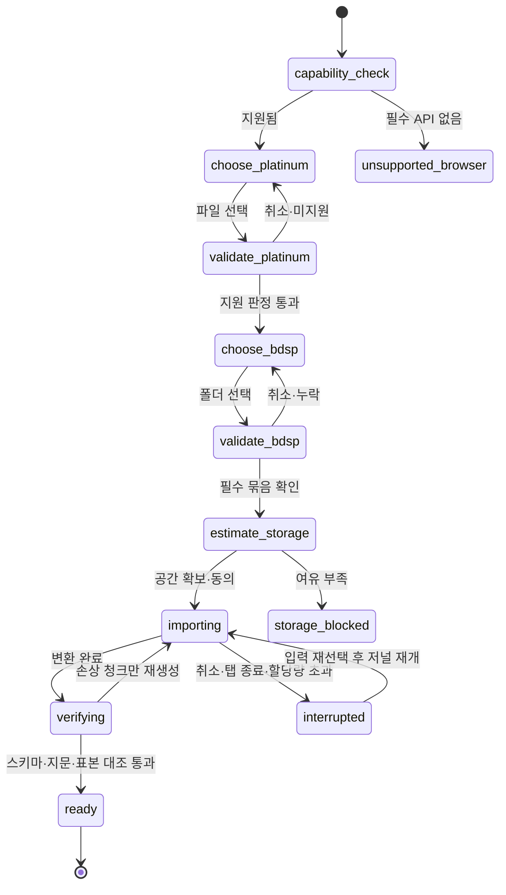
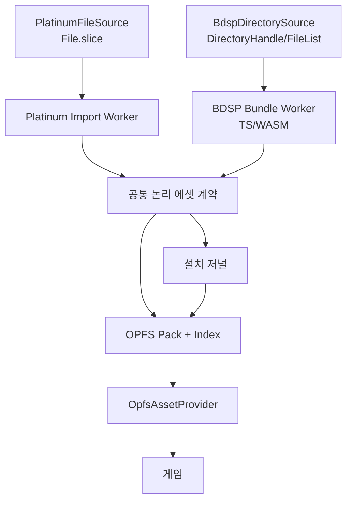
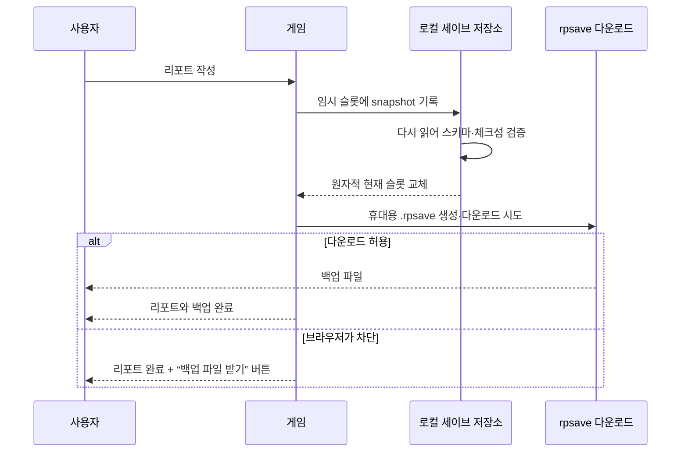

# 로컬 Import·설치·세이브 안내와 구현 계약

> 상태: **일부 구현** (2026-08-10). 이 문서는 공개 배포판이 도달해야 할 계약이며,
> §14 완료 조건을 통과하기 전 현재 빌드를 공개판으로 간주하지 않는다.
>
> ⚠️ **지금 막혀 있는 것은 변환이다.** 경계·리포트·Provider·부팅·Worker·설치·
> 무결성 검증은 섰지만 Platinum 변환은 그룹 아홉 중 **둘**(`moves`·`marts`)만
> 옮겨졌고, BDSP 변환은 **컨테이너까지만** 된다 — UnityFS를 열어 안에 무엇이
> 몇 개 있는지 세는 데까지고(UnityPy와 208개 일치) 정점도 픽셀도 아직 안 읽는다.
> 무엇이 왜 막혔는지는 `src/import/platinum/convert.ts`의 `GROUPS` 표와
> `src/import/bdsp/unityfs.ts`의 `SPIKE_BLOCKERS`에 있다.
>
> ⚠️ **그래서 공개판은 아직 `ready`에 도달할 수 없다.** 필수 그룹
> (`src/import/install/required.ts`)이 열둘인데 둘만 만들 수 있다. 설치를 끝내도
> 상태는 `partial`이고, `partial`로는 게임이 안 열린다 — 그것이 설계다.
>
> 공개 배포를 막고 있는 것 전체는 [DEPLOY.md](DEPLOY.md) §1.
>
> 정책 경계는 [COPYRIGHT.md](COPYRIGHT.md), 포맷은 [DATA.md](DATA.md),
> 작업 순서는 [PLAN.md](PLAN.md)를 따른다.

---

## 1. 사용자가 준비할 것

Radiant Platinum은 원본 게임 파일이나 변환된 에셋 팩을 제공하지 않는다. 공개판을
처음 실행할 때 사용자가 이 기기에서 두 입력을 선택한다.

1. 자신이 적법하게 보유한 지원 지역판 Pokémon Platinum `.nds` 파일
2. 자신이 적법하게 보유한 Pokémon Brilliant Diamond에서 이미 추출해 둔
   `Data/StreamingAssets/AssetAssistant/` 폴더

BDSP 쪽은 정확히 `AssetAssistant`를 찾아 들어갈 필요가 없다. 브라우저가 폴더
선택을 지원하면 다음 중 하나를 골라도 Importer가 아래를 탐색한다.

```text
romfs/
  Data/
    StreamingAssets/
      AssetAssistant/
        Battle/
        Characters/
        Dpr/
        Environments/
        Pokemon Database/
```

지원 판정은 폴더 이름 하나가 아니라 필요한 하위 인덱스와 번들 조합으로 한다.
대소문자·공백은 알려진 정식 구조 안에서만 정규화한다. 이름이 비슷한 임의 폴더를
추측해 받아들이지 않는다.

웹사이트가 설명하는 범위는 다음까지다.

- 어떤 두 입력이 필요한가
- 어떤 폴더를 선택해야 하는가
- 앱이 입력을 어떻게 로컬에서 검증하는가
- 필요한 저장공간과 예상 변환 단계
- 실패했을 때 어느 폴더·파일 묶음이 부족한가
- 설치·에셋 캐시·리포트를 어떻게 백업하고 지우는가

ROM 다운로드, 콘솔 개조, 키 획득, NSP/NCA/XCI 복호화 또는 보호조치 우회 방법은
설명하지 않는다. `AssetAssistant`가 준비되지 않았다면 앱은 원천 컨테이너나 키를
요구하는 대신 **“이미 추출된 지원 폴더가 필요합니다”**라고 안내하고 멈춘다.

---

## 2. “선택”이지 “업로드”가 아니다

파일·폴더 선택기는 브라우저가 로컬 파일 읽기 권한을 받는 UI다. Importer는 다음
정보를 네트워크로 보내지 않는다.

- 원본 바이트
- 파일명과 전체 폴더 목록
- 로컬 경로
- 파일·폴더 해시 또는 지원 판정 지문
- 변환된 GLB·PNG·JSON·오디오
- 설치 진행률과 오류 상세

Import 화면의 문구는 “업로드” 대신 **“이 기기에서 Platinum 선택”**,
**“이 기기에서 BDSP 폴더 선택”**으로 쓴다. 개발자 도구의 Network 패널로도 Import
중 정적 앱 업데이트 확인 외 파일 전송이 없음을 검증한다. Import 라우트에는 분석
SDK와 원격 오류 수집기를 넣지 않고 CSP `connect-src 'self'`를 기본으로 둔다.

---

## 3. 지원 브라우저와 권한

첫 지원 목표는 데스크톱 Chromium 계열의 최신 안정판이다.

- HTTPS 또는 localhost가 필요하다.
- `showOpenFilePicker`·`showDirectoryPicker`가 있으면 명시적 핸들을 사용한다.
- 디렉터리 선택 API가 없으면 `<input type="file" webkitdirectory>` 폴백을 제공한다.
- 폴백은 브라우저를 닫은 뒤 원본 폴더 핸들을 다시 열 수 없으므로, 중단 재개 시
  같은 폴더를 다시 선택하게 할 수 있다. 이미 OPFS에 완성된 청크는 다시 만들지 않는다.
- OPFS와 Worker가 없거나 저장공간 추정에 실패하면 게임 설치를 시작하지 않고
  지원 환경을 설명한다.
- 권한 거부는 오류가 아니라 취소다. 이미 설치된 에셋과 리포트를 지우지 않는다.

모바일은 수 GB 폴더 선택, 변환 시간, 메모리, 발열 때문에 첫 공개 목표가 아니다.
모바일에서 앱 셸이 열리더라도 Import 지원을 약속하지 않는다.

---

## 4. 첫 실행 흐름



화면은 각 단계에서 다음을 보여 준다.

| 단계 | 사용자에게 보여 줄 것 |
|---|---|
| 환경 확인 | 브라우저 지원 여부, 보안 컨텍스트, OPFS, 폴더 선택 폴백 |
| Platinum 검증 | 감지 지역판, 지원 여부, 필요한 경우 “다른 파일 선택” |
| BDSP 검증 | 찾은 `AssetAssistant` 상대 경로, 필수 그룹별 있음/없음 |
| 공간 확인 | 원본 크기가 아닌 예상 **변환 결과 + 임시 여유**, 현재 quota·usage |
| 변환 | 전체 퍼센트뿐 아니라 현재 그룹, 처리 수/전체, 쓴 용량, 남은 단계 |
| 검증 | 스키마, 인덱스, 청크 체크섬, 개발 기준 산출물과의 계약 버전 |
| 완료 | 설치된 지역판·언어, 에셋 용량, 리포트 불러오기, 시작 버튼 |

시간 예측은 충분한 실측이 쌓이기 전 표시하지 않는다. 부정확한 “3분 남음”보다
단계·처리량·완료 그룹을 보여 주는 편이 낫다.

---

## 5. 입력 검증

### Platinum

검증 순서:

1. 확장자와 최소 헤더 길이
2. NDS 헤더·FNT·FAT 범위가 파일 안에 있는지
3. 필수 NARC·SDAT·오버레이 엔트리 존재
4. 지원 지역판과 리비전의 로컬 지문
5. 표본 NARC의 엔트리 수와 구조
6. 선택한 지역판에서 만들 수 있는 언어 선언

전체 파일을 한 번에 메모리로 읽지 않는다. `File.slice()`로 필요한 범위를 읽고,
순차 해시가 필요하면 Worker에서 스트리밍한다.

공개판은 설치한 Platinum 언어만 제공한다. 다른 언어를 추가하려면 그 지역판의
호환 ROM을 별도로 선택한다. 현재 개발 모드가 KO·EN·JA 세 벌을 모두 갖는다는
이유로 공개판이 세 언어를 기본 제공해서는 안 된다.

### BDSP

Importer는 선택 폴더 아래에서 알려진 `AssetAssistant` 루트를 찾은 뒤, 최소한 다음
논리 그룹을 검증한다.

| 그룹 | 용도 |
|---|---|
| `Dpr` | 맵·게임 설정·모델 연결 표 |
| `Battle` | 배틀 표와 모션 타이밍 |
| `Characters` | 주인공·NPC·자전거 |
| `Environments` | 배틀 무대와 하늘 |
| `Pokemon Database` | 포켓몬 배틀 프리팹·메시·텍스처 |

포켓몬은 프리팹·공용 메시·폼별 텍스처가 여러 번들에 나뉘므로 파일 하나의 존재만
보고 통과시키지 않는다. 필요한 세트가 모두 해석되는 표본 종을 먼저 열어 본다.

지원되지 않는 BDSP 버전은 “잘못된 소유권”으로 단정하지 않고, 감지한 구조와 지원
계약 버전만 로컬 화면에 표시한다. 원본 파일명이나 지문을 오류 서버로 보내지 않는다.

---

## 6. 변환 아키텍처



현재 Node 추출기의 NDS·NARC·Nitro 포맷 코드는 브라우저 TypeScript로 옮길 수 있지만,
`fs`·`Buffer`·Node zlib 의존은 제거해야 한다. 현재 BDSP 모델 변환기는
Python의 UnityPy·NumPy·Pillow에 의존하므로 그대로 브라우저에서 돌지 않는다.
Unity AssetBundle, Mesh, Texture2D, AnimationClip, 재질 채색, GLB 작성에 동등한
TypeScript/WASM 경로가 필요하다.

Pyodide로 UnityPy 전체를 싣는 방식은 초기 다운로드·메모리·호환성 비용을 먼저
측정하기 전 기본안으로 채택하지 않는다. 어떤 구현을 택하든 현재 Python 산출물과
파일 수·스키마·메시 바운드·애니메이션 클립·대표 픽셀을 비교하는 parity test를
통과해야 한다.

Worker 메시지는 큰 ArrayBuffer를 복사하지 않고 transferable로 넘긴다. 원본 전체를
메인 스레드에 올리지 않으며, 한 그룹을 끝낼 때마다 OPFS에 기록하고 메모리를
해제한다. UI는 취소 신호와 진행 이벤트만 주고받는다.

---

## 7. 런타임 에셋 계약

현재 게임은 약 20개 모듈에서 `dataUrl()`·`modelUrl()`을 만들고 `fetch`,
CSS 이미지, Three.js `GLTFLoader`에 직접 넘긴다. OPFS는 공개 HTTP URL이 아니므로
주소의 뿌리만 바꾸는 것으로는 동작하지 않는다.

목표 인터페이스:

```ts
interface AssetProvider {
  exists(path: string): Promise<boolean>
  bytes(path: string): Promise<ArrayBuffer>
  text(path: string): Promise<string>
  blob(path: string): Promise<Blob>
  objectUrl(path: string): Promise<string>
  releaseObjectUrl(path: string): void
}
```

구현은 둘이다.

- `DevAssetProvider`: 개발 전용 로컬 변환 결과를 읽는다. 처음에는 현재
  `public/data`·`public/models` 호환 모드를 제공하되, 최종적으로는
  `public/` 밖 `raw/dev-assets` 또는 별도 로컬 캐시를 Vite dev middleware로만
  노출한다.
- `OpfsAssetProvider`: 공개판 설치 팩과 인덱스를 읽고 이미지·GLB에는 캐시된 Blob
  URL을 제공한다. 화면·맵이 언마운트될 때 참조 수를 줄이고 안전할 때 revoke한다.

JSON·바이너리 로더는 URL로 재-fetch하지 말고 Provider에서 직접 읽는다. CSS 배경,
`Image`, `GLTFLoader`처럼 URL이 필요한 소비자만 Blob URL을 사용한다. GLB는
외부 상대 경로를 갖지 않는 self-contained 결과로 고정한다.

---

## 8. OPFS 설치 구조와 복구

논리 구조:

```text
/radiant-platinum/
  install.json               # 계약 버전·설치 상태·지역판·그룹 지문
  journal.json               # 진행 중 그룹·완료 청크·재시작 정보
  assets/
    data.pack
    data.index.json
    models.pack
    models.index.json
    textures.pack
    textures.index.json
    audio.pack
    audio.index.json
  saves/                     # 에셋 삭제와 분리된 로컬 리포트 사본
```

수천 개 소파일을 그대로 만들지 않고 종류별 pack과 index로 묶는다. 단, 첫 구현은
정확성을 위해 파일 단위로 시작해도 되며 pack 전환은 `AssetProvider` 뒤에서 한다.

설치 규칙:

- 시작 전 `navigator.storage.estimate()` 결과와 변환 임시 여유를 확인한다.
- 사용자 제스처 안에서 `navigator.storage.persist()`를 요청하되 승인으로 간주하지
  않는다.
- `install.json`은 모든 검증이 끝날 때까지 `ready`가 되지 않는다.
- 각 출력은 임시 이름에 쓴 뒤 체크섬을 확인하고 rename/commit한다.
- 중단 후에는 journal과 실제 파일을 대조해 완성된 청크만 재사용한다.
- 계약 버전이 바뀌면 재사용 가능한 그룹과 재생성 그룹을 구분한다.
- “에셋 다시 설치”는 `assets/`와 설치 저널만 지우며 `saves/`와 IndexedDB
  리포트를 건드리지 않는다.
- “모든 로컬 데이터 지우기”는 리포트 백업 다운로드와 별도 확인 없이는 실행하지 않는다.

Service Worker는 앱 셸만 precache한다. 변환 에셋은 Cache Storage와 OPFS에 이중으로
저장하지 않는다.

---

## 9. 개발용 `raw/` 경로

현재 파일은 이동하지 않고 다음 레거시 계약으로 먼저 연결한다.

| 현재 경로 | 역할 | 공개 사용자의 입력과 같은가 |
|---|---|---|
| `raw/roms/` | 개발 Platinum 원본 | 개념상 같지만 파일명에 의존하면 안 됨 |
| `raw/extracted/{us,ko,ja}/` | 언어별 선추출 캐시 | 아니오. 공개판은 선택 ROM에서 생성 |
| `raw/decomp/` | 구조·상수 대조 참조 | 아니오. Import 입력이 아님 |
| `raw/decomp-derived/` | 개발 검증 중간표 | 아니오 |
| `raw/bdsp/Characters`, `dpr`, `pokemon*`, `arenas` | 이미 골라 둔 BDSP 하위 집합 | 공개 `AssetAssistant`의 논리 그룹에 매핑 |
| `raw/bdsp/nca`, `out` 등 | 기존 준비 과정의 보관·중간물 | 아니오. 정상 빌드·Importer가 읽지 않음 |
| `raw/models/` | 모델 실험·중간물 | 아니오 |

목표 구조는 [COPYRIGHT.md §5](COPYRIGHT.md#5-개발용-raw-정책)의
`sources/references/work/dev-assets/legacy` 분리다. 자동 재배치는 하지 않는다.
먼저 `raw.sources.local.json` 같은 Git 무시 설정으로 현재 실제 경로를 논리 그룹에
매핑하고, 추출기는 하드코딩된 특정 파일명 대신 그 설정을 읽는다.

개발 검증은 두 번 돈다.

1. 현재 raw → 기존 Node/Python 추출기 → DevAssetProvider
2. 같은 원천의 지원 입력 → 브라우저 Worker → 임시 OPFS → OpfsAssetProvider

대표 맵·대사·소리·NPC·무대·포켓몬을 두 경로에서 비교한다. 두 결과가 동등해질
때까지 raw 경로를 제거하거나 덮어쓰지 않는다.

---

## 10. 리포트 저장과 휴대용 백업

현재 구현은 `radiant-platinum/save/report` 한 슬롯을 IndexedDB structured clone으로
저장한다. `Uint8Array`가 보존되고 기존 `pt-3d` DB에서 한 번 이전되는 것은
테스트됐다. 그러나 현재는 정확히 같은 `SAVE_VERSION`만 읽고, 다른 버전은 없는
리포트처럼 처리한다. 파일 내보내기·가져오기·스키마 검증도 없다.

목표 리포트 흐름:



**매번 리포트할 때 다운로드를 시도**한다. 브라우저가 반복 다운로드를 차단할 수
있으므로 내부 저장 성공과 파일 다운로드 성공을 별도 상태로 보여 준다. 타이틀과
설정에도 “리포트 백업 받기”를 항상 둔다.

권장 파일명:

```text
radiant-platinum_<trainer>_<YYYY-MM-DD_HH-mm-ss>.rpsave
```

파일 봉투 예시:

```ts
interface PortableSave {
  magic: 'RADIANT_PLATINUM_SAVE'
  formatVersion: number
  saveVersion: number
  createdAt: string
  buildCompatibility: { min: string; max?: string }
  contentContract: { platinumLocale: string; schema: number }
  summary: { trainer: string; playtimeMs: number }
  codec: 'json+base64-typed-arrays'
  checksum: string
  payload: string
}
```

checksum은 우발적 손상을 찾는 장치이지 보안 서명이 아니다. 원본 파일명·경로·ROM
전체 해시·에셋 바이트는 넣지 않는다.

---

## 11. 리포트 불러오기

타이틀 화면에 **“리포트 파일 불러오기”**를 항상 둔다. 현재 로컬 리포트가 없어도
보여야 한다.

1. 사용자가 `.rpsave`를 선택한다.
2. magic·파일 크기 상한·봉투 스키마를 검사한다.
3. checksum을 확인한다.
4. TypedArray를 복원하고 SaveSchema로 범위까지 검증한다.
5. `saveVersion`을 순차 migration한다.
6. 필요한 콘텐츠 계약이 설치돼 있는지 확인한다.
7. 주인공·플레이 시간·저장 시각·호환 결과를 미리 보여 준다.
8. 현재 리포트가 있으면 먼저 그 리포트를 다운로드한다.
9. 사용자가 확인한 뒤 임시 슬롯에 쓰고 다시 읽어 검증한다.
10. 검증 성공 후에만 현재 슬롯을 교체한다.

실패한 가져오기는 현재 리포트를 전혀 바꾸지 않는다. 더 최신 앱에서 만든 파일,
손상 파일, 너무 큰 파일, 알 수 없는 codec을 구분해 안내한다. 지원하지 못하는 옛
버전도 버리지 않고 원본 파일을 그대로 보관하라고 안내한다.

새 게임·설정의 “처음부터”처럼 리포트를 지우는 동작도 삭제 전에 현재 `.rpsave`
다운로드를 시도한다. 개발 콘솔의 reset은 개발 모드 예외지만 명시적 경고를 남긴다.

---

## 12. 알려진 전환 문제

| 문제 | 현재 사실 | 해결 게이트 |
|---|---|---|
| Vite 공개 폴더 혼입 | ✅ `copyPublicDir: false` + 허용 목록. 실측 `dist` 642.0MB → 11.9MB | 남은 것은 개발 산출물을 `public/` 밖으로 옮기는 일 |
| URL 직접 의존 | ✅ 소비자 열아홉 곳을 Provider로. `dataUrl`을 부르는 파일이 하나뿐인 것을 시험이 붙든다 | — |
| SW 캐시 모델 | ✅ 앱 셸만. 옛 판이 만든 에셋 캐시도 활성화 때 지운다 | — |
| 세이브 버전 | ✅ SaveSchema + 순차 migration. 못 읽는 것은 **원본 파일로 돌려준다** | — |
| 단일 삭제 경로 | ✅ 지우기 전에 `.rpsave`와 IndexedDB 백업 슬롯 둘 다 | — |
| 대용량 메모리 | ✅ `Blob.slice()`. 크기로 걸러지는 파일은 **한 조각도 안 읽는다** | 변환 그룹이 늘면 그룹별 해제를 다시 잰다 |
| 중단 복구 | ✅ 저널 + 임시 파일 + 검증 후 commit + 재개. **저널만 믿지 않고 실제 파일과 대조한다** | — |
| 3개 언어 가정 | ✅ `availableLanguages()`가 설치 manifest에서 온다. 없는 언어를 고른 상태면 첫 번째로 되돌린다 | — |
| 부팅 배선 | ✅ 개발=HTTP · 공개+ready=OPFS · 공개+미설치=**설치 화면**. 미설치에서 HTTP로 안 되돌아간다 | — |
| 부분 설치 | ✅ `installing`/`partial`/`ready` 분리. 필수 그룹이 다 있어야 `ready`다 | — |
| 파일 무결성 | ✅ 파일마다 길이 + SHA-256. 재개가 깨진 그룹만 다시 만든다 | — |
| Import Worker | ✅ 실제 module Worker. `File`이 아니라 `Blob`을 넘기고, 산출물은 transferable | — |
| **Platinum 변환 이식** | ⚠️ 그룹 아홉 중 **둘**(`moves`·`marts`). 셋 다 노드 산출물과 바이트로 같다 | 나머지 일곱 |
| **decomp 의존 추출** | ⚠️ `scripts`만 남았다 (명령 폭·scriptID 표). `marts`는 ARM9에서 직접 읽는다 | `scripts`를 롬 파싱으로 |
| **BDSP 변환** | ⚠️ 컨테이너까지. UnityFS·LZ4·SerializedFile 오브젝트 표가 UnityPy와 208개 일치. **정점도 픽셀도 아직 안 읽는다** | 타입 트리 해석 · 텍스처 디코딩 · GLB 쓰기 (`SPIKE_BLOCKERS`) |
| 번들 안의 제3자 데이터 | ❌ `battle-sim` 청크 6.55MB 중 8,673kB가 `@pkmn/sim` 정적 게임 데이터 | DEPLOY.md §4. **미해결 release blocker** |
| CSP | ⚠️ 정본과 meta 태그는 있다. **응답 헤더를 실제 호스트에서 잰 적이 없다** | `pnpm verify:deploy <url>` |
| 무전송 검증 | ⚠️ 단위 시험은 "미설치 부팅에서 `fetch` 0회"를 잰다. 실제 브라우저 Network 검사는 아직 | §14 완료 조건 |

---

## 13. 구현 순서

1. ✅ **경계 게이트부터**: 프로덕션 빌드가 `public/data`, `public/models`, ROM,
   런타임 팩을 포함하면 실패한다.
2. ✅ **리포트 휴대성**: SaveSchema, codec, migration, 매 리포트 다운로드, 가져오기,
   삭제 전 백업. 에셋 전환 중에도 진행을 잃지 않게 하려던 것이고, 그 목적을 지켰다.
3. ✅ **AssetProvider**: URL 소비자를 bytes/blob/objectUrl 계약으로 옮겼다.
   DevAssetProvider가 기존 게임의 동작을 그대로 보존한다.
4. ⚠️ **raw source adapter**: 경로 매핑은 끝났다. **출력은 아직 `public/` 안이다** —
   배포물로는 안 나가지만 목표는 `raw/dev-assets`다. 기존 raw 파일은 한 개도 안 옮겼다.
5. ⚠️ **Platinum 변환**: 입력 검증·단일 설치 언어·Worker는 끝났고, 변환은
   `moves`와 `marts`가 노드 산출물과 바이트로 같다. 나머지 일곱이 남았다.
6. ✅ **BDSP 디렉터리 스캐너**: 상위 폴더 자동 탐색, 그룹 다섯 검증, 표본 종, 누락 진단.
7. ⚠️ **BDSP 브라우저 변환**: spike가 컨테이너까지 갔다 — UnityFS 헤더·LZ4·블록·
   디렉터리·SerializedFile 오브젝트 표. 실측으로 UnityPy와 오브젝트 208개와 클래스별
   개수가 **정확히 같다**. 그 위(타입 트리 해석 · 텍스처 디코딩 · GLB 쓰기)는
   `SPIKE_BLOCKERS`에 무엇이 왜 막혔는지와 다음 선택지를 적어 두었다.
   **최우선 기술 게이트다.**
8. ✅ **OPFS installer**: quota, persist, journal, 원자적 commit, 재개, 삭제 분리,
   파일별 길이·SHA-256 검증, `partial`/`ready` 구분.
9. ⚠️ **Import Wizard**: 단계 UI가 Worker로 돈다. 설치 시작 조건에 Platinum·BDSP·
   저장 공간·브라우저 지원이 모두 걸린다. 필수 그룹이 모자라 아직 `partial`까지고,
   화면 첫 줄이 그 사실을 적는다.
10. ⚠️ **부팅 배선**: 개발=HTTP · 공개+ready=OPFS · 공개+미설치=설치 화면.
    설치 직후 reload 없이 갈아 끼우고, 다시 켜도 복구된다.
11. ❌ **PWA·개인정보 검증**: 실제 브라우저 Network 무전송 검사, 지원 브라우저 E2E,
    새 프로필 세이브 왕복, 배포 URL CSP 응답 헤더.

2~4가 끝나기 전에 브라우저 추출 UI부터 만들지 않는다. 저장·로더 경계가 없으면
Importer가 만든 결과를 기존 게임이 소비할 수 없고, 실패 중 리포트를 잃을 수 있다.

---

## 14. 공개판 완료 조건

- 깨끗한 clone의 프로덕션 빌드에 원본 유래 파일이 0개다.
- 서버 요청 로그와 브라우저 Network 검사에서 사용자 입력 전송이 0이다.
- 지원 Platinum 한 지역판과 지원 BDSP `AssetAssistant`로 새 설치가 완료된다.
- 취소·탭 종료·quota 부족 뒤에 완성 청크를 보존하고 재개한다.
- DevAssetProvider와 OpfsAssetProvider가 같은 계약 테스트를 통과한다.
- 대표 데이터·맵·대사·음악·NPC·포켓몬·무대가 현재 raw 개발판과 동등하다.
- 에셋 캐시 삭제 후 리포트가 남고, 재설치 뒤 이어진다.
- 리포트할 때마다 내부 저장과 `.rpsave` 다운로드 상태가 표시된다.
- `.rpsave` 내보내기 → 새 브라우저 프로필 가져오기 → 같은 위치·파티·박스·가방·
  플래그·변수로 이어하기 E2E가 통과한다.
- 앱 업데이트로 saveVersion이 바뀌어도 migration 또는 원본 백업 반환이 된다.
- 공개 도움말에 취득·복호화·키·우회 안내가 없고 로컬 선택·검증·복구는 충분히
  설명돼 있다.

이 조건 중 하나라도 빠지면 “웹에서 편리하게 설치하고 안전하게 이어하는 공개판”은
완료가 아니다.

