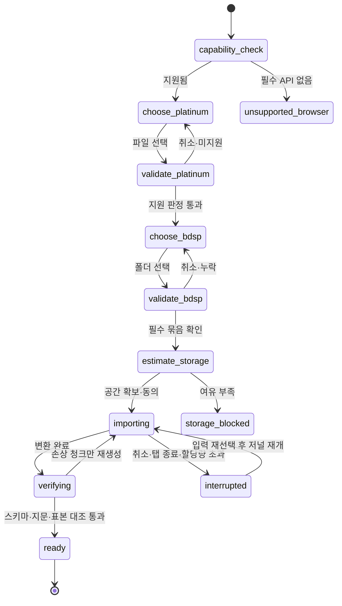
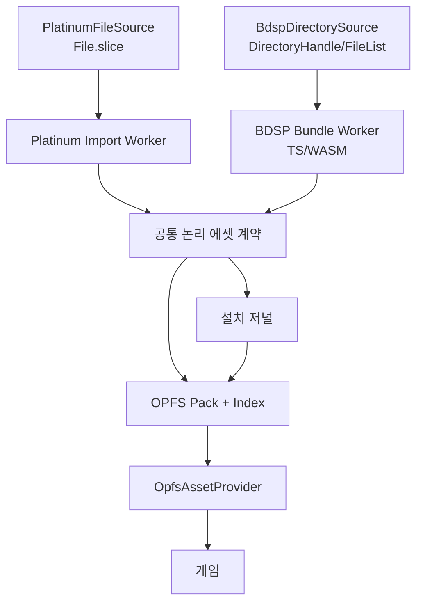
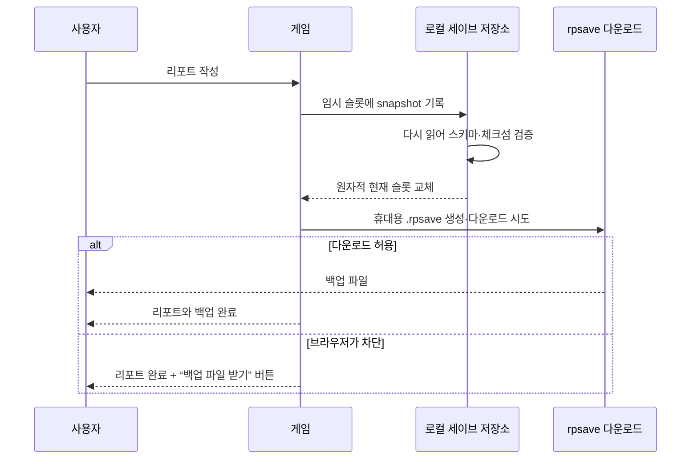

# 로컬 Import·설치·세이브 안내와 구현 계약

> 상태: **일부 구현** (2026-08-10). 이 문서는 공개 배포판이 도달해야 할 계약이며,
> §14 완료 조건을 통과하기 전 현재 빌드를 공개판으로 간주하지 않는다.
>
> ⚠️ **지금 막혀 있는 것은 변환이다.** 경계·리포트·Provider·부팅·Worker·설치·
> 무결성 검증은 섰지만 Platinum 변환은 그룹 아홉 중 **둘**(`moves`·`marts`)만
> 옮겨졌고, BDSP 변환은 **컨테이너까지만** 된다 — UnityFS를 열어 안에 무엇이
> 몇 개 있는지 세는 데까지고(UnityPy와 208개 일치) 정점도 픽셀도 아직 안 읽는다.
> 무엇이 왜 막혔는지는 `src/import/platinum/convert.ts`의 `GROUPS` 표와
> `src/import/bdsp/unityfs.ts`의 `SPIKE_BLOCKERS`에 있다.
>
> ⚠️ **그래서 공개판은 아직 `ready`에 도달할 수 없다.** 필수 그룹
> (`src/import/install/required.ts`)이 열둘인데 둘만 만들 수 있다. 설치를 끝내도
> 상태는 `partial`이고, `partial`로는 게임이 안 열린다 — 그것이 설계다.
>
> 공개 배포를 막고 있는 것 전체는 [DEPLOY.md](DEPLOY.md) §1.
>
> 정책 경계는 [COPYRIGHT.md](COPYRIGHT.md), 포맷은 [DATA.md](DATA.md),
> 작업 순서는 [PLAN.md](PLAN.md)를 따른다.

---

## 1. 사용자가 준비할 것

Radiant Platinum은 원본 게임 파일이나 변환된 에셋 팩을 제공하지 않는다. 공개판을
처음 실행할 때 사용자가 이 기기에서 두 입력을 선택한다.

1. 자신이 적법하게 보유한 지원 지역판 Pokémon Platinum `.nds` 파일
2. 자신이 적법하게 보유한 Pokémon Brilliant Diamond에서 이미 추출해 둔
   `Data/StreamingAssets/AssetAssistant/` 폴더

BDSP 쪽은 정확히 `AssetAssistant`를 찾아 들어갈 필요가 없다. 브라우저가 폴더
선택을 지원하면 다음 중 하나를 골라도 Importer가 아래를 탐색한다.

```text
romfs/
  Data/
    StreamingAssets/
      AssetAssistant/
        Battle/
        Characters/
        Dpr/
        Environments/
        Pokemon Database/
```

지원 판정은 폴더 이름 하나가 아니라 필요한 하위 인덱스와 번들 조합으로 한다.
대소문자·공백은 알려진 정식 구조 안에서만 정규화한다. 이름이 비슷한 임의 폴더를
추측해 받아들이지 않는다.

웹사이트가 설명하는 범위는 다음까지다.

- 어떤 두 입력이 필요한가
- 어떤 폴더를 선택해야 하는가
- 앱이 입력을 어떻게 로컬에서 검증하는가
- 필요한 저장공간과 예상 변환 단계
- 실패했을 때 어느 폴더·파일 묶음이 부족한가
- 설치·에셋 캐시·리포트를 어떻게 백업하고 지우는가

ROM 다운로드, 콘솔 개조, 키 획득, NSP/NCA/XCI 복호화 또는 보호조치 우회 방법은
설명하지 않는다. `AssetAssistant`가 준비되지 않았다면 앱은 원천 컨테이너나 키를
요구하는 대신 **“이미 추출된 지원 폴더가 필요합니다”**라고 안내하고 멈춘다.

---

## 2. “선택”이지 “업로드”가 아니다

파일·폴더 선택기는 브라우저가 로컬 파일 읽기 권한을 받는 UI다. Importer는 다음
정보를 네트워크로 보내지 않는다.

- 원본 바이트
- 파일명과 전체 폴더 목록
- 로컬 경로
- 파일·폴더 해시 또는 지원 판정 지문
- 변환된 GLB·PNG·JSON·오디오
- 설치 진행률과 오류 상세

Import 화면의 문구는 “업로드” 대신 **“이 기기에서 Platinum 선택”**,
**“이 기기에서 BDSP 폴더 선택”**으로 쓴다. 개발자 도구의 Network 패널로도 Import
중 정적 앱 업데이트 확인 외 파일 전송이 없음을 검증한다. Import 라우트에는 분석
SDK와 원격 오류 수집기를 넣지 않고 CSP `connect-src 'self'`를 기본으로 둔다.

---

## 3. 지원 브라우저와 권한

첫 지원 목표는 데스크톱 Chromium 계열의 최신 안정판이다.

- HTTPS 또는 localhost가 필요하다.
- `showOpenFilePicker`·`showDirectoryPicker`가 있으면 명시적 핸들을 사용한다.
- 디렉터리 선택 API가 없으면 `<input type="file" webkitdirectory>` 폴백을 제공한다.
- 폴백은 브라우저를 닫은 뒤 원본 폴더 핸들을 다시 열 수 없으므로, 중단 재개 시
  같은 폴더를 다시 선택하게 할 수 있다. 이미 OPFS에 완성된 청크는 다시 만들지 않는다.
- OPFS와 Worker가 없거나 저장공간 추정에 실패하면 게임 설치를 시작하지 않고
  지원 환경을 설명한다.
- 권한 거부는 오류가 아니라 취소다. 이미 설치된 에셋과 리포트를 지우지 않는다.

모바일은 수 GB 폴더 선택, 변환 시간, 메모리, 발열 때문에 첫 공개 목표가 아니다.
모바일에서 앱 셸이 열리더라도 Import 지원을 약속하지 않는다.

---

## 4. 첫 실행 흐름



화면은 각 단계에서 다음을 보여 준다.

| 단계 | 사용자에게 보여 줄 것 |
|---|---|
| 환경 확인 | 브라우저 지원 여부, 보안 컨텍스트, OPFS, 폴더 선택 폴백 |
| Platinum 검증 | 감지 지역판, 지원 여부, 필요한 경우 “다른 파일 선택” |
| BDSP 검증 | 찾은 `AssetAssistant` 상대 경로, 필수 그룹별 있음/없음 |
| 공간 확인 | 원본 크기가 아닌 예상 **변환 결과 + 임시 여유**, 현재 quota·usage |
| 변환 | 전체 퍼센트뿐 아니라 현재 그룹, 처리 수/전체, 쓴 용량, 남은 단계 |
| 검증 | 스키마, 인덱스, 청크 체크섬, 개발 기준 산출물과의 계약 버전 |
| 완료 | 설치된 지역판·언어, 에셋 용량, 리포트 불러오기, 시작 버튼 |

시간 예측은 충분한 실측이 쌓이기 전 표시하지 않는다. 부정확한 “3분 남음”보다
단계·처리량·완료 그룹을 보여 주는 편이 낫다.

화면이 실제로 말하는 것 (`src/import/ui/ImportWizard.tsx`):

| 문서가 요구한 것 | Wizard 어디 |
|---|---|
| Platinum 입력은 **적법하게 보유한 호환 `.nds` 백업**이다 | ① “이 기기에서 Platinum 선택 · 전송하지 않음” + 타이틀 화면 고지 |
| 크기 → 헤더 → 게임 코드 → ARM9 locator → NARC 순으로 로컬 검증 | ① 선택 즉시 진행 줄이 그 순서로 흐른다 (§5) |
| **크기에서 걸리면 내용을 더 안 읽는다** | 같은 곳. `validate.ts`가 그 순서를 강제한다 |
| BDSP 입력은 **이미 추출된** `AssetAssistant` 또는 그 상위 romfs 폴더 | ② “이미 추출된 AssetAssistant (또는 그 상위)” |
| 하위 경로를 브라우저가 자동 탐색한다 | ② “찾았습니다: `<상대 경로>`” |
| 고른 데이터를 네트워크로 안 보낸다 | 머리말 — 바이트·파일 이름·폴더 목록·판정 결과 넷을 다 적는다 |
| 저장 공간 진단 | ③ 여유/전체/필요 · “오래 보관” 승인 여부 |
| 결과는 OPFS에 있고 **사이트 데이터를 지우면 사라진다** | 머리말 |
| **한 번 설치하면 다시 안 고른다** · 원본을 안 기억한다 | 머리말 (§15) |
| **브라우저·기기·주소가 다르면 공유되지 않는다** | 머리말 |
| 무엇이 모자란가 | 머리말의 필수 개수 · 완료 뒤 누락 그룹 이름 · “아직 안 옮긴 변환” 목록 |
| 매 리포트마다 내부 저장과 `.rpsave` 받기를 **각각** 시도한다 | 타이틀 화면 (§10) |
| `.rpsave` 내보내기·가져오기·삭제 전 백업·검증 | 타이틀 화면 (§10 · §11) |
| **취득·개조·키·복호화·우회는 안내하지 않는다** | ② 본문에 그대로 적는다 |

“업로드”라는 말을 화면 어디에도 쓰지 않는다 — “이 기기에서 선택” · “브라우저
안에서 변환”이다. 그 오해가 이 프로젝트의 정책을 통째로 잘못 읽게 만든다.

마지막 줄이 화면에 있는 이유는, 사람들이 “그럼 그건 어디서 구하나요”를 묻는
자리가 정확히 거기이기 때문이다. 문서에만 적어 두면 그 순간에 안 보인다.

### 부팅 갈래는 밖에서 읽을 수 있다

`boot()`이 정하고 나서 `<html data-boot>`에 적는다 — `play:dev` · `play:opfs` ·
`install:none` · `install:partial` · `install:invalid` · `install:unsupported` ·
`install:outdated`.

**뒷문이 아니다. 관측 전용이다.** 아무것도 안 바꾸고 **이미 내린 결정**을 밖에서
읽게만 한다. 이게 없으면 “설치본을 읽고 떴는가”를 화면 글자로 짐작해야 하는데,
그건 갈래가 아니라 렌더 결과를 재는 것이다. 지원 문의에도 같은 값이 필요하다.

그것이 정말 관측 전용인지는 브라우저가 직접 누른다 (DEPLOY.md §5의 ㉓):
`?boot=play:opfs` · `#play:opfs` · `localStorage` · `sessionStorage` · 표식을
손으로 고치기 — **다섯 다 안 먹는다.** 진입 청크에 그 표식을 *읽는* 코드도 없다.

---

## 5. 입력 검증

### Platinum

검증 순서:

1. 확장자와 최소 헤더 길이
2. NDS 헤더·FNT·FAT 범위가 파일 안에 있는지
3. 필수 NARC·SDAT·오버레이 엔트리 존재
4. 지원 지역판과 리비전의 로컬 지문
5. 표본 NARC의 엔트리 수와 구조
6. 선택한 지역판에서 만들 수 있는 언어 선언

전체 파일을 한 번에 메모리로 읽지 않는다. `File.slice()`로 필요한 범위를 읽고,
순차 해시가 필요하면 Worker에서 스트리밍한다.

공개판은 설치한 Platinum 언어만 제공한다. 다른 언어를 추가하려면 그 지역판의
호환 ROM을 별도로 선택한다. 현재 개발 모드가 KO·EN·JA 세 벌을 모두 갖는다는
이유로 공개판이 세 언어를 기본 제공해서는 안 된다.

### BDSP

Importer는 선택 폴더 아래에서 알려진 `AssetAssistant` 루트를 찾은 뒤, 최소한 다음
논리 그룹을 검증한다.

| 그룹 | 용도 |
|---|---|
| `Dpr` | 맵·게임 설정·모델 연결 표 |
| `Battle` | 배틀 표와 모션 타이밍 |
| `Characters` | 주인공·NPC·자전거 |
| `Environments` | 배틀 무대와 하늘 |
| `Pokemon Database` | 포켓몬 배틀 프리팹·메시·텍스처 |

포켓몬은 프리팹·공용 메시·폼별 텍스처가 여러 번들에 나뉘므로 파일 하나의 존재만
보고 통과시키지 않는다. 필요한 세트가 모두 해석되는 표본 종을 먼저 열어 본다.

지원되지 않는 BDSP 버전은 “잘못된 소유권”으로 단정하지 않고, 감지한 구조와 지원
계약 버전만 로컬 화면에 표시한다. 원본 파일명이나 지문을 오류 서버로 보내지 않는다.

---

## 6. 변환 아키텍처



현재 Node 추출기의 NDS·NARC·Nitro 포맷 코드는 브라우저 TypeScript로 옮길 수 있지만,
`fs`·`Buffer`·Node zlib 의존은 제거해야 한다. 현재 BDSP 모델 변환기는
Python의 UnityPy·NumPy·Pillow에 의존하므로 그대로 브라우저에서 돌지 않는다.
Unity AssetBundle, Mesh, Texture2D, AnimationClip, 재질 채색, GLB 작성에 동등한
TypeScript/WASM 경로가 필요하다.

Pyodide로 UnityPy 전체를 싣는 방식은 초기 다운로드·메모리·호환성 비용을 먼저
측정하기 전 기본안으로 채택하지 않는다. 어떤 구현을 택하든 현재 Python 산출물과
파일 수·스키마·메시 바운드·애니메이션 클립·대표 픽셀을 비교하는 parity test를
통과해야 한다.

Worker 메시지는 큰 ArrayBuffer를 복사하지 않고 transferable로 넘긴다. 원본 전체를
메인 스레드에 올리지 않으며, 한 그룹을 끝낼 때마다 OPFS에 기록하고 메모리를
해제한다. UI는 취소 신호와 진행 이벤트만 주고받는다.

### 취소는 세 군데서 걸린다

⚠️ **한 군데만 걸면 창이 생긴다.** 실제로 셋 다 필요했고, 셋 다 브라우저에서
잰 뒤에 알았다 (`tools/e2e/run.mjs` ⑪).

| 어디 | 무엇이 없으면 |
|---|---|
| `runInstall`의 `signal` | 저널·매니페스트를 쓰고 기존 그룹을 검증하는 **동안** 눌린 취소가 아무것도 안 한다. Worker에 걸린 일이 그때는 없다 |
| Worker 메시지 (`client.cancel()`) | 변환이 도는 중에는 못 멈춘다 |
| `worker.terminate()` (2초 뒤) | 숨을 안 쉬는 루프가 하나라도 들어오면 취소 버튼이 영영 먹통이고, 남는 수단이 탭을 닫는 것뿐이다 |

⚠️ **협조적 취소가 먼저다.** 끊으면 Worker가 들고 있던 판정 결과가 사라져
128MB를 다시 읽어야 한다. 끊는 갈래는 대답이 없을 때의 마지막 수단이다.

### 숨은 반드시 타이머로 한 번씩

변환 루프는 `BREATH`(64)마다 한 번 양보한다. **`scheduler.yield()`만으로는 안
된다** — 그 재개는 다른 태스크보다 먼저 실행되도록 우선순위가 붙어서 취소
메시지를 계속 앞지를 수 있다. 그래서 넷에 한 번은 `setTimeout(0)`으로
큐를 비운다 (`convert.ts`의 `breathe`).

한때 이 자리에 `await`가 아예 없었다. 같은 스레드에서 함수를 직접 부르던 시험은
그걸 못 잡았다 — 시험이 스스로 `aborted`를 켰기 때문이다.

---

## 7. 런타임 에셋 계약

현재 게임은 약 20개 모듈에서 `dataUrl()`·`modelUrl()`을 만들고 `fetch`,
CSS 이미지, Three.js `GLTFLoader`에 직접 넘긴다. OPFS는 공개 HTTP URL이 아니므로
주소의 뿌리만 바꾸는 것으로는 동작하지 않는다.

목표 인터페이스:

```ts
interface AssetProvider {
  exists(path: string): Promise<boolean>
  bytes(path: string): Promise<ArrayBuffer>
  text(path: string): Promise<string>
  blob(path: string): Promise<Blob>
  objectUrl(path: string): Promise<string>
  releaseObjectUrl(path: string): void
}
```

구현은 둘이다.

- `DevAssetProvider`: 개발 전용 로컬 변환 결과를 읽는다. 처음에는 현재
  `public/data`·`public/models` 호환 모드를 제공하되, 최종적으로는
  `public/` 밖 `raw/dev-assets` 또는 별도 로컬 캐시를 Vite dev middleware로만
  노출한다.
- `OpfsAssetProvider`: 공개판 설치 팩과 인덱스를 읽고 이미지·GLB에는 캐시된 Blob
  URL을 제공한다. 화면·맵이 언마운트될 때 참조 수를 줄이고 안전할 때 revoke한다.

JSON·바이너리 로더는 URL로 재-fetch하지 말고 Provider에서 직접 읽는다. CSS 배경,
`Image`, `GLTFLoader`처럼 URL이 필요한 소비자만 Blob URL을 사용한다. GLB는
외부 상대 경로를 갖지 않는 self-contained 결과로 고정한다.

---

## 8. OPFS 설치 구조와 복구

논리 구조:

```text
/radiant-platinum/
  install.json               # 계약 버전·설치 상태·지역판·그룹 지문
  journal.json               # 진행 중 그룹·완료 청크·재시작 정보
  assets/
    data.pack
    data.index.json
    models.pack
    models.index.json
    textures.pack
    textures.index.json
    audio.pack
    audio.index.json
  saves/                     # 에셋 삭제와 분리된 로컬 리포트 사본
```

수천 개 소파일을 그대로 만들지 않고 종류별 pack과 index로 묶는다. 단, 첫 구현은
정확성을 위해 파일 단위로 시작해도 되며 pack 전환은 `AssetProvider` 뒤에서 한다.

설치 규칙:

- 시작 전 `navigator.storage.estimate()` 결과와 변환 임시 여유를 확인한다.
- 사용자 제스처 안에서 `navigator.storage.persist()`를 요청하되 승인으로 간주하지
  않는다.
- `install.json`은 모든 검증이 끝날 때까지 `ready`가 되지 않는다.
- 각 출력은 임시 이름에 쓴 뒤 체크섬을 확인하고 rename/commit한다.
- 중단 후에는 journal과 실제 파일을 대조해 완성된 청크만 재사용한다.
- 계약 버전이 바뀌면 재사용 가능한 그룹과 재생성 그룹을 구분한다.
- “에셋 다시 설치”는 `assets/`와 설치 저널만 지우며 `saves/`와 IndexedDB
  리포트를 건드리지 않는다.
- “모든 로컬 데이터 지우기”는 리포트 백업 다운로드와 별도 확인 없이는 실행하지 않는다.

Service Worker는 앱 셸만 precache한다. 변환 에셋은 Cache Storage와 OPFS에 이중으로
저장하지 않는다. 브라우저에서 실제로 재고 있다 — 캐시에 남은 것 6개가 전부 셸이고
`/data`·`/models`가 하나도 없다 (DEPLOY.md §5 ③).

### 임시 조각은 목록에 없지만 지울 때는 본다

`.part`는 `list()`가 안 준다 — 재개가 그것을 완성품으로 읽으면 안 된다.
⚠️ **그런데 `clear()`도 `list()`로 도는 자리라, 쓰다가 탭이 죽어 남은 조각을
아무도 못 지웠다.** `list(prefix, { parts: true })`를 두고 `clear`만 그쪽을 쓴다.

### 큰 파일 하나에 힙이 몇 배가 되는가

`.part`에 쓰고 → 되읽고 → 해시하고 → 옮기는 길에서 **같은 바이트가 몇 벌 사는지**를
96MB로 쟀다 (DEPLOY.md §5 ⑭). 두 자리가 통째로 한 벌씩 더 만들고 있었다:

- 되읽기가 `.arrayBuffer()`였다 → 길이만 필요하므로 `File.size`를 보고, 복사는
  `File`(Blob) 그대로 쓰기 스트림에 넘긴다. **+126MB → +31MB**
- `sha256`이 `new Uint8Array(bytes).buffer`로 잘라 넘겼다 → `digest`는 뷰를
  그대로 받고 `byteOffset`·`byteLength`만 본다. **+97MB → +0MB**

BDSP 모델 그룹이 붙으면 이 한 벌 한 벌이 그대로 설치 실패가 된다.

---

## 9. 개발용 `raw/` 경로

현재 파일은 이동하지 않고 다음 레거시 계약으로 먼저 연결한다.

| 현재 경로 | 역할 | 공개 사용자의 입력과 같은가 |
|---|---|---|
| `raw/roms/` | 개발 Platinum 원본 | 개념상 같지만 파일명에 의존하면 안 됨 |
| `raw/extracted/{us,ko,ja}/` | 언어별 선추출 캐시 | 아니오. 공개판은 선택 ROM에서 생성 |
| `raw/decomp/` | 구조·상수 대조 참조 | 아니오. Import 입력이 아님 |
| `raw/decomp-derived/` | 개발 검증 중간표 | 아니오 |
| `raw/bdsp/Characters`, `dpr`, `pokemon*`, `arenas` | 이미 골라 둔 BDSP 하위 집합 | 공개 `AssetAssistant`의 논리 그룹에 매핑 |
| `raw/bdsp/nca`, `out` 등 | 기존 준비 과정의 보관·중간물 | 아니오. 정상 빌드·Importer가 읽지 않음 |
| `raw/models/` | 모델 실험·중간물 | 아니오 |

목표 구조는 [COPYRIGHT.md §5](COPYRIGHT.md#5-개발용-raw-정책)의
`sources/references/work/dev-assets/legacy` 분리다. 자동 재배치는 하지 않는다.
먼저 `raw.sources.local.json` 같은 Git 무시 설정으로 현재 실제 경로를 논리 그룹에
매핑하고, 추출기는 하드코딩된 특정 파일명 대신 그 설정을 읽는다.

개발 검증은 두 번 돈다.

1. 현재 raw → 기존 Node/Python 추출기 → DevAssetProvider
2. 같은 원천의 지원 입력 → 브라우저 Worker → 임시 OPFS → OpfsAssetProvider

대표 맵·대사·소리·NPC·무대·포켓몬을 두 경로에서 비교한다. 두 결과가 동등해질
때까지 raw 경로를 제거하거나 덮어쓰지 않는다.

---

## 10. 리포트 저장과 휴대용 백업

현재 구현은 `radiant-platinum/save/report` 한 슬롯을 IndexedDB structured clone으로
저장한다. `Uint8Array`가 보존되고 기존 `pt-3d` DB에서 한 번 이전되는 것은
테스트됐다. 그러나 현재는 정확히 같은 `SAVE_VERSION`만 읽고, 다른 버전은 없는
리포트처럼 처리한다. 파일 내보내기·가져오기·스키마 검증도 없다.

목표 리포트 흐름:



**매번 리포트할 때 다운로드를 시도**한다. 브라우저가 반복 다운로드를 차단할 수
있으므로 내부 저장 성공과 파일 다운로드 성공을 별도 상태로 보여 준다. 타이틀과
설정에도 “리포트 백업 받기”를 항상 둔다.

권장 파일명:

```text
radiant-platinum_<trainer>_<YYYY-MM-DD_HH-mm-ss>.rpsave
```

파일 봉투 예시:

```ts
interface PortableSave {
  magic: 'RADIANT_PLATINUM_SAVE'
  formatVersion: number
  saveVersion: number
  createdAt: string
  buildCompatibility: { min: string; max?: string }
  contentContract: { platinumLocale: string; schema: number }
  summary: { trainer: string; playtimeMs: number }
  codec: 'json+base64-typed-arrays'
  checksum: string
  payload: string
}
```

checksum은 우발적 손상을 찾는 장치이지 보안 서명이 아니다. 원본 파일명·경로·ROM
전체 해시·에셋 바이트는 넣지 않는다.

### 판과 신원은 다른 값이다

봉투의 `build`는 `0.1.0+a1b2c3d` 꼴이지만 **그 문자열로 호환을 따지지 않는다.**
SemVer에서 `+` 뒤는 빌드 메타데이터라 우선순위를 안 바꾼다 — `0.1.0+dev`와
`0.1.0+a1b2c3d`는 SemVer상 같은 판이다. 그래서 코드가 둘을 나눠 들고 있다:
비교해도 되는 것은 `APP_VERSION`(SemVer)이고, `BUILD_ID`(`dev` · `a1b2c3d` ·
`a1b2c3d-dirty`)는 사람이 버그를 재현할 때 쓰는 신원이다. 실제 호환 판정은
`PORTABLE_FORMAT`과 `SAVE_VERSION`이 한다 — 둘 다 정수라 비교가 된다.

---

## 11. 리포트 불러오기

타이틀 화면에 **“리포트 파일 불러오기”**를 항상 둔다. 현재 로컬 리포트가 없어도
보여야 한다.

1. 사용자가 `.rpsave`를 선택한다.
2. magic·파일 크기 상한·봉투 스키마를 검사한다.
3. checksum을 확인한다.
4. TypedArray를 복원하고 SaveSchema로 범위까지 검증한다.
5. `saveVersion`을 순차 migration한다.
6. 필요한 콘텐츠 계약이 설치돼 있는지 확인한다.
7. 주인공·플레이 시간·저장 시각·호환 결과를 미리 보여 준다.
8. 현재 리포트가 있으면 먼저 그 리포트를 다운로드한다.
9. 사용자가 확인한 뒤 임시 슬롯에 쓰고 다시 읽어 검증한다.
10. 검증 성공 후에만 현재 슬롯을 교체한다.

실패한 가져오기는 현재 리포트를 전혀 바꾸지 않는다. 더 최신 앱에서 만든 파일,
손상 파일, 너무 큰 파일, 알 수 없는 codec을 구분해 안내한다. 지원하지 못하는 옛
버전도 버리지 않고 원본 파일을 그대로 보관하라고 안내한다.

새 게임·설정의 “처음부터”처럼 리포트를 지우는 동작도 삭제 전에 현재 `.rpsave`
다운로드를 시도한다. 개발 콘솔의 reset은 개발 모드 예외지만 명시적 경고를 남긴다.

---

## 12. 알려진 전환 문제

| 문제 | 현재 사실 | 해결 게이트 |
|---|---|---|
| Vite 공개 폴더 혼입 | ✅ `copyPublicDir: false` + 허용 목록. 실측 `dist` 642.0MB → 11.9MB | 남은 것은 개발 산출물을 `public/` 밖으로 옮기는 일 |
| URL 직접 의존 | ✅ 소비자 열아홉 곳을 Provider로. `dataUrl`을 부르는 파일이 하나뿐인 것을 시험이 붙든다 | — |
| SW 캐시 모델 | ✅ 앱 셸만. 옛 판이 만든 에셋 캐시도 활성화 때 지운다 | — |
| 세이브 버전 | ✅ SaveSchema + 순차 migration. 못 읽는 것은 **원본 파일로 돌려준다** | — |
| 단일 삭제 경로 | ✅ 지우기 전에 `.rpsave`와 IndexedDB 백업 슬롯 둘 다 | — |
| 대용량 메모리 | ✅ `Blob.slice()`. 크기로 걸러지는 파일은 **한 조각도 안 읽는다** | 변환 그룹이 늘면 그룹별 해제를 다시 잰다 |
| 중단 복구 | ✅ 저널 + 임시 파일 + 검증 후 commit + 재개. **저널만 믿지 않고 실제 파일과 대조한다** | — |
| 3개 언어 가정 | ✅ `availableLanguages()`가 설치 manifest에서 온다. 없는 언어를 고른 상태면 첫 번째로 되돌린다 | — |
| 부팅 배선 | ✅ 개발=HTTP · 공개+ready=OPFS · 공개+미설치=**설치 화면**. 미설치에서 HTTP로 안 되돌아간다 | — |
| 부분 설치 | ✅ `installing`/`partial`/`ready` 분리. 필수 그룹이 다 있어야 `ready`다 | — |
| 파일 무결성 | ✅ 파일마다 길이 + SHA-256. 재개가 깨진 그룹만 다시 만든다 | — |
| Import Worker | ✅ 실제 module Worker. `File`이 아니라 `Blob`을 넘기고, 산출물은 transferable | — |
| **Platinum 변환 이식** | ✅ 필수 아홉이 전부 브라우저에서 돈다 (`text`·`species`·`moves`·`marts`·`maps`·`chunks`·`scripts`·`sound`·`pokegra`). 산출물이 노드 추출기와 **바이트로 같다** — 그림만 픽셀로 잰다 | — |
| **decomp 의존 추출** | ⚠️ `scripts`가 명령 폭·scriptID 표를 디컴프에서 받는다. 롬에 없는 값이라 `scriptMeta.ts`에 **호환성 메타데이터로 굽는다**(91KB, 롬 바이트 0). `maps`는 주소 상수마저 없앴다 — 표를 성질로 찾는다 | 굽는 것이 맞는가를 COPYRIGHT.md §11에서 다시 본다 |
| **BDSP 변환** | ⚠️ 컨테이너 + **타입 트리 + 메시**. 오브젝트 수·클래스별 개수·정점 7,693·채널 14·정점 자료 615,456B·부분메시 7·색인 73,116B·바인드포즈 111이 UnityPy와 같다. **픽셀은 아직 안 읽는다** | 텍스처 디코딩 · GLB 쓰기 (`SPIKE_BLOCKERS`) |
| 번들 안의 제3자 데이터 | ⚠️ 8,881kB → **1,732kB**. 습득기술·설명문·티어·안 쓰는 세대 모드 7,149kB를 뺐다. 남은 것은 수치와 구현이 한 객체인 파일들과 `pokedex.mjs` | DEPLOY.md §4. **release blocker 유지** |
| 번들 안의 `eval(` | ✅ **0건**. `>eval` 디버그 명령을 빌드에서 지운다 | — |
| CSP | ⚠️ 정본과 meta 태그는 있다. **응답 헤더를 실제 호스트에서 잰 적이 없다** | `pnpm verify:deploy <url>` |
| 무전송 검증 | ✅ 브라우저 실측 22건 PASS. 미설치·설치 중·두 번째 실행 전부 요청 0건 | DEPLOY.md §5 |
| **한 번 설치하면 다시 안 묻기** | ⚠️ 구현은 끝났고 진짜 바이트로 "다시 안 만든다"까지 쟀다. **진짜 12/12 완주는 아직** | §15 · DEPLOY.md §5의 ⑮ |

---

## 13. 구현 순서

1. ✅ **경계 게이트부터**: 프로덕션 빌드가 `public/data`, `public/models`, ROM,
   런타임 팩을 포함하면 실패한다.
2. ✅ **리포트 휴대성**: SaveSchema, codec, migration, 매 리포트 다운로드, 가져오기,
   삭제 전 백업. 에셋 전환 중에도 진행을 잃지 않게 하려던 것이고, 그 목적을 지켰다.
3. ✅ **AssetProvider**: URL 소비자를 bytes/blob/objectUrl 계약으로 옮겼다.
   DevAssetProvider가 기존 게임의 동작을 그대로 보존한다.
4. ⚠️ **raw source adapter**: 경로 매핑은 끝났다. **출력은 아직 `public/` 안이다** —
   배포물로는 안 나가지만 목표는 `raw/dev-assets`다. 기존 raw 파일은 한 개도 안 옮겼다.
5. ⚠️ **Platinum 변환**: 입력 검증·단일 설치 언어·Worker는 끝났고, 변환은
   `moves`와 `marts`가 노드 산출물과 바이트로 같다. 나머지 일곱이 남았다.
6. ✅ **BDSP 디렉터리 스캐너**: 상위 폴더 자동 탐색, 그룹 다섯 검증, 표본 종, 누락 진단.
7. ⚠️ **BDSP 브라우저 변환**: spike가 컨테이너까지 갔다 — UnityFS 헤더·LZ4·블록·
   디렉터리·SerializedFile 오브젝트 표. 실측으로 UnityPy와 오브젝트 208개와 클래스별
   개수가 **정확히 같다**. 그 위(타입 트리 해석 · 텍스처 디코딩 · GLB 쓰기)는
   `SPIKE_BLOCKERS`에 무엇이 왜 막혔는지와 다음 선택지를 적어 두었다.
   **최우선 기술 게이트다.**
8. ✅ **OPFS installer**: quota, persist, journal, 원자적 commit, 재개, 삭제 분리,
   파일별 길이·SHA-256 검증, `partial`/`ready` 구분.
9. ⚠️ **Import Wizard**: 단계 UI가 Worker로 돈다. 설치 시작 조건에 Platinum·BDSP·
   저장 공간·브라우저 지원이 모두 걸린다. 필수 그룹이 모자라 아직 `partial`까지고,
   화면 첫 줄이 그 사실을 적는다.
10. ⚠️ **부팅 배선**: 개발=HTTP · 공개+ready=OPFS · 공개+미설치=설치 화면.
    설치 직후 reload 없이 갈아 끼우고, 다시 켜도 복구된다.
11. ❌ **PWA·개인정보 검증**: 실제 브라우저 Network 무전송 검사, 지원 브라우저 E2E,
    새 프로필 세이브 왕복, 배포 URL CSP 응답 헤더.

2~4가 끝나기 전에 브라우저 추출 UI부터 만들지 않는다. 저장·로더 경계가 없으면
Importer가 만든 결과를 기존 게임이 소비할 수 없고, 실패 중 리포트를 잃을 수 있다.

---

## 14. 공개판 완료 조건

- 깨끗한 clone의 프로덕션 빌드에 원본 유래 파일이 0개다.
- 서버 요청 로그와 브라우저 Network 검사에서 사용자 입력 전송이 0이다.
- 지원 Platinum 한 지역판과 지원 BDSP `AssetAssistant`로 새 설치가 완료된다.
- 취소·탭 종료·quota 부족 뒤에 완성 청크를 보존하고 재개한다.
- DevAssetProvider와 OpfsAssetProvider가 같은 계약 테스트를 통과한다.
- 대표 데이터·맵·대사·음악·NPC·포켓몬·무대가 현재 raw 개발판과 동등하다.
- 에셋 캐시 삭제 후 리포트가 남고, 재설치 뒤 이어진다.
- 리포트할 때마다 내부 저장과 `.rpsave` 다운로드 상태가 표시된다.
- `.rpsave` 내보내기 → 새 브라우저 프로필 가져오기 → 같은 위치·파티·박스·가방·
  플래그·변수로 이어하기 E2E가 통과한다.
- 앱 업데이트로 saveVersion이 바뀌어도 migration 또는 원본 백업 반환이 된다.
- 공개 도움말에 취득·복호화·키·우회 안내가 없고 로컬 선택·검증·복구는 충분히
  설명돼 있다.

이 조건 중 하나라도 빠지면 “웹에서 편리하게 설치하고 안전하게 이어하는 공개판”은
완료가 아니다.

### 지금 어디까지 왔는가 (2026-08-10)

`pnpm e2e`가 재는 것과 못 재는 것 (DEPLOY.md §5에 표 전체):

| 조건 | 상태 |
|---|---|
| 프로덕션 빌드에 원본 유래 파일 0개 | ✅ 매 빌드 재검사. **단 `@pkmn/sim` 제3자 데이터 8.5MB는 남아 있다** |
| 사용자 입력 전송 0 | ✅ 128MB 롬을 변환하는 내내 요청 0건 (⑨) |
| 새 설치가 **완료**된다 | ⛔ 필수 12개 중 변환기가 2개 (`moves`·`marts`) |
| 취소·중단 뒤 재개 | ✅ 취소 ⑪ · 손상 파일 재생성 ⑩ |
| 두 Provider가 같은 계약 시험 통과 | ✅ 노드 시험 |
| 대표 자료가 raw 개발판과 동등 | ✅ 옮긴 두 그룹은 **바이트로 같다** (⑨) |
| 에셋 삭제 후 리포트 유지 | ✅ 노드 시험 (저장소가 아예 다르다) |
| 내부 저장과 다운로드 상태를 따로 표시 | ✅ ⑬ — 받기를 막아도 내부 저장은 성공 |
| `.rpsave` 새 프로필 왕복 | ✅ 브라우저 왕복 ⑫ (**개발 서버**. 공개 빌드는 설치가 완주해야 타이틀에 닿는다) |
| saveVersion migration | ✅ guard 시험. 지금은 판이 하나라 표가 비어 있다 |
| 도움말에 취득·복호화 안내 없음 | ✅ 문서와 **화면 둘 다** (§4) |


---

## 15. 한 번 설치하면 다시 안 묻는다

사용자가 같은 브라우저·같은 origin에서 사이트 데이터를 지우지 않는 한, Platinum
`.nds`와 BDSP 폴더는 **최초 설치 때 한 번만** 고른다.

"바로 실행"이 앱 셸·manifest·필요 자산 로딩까지 없앤다는 뜻은 아니다. 다음이
반복되지 않는다는 뜻이다: 파일·폴더 선택 · 원본 접근 권한 요청 · Platinum
재파싱 · BDSP 재스캔·재변환 · OPFS 전체 재설치 · 시작할 때마다 전체 SHA-256 재검사.

> ⚠️ **아직 확정으로 쓰지 않는다.** 진짜 입력으로 12/12를 완주하는 길이 막혀
> 있어서(§12) 그 뒤의 두 번째 실행을 브라우저에서 못 쟀다 (DEPLOY.md §5의 ⑮).
> 아래는 **구현과 거기까지의 실측**이고, 완주 증거가 나오기 전에는 "한 번만
> 고르면 된다"를 확정으로 적지 않는다.

### 판이 넷이고 서로 다른 것을 뜻한다

하나로 뭉치면 오타 하나 고친 배포가 사용자의 600MB를 다시 만들게 한다.

| 판 | 무엇 | 설치본을 무효로 만드는가 |
|---|---|---|
| `APP_VERSION` | 앱 코드의 판 (SemVer). 사람이 올린다 | **아니다** |
| `BUILD_ID` | 이 빌드의 신원(커밋 SHA). 매 빌드 바뀐다 | **아니다** |
| `SAVE_VERSION` | 리포트 내용의 판 | **아니다** — 세이브 migration은 따로 돈다 |
| `ASSET_FORMAT` | 설치물이 어떤 모양인가 | **여기만** |

그리고 `ASSET_FORMAT`도 **그룹마다 따로 센다**(`groups[].format`). 모델 포맷을
바꿨다고 글 표까지 다시 만들 이유가 없다. 통짜 판 하나로 두면 언제나 전부
다시 만들게 된다.

기록의 **모양** 판은 또 다른 것이다 — `CONTRACT_VERSION`(지금 3)은 매니페스트
구조가 바뀔 때만 오른다.

### 최초 설치

1. **설치 버튼 클릭 안에서** `navigator.storage.persist()`를 청한다. 그 제스처
   밖에서 부르면 브라우저가 그냥 거절한다
2. 켜졌으면 그렇게 말하고, 거부되면 **설치는 그대로 하되** 브라우저가 공간을
   되찾아 갈 수 있다고 경고한다 — 거부를 실패로 다루지 않는다
3. 변환 결과와 무결성 정보(길이·SHA-256)만 OPFS에 넣는다
4. **원본 `.nds`·romfs 사본·원본 파일명·경로·해시·영구 핸들을 저장하지 않는다.**
   기록의 필드 목록을 시험이 못 박는다 — 나중에 누가 `sourceFile`을 넣으면 거기서 걸린다
5. 모든 그룹의 임시 기록 → 길이·SHA-256 검증이 끝난 **뒤에만** `commit` 도장을
   찍는다. 도장은 매니페스트와 **같은 쓰기**로 나간다 (따로 두면 둘이 어긋난다)
6. `ready`가 되면 **reload 없이** OPFS provider로 갈아 끼우고 타이틀로 간다

### 이후 실행

```
앱 셸 → install.json 한 장 읽기 → 스키마·도장·산출물 판·필수 그룹 확인
     → 맞으면 그 자리에서 OPFS provider → 타이틀
```

읽는 파일이 **한 장**이다. 해시를 하나도 안 센다.

정상 `ready` 설치에서 하면 안 되는 것: 변환기 Worker 만들기 · 원본 선택 UI를
잠깐이라도 보이기 · HTTP `/data`·`/models` fallback. 브라우저 실측 ⑱이 셋 다 잰다.

⚠️ 화면이 뜨는 것만으로 스레드가 생기던 자리가 있었다 — `ImportWizard`가
마운트하면서 곧바로 변환기 Worker를 띄웠다. 하다 만 설치본으로 다시 접속하면
사용자가 아무것도 안 눌러도 스레드가 하나 생긴다. 지금은 파일을 고르거나 설치를
누를 때 만든다.

### 빠른 부팅과 무결성의 균형

매 시작마다 수백 MB를 다시 해싱하지 않는다. 그렇다고 안 보면 브라우저가 말없이
되찾아 간 파일을 게임이 만난다. 그래서 셋으로 나눈다.

| 언제 | 무엇 | 어디 |
|---|---|---|
| 부팅 | 매니페스트 한 장. 해시 0회 | `installReady` |
| 그 파일을 **처음 읽을 때** | 길이(O(1)) + SHA-256. 세션 안에서 한 번 | `verifiedPackStore` |
| 타이틀에 닿은 뒤 한가할 때 | 뒤에서 전부 | `integrityWatch` |
| 손으로 | 설정 → **에셋 확인** | 같은 곳 |

안 읽은 파일은 안 센다. 첫 화면이 여는 파일은 몇 개고, 배틀 모델은 배틀에
들어갈 때 처음 본다.

깨진 파일은 게임에 안 넘긴다 — 그 자리에서 던지고 **그 그룹만** `corrupt`로
표시한다. 나머지 그룹은 그대로 열린다. 다시 만들 때도 그 그룹만 만든다.

### 판이 올랐을 때

| 무엇이 바뀌었나 | 어떻게 |
|---|---|
| 앱 코드·`BUILD_ID`만 | 그대로 쓴다. 실측 ⑲ |
| 리포트 판 | 세이브 migration만 돈다. 에셋과 무관하다 |
| 그룹의 산출물 판, 옮길 길 있음 | 원본 없이 옮긴다 (`MIGRATIONS`) |
| 그룹의 산출물 판, 옮길 길 없음 | **그 그룹만** 다시 만든다 → `install:outdated`. 실측 ⑳ |
| 기록 구조(`CONTRACT_VERSION`) | 기록을 못 읽으므로 다시 설치 |

⚠️ **지금 진짜 migration은 하나도 없다.** `ASSET_FORMAT`이 1이고 판을 올린 적이
없으니 옮길 것도 없다 — 없는 과거를 지어내지 않는다. 길만 놓고 첫 승격 때 채운다.
길이 실제로 도는지는 인공 migration으로 확인한다.

전체 재설치는 **마지막 수단**이다.

### 사이트 데이터가 지워지면

1. 설치 화면으로 돌아간다 (실측 ㉒)
2. 사용자가 원본을 다시 골라 자산을 재설치한다
3. 받아 둔 `.rpsave`로 진행 상태를 되돌린다

`.rpsave`에는 **진행 상태만** 들어간다. 게임 자산도 원본 입력도 안 들어간다 —
실측 5.3kB다.

### 브라우저·기기·주소가 다르면 공유되지 않는다

OPFS는 **origin마다 따로**다. 다른 브라우저·다른 기기에서는 다시 설치해야 하고,
**배포 도메인을 바꾸면 기존 설치를 이어받지 못한다.** 이 사실을 설치 화면 본문에
적어 둔다 — 이어받을 수 있다고 주장하지 않는다.
