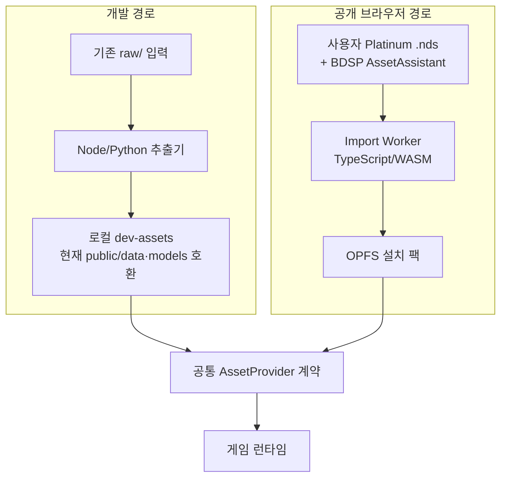
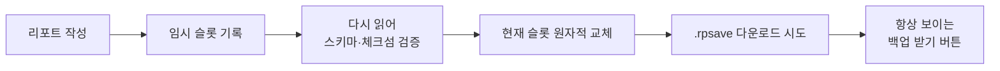

# Pokémon Radiant Platinum — 포켓몬스터 플래티넘 3D 리메이크 기획서

> **배포 설계 확정 (2026-08-10):** 공개판은 원본 유래 에셋 CDN을 사용하지 않는다.
> 사용자가 이 기기에서 Platinum `.nds`와 이미 추출된 BDSP
> `AssetAssistant/` 계열 폴더를 선택하면 브라우저가 로컬 변환해 OPFS에 설치한다.
> 상세 사용자 흐름은 [IMPORT.md](IMPORT.md), 정책과 남는 위험은
> [COPYRIGHT.md](COPYRIGHT.md), 포맷·변환 계약은 [DATA.md](DATA.md)가 정본이다.
>
> **현재 구현은 아직 전환 전이다.** `src/data/assetBase.ts`와 약 20개 소비자는
> HTTP URL을 사용하고, `public/data/` 약 50MB와 `public/models/` 약 580MB는
> Vite 빌드 시 `dist/`로 복사된다. 기존 `raw/`와 게임 기능은 보존하되,
> Import·AssetProvider·OPFS·프로덕션 경계 게이트를 완료하기 전 현재 빌드를
> 공개 배포하지 않는다.

> 작성일: 2026-08-04 · v3 (선행 사례 / 기술 호환성 / 공백 영역 — 3갈래 외부 리서치 재검증 반영)
> 스택: React 19 + Vite 8 + TypeScript + vanilla-extract + react-router 7 + three.js(WebGPU/R3F)
>
> 성능·호환성 관련 수치는 전부 문서 하단 참고 링크에 출처를 명시했다.

---

## 0. 선행 사례 조사 결과

### 0.1 결론

**"플래티넘을 *게임으로서* React/three.js로 웹 리메이크한 사례"는 존재하지 않는다.** 검색 범위(GitHub topics, 디컴파일 커뮤니티, PokeCommunity, ProjectPokemon, three.js 포럼, itch.io)에서 확인한 결과, 4세대 DS 타이틀의 네이티브 웹 리메이크 완성 사례는 없다. 인접 사례와의 경계는 이렇다:

- **"브라우저에서 플래티넘을 플레이"는 이미 가능하다.** DeSmuME/melonDS의 WASM 포트(ds.44670.org, EmulatorJS의 NDS 코어)로 ROM만 있으면 지금도 브라우저에서 돌아간다. A15급 기기에서 거의 풀스피드다. 즉 *원본 재현*이 목표라면 이 프로젝트는 존재할 이유가 없다 — **우리의 존재 이유는 3D 리메이크**라는 점을 명확히 해 둔다.
- **PokéRegions**(Next.js + three.js 신오 3D 맵, 2026-02)가 스택·소재 면에서 최근접 선행이지만, 게임이 아니라 뷰어다 (아래 표).

다만 **필요한 조각은 전부 개별적으로 존재**한다. 이게 이 프로젝트의 가장 중요한 전제다 — 우리는 밑바닥부터 만드는 게 아니라, 검증된 조각들을 조립하고 그 사이의 접착제(엔진)를 만든다.

### 0.2 카테고리별 정리

#### A. 원본 게임 데이터 소스

| 프로젝트 | 내용 | 활용도 |
|---|---|---|
| **pret/pokeplatinum** | 플래티넘 디컴파일(C, WIP). US Rev0/Rev1 빌드 성공. `res/`에 battle, field, items, moves, pokemon, trainers, text, town_map 분류 | ★★★★★ **데이터의 정본**. 종족값·기술·트레이너·인카운터 테이블의 근거 |
| **JimB16/PokePlat** | 구버전 디스어셈블리 | ★★☆ pokeplatinum이 미커버한 영역 보완 |
| **DSPRE** | DS 포켓몬 ROM 에디터. 맵 NSBMD/BIN 및 DAE/GLB/NSBMD 내보내기 지원 | ★★★★ 맵 데이터 추출 |
| **Pokemon DS Map Studio / SDSME** | 4·5세대 맵 에디터. 매트릭스·헤더 편집, 3D 뷰어 내장 | ★★★★ 맵 매트릭스 구조 이해 |
| **PokeAPI** | Gen4 데이터 CSV/SQLite 덤프 | ★★★ 보조용. **플래티넘 배회 포켓몬 인카운터 데이터 누락** 등 구멍 있음 |
| **한국어판 ROM 《포켓몬스터Pt 기라티나》** | 2009-07-02 한국 정식 발매판 | ★★★★★ **한국어 텍스트의 정본.** 번역 작업이 추출 작업으로 바뀐다 (§4.2) |
| **일본어판 ROM** | 일본 발매판 | ★★★★ **일본어 텍스트의 정본.** 역할은 한국어판과 동일 — 텍스트 NARC 전용 |
| **BDSP (Brilliant Diamond/Shining Pearl)** | 공식 신오 3D 리메이크. Unity 엔진 — romfs `Data/StreamingAssets/AssetAssistant/` 하위 AssetBundle | ★★★★ 캐릭터(치비+등신)·맵·포켓몬 3D 모델 소스 (§4.3). Luminescent 팀이 모딩 워크플로 문서화 완료 |

#### B. 에셋 추출 툴체인

| 툴 | 내용 |
|---|---|
| **scurest/apicula** (Rust) | **핵심 툴.** `.nsbmd/.nsbtx/.nsbca/.nsbtp/.nsbta` → COLLADA(.dae) / **glTF(.glb)**. 조인트 애니메이션은 컨버터에서 동작, 패턴/머티리얼 애니메이션은 뷰어에서만 동작 |
| **Narctowl / Nds4j** | NARC(Nitro Archive) 언팩/팩. CARC는 LZ 압축된 NARC |
| **ndstool / Tinke** | NDS 파일시스템 언팩 |
| **msgenc / thenewpoketext / PPTXT** | 4세대 텍스트 코덱. `pl_msg.narc`는 **XOR 계열 난독화** — 평문이 아니다. 영어는 pret가 이미 복호화해 `res/text/*.json`으로 제공, 한국어판은 동일 파이프라인 적용 |
| **AssetStudio / AssetRipper** | Unity AssetBundle 추출 — BDSP romfs → FBX/DAE → Blender → glb |

```bash
apicula extract game.nds -o out/
apicula convert -f=glb out/*.nsbmd -o gltf/
```

#### C. 웹 이식 / 3D 선행 사례

| 프로젝트 | 스택 | 참고할 점 |
|---|---|---|
| **PokéRegions** (pokeregions.com) | Next.js + three.js, PWA, 2026-02 공개 | **지도 파트의 최근접 선행 사례.** 신오지방 3D 인터랙티브 맵. 그래픽 프리셋(Low/Med/High), 낮/밤 토글. 단 *뷰어*이고 게임이 아님 |
| **Pallet Town 3D** (PauliusOS) | three.js + TS + **Vite** | **아키텍처 레퍼런스 1순위.** 바이너리 아트 에셋 0개 — 텍스처는 캔버스에 절차적 베이크, 모델은 SDF+마칭큐브, 사운드는 WebAudio 합성. 1600×900 60fps / 드로우콜 ≤260 / 트라이앵글 ≤2.2M. 8회 이상 등장하면 무조건 InstancedMesh. **저작권 회피 모델로서도 참고 가치 높음** |
| **pokeemerald-wasm** | 디컴파일 → WASM | "디컴파일을 웹으로" 접근법의 증명. 단 3세대 GBA이고 *원본 재현*이지 3D 리메이크가 아님. 우리 방향과 다름 |
| **DS Player / desmume-wasm** (44670) | DeSmuME → WASM (ds.44670.org) | **브라우저 NDS 에뮬레이터.** A15급에서 3D 게임 거의 풀스피드. "원본 재현" 노선의 최단 경로가 이미 존재함을 증명 — 우리는 이 길이 아니다 |
| **melonDS-wasm / ds-anywhere / EmulatorJS** | melonDS → WASM. ds-anywhere는 TS+Preact+Vite 프런트 | 같은 카테고리. EmulatorJS는 임베드 가능한 NDS 코어(melonds/desmume2015) 제공 |
| **pokeplatinum-portable** | pret 디컴파일 → SDL3 네이티브 포팅 | 플래티넘 디컴파일의 타 플랫폼 이식이 시작됐다는 신호. WASM 타깃이 아직 없을 뿐 |
| **PokéRogue** (pagefaultgames) | TypeScript + **Phaser 3.70**, AGPL-3.0, 20k+ stars | **배틀 시스템 스코프/데이터 모델링 레퍼런스.** 오버월드 없이 배틀 엔진만으로 게임 성립시킨 사례 |
| **FullScreenPokemon** | HTML5 | 1세대 2D. 구조 참고용 |

#### D. 런타임 라이브러리

| 패키지 | 역할 |
|---|---|
| **@pkmn/sim** | Pokémon Showdown 시뮬레이터 모듈화. Gen 1~9 전 세대 배틀 로직. **⚠️ 배틀 전용** — 포획·경험치·진화·상대 AI는 범위 밖 (§7.6·§7.7) |
| **@pkmn/protocol** | Showdown 프로토콜 파서 |
| **@pkmn/data** | 세대별 종족값/기술/특성 데이터 레이어 |
| **@pkmn/engine** | Zig 구현. PS 대비 1000배 이상 빠름. 현재 Gen1~2 위주 → **초기에는 @pkmn/sim 사용** |
| **Pokemon-3D-api/assets** | 1300+ 최적화 `.glb` 포켓몬 모델. Draco 압축 + WebP 텍스처 + 1024² 리사이즈. 샤이니/메가/리전폼 포함 |

### 0.3 이 조사가 기획에 주는 함의

1. **배틀 로직은 직접 짜지 않는다.** `@pkmn/sim`이 4세대(물리/특수 분리 도입 세대)를 포함해 검증된 구현을 제공한다. 우리가 만들 것은 **연출 레이어**다.
2. **맵 지오메트리를 그대로 뽑아 쓰면 안 된다.** DS 시절 폴리곤을 웹에서 확대하면 처참하다. PokéRegions가 성립한 건 "지도 뷰"라서다. 우리는 *레이아웃 데이터*만 추출하고 아트는 새로 만든다 — 그래서 "이식"이 아니라 "리메이크"다.
3. **에셋은 저장소에 넣지 않는다.** pokeemerald-wasm, 모든 디컴프 프로젝트가 그렇듯, 저장소에는 *추출 스크립트*만 두고 사용자가 자기 ROM으로 로컬 생성한다.
4. **풀스케일은 1인 3~5년짜리다.** 후술할 스코프 재정의가 이 기획서에서 가장 중요한 부분이다.
5. **@pkmn/sim은 심판이지 게임이 아니다.** 포획 판정, 경험치/노력치, 레벨업 기술, 진화, 그리고 상대 AI까지 전부 우리 몫이다 (§7.6·§7.7).
6. **현지화는 번역이 아니라 사용자 입력에서의 추출이다.** 개발 raw의 3지역판은 대조 오라클이고, 공개판은 사용자가 설치한 지역판 언어만 제공한다 (§12.2).

---

## 1. 프로젝트 정의와 스코프

### 1.1 현실 점검

플래티넘 풀스케일의 물량:

- 맵: 약 200개 (마을/루트/던전/실내)
- NPC: 500명 이상
- 포켓몬: 493종 × (모델 + 최소 idle/attack/hit/faint 4개 애니메이션) ≈ **2,000개 애니메이션 클립**
- 기술: 467개 (각각 3D 연출 필요)
- 스토리 스크립트: 수천 개 이벤트

혼자서 이걸 다 하면 3~5년이고, 대부분의 팬 프로젝트가 **떡잎마을을 못 벗어나고 죽는다**. 이유는 실력이 아니라 스코프 설계 실패다.

### 1.2 스코프 재정의 — v1.0의 정의

> **v1.0 = 떡잎마을 ~ 무쇠시티 첫 배지까지, 완결된 게임 루프**

포함:
- 떡잎마을 · 201~204번 도로 · 잔모래마을 · 축복시티 · 무쇠시티와 그 체육관 · 예진호수
- 포켓몬 약 30종 — 201~204번 도로 인카운터 테이블이 자연스럽게 정하는 수치다. 인위적 상한이 아니다 (§4.3)
- 기술 약 60개
- 이동 → 인카운터 → 배틀 → 포획 → 레벨업/진화 → 세이브의 **닫힌 루프**
- 트레이너 배틀 + 체육관전 + 배지 획득

제외(v2 이후):
- 배회 포켓몬, 지하대공동, 배틀타워, 통신교환/대전, 포켓몬 콘테스트, 포켓치, 모험노트

**근거:** 이 루프가 완성되면 나머지는 전부 *반복 가능한 콘텐츠 확장*이다. 새 시스템을 만드는 게 아니라 데이터를 채우는 일이 된다. 그 시점부터는 협업자를 받을 수도 있고, 중단해도 "완성된 무언가"가 남는다.

⚠️ **모바일은 안 한다.** 노트북 이상에서 도는 것이 목표다. 터치 컨트롤 ·
렌더 스케일 프리셋 · 모바일 VRAM 예산(180MB)이 전부 범위 밖으로 나간다 —
그 셋이 서로 물려 있어서 하나만 하는 것이 뜻이 없다. KTX2는 남는다: 그건
모바일 때문이 아니라 데스크톱에서도 텍스처 메모리가 실측 대상이라서다.

⚠️ **맵은 이 범위를 이미 넘었다.** 추출이 맵을 거의 공짜로 만들어서, 지금은 헤더
593개 · 이벤트 파일 534개가 그대로 붙어 **걸어서 이어진 신오 전체**를 돌아다닌다
(§13 Phase 2). 그래도 위 목록을 그대로 두는 이유는, v1.0의 잣대가 "맵이 몇 개냐"가
아니라 **닫힌 루프가 끝까지 도느냐**이기 때문이다. 넓이는 늘어도 그 잣대는 안 바뀐다.

### 1.3 성공 기준

상세 근거는 §10.

| 지표 | 목표 | 비고 |
|---|---|---|
| 데스크톱 1080p | 60fps 안정 | |
| **VRAM 총량** | **≤ 600MB** | 데스크톱 기준. 아래 참조 |
| 첫 진입 → 타이틀 인터랙티브 | 3초 이내 | |
| 초기 청크 | **≤ 150KB gz** | 120.7KB ✅ — 타이틀에 three.js도 배틀 UI도 소리도 싣지 않는다 (§10.4) |
| 게임 진입 시 추가 JS | ≤ 450KB gz | 475KB ⚠️ — `three/webgpu`가 혼자 423KB다 (§10.4) |
| 첫 플레이 가능까지 | ≤ 8초 (4G) | 저해상도 선행 로드 |
| 설치 완료 뒤 게임 에셋 네트워크 | **0** | 에셋은 OPFS, 앱 셸은 SW. 첫 Import는 로컬 변환 (§4.6) |
| 드로우콜 | Low ≤100 / Med ≤200 / High ≤300 | 단일 값이 아니라 프리셋별 (§10.1) |
| 가시 트라이앵글 | ≤ 1.5M | |
| 플레이 타임 (v1.0) | 60~90분 | |

---

## 2. 기술 스택과 결정 근거

### 2.1 확정 스택

```
React 19
Vite 8
TypeScript 6.x (strict)           # 7.0(네이티브 Go 컴파일러)은 툴체인 호환 확인 후 전환
react-router 7
three.js (r185+, `three/webgpu` 진입점)   # WebGPU 우선 · WebGL2 자동 폴백
@react-three/fiber 9              # React 19 대응. ⚠️ WebGPURenderer는 v9에서 수동 초기화 (§2.4)
@react-three/drei                 # ⚠️ 셰이더 주입형 일부(MeshReflectorMaterial 등) WebGPU 미호환 — 사용 전 개별 확인
@react-three/rapier 2             # R3F v9 / React 19 대응 (v1은 React 18용)
three-mesh-bvh                    # 레이캐스팅 가속
zustand 5
zod 4                             # 데이터 스키마 검증
@vanilla-extract/css              # 제로 런타임 스타일링
@vanilla-extract/vite-plugin
@vanilla-extract/dynamic          # 고빈도 값 → CSS 변수 주입
@pkmn/sim, @pkmn/protocol, @pkmn/data
idb-keyval                        # IndexedDB 세이브
Service Worker                  # 현재 수동 sw.js; 목표는 앱 셸만 precache (§4.6)
```

버전 커플링 주의: **R3F v9 ↔ React 19 ↔ rapier v2**는 세트다. React 18을 쓰면 R3F v8 + rapier v1이어야 한다. 섞으면 안 된다. R3F **v10**이 WebGPURenderer를 기본 지원할 예정이므로 릴리스 시 마이그레이션을 검토한다.

### 2.2 결정: R3F vs 순수 three.js → **하이브리드**

R3F를 전면 채택하면 씬 그래프 조작이 리컨실러를 타서 청크 스트리밍처럼 오브젝트를 대량 마운트/언마운트하는 작업에서 비용이 든다. 순수 three.js를 쓰면 React UI와의 통합이 수동 배선 지옥이 된다.

**채택안:**

- **R3F가 선언하는 것**: Canvas, 조명, 포스트프로세싱, 카메라 리그, 정적 씬 구조, 배틀 스테이지
- **명령형 three.js가 담당하는 것**: 청크 스트리밍, InstancedMesh 풀(잔디/나무/바위), NPC 무리, 파티클, 매 프레임 변환

경계 규칙: **엔진 레이어(`src/engine/`)는 React를 import하지 않는다.** 순수 TypeScript. R3F 컴포넌트는 엔진 시스템의 얇은 마운트 포인트일 뿐이다. 이 규칙이 지켜지면 나중에 R3F를 걷어내도 게임이 살아남는다.

### 2.3 결정: 스타일링 → **vanilla-extract** (styled-components 대체)

**핵심 논거: 게임 UI는 60fps 캔버스 위에 얹힌다.** 런타임 CSS-in-JS는 스타일 객체 생성 → 직렬화 → 해시 → 스타일시트 삽입을 **메인 스레드에서** 한다. 그 메인 스레드는 게임 루프가 프레임당 16.6ms를 놓고 다투는 곳이다. 빌드 타임에 CSS를 추출해버리면 이 비용이 **0**이 된다. 일반 웹앱에서는 취향 문제지만 게임에서는 아니다.

부차적으로 styled-components는 2025년 3월부터 메인테넌스 모드다. v6.4.0이 React 19 대응과 `createTheme`를 내놔서 죽은 건 아니지만, 굳이 선택할 이유가 없어졌다.

#### 후보 비교

| 후보 | 런타임 | 판정 |
|---|---|---|
| styled-components | 있음 | 런타임 비용 + 메인테넌스 모드. **탈락** |
| Tailwind v4 | 없음 | 이터레이션은 최고. 다만 게임 UI는 9-slice 대화창·커스텀 HP바·픽셀 프레임처럼 고도로 커스텀이라 유틸리티가 오히려 방해. **탈락** |
| CSS Modules | 없음 | 제로 의존성, Vite 내장. 나쁘지 않음. 단 디자인 토큰 타입 안전성 없음. **폴백 후보** |
| Panda CSS | 없음 | 훌륭하지만 빌드 셋업이 무겁고 이 규모엔 오버킬 |
| **vanilla-extract** | **없음** | ✅ **채택** |

#### vanilla-extract를 고른 결정적 이유

1. **`createTheme`가 CSS 변수를 네이티브로 생성한다.** 프레임당 갱신되는 UI(HP바 등)가 요구하는 "CSS 변수 직접 조작"이 예외 규칙이 아니라 **정식 경로**다. 테마 토큰 = CSS 변수이므로 낮/밤 전환도 클래스 토글 하나다.

   ```ts
   // ui/theme/theme.css.ts
   export const [darkTheme, vars] = createTheme({
     hud: { hpFill: '#3ddc84', hpBg: '#1a1a1a' },
     panel: { bg: '#0f1420', border: '#2a3550' },
   })
   ```
   ```ts
   // 배틀 HP바 — 프레임당 갱신. React 리렌더 0회.
   import { assignInlineVars } from '@vanilla-extract/dynamic'
   el.style.setProperty(hpRatioVar, String(current / max))
   ```

2. **완전한 TypeScript.** 토큰 자동완성, 오타 시 컴파일 에러. 493종 포켓몬 타입 컬러 팔레트(§7.3)처럼 토큰이 수백 개가 되면 이게 실제로 중요해진다.

3. **Vite 플러그인 1급 지원.** `@vanilla-extract/vite-plugin`은 2026년 3월 기준 유지보수 중.

4. **SSR/RSC 이슈 무관.** 이 프로젝트는 SPA 게임이라 styled-components의 최대 약점(RSC 비호환)이 애초에 해당사항 없었다 — 즉 그건 탈락 사유가 아니었다. 진짜 사유는 1번 런타임 비용이다.

유틸리티 스타일이 필요해지면 `@vanilla-extract/sprinkles`를 나중에 추가한다. 지금은 넣지 않는다.

#### 유지되는 제약

- **프레임당 갱신 UI(HP바, 데미지 숫자, 게이지)는 CSS 변수 경로.** 어떤 스타일링 라이브러리를 쓰든 변하지 않는 규칙이다.
- 스타일은 `*.css.ts`에 분리. 컴포넌트 파일에 인라인 스타일 로직 금지.

### 2.4 결정: 렌더러 → **WebGPU 우선, WebGL2 자동 폴백**

**현황:**
- `WebGPURenderer`는 three.js r171부터 프로덕션 옵션, 현재 r185에서 실사용 다수
- Safari 26(2025년 9월)이 마지막으로 합류, Firefox도 141+(Win)/145+(macOS) 지원 → **커버리지 약 95%**. 나머지 5%는 `three/webgpu` 진입점이 **WebGL2로 자동 폴백**한다 (별도 코드 경로 불필요). `three`와 `three/webgpu`를 동시에 import하면 tree-shaking이 깨져 중복 번들이 생기니 주의

**우리 케이스에 대한 판정:**

| 항목 | 수치 | 우리에게 |
|---|---|---|
| 번들 비용 | WebGPU 188 KB gz vs WebGL 121 KB gz → **+67 KB** | 부담이지만 감수 가능 |
| 드로우콜 헤비 씬 | **2~10배** | ✅ 오버월드가 정확히 이 케이스 |
| 파티클 | WebGL 5만 → WebGPU 100만+ | ✅ 기술 이펙트(§7.3)에 직결 |
| 물리 바디 | ~1,000 → ~100,000 | 우리 규모엔 과잉 |

**결정: 처음부터 `three/webgpu`로 간다. 단 Phase 0 스파이크로 검증한다.**

가장 중요한 이유는 성능이 아니라 **셰이더 언어 선택이 되돌리기 비싼 결정이기 때문**이다:

- 커스텀 GLSL은 WebGPU에서 **그대로 안 먹는다**. TSL로 써야 WGSL/GLSL 양쪽으로 컴파일된다
- 우리는 잔디 흔들림, 물, 화면 전환, 기술 VFX에 커스텀 셰이더를 쓸 예정이다
- **지금 TSL로 쓰면 추가 비용 0. 나중에 마이그레이션하면 커스텀 셰이더가 있는 프로젝트 기준 1~2일**
- 즉 이건 "나중에 결정" 하면 안 되는 항목이다

**포스트프로세싱:** `@react-three/postprocessing`은 쓰지 않는다 — 기반인 pmndrs postprocessing v6가 **WebGL 전용**이고 WebGPU 대응(v7)은 아직 작업 중이다. 대신 **three 내장 TSL 기반 `PostProcessing`(`three/tsl`의 `pass`, `bloom` 등)을 채택한다.** WebGPURenderer + WebGL2 폴백 양쪽에서 동작하는 공식 예제가 이미 다수다. Phase 0 스파이크의 검증 질문은 "내장 노드로 원하는 룩이 나오는가"다.

**R3F v9 수동 초기화:** v9는 WebGPURenderer를 기본 지원하지 않는다. `gl` prop에 async 초기화 함수를 넘긴다 (v10에서 기본화 예정):

```tsx
<Canvas gl={async (props) => {
  const renderer = new WebGPURenderer(props as any)
  await renderer.init()
  return renderer
}}>
```

**렌더러는 추상화 뒤에 둔다.** `engine/render/`에 진입점을 한 곳으로 모아 교체 가능하게.

### 2.5 3D UI vs DOM UI 경계

| 요소 | 구현 |
|---|---|
| 메인 메뉴, 설정, 도감, 가방, 파티 관리, 세이브 | **DOM** (vanilla-extract) |
| 다이얼로그 박스, 선택지 | **DOM** — 텍스트 렌더링 품질·접근성·i18n 때문 |
| 배틀 HUD (HP바, 기술 선택) | **DOM** — 단 CSS 변수 경로 |
| 이름표, 데미지 팝업, 상호작용 프롬프트 | **3D** (Sprite / drei `Html` 최소 사용) |
| 화면 전환 이펙트 | **셰이더** (포스트프로세싱 패스) |

DOM UI는 Canvas 위에 절대 위치로 오버레이. `pointer-events` 관리 주의.

---

## 3. 아키텍처

### 3.1 레이어

```
┌─────────────────────────────────────────────┐
│  app/     라우터 · 프로바이더 · 레이아웃      │  React
├─────────────────────────────────────────────┤
│  ui/      DOM UI (vanilla-extract)          │  React
├─────────────────────────────────────────────┤
│  scene/   R3F 선언 (Canvas · 라이트 · 리그)  │  React ↔ three
├═════════════════════════════════════════════┤  ← React 경계
│  engine/  순수 TS: 루프 · 월드 · 액터 ·      │
│           스크립트 · 배틀 · VFX · 오디오      │  no React
├─────────────────────────────────────────────┤
│  state/   zustand 스토어 3종                 │  bridge
├─────────────────────────────────────────────┤
│  data/    zod 스키마 · 로더 · 캐시           │
└─────────────────────────────────────────────┘
```

### 3.2 상태 3분할 — 가장 중요한 규칙

이 프로젝트에서 사람들이 제일 많이 망치는 지점이다. 상태를 **성격에 따라 3개로 완전히 분리**한다.

#### ① 세이브 상태 — `useSaveStore` (영속)

```ts
interface SaveState {
  version: number            // 마이그레이션용
  trainer: { name, gender, id, secretId, playtimeMs }
  party: PokemonInstance[]   // 최대 6
  boxes: PokemonInstance[][]
  bag: Record<ItemId, number>
  badges: number             // 비트마스크
  pokedex: { seen: Uint8Array, caught: Uint8Array }
  flags: Record<string, boolean | number>   // 스크립트 이벤트 플래그
  position: { mapId, x, y, z, facing }
  money: number
}
```

- zustand + `persist` 미들웨어 → **IndexedDB**(`idb-keyval`). localStorage는 5MB 한계 + 동기 블로킹이라 부적합
- **⚠️ `createJSONStorage`를 쓰지 않는다.** persist의 기본 JSON 직렬화는 `Uint8Array`(도감)·`Map`을 파괴한다. `PersistStorage<T>` 인터페이스를 직접 구현해 idb-keyval `get/set/del`에 값을 그대로 전달한다 — IndexedDB의 structured clone이 TypedArray를 보존한다. 비동기 스토리지이므로 `onRehydrateStorage`로 hydration 완료 시점을 처리
- **JSON 경로의 실패 양상이 특히 고약하다** (테스트로 고정: `saveStore.test.ts`). 복원 직후 `Uint8Array`는 숫자 키를 가진 평범한 객체로 뭉개지는데, **읽기는 우연히 계속 동작한다** — 인덱스 접근이 그대로 먹히기 때문이다. 파손은 다음 *쓰기*에서 터진다. `new Uint8Array(평범한객체)`는 `length`가 없어 빈 배열을 만들고, 그 순간 도감 기록 전체가 조용히 사라진다. 즉 버그가 저장 시점이 아니라 한참 뒤 "포켓몬 한 마리 더 잡았을 때" 드러난다
- 도감 필드 타입은 `Uint8Array<ArrayBuffer>`로 좁힌다(`DexField`). 기본 인자인 `ArrayBufferLike`는 SharedArrayBuffer 뷰까지 허용하는데, structured clone으로 오가는 값에는 맞지 않는 의도다
- `version` 필드 필수. 마이그레이션 함수 체인을 처음부터 만들어 둔다 — 나중에 붙이면 이미 늦다
- 저장 시점: 세이브 메뉴 / 맵 전환 / 배틀 종료 (자동저장 옵션)

#### ② 세션 상태 — `useSessionStore` (React 리렌더 OK)

```ts
interface SessionState {
  phase: 'title' | 'overworld' | 'battle' | 'menu' | 'transition'
  dialogue: { speaker, lines, index, choices } | null
  battleUI: { turn, menu, selectedMove, targets } | null
  loadedChunks: Set<ChunkId>
  graphicsPreset: 'low' | 'medium' | 'high'
}
```

빈도가 낮은(초당 몇 번 이하) 상태만. 셀렉터로 슬라이스 구독.

#### ③ 프레임 상태 — `worldState` (React를 절대 건드리지 않음)

```ts
// 평범한 mutable 싱글톤. 스토어 아님.
export const worldState = {
  player: { position: new Vector3(), velocity: new Vector3(), facing: 0, grounded: true },
  camera: { target: new Vector3(), yaw: 0, pitch: 0, distance: 8 },
  time: { elapsed: 0, delta: 0, gameHour: 12 },
  input: { move: new Vector2(), run: false, interact: false },
}
```

**금지 사항:** 플레이어 좌표를 zustand에 넣는 것. 초당 60회 `setState`가 발생해 React 트리 전체가 리렌더된다. 이게 R3F 프로젝트가 죽는 1번 원인이다.

프레임 상태를 UI에 노출해야 할 때(예: 미니맵 좌표)는 **스로틀링**(200ms)해서 세션 스토어에 밀어 넣는다.

### 3.3 라우팅 + 영속 Canvas

react-router를 게임에 쓸 때의 함정: 라우트 전환 시 `<Canvas>`가 언마운트되면 **WebGL 컨텍스트가 날아가고 모든 GPU 리소스를 재업로드**해야 한다. 로딩이 3초씩 걸린다.

**해법: Canvas를 라우트 트리 *위*에 둔다.**

```tsx
// app/GameLayout.tsx
function GameLayout() {
  return (
    <Shell>
      <Stage />          {/* <Canvas> — 절대 언마운트되지 않음 */}
      <UILayer>
        <Outlet />       {/* 라우트는 DOM 오버레이만 렌더 */}
      </UILayer>
    </Shell>
  )
}
```

라우트 설계:

| 경로 | 렌더 |
|---|---|
| `/` | 타이틀 (3D 배경 씬 + DOM 메뉴) |
| `/new` | 새 게임 — 이름/성별 선택 |
| `/load` | 세이브 슬롯 선택 |
| `/play` | 오버월드 (오버레이 없음, HUD만) |
| `/play/menu` | 메인 메뉴 오버레이 |
| `/play/menu/party` · `/bag` · `/pokedex` · `/save` | 서브 메뉴 |
| `/play/battle` | 배틀 HUD 오버레이 |
| `/settings` | 설정 |

**오버월드 ↔ 배틀 전환은 라우트가 아니라 상태 머신이 주도**하고, 라우터는 그 결과를 URL에 *반영*할 뿐이다. 라우트 변경이 씬 전환을 트리거하는 게 아니다. 방향이 반대면 뒤로가기로 배틀 도중에 탈출하는 버그가 생긴다.

### 3.4 게임 루프

```ts
// engine/loop/GameLoop.ts
const FIXED_DT = 1 / 60
let accumulator = 0

function tick(delta: number) {
  accumulator += Math.min(delta, 0.25)      // 스파이럴 방지 클램프
  while (accumulator >= FIXED_DT) {
    fixedUpdate(FIXED_DT)                    // 물리·충돌·스크립트
    accumulator -= FIXED_DT
  }
  update(delta)                              // 애니메이션·카메라·VFX
  render(accumulator / FIXED_DT)             // 보간 알파
}
```

R3F의 `useFrame`을 진입점으로 쓰되, 실제 로직은 엔진의 시스템 리스트를 순회한다.

```tsx
function EngineDriver() {
  useFrame((_, delta) => gameLoop.tick(delta))
  return null
}
```

시스템 실행 순서(고정):
`Input → Script → AI → Movement → Physics → Collision → Trigger → Camera → Animation → VFX → Audio`

---

## 4. 에셋 파이프라인

> 롬 내부 포맷의 실측 스펙과 추출 파이프라인 설계는 **[DATA.md](DATA.md)** 에 분리해 두었다. 이 장은 "무엇을 어디서 조달하는가"를 다루고, DATA.md는 "원본이 어떻게 생겼는가"를 다룬다.
>
> **자료는 다 들어왔다.** 맵 헤더 593개, 행렬 270개 충돌 격자, 워프 1213개,
> NPC 3555명, 인카운터 183표, 종족 508종, 기술 471개, 아이템 468종, 이벤트
> 스크립트 1124개가 전부 실측 확정 + 원작 대조를 통과했다. 압축 후 신오 전체가
> 210KB 남짓이다. 포맷이 막힌 것은 없다 — 남은 것은 **자료를 게임에 붙이는
> 일**이고, 무엇이 안 붙었는지는 §16에 실측으로 적어 뒀다.
>
> 필드는 블록아웃을 벗었다. land_data 청크의 NSBMD를 풀어 원작 지오메트리와
> 텍스처로 그린다 — 정점 106만·삼각형 60만, MDL0 헤더 수치와 666/666 일치한다.
> **법선만은 롬 것을 안 쓴다** — 나무 600삼각형이 쓰는 법선이 둘뿐이고 둘 다
> 위를 봐서, 빛을 걸면 네 면이 같은 밝기가 되어 납작한 마름모가 된다.
> 지오메트리에서 다시 계산한다.
>
> 판때기는 세워 놓았다. 나무·풀은 입체가 됐고 소품 뒷면도 막았다 —
> 다만 **뒤만** 막았다(DATA.md §2.2, 남은 면은 §16.7).

### 4.1 원칙

**공개 서버는 앱 셸만 배포하고, 원본 유래 런타임 에셋은 사용자 브라우저 안에서
만든다.** `.gitignore`는 저장소 유입만 막을 뿐 Vite의 `public → dist` 복사를
막지 못하므로 프로덕션 빌드 게이트가 별도로 필요하다.



목표 계약은 JSON·바이너리·이미지·GLB를 모두 다룬다.

```ts
interface AssetProvider {
  exists(path: string): Promise<boolean>
  bytes(path: string): Promise<ArrayBuffer>
  text(path: string): Promise<string>
  blob(path: string): Promise<Blob>
  objectUrl(path: string): Promise<string>
  releaseObjectUrl(path: string): void
}
```

- `DevAssetProvider`는 현재 `raw → tools/extract → 로컬 산출물` 경로를 살린다.
  기존 raw 파일을 이동·삭제하지 않고 레거시 경로 어댑터로 먼저 연결한다.
- `OpfsAssetProvider`는 공개 Importer가 만든 로컬 설치 팩을 읽는다.
- 두 Provider는 같은 논리 경로·스키마·대표 콘텐츠 parity test를 통과해야 한다.
- JSON·바이너리는 Provider에서 직접 읽고, CSS 이미지와 Three.js GLB처럼 URL이
  필요한 경우에만 수명 관리되는 Blob URL을 쓴다.
- 공개 서버·배포 ZIP·Service Worker 캐시에는 원본 또는 원본 유래 런타임 에셋을
  넣지 않는다.
- 브라우저가 만든 런타임 팩은 내보내기 기능을 제공하지 않는다. 사용자가 내보낼 수
  있는 것은 휴대용 리포트 `.rpsave`뿐이다.
- 전체 설치·사용자 안내·중단 복구 계약은 [IMPORT.md](IMPORT.md)가 정본이다.

`assets:pull`·`PT_ASSET_ORIGIN`·`VITE_ASSET_BASE`는 **없앴다** — 서버가 원본 유래
산출물을 내려 주는 경로 자체가 공개 모델과 어긋난다. `VITE_ASSET_BASE`가 설정돼
있으면 `boundary:pre`가 선다. 에셋 목차는 `raw/work/assets-manifest.local.json`
으로 옮겨 **로컬 개발 전용**이 됐다 (COPYRIGHT.md §5·§9).

### 4.2 추출 대상과 전략

| 대상 | 전략 | 근거 |
|---|---|---|
| **맵 지오메트리** | ⚠️ 최종 렌더 ❌ / **블록아웃 레퍼런스 ✅** | DS 원본 지오메트리는 웹 품질 미달. 단 Blender에 임포트해 **리모델링 기준선**으로 쓰면 타일 데이터만 보고 재구축하는 것보다 훨씬 빠르고 정확 |
| **맵 매트릭스 · 타일 충돌** | ✅ **완료** (DATA.md §2.1~2.2, §4.1) | 행렬 270개를 격자로 폈다. 오버월드는 960×960 한 장 — 걸어서 11개 존 도달 확인. 높이(BDHC)는 미파싱, 평면 취급 |
| **맵 헤더 · 워프 · NPC · 인카운터** | ✅ **완료** (DATA.md §2.3~2.4, §2.8) | arm9 헤더 표를 역산으로 특정. 문으로 실내 출입, 풀숲에서 야생 조우가 동작한다 |
| **포켓몬 모델** | ✅ **전량 활용** (§4.3) | 제약 해제로 최대 병목 소멸 |
| **인간 캐릭터 모델·애니메이션** | ✅ **BDSP 덤프 자가 추출** (§4.3.1) | 풀비율 배틀 모델 + 클립 23종 + 트레이너 96종 |
| **종족값 · 기술 · 특성 · 진화** | ✅ **완료** (DATA.md §2.5~2.7) | 508종 + 471기술 + 진화 246분기 + 레벨업 6753항목. 모부기·이브이·전광석화 등으로 원작 대조 |
| **트레이너 테이블** | ✅ **완료** (DATA.md §2.9) | 928명 파티·AI 플래그·가방·상금 배수. 4세대 AI를 롬에서 이식했다(§7.7) |
| **텍스트/대사** | ✅ JSON 추출 — **영어·한국어·일본어. 스파이크 검증 완료** | 자체 구현 디코더(`tools/spike/gen4text.js`, pret msgenc 알고리즘 이식)로 3개 로케일 전 뱅크 **2,147개 복호화 성공, 실패 0**. 4세대는 통합 문자 테이블이라 pret charmap 하나로 한글까지 커버되지만 **결함 2개를 고쳐야 했다** — 아래 참조. 뱅크 매핑 테이블 완성(§4.2.1). US는 종족명을 대문자(TURTWIG)로 저장 — 표기 정책 결정 필요 |
| **BGM/SE** | ✅ **SSEQ 시퀀스 추출** (§4.5) | 원본 시퀀스 재생. 크기·표현력 동시 확보 |
| **UI 스프라이트** | ⚠️ 참고용 | 3D UI에 그대로는 안 맞음. 단 폰트·타입 아이콘·아이템 아이콘은 그대로 활용 |

#### 4.2.1 텍스트 뱅크 매핑 — 완료

**뱅크 순서는 지역판마다 다르다** (us 724 / ko 714 / ja 709개). 같은 인덱스에서 엔트리 수가 일치하는 비율은 us↔ko 10%, ko↔ja 63%에 불과하다. **인덱스로 텍스트를 참조하면 로케일을 바꾸는 순간 엉뚱한 데이터가 나온다.** 게임 코드는 반드시 의미 이름으로 참조하고, `src/data/textBanks.ts`가 로케일별 인덱스로 옮긴다.

⚠️ **매핑은 전단사가 아니다.** 영어는 대문자 변형 뱅크를 따로 갖는데(`move_names` us#647·#648) CJK는 대소문자가 없어 하나뿐이다. 전체를 1:1로 자동 정렬하려는 시도는 여기서 반드시 깨진다.

`tools/spike/bank-map.js`가 표를 생성한다. 4단계 판별:

1. 알려진 영어 문자열로 us 뱅크를 특정 (`"BULBASAUR"`, `"Twinleaf Town"` …)
2. 엔트리 수가 같은 ko/ja 후보를 추림 — **이것만으로는 부족하다.** 엔트리 수가 고유한 뱅크는 8%뿐
3. 후보 종류 필터: 빈 뱅크 제외, **고유 엔트리 비율 >0.8**(자리표시자 뱅크는 `－`가 반복돼 걸러진다), 이름형/설명형 구분(이름은 어느 언어에서든 <20코드, 설명은 >20)
4. 전체 LCS 정렬로 예측한 위치에 가장 가까운 후보 선택 — 뱅크 순서는 보존되고 **드리프트는 단조 증가**한다

시도했다가 버린 것: 엔트리 길이의 **상관계수**(r=0.05~0.48로 신호가 약해 한쪽을 고치면 다른 쪽이 깨졌다)와 **길이 비율**(언어마다 흔들려 이름/설명 구분에 실패). 절대 기준이 안정적이다.

검증 결과 — 7개 뱅크 전부 3로케일 실제 텍스트 대조 완료. 드리프트 단조성도 확인:

| 뱅크 | 엔트리 | us | ko | ja | ko 드리프트 |
|---|---|---|---|---|---|
| `nature_names` | 25 | 202 | 201 | 201 | +1 |
| `item_names` | 468 | 392 | 390 | 390 | +2 |
| `species_names` | 496 | 412 | 408 | 408 | +4 |
| `location_names` | 126 | 433 | 428 | 427 | +5 |
| `ability_names` | 124 | 610 | 605 | 604 | +5 |
| `type_names` | 18 | 624 | 617 | 616 | +7 |
| `move_names` | 468 | 647 | 637 | 636 | +10 |

값은 `src/data/textBanks.test.ts`가 고정한다. 판별 휴리스틱을 개선하다 이 값이 흔들리면 그건 개선이 아니라 회귀다.

**⚠️ charmap 결함 2개 — 수정 완료.** 초기 스파이크가 보고한 "미매핑 0"은 **커버리지를 잰 것이지 정확성을 잰 것이 아니었다.** 모든 코드에 매핑이 있었지만 일부가 틀린 글자였다:

1. **한글 표 0x401~0x40F 구간이 한 칸 밀려 있었다.** `가`가 표 전체에서 누락된 상태였다(가장 흔한 음절인데). 증상: `가지고`→`각지고`, `올라간다`→`올라갇다`, `용감`→`용갑`. 0x410 이후는 원래 정확했다 — 성격명 8개가 쓰는 20여 코드로 교차 확인
2. **`// Function codes` 구역이 문자 매핑을 덮어쓰고 있었다.** 명령 코드는 0xFFFE 뒤에서만 의미가 있는데 같은 맵에 병합되면서 0x600/0x602/0x603의 한글 `됨`/`됩`/`됫`이 `{STRVAR_6}`/`{UNK_*}`에 가려졌다. `loadCharmap`이 두 구역을 분리하도록 수정

교훈: **디코더 검증은 "모든 코드가 매핑되는가"가 아니라 "결과가 뜻이 통하는가"로 해야 한다.** 3로케일을 나란히 놓고 번역쌍인지 눈으로 대조하는 것이 유일하게 믿을 만한 검증이었다.

### 4.3 포켓몬·캐릭터 모델

**포켓몬: [Pokemon-3D-api/assets](https://github.com/Pokemon-3D-api/assets) 전량 활용.**

- 1300+ `.glb`. Draco 압축 + WebP 텍스처 + 1024² 리사이즈 — 다만 **우리 기준으로는 재처리 필요**(Meshopt + KTX2). 사유는 §4.4
- 샤이니 / 메가 / 리전폼 / 거다이맥스 포함. 저장소는 활동 중이나 라이선스 파일은 없다(립 모델 재배포 저장소) — 미러 백업을 떠 둔다
- 종수 상한은 두지 않는다 — 어차피 201~204번 도로 인카운터 테이블이 자연스럽게 30종 안팎으로 제한한다

**단, 어댑터 인터페이스를 둔다.** 사유는 **품질 일관성**이다:

- 해당 모델들은 본가 3D 게임(SM/SwSh 등) 기준이라 **애니메이션 세트가 종마다 제각각**일 수 있다. 없는 클립은 폴백 처리가 필요하다
- 스케일·축 방향·원점이 통일되어 있지 않을 가능성이 높다 → 로드 시 정규화 레이어 필수
- 나중에 아트 방향을 통일하려면 교체 경로가 있어야 한다

```ts
type ClipRole = 'idle' | 'attack' | 'hit' | 'faint'

interface PokemonModel {
  scene: Group
  clips: Partial<Record<ClipRole, AnimationClip>>   // 없을 수 있음 → 폴백
  bounds: Box3
  anchors: { mouth: Vector3, center: Vector3, feet: Vector3 }  // VFX 부착점
}

interface PokemonModelSource {
  load(species: SpeciesId, form?: FormId): Promise<PokemonModel>
}
```

로더 뒤에 **정규화 단계**를 반드시 둔다: 바운딩박스 기준 스케일 통일 → 발밑을 원점으로 → +Z 정면 정렬 → 누락 클립을 절차적 폴백(idle은 부유/호흡, hit은 백스텝+플래시)으로 채움. 이걸 안 하면 배틀 씬에서 종마다 크기와 방향이 제각각이 된다.

`anchors`가 핵심이다. 기술 이펙트가 모델 구조를 몰라도 되게 만든다 — 나중에 모델을 통째로 갈아도 연출 코드는 그대로다. 앵커가 없는 모델은 바운딩박스에서 추정한다.

#### 플레이어·NPC 모델

**4세대 오버월드 캐릭터는 2D 스프라이트다. 3D 모델이 원작에 존재하지 않는다.**

**아트 방향 결정: 풀 프로포션(등신)으로 통일하고 치비는 쓰지 않는다.** BDSP 혹평의 대상은 오버월드 치비 모델이고, 포켓몬 모델(Pokemon-3D-api, 본가 SM/SwSh 계열)·3인칭 추적 카메라(§6.2)와 정합하는 건 등신이다. BDSP에는 배틀(VS)용 풀 프로포션 모델이 전 트레이너 클래스에 별도로 존재한다 — DS 스프라이트를 충실히 3D화한 디자인이라 플래티넘 리메이크에 가장 정통성 있는 소스다.

트레이너판 Pokemon-3D-api(웹용 glb 일괄 팩)는 존재하지 않는다 — 변환 파이프라인은 직접 만들되, 소스는 기성 립으로 대부분 충당된다. v1.0 약 20명 기준 조달 계획:

**조달은 BDSP 덤프 자가 추출로 일원화한다** (§4.3.1에서 경로 확보). 수동 다운로드 사이트를 뒤질 필요가 없어졌다:

| 캐릭터 | 소스 | 상태 |
|---|---|---|
| 주인공 빛나 | `persons/battle/pc0002_00` (+ `_10`~`_22` 의상 변형) | ✅ 추출 완료 |
| 주인공 광휘(Lucas) | `persons/battle/pc0001_*` | ✅ 확인됨 |
| 트레이너 클래스·주요 인물 | `persons/battle/tr####_00` — **96종** | ✅ 확인됨 |
| 일반 주민 | `persons/field/fc####_00` (치비) — 풀비율 대응 필요 | ⚠️ 대조 필요 |
| 로우 박사·엄마 | 위 96종에 포함되는지 미확인 | ⚠️ 확인 후 판단 |

`tr####`가 어떤 인물·직업군에 대응하는지는 **번들 안 텍스처 이름**으로 붙였다 — 156종 중 46종이 붙는다 (§16.9).

변환 파이프라인 주의사항:

- **Blender는 4.2 LTS** — 5.0에서 Collada(.dae) 임포트가 제거됐다
- 후처리는 포켓몬 모델과 동일한 gltf-transform 파이프라인(§4.4) — 스타일·최적화 일관성 확보
- 어차피 리깅·정규화·클립 폴백은 위 어댑터 인터페이스가 흡수한다

**스파이크 검증 완료 — "Dawn (Platinum Style)" dae → glb → 씬 배치.** 실측 결과:

- **지오메트리·리그는 그대로 쓸 수 있다.** 6메시 18,544 트라이앵글, 166본 풀리그(손가락 3관절·눈알·눈썹·귀·머리카락 물리본 포함). 원본이 Z-up이라 glTF 변환 시 **모델 전방이 +Z가 되어 `facing = atan2(vx, vz)` 규약과 그대로 일치**한다 — 회전 보정 불필요
- ⚠️ **스케일은 Blender에서 만지면 안 된다.** 아머처 오브젝트에 스케일을 걸고 내보내면 **역바인드 행렬과 노드 스케일에 이중으로 실려** 결과가 제곱으로 줄어든다(1.50m 의도 → 실측 0.88m). **정규화는 전적으로 로드 시점 `normalizeModel()`이 담당**하고 glb는 네이티브 크기로 내보낸다. 어차피 Pokemon-3D-api 1300종의 제각각인 스케일도 같은 코드로 흡수해야 하므로, 이게 원래 맞는 구조다
- **대체 복장 메시가 겹쳐 들어있다.** `hair1Skin`(비니 착용)/`hair2Skin`, `shoes1Skin`/`shoes2Skin`이 동일 위치에 중복 존재해 그대로 두면 z-fighting이 난다. 노드명으로 `.visible` 토글해 처리 — glb 하나로 복장 변형을 커버할 수 있는 이점이기도 하다
- **Models Resource 립에는 애니메이션 클립이 0개다.** T포즈 메시+본만 담고 있다. 아래 자가 추출로 해결됐다

**용량 실측:** 무압축 glb 5.0MB (텍스처 embed PNG가 대부분). §10.4 예산 대비 캐릭터 1인분으로는 과대 — §4.4의 KTX2(ETC1S) + Meshopt 적용이 선택이 아니라 필수임을 확인.

#### 4.3.1 BDSP 로컬 입력과 브라우저 변환 — 개발 경로 완료, 공개 경로 미구현

개발 환경도 공개 사용자와 **같은 폴더**를 읽는다 — `raw/AssetAssistant/`이고,
구조가 덤프 그대로다. 한때 필요한 번들만 골라 다른 이름으로 옮긴 폴더를 썼는데,
그러면 개발만 그 재배치에 기대게 되고 진짜 구조에서는 안 도는 코드가 남는다.

공개 사용자는 자신이 준비한 다음 폴더 또는 그 상위를 선택한다.

```text
Data/StreamingAssets/AssetAssistant/
  Battle/
  Characters/
  Dpr/
  Environments/
  Pokemon Database/
```

`romfs/`, `Data/`, `StreamingAssets/`를 선택해도 앱이 아래에서
`AssetAssistant/`를 찾는다. 공개 Importer는 NSP·NCA·XCI·키 파일을 받지 않으며,
다운로드·복호화·보호조치 우회 절차를 안내하지 않는다. 이미 추출된 지원 폴더가
없으면 그 자리에서 멈춘다.

읽는 논리 그룹:

| 뿌리 아래 자리 | 용도 |
|---|---|
| `Dpr` | 맵·게임 설정·연결 표 · `masterdatas`(배틀 배율) |
| `Battle` | 배틀 표·시퀀스 · `battle_masterdatas`(타격 프레임) |
| `Characters` | 주인공·NPC·자전거 |
| `Environments/bg/arenas` | 배틀 무대·하늘 |
| `Pokemon Database/pokemons/{battle,common}` | 프리팹·메시·텍스처 |

자리는 `tools/raw/sources.cjs`가 정한다 — `bdsp.root`만 기계마다 다르고 그
아래는 덤프 구조 그대로다. 공개 Importer도 사용자가 고른 핸들에 같은 계약을
건다 (`src/import/bdsp/scan.ts`).

가장 큰 선행조건은 변환기 이식이다. 현재 캐릭터·포켓몬·무대 변환은
UnityPy·NumPy·Pillow에 의존한다. 공개판에는 Unity AssetBundle, Mesh, Texture2D,
AnimationClip, 재질 채색, GLB 작성을 처리하는 TypeScript/WASM 동등 구현이 필요하다.
현재 Python 산출물과 메시 바운드·클립·대표 픽셀·파일 인덱스를 대조하기 전에는
완료로 표시하지 않는다.

포켓몬은 번들이 셋으로 갈릴 수 있다. 배틀 프리팹 하나만 확인하지 않고, 공용 메시와
폼별 텍스처까지 한 세트로 열리는 표본 검증을 거친다. 자세한 입력 진단과 단계 UI는
[IMPORT.md §5~6](IMPORT.md#5-입력-검증)를 따른다.

#### 4.3.2 BDSP 채색 구조 — 해독 완료

`_col`은 알베도가 아니라 **그레이스케일 음영 맵**이다. 실제 색은 텍스처가 아니라 머티리얼·컴포넌트에 있다:

```
albedo = _MainTex(음영) × 레이어색[_MaskTex 채널]
  🔴 R → _SkinColor   🟢 G → _PrimaryColor   🔵 B → _SecondaryColor   ⬛ 검정 → 틴트 없음
```

⚠️ **채널 매핑이 두 개다. 하나로 묶으면 안 된다.** `_MaskTex`의 RGB 채널 순서와 `ColorVariation`의 `channel` 인덱스 순서가 다르다:

| 매핑 | 0 | 1 | 2 |
|---|---|---|---|
| `_MaskTex` RGB | `_SkinColor` | `_PrimaryColor` | `_SecondaryColor` |
| `ColorVariation.channel` | `_PrimaryColor` | `_SecondaryColor` | `_SkinColor` |

같은 상수로 처리하면 **의상을 맞추는 순간 머리·눈·얼굴이 깨진다.** 실제로 한 번 그렇게 만들었다가 "채널 순서는 프로퍼티 선언 순서가 맞다"는 잘못된 결론에 도달했다. 게임 화면과 대조해서야 분리해야 한다는 것이 드러났다.

- **마스크는 한 장이다.** `_MaskTex` 하나의 RGB 채널이 세 색을 고른다. Models Resource 립의 `_msk`/`_msk2`/`_msk3`는 그 채널을 분리해 저장한 것이었다
- **`_SkinColor`는 피부 전용이 아니라 세 번째 범용 레이어 색이다.** 가방엔 노랑(#eedfa7), 모자엔 분홍이 들어간다
- **`ColorVariation` 컴포넌트가 머티리얼 기본값을 이긴다.** `Property00`~`03`이 게임 시작 시 고르는 외형 프리셋이고 `ColorIndex`가 기본값을 가리킨다. **다루는 범위는 피부·머리·눈 색뿐이고 의상은 건드리지 않는다** — 프리셋 4개를 전부 덤프해 확인했다. 이걸 반영하기 전엔 머리가 회백색, 눈이 무채색으로 나왔다
- 검증은 **실제 게임 스크린샷과 대조**해야 한다. 머티리얼 값만 보고는 어느 채널이 어느 색인지 알 수 없고, 기억에 의존한 배색 판단은 두 번 틀렸다

`tools/extract/bdsp_bake_albedo.py`가 위 식을 오프라인에서 계산해 **평범한 알베도 PNG로 굽는다.** 런타임에서 BDSP 셰이더를 재현할 필요가 없어지고, KTX2(§4.4)에도 그대로 태울 수 있다. 선형↔sRGB 변환과 마스크 NEAREST 업스케일(영역 경계 번짐 방지)을 포함한다.

**검증 결과 (게임 스크린샷 대조):** 흰 비니 + 분홍 엠블럼, 노란 머리장식, 빨간 목도리, 노란 가방, 남색 머리 — 전부 일치한다.

⚠️ **남은 차이는 명도다.** 조끼가 원작은 검정인데 우리 결과는 진회색으로 나온다. `wear` 머티리얼의 가장 어두운 값이 #7c7676이라 **어떤 곱셈 방식으로도 검정이 나오지 않는다** — 선형/sRGB 어느 공간에서 곱해도 결과는 회색이다. 치마·부츠도 원작보다 옅다. 톤 커브가 따로 있거나 해당 영역이 다른 경로로 칠해진다는 뜻인데, 미해결로 남긴다. 시각적으로 치명적이지 않고 애니메이션 작업을 막지 않는다.

또한 베이크는 알베도만 다룬다. 셰이더의 림 라이트·서브서피스·스펙큘러(`_ComplexTex`가 채널에 패킹)는 재현 대상이 아니다 — 우리는 자체 툰 셰이더(§2.4)를 쓴다.

- **맵은 별개 판단** — BDSP 맵 립은 "블록아웃 레퍼런스 + 자작 아트 킷"(§4.2)의 대안이지만, Unity 씬 조각이라 추출 후 재조립 비용이 있고 아트 스타일 통일 문제가 있다. **v1.0은 자작 아트 킷을 유지**하고, BDSP 맵은 비율·소품 배치 레퍼런스로 쓴다. 맵 자작이 병목이 되면 그때 전환을 재검토(ADR로 기록)

### 4.4 최적화 규격

```bash
gltf-transform prune    in.glb  out.glb                       # 미사용 노드/머티리얼 제거
gltf-transform resize   out.glb out.glb --width 512 --height 512
gltf-transform etc1s    out.glb out.glb --slots "baseColorTexture,emissiveTexture"
gltf-transform uastc    out.glb out.glb --slots "normalTexture" --zstd 18
gltf-transform meshopt  out.glb out.glb --level high           # ★ 반드시 마지막
```

| 자산 | 텍스처 | 트라이앵글 |
|---|---|---|
| 포켓몬 | 512² KTX2/ETC1S | ≤ 4,000 |
| 플레이어/NPC | 512² KTX2/ETC1S | ≤ 3,000 |
| 맵 청크 | 1024² KTX2 아틀라스 | ≤ 20,000 |
| 소품(instanced) | 256² 공유 아틀라스 | ≤ 300 |
| 노멀맵 전반 | KTX2/**UASTC** | — |
| 환경맵/IBL | **KTX2 사용 안 함** (HDR) | — |

#### WebP·PNG를 텍스처로 쓰면 안 되는 이유

WebP/PNG/JPEG는 파일이 작을 뿐 **VRAM에서 완전히 압축 해제된다.** 파일 크기만 보고 고르면 GPU 메모리에서 그대로 터진다.

```
uncompressedSize = width × height × 4 × 1.333   (밉맵 포함)

512²  →  1.4 MB   (포맷 무관. WebP든 PNG든 동일)
1024² →  5.6 MB
4096² →  90 MB
```

KTX2/Basis Universal은 GPU 네이티브 포맷(데스크톱 BC, 모바일 ASTC/ETC2)으로 **트랜스코딩되어 압축 상태로 VRAM에 상주**한다. 텍스처 메모리 **4~8배 절감**, 업로드도 같은 배수만큼 빠르다.

| 코덱 | 품질 | 파일 크기 | 용도 |
|---|---|---|---|
| **ETC1S** (BasisLZ) | 저·중 | JPEG급 | **색상 텍스처 기본값.** 노멀맵 등 데이터 텍스처엔 부적합 |
| **UASTC** | BC7급 | ETC1S보다 큼 (Zstd 슈퍼압축으로 완화) | **노멀맵·데이터 텍스처** |

트레이드오프: KTX2 파일은 JPEG 대비 **1~2배 크다.** 즉 다운로드는 손해, GPU 메모리는 큰 이득이다. 이 게임은 "한 번 들어와서 오래 머무는" 유형이고 텍스처를 계속 스트리밍하므로 **GPU 메모리 쪽이 압도적으로 중요하다.**

**KTX2를 쓰지 않는 경우:** HDR 환경맵/IBL. Basis Universal은 HDR을 지원하지 않는다. 환경맵은 저해상도 유지 + RGBE/HalfFloat로 처리한다.

#### ⚠️ 실무 함정: Pokemon-3D-api 에셋 재처리 필요

[Pokemon-3D-api/assets](https://github.com/Pokemon-3D-api/assets)는 **Draco + WebP**로 최적화되어 있다. 웹 배포용으로는 합리적인 선택이지만 **우리 기준으로는 둘 다 바꿔야 한다.** 그대로 30종을 동시 로드하면 모바일에서 VRAM이 터진다.

```bash
# 지오메트리: Draco → Meshopt / 텍스처: WebP → KTX2
gltf-transform meshopt        in.glb out.glb --level high
gltf-transform uastc          out.glb out.glb --slots "normalTexture" --zstd 18
gltf-transform etc1s          out.glb out.glb --slots "baseColorTexture,emissiveTexture"
```

#### Draco → Meshopt 교체

**Meshopt 디코드는 WASM SIMD로 약 1 GB/s**, Draco보다 상당히 빠르다. gzip/brotli와 결합하면 압축률은 Draco와 대등하다. 파일 크기가 아니라 **디코드 시간이 프레임 스톨로 나타나는** 우리 상황(청크 스트리밍 중 포켓몬 모델 동시 로드)에서는 Meshopt가 명확히 낫다.

주의: Meshopt는 **손실 압축**이다. 반복 압축하면 정밀도가 깎이므로 파이프라인의 **마지막 단계**에만 둔다.

#### 런타임 디코더 메모

- **KTX2는 런타임 트랜스코더가 필요하다.** `KTX2Loader.setTranscoderPath()`로 `basis_transcoder.js/.wasm` 경로 지정 + `detectSupport(renderer)` 호출. 트랜스코더 파일은 자체 호스팅한다 (§4.6)
- **무거운 디코드는 이미 오프스레드다.** KTX2Loader·DRACOLoader는 자체 워커풀을 쓰고, Meshopt는 `MeshoptDecoder.useWorkers(n)`으로 워커 디코드를 켠다. SharedArrayBuffer는 쓰지 않으므로 COOP/COEP 헤더 불필요 (§4.6)
- glTF 씬그래프 조립 자체는 메인 스레드 몫이다(three 객체는 transferable이 아님) — 프레임 스파이크는 에셋 단위 분할 로드로 흡수한다

### 4.5 오디오 파이프라인 — SSEQ를 직접 렌더한다

원작 음원을 쓸 수 있게 된 것 자체보다, *DS가 음악을 저장하는 방식* 때문에 얻는
이득이 크다.

#### 시퀀스라서 크기와 표현력을 동시에 얻는다

DS 음악은 오디오 파일이 아니라 **악보**다. 곡 하나가 수 KB고 표본 창고는 곡들이
나눠 쓴다. mp3로 구우면 전곡이 100MB를 훌쩍 넘지만, 악보 1013개 + 악기표·창고
521벌은 **7.5MB**다(형식은 DATA.md §2.18). 곡 하나에 실제로 받는 것은 창고가
겹쳐서 500KB 남짓이고, 한 번 받으면 다음 곡부터는 악보만 받는다.

mp3를 썼으면 하나도 못 했을 것들이 딸려 온다:

- **동적 템포** — 체력 위험 시 배틀 BGM 가속 (원작 기능)
- **레이어 믹싱** — 트랙별 볼륨으로 낮/밤·실내/실외 변주를 같은 곡에서
- **심리스 전환** — 마디 경계 크로스페이드
- **3D 위치 오디오** — SE를 `PannerNode`에 연결

#### 결정: 실시간 노드 그래프가 아니라 **워커에서 통째로 렌더**

Web Audio 노드로 음표를 쌓는 길은 안 갔다. 두 가지가 걸린다.

1. 곡 하나에 음표가 수천 개다. 그만큼 노드를 만들고 버리면 GC가 튄다.
2. 포락선을 `GainNode` 자동화로 흉내 내면 **원작 곡선이 아니라 비슷한 곡선**이
   된다. 원작 포락선은 지수 곡선이 아니라 0.1dB 단위의 정수 상태 기계다.

대신 드라이버가 하던 일을 그대로 한다 — **1/192초마다** 트랙을 밟고, 포락선을 한
칸 굴리고, 그 사이를 표본으로 채운다. 결과는 `Float32Array` 한 장이라
`AudioBufferSourceNode` 하나로 튼다. 도돌이표는 같은 트랙이 두 번째로 뛰는 자리까지
펴서 `loopStart`~`loopEnd`로 준다 — 이어 붙은 자리가 안 들린다.

렌더는 워커에서 돈다. 주 스레드에서 돌리면 곡이 바뀔 때마다 프레임이 튄다.

#### 서는 자리

```
raw/roms/*.nds
  ↓ pnpm extract:sound          tools/extract/sound.js
public/data/sound/
  index.json    곡·뱅크 색인 (작아서 추적한다)
  seq/*.bin     악보 1013      war/*.bin  파형 창고 521
  bnk/*.bin     악기표 521
  ↓ pnpm extract:sndTables      tools/extract/sndTables.js
src/engine/audio/tables.ts      ARM7에서 뜯은 포락선 표

런타임
  {sseq,sbnk,swar}.ts   파서
  envelope.ts           포락선 상태 기계 (ARM7 디스어셈블)
  render.ts             틱 렌더러 — 여기가 드라이버다
  renderWorker.ts       위를 워커에서 돌린다
  music.ts              재생·캐시·스테레오/모노·미리 펴기
  {songs,sfx}.ts        어느 곡을 언제 트는가
```

산출물은 청크·소품과 같이 `.gitignore`에 있다. `index.json`만 추적한다.

⚠️ **소리 드라이버는 디컴프에 없다.** Nitro SDK가 ARM7에 넣는 코드라 디컴프는
`NNS_Snd*`를 부르기만 한다. 표와 식은 ARM7 바이너리에서 바이트열로 찾아
디스어셈블했고, `sndTables.js`가 **만들 때마다 닫힌 식과 다시 대조한다** —
어긋나면 거기서 멈춘다. 자리를 잘못 짚은 채로 조용히 굴러가지 않게 하는 장치다.

무엇을 어떻게 확인했는지는 §16.8에, 형식은 DATA.md §2.18에 있다.

### 4.6 로컬 설치·캐싱·오프라인

#### 호스팅 경계

호스팅 사업자는 정적 앱 셸만 제공한다. 플랫폼은 Pages·정적 호스팅 어디든 바꿀 수
있지만 다음 조건은 바뀌지 않는다.

- 배포물: HTML·해시 JS/CSS·서비스 워커·웹 매니페스트·자체 제작 아이콘
- 비배포물: `data/`, `models/`, ROM, romfs, AssetBundle, 변환 팩과 원본 유래 표
- 외부 에셋 CDN 없음, `VITE_ASSET_BASE` 없음
- Import 라우트에 분석 SDK·원격 오류 수집 없음
- CSP 기본값 `connect-src 'self'`; 사용자 파일 내용·이름·해시 전송 금지

`public/data`(64MB)와 `public/models`(581MB)는 개발 산출물이고 **여전히 거기
있다.** 배포물로 나가지 않는 것은 `copyPublicDir: false`와 허용 목록
(`tools/distribution/appShell.mjs`) 덕이다 — 금지 목록이 아니라 허용 목록인 이유는
금지 목록이 새 폴더가 생길 때마다 뚫리기 때문이다. `tools/distribution/check.mjs`가
빌드 앞뒤로 서고, 뒤 검사는 **실제로 나온 파일 목록을 다시 훑는다.**

개발 산출물을 `public/` 밖(`raw/dev-assets`)으로 옮기는 것은 남아 있다.
raw 어댑터의 후보 목록에 그 자리가 먼저 적혀 있어서, 옮기면 설정을 안 고쳐도 잡힌다.

#### Service Worker

Service Worker는 앱 셸만 캐시한다. `/data|models` 런타임 캐시는 없앴다 —
변환 에셋은 OPFS에 있으므로 여기 두면 같은 수 GB를 두 곳에 이중으로 들게 된다.
활성화할 때 **옛 판이 만든 에셋 캐시도 지운다**. 주인 없이 남아 할당량을 먹는다.

- 내비게이션은 네트워크 우선, 실패 시 캐시된 앱 셸
- 해시 JS/CSS와 자체 제작 정적 자산만 앱 셸 캐시
- OPFS 에셋은 Cache Storage에 중복 저장하지 않음
- 업데이트는 플레이 중 강제 reload하지 않고 리포트 이후 적용을 제안
- 앱 업데이트와 에셋 계약 업데이트를 분리; 필요한 그룹만 재생성

#### OPFS 설치와 견고성

- 변환 전 `navigator.storage.estimate()`로 결과 + 임시 여유를 확인한다.
- 사용자 제스처 안에서 `navigator.storage.persist()`를 요청하되 승인을 보장으로
  취급하지 않는다.
- Worker가 그룹·청크 단위로 임시 파일에 쓰고 검증 후 commit한다.
- `journal.json`이 완료 청크를 기록해 취소·탭 종료·quota 초과 뒤 재개한다.
- 설치 manifest가 `ready`가 되기 전 게임을 시작하지 않는다.
- 에셋 캐시와 리포트는 저장소·삭제 UI를 분리한다.
- 앱을 다시 설치하거나 에셋을 지워도 리포트는 남는다.
- Service Worker와 OPFS가 있어도 브라우저 데이터 삭제는 가능하므로 매 리포트
  `.rpsave` 다운로드와 수동 내보내기·가져오기가 최종 보험이다 (§9).

첫 공개 지원은 대용량 폴더 선택과 Worker/OPFS 검증이 쉬운 데스크톱 Chromium이다.
디렉터리 핸들이 없으면 `webkitdirectory` 폴백을 제공하되, 중단 재개 때 같은 폴더를
다시 선택하게 될 수 있다. 세부 상태 머신과 오류 문구는 [IMPORT.md](IMPORT.md)가
정본이다.

---

## 5. 월드 / 맵 시스템

### 5.1 청크 모델

DS 4세대 맵은 **매트릭스**(청크 그리드) 구조다. 각 청크는 32×32 타일. 이 구조를 그대로 스트리밍 단위로 쓴다.

```ts
interface Chunk {
  id: ChunkId                   // "sinnoh:12,7"
  origin: [number, number]      // 월드 좌표
  collision: Uint8Array         // 32×32, 통과 유형
  height: Float32Array          // 32×32, 높이
  tiles: Uint16Array            // 32×32, 타일 종류 (인카운터 판정용)
  encounters: EncounterTableRef
  triggers: TriggerDef[]        // 워프, 스크립트, 사인
  props: PropPlacement[]        // 인스턴싱 대상
  meshUrl: string               // 자작 지오메트리 .glb
}
```

### 5.2 스트리밍

- 플레이어 중심 **3×3 청크 상주**, 5×5까지 프리페치
- 이동 방향 예측 프리페치 (속도 벡터 기준)
- 언로드는 지연(2초 그레이스) — 경계 왕복 시 스래싱 방지
- 로드는 Web Worker에서 파싱, 메인 스레드는 GPU 업로드만
- 청크 간 심(seam)은 높이 데이터를 공유 엣지로 강제 일치

### 5.3 지오메트리 생성 전략

타일 데이터 → 자작 아트 킷으로 조립.

1. **지형 메시**: 높이맵 → 그리드 메시. 청크당 1 드로우콜
2. **절벽/계단**: 높이 불연속 지점 자동 감지 → 프리팹 배치
3. **잔디**: `InstancedMesh` + 정점 셰이더 흔들림. 청크당 1 드로우콜
4. **나무/바위/건물**: 종류별 `InstancedMesh` 풀
5. **물**: 커스텀 셰이더 (반사 없음 — 성능)

**드로우콜 예산 배분(오버월드 300):** 지형 9 · 잔디 9 · 소품 인스턴스 40 · 건물 30 · NPC 20 · 플레이어 5 · 파티클 20 · 그림자 패스 60 · 여유 107

### 5.4 충돌

Rapier 물리 엔진을 전부 쓰지 않는다. 오버월드는 **높이맵 + 그리드 충돌**로 충분하고 훨씬 빠르다.

- 수평: 32×32 충돌 그리드 대상 캡슐 스윕
- 수직: 높이맵 샘플링(바이리니어 보간)
- Rapier는 **배틀 씬의 물리 기반 연출**(밀려남, 파편)에만 사용

---

## 6. 캐릭터 / 이동

### 6.1 이동 모델 결정

원작은 타일 락 그리드 이동이다. 3D에서 그대로 하면 몰입감 목표와 충돌한다.

**채택: 그리드 앵커드 자유 이동**

- 이동 자체는 아날로그 자유 (WASD / 스틱 / 가상 조이스틱)
- **인카운터·상호작용·스크립트 트리거는 타일 그리드에서 판정**
- 즉 물리적으로는 연속, 논리적으로는 이산

이유: 자유 이동은 몰입감을 주고, 그리드 판정은 원작 데이터(인카운터 테이블, 이벤트 위치)를 그대로 재사용하게 해준다. 둘 다 얻는다.

옵션으로 "클래식 그리드 이동" 토글 제공 — 원작 팬 배려 + 구현 난이도 낮음.

### 6.2 카메라

3인칭 추적 카메라. 상황별 프리셋을 데이터로 정의.

```ts
type CameraPreset = {
  distance: number, height: number, pitch: number,
  fov: number, damping: number, collisionRadius: number
}
```

| 상황 | 프리셋 |
|---|---|
| 필드 기본 | dist 8, height 4, pitch -25°, fov 55 |
| 실내 | dist 5, height 3.5, pitch -35° (천장 회피) |
| 동굴 | dist 6, pitch -20°, fov 65 (폐소감) |
| 대화 | dist 4, 대상 방향 살짝 회전 |
| 시네마틱 | 스크립트가 직접 제어 |

프리셋 간 전환은 크리티컬 댐프드 스프링 보간. 카메라 충돌은 스피어캐스트 → 벽 뚫림 방지.

### 6.3 NPC

- 행동은 데이터 정의: `static` / `patrol(path)` / `wander(radius)` / `lookAt(player)`
- 시야 콘 → 트레이너 조우 판정
- 30m 밖 NPC는 애니메이션 정지, 60m 밖은 언로드
- 군중 NPC(도시)는 `InstancedMesh` + 스켈레톤 텍스처 애니메이션

### 6.4 입력 시스템

**액션 매핑 레이어를 사이에 둔다.** 엔진은 `Action`(move / confirm / cancel / menu / run)만 알고 디바이스를 모른다. 매 tick에 키보드 상태 + 게임패드 폴링 + 터치 상태를 하나의 `InputState`로 합성해 `worldState.input`에 쓴다.

- **키보드**: `KeyboardEvent.code`(물리 키) 기준 — 한/영 전환·키보드 레이아웃 무관
- **게임패드는 폴링이다.** `navigator.getGamepads()`를 fixedUpdate에서 읽는다. `gamepadconnected/disconnected`는 연결 감지에만 사용. 이벤트 기반 API 제안(rawgamepadchange)은 아직 origin-trial 단계 — 무시한다. Firefox의 비표준 매핑 케이스는 `mapping === 'standard'` 확인으로 방어
- **키 리맵**: "키 입력 대기" 캡처 → `event.code` 저장. 표시 라벨은 `navigator.keyboard.getLayoutMap()`(Chromium 전용 — 폴백 필수). 기본값 복원 버튼 제공, Escape는 취소로 예약
- **터치**: 자유 이동은 가상 스틱(nipplejs `mode: 'static'`), 클래식 그리드 모드는 고정 D-pad + A/B 버튼 직접 구현(pointer events + `touch-action: none`). 스틱 입력 → 8방향 양자화 로직은 클래식 토글(§6.1)과 공유
- 접근성 연결 고리: 액션 매핑이 있으면 키 리맵은 공짜다 (§12.1)

---

## 7. 배틀 시스템

### 7.1 3계층 분리

이 분리가 배틀의 전부다.

```
┌──────────────────────────────────────────┐
│  Simulation   @pkmn/sim                  │  즉시 해결. 0ms.
│  입력: 명령 → 출력: 프로토콜 스트림       │
├──────────────────────────────────────────┤
│  Timeline     프로토콜 → 연출 큐 컴파일   │  결정론적 변환
├──────────────────────────────────────────┤
│  Director     큐를 시간축에 재생          │  수 초에 걸쳐 상영
└──────────────────────────────────────────┘
```

시뮬레이션은 즉시 끝나고, 연출은 천천히 상영된다. 이 둘을 섞으면 애니메이션이 게임 로직을 막게 되고 그 시점에서 코드가 지옥이 된다.

### 7.2 구현

```ts
// 1) 시뮬
const battle = new BattleStream()
battle.write(`>p1 move thunderbolt`)

// 2) 프로토콜 파싱
for (const line of protocol) {
  const { args, kwArgs } = Protocol.parseBattleLine(line)
  events.push(toDomainEvent(args, kwArgs))
}
// |move|p1a: Luxray|Thunderbolt|p2a: Roserade
// |-damage|p2a: Roserade|142/210
// |-supereffective|p2a: Roserade

// 3) 타임라인 컴파일
const cues: Cue[] = compile(events)
// [
//   { at: 0.0,  kind: 'camera',  shot: 'attacker-over-shoulder', dur: 0.4 },
//   { at: 0.4,  kind: 'anim',    actor: 'p1a', clip: 'attack' },
//   { at: 0.5,  kind: 'vfx',     archetype: 'beam', element: 'electric',
//               from: 'p1a.mouth', to: 'p2a.center', dur: 0.7 },
//   { at: 1.1,  kind: 'camera',  shot: 'impact-close', dur: 0.3 },
//   { at: 1.2,  kind: 'impact',  target: 'p2a', shake: 0.8 },
//   { at: 1.2,  kind: 'hpbar',   target: 'p2a', from: 210, to: 142, dur: 0.6 },
//   { at: 1.3,  kind: 'text',    key: 'supereffective' },
// ]

// 4) 재생 — useFrame에서 시간 커서 전진
director.update(delta)
```

**부가 이득:** 타임라인이 데이터라서 배속(1×/2×/스킵)이 공짜다. 커서 전진 속도만 바꾸면 된다.

바깥에서 보이는 배틀은 `BattleController` 하나다 — `actions`에서 하나 골라 `choose`에 주면 그 사이의 이벤트 전부와 이후 화면 상태가 돌아온다. 상대가 쓰러져 그쪽만 교체하는 구간처럼 우리 요청이 `wait`인 왕복은 컨트롤러가 삼킨다.

#### 7.2.1 전지적 스트림을 그대로 읽으면 안 된다

`BattleStream`을 직접 읽으면 전지적 시점이라 `|split|p1` 뒤에 **같은 사건이 두 줄**(비공개판·공개판) 온다. 그대로 접으면 데미지가 두 번 들어가는데, 로그에는 "데미지 줄이 나왔다"까지만 보이고 숫자가 두 배라는 건 안 보인다.

`BattleStreams.getPlayerStreams`가 그 갈래를 정리해 각 쪽이 실제로 보는 줄만 준다. 덤으로 **AI가 컨닝을 못 한다** — 우리 개체값·기술이 애초에 p2 쪽 줄에 안 들어 있다.

검증은 접은 결과로 한다: 씨앗 고정 배틀 8판을 끝까지 굴리며 우리가 프로토콜만 보고 만든 HP·상태이상을 sim이 따로 보내는 `|request|`와 매 정산 대조한다. **불일치 0.** 1 HP만 어긋나게 해도 117건이 잡힌다.

#### 7.2.2 개체를 가리키는 것은 이름이 아니라 키다

프로토콜은 개체를 `p1a: <이름>`으로만 가리킨다. 거기에 표시 이름을 넣으면 같은 종을 둘 데리고 있을 때(이브이 둘) 구분이 안 된다. 그래서 sim에 넣는 이름은 `p1-0`… 같은 **고유 키**고, 화면에 쓸 이름은 `|switch|`가 준 종족 번호로 따로 찾는다.

배틀이 끝난 뒤 HP를 세이브에 되돌릴 때 이 구분이 없으면 안 된다. sim의 `sides[i].pokemon` **배열은 팀 순서가 아니다** — 교체하면 나온 애가 0번으로 앞당겨진다(실측: `a0 a1 a2` → `a2 a1 a0`). 순서로 겹쳐 쓰면 2번이 입은 데미지가 0번에 적힌다.

벤치에 있던 애들의 최종 HP는 **프로토콜 어디에도 안 나온다**(`|request|`는 마지막 선택 시점 값이라 그 뒤 데미지가 빠져 있다). 그래서 결과만은 sim의 배틀 객체에서 직접 읽고, 키로 짝짓고, 짝을 못 찾으면 건드리지 않는다.

#### 7.2.3 `Dex.forGen(4)`는 세대로 거르지 않는다

4세대 규칙과 수치를 얹어 줄 뿐, 표에는 이후 세대 항목이 그대로 남아 있다 — 실측으로 **종족 532개·기술 468개·특성 193개**가 더 있고 전부 `exists: true`다. 안 자르면 조로아크가 571번으로 오가는데 우리 데이터는 493번까지다. 그래서 브리지가 양방향 모두 493/467/123에서 자른다.

#### 7.2.4 박자 목록의 앞부분은 절대 안 흔들린다

sim은 한 턴을 통째로 계산해서 사건을 0ms에 다 내놓는다. 그것을 박자로 끊어 시간 위에 펴는 것이 `engine/battle/playback`이고, 재생기(`ui/battle/useBattlePlayback`)는 **몇 번째 박자까지 틀었나**만 들고 있다.

그런데 사건은 계속 뒤에 붙고, 화면은 그때마다 `buildBeats`를 **처음부터 다시** 부른다. 그래서 계약이 하나 붙는다 — **사건이 뒤에 붙어도 앞의 박자는 한 칸도 안 달라져야 한다.** 달라지면 그 자리의 사건이 통째로 안 틀린다.

여기를 깼던 것이 "글도 쉼도 없는 박자를 앞엣것과 합쳐 프레임을 아끼는" 코드였다. 턴은 늘 `turn`(글도 쉼도 없다)으로 끝나고 교체는 `switch`(역시 글이 뒤에 온다)로 시작하므로, 다음 턴의 `switch`가 **이미 틀어 버린** `turn` 박자 안으로 빨려 들어갔다.

증상이 헷갈렸다: 기술 목록은 `actions`에서 바로 오니까 렌트라 것으로 바뀌는데, **이름표와 3D 모델은 뷰를 보므로 토대부기가 계속 서 있었다.** 내 교체만이 아니라 상대가 다음 마리를 내보낼 때도 마찬가지였다.

프레임을 아끼는 일은 재생기로 옮겼다 — 거기서는 이미 튼 자리를 못 건드린다. 못 박은 자리는 둘이다: `buildBeats`의 앞부분 불변(`playback.test`)과, **실제 배틀 한 판을 재생기와 똑같이 이어 틀어** 화면의 마리가 정본과 안 어긋나는지(`sim/controller.test`).

### 7.3 기술 연출 DSL

467개 기술을 손으로 만들 수 없다. **아키타입 × 타입 팔레트** 조합으로 생성한다.

**아키타입 15종:**

| 아키타입 | 예시 기술 |
|---|---|
| `contact-melee` | 몸통박치기, 할퀴기, 인파이트 |
| `projectile` | 불꽃세례, 물대포, 에너지볼 |
| `beam` | 하이드로펌프, 파괴광선, 냉동빔 |
| `multi-hit` | 연속자르기, 고드름침 |
| `charge` | 솔라빔, 하늘의은총, 구멍파기 |
| `aoe-ground` | 지진, 매그니튜드 |
| `aoe-weather` | 모래바람, 비바라기, 쾌청 |
| `self-buff` | 칼춤, 나쁜음모, 방어 |
| `debuff-ranged` | 전기자석파, 최면술, 이상한빛 |
| `status-dot` | 독, 화상, 씨뿌리기 |
| `field-hazard` | 스텔스록, 압정뿌리기 |
| `heal` | 자기재생, 아침햇살 |
| `summon` | 도우미, 대타출동 |
| `burrow` | 구멍파기, 다이빙 |
| `explosion` | 자폭, 대폭발 |

**타입 팔레트 18종:** 각 타입마다 `{ 주색, 보조색, 파티클 텍스처, 트레일 셰이더, 임팩트 링, 사운드 프리셋 }`

```json
{ "id": "thunderbolt", "archetype": "beam", "type": "electric",
  "intensity": 0.8, "duration": 0.7, "shake": 0.6,
  "overrides": { "trail": "forked" } }
```

15 × 18 = 270 조합 + 개별 오버라이드로 467개 전부 커버. **간판 기술 20개 정도만 수제작**(고오라파, 파괴광선, 시간의포효 등).

### 7.4 카메라 연출

배틀이 "3D답게" 느껴지는 건 대부분 카메라 덕이다. 샷 프리셋:

| 샷 | 용도 |
|---|---|
| `establish` | 턴 시작 와이드. 양쪽 다 보임 |
| `attacker-oncoming` | 공격자 뒤 → 대상 방향 |
| `travel` | 투사체 추적 |
| `impact-close` | 명중 순간 클로즈업 + 셰이크 |
| `reaction` | 피격자 표정/리액션 |
| `faint` | 로우앵글 슬로우 |
| `switch-in` | 등장 시 회전 |
| `finisher` | 마지막 일격 시네마틱 |

6세대 이후 본가의 문법을 그대로 따르면 된다. 샷 전환은 컷(즉시), 샷 내 이동은 이징.

**만들었다** (`engine/battle/shots.ts`). 여섯 샷이고, 배틀에서 일어나는 일이
컷을 건다 — 기술을 쓰면 `oncoming`, 맞으면 `impact`, 쓰러지면 `faint`,
교체하면 `switchIn`. 샷 사이는 컷이고 샷 안에서는 천천히 민다.

⚠️ **카메라가 도는 폭은 무대에 선 것이 정한다.** 도트 한 장을 세우던 시절에는
**40°**였다 — 앞모습 그림을 옆에서 보면 빌보드로 돌려 놔도 그려진 각도와
어긋나는 것이 눈에 띄었다. 지금은 BDSP 3D 모델이라 그 제약이 없어 **60°**다.
모델을 못 받은 종은 여전히 도트로 떨어지므로 빌보드는 남는다.

⚠️ **샷을 두 자리를 잇는 축으로 세우면 안 된다.** 처음에 그렇게 만들었더니
상대가 때릴 때 카메라가 무대 **반대편**으로 넘어갔다 — 재어 보니 기준에서
148~180°였고, 접는 코드가 전부 40°로 되감아서 **다섯 샷이 다 같은 자리**가
됐다. 시험은 통과하는데 연출은 없는 상태였다. 지금은 모든 샷을 기준 시선의
깊이·좌우로 적고, 시험이 **접기 전의 자리**를 잰다.

`SHOULDER`가 0.5면 안 되는 것도 같은 갈래다. 정확히 두 자리의 한가운데라 어느
쪽이 때리든 카메라가 같은 자리에 선다 — 어깨 너머가 아니라 그냥 가까운 기본
샷이 된다. 0.62다.

설정의 **배틀 애니메이션**을 여기에 걸었다. 끄면 기술 연출과 카메라 샷이 통째로
빠지고 기본 샷에 붙박이가 된다 — 원작의 그 항목이 하는 일이 그것이고, 그래서
배틀이 빨라진다. 그동안 값만 저장되고 아무 데도 안 걸려 있던 항목이다.

아직 없는 샷: `travel`(투사체 추적) · `finisher`(마지막 일격). 둘 다 지금 없는
연출에 붙는 것이라 자리만 비워 뒀다.

**때리는 순간은 종마다 다르다** (`BattleDataTable.MotionTimingData`, 11.9KB).
여태 493종이 한 박자로 나갔다 왔는데 공식 리메이크가 종마다 타격 프레임을 적어
두었다 — 모부기 25 · 리아코 14 · 블레이범 30프레임이고 범위가 0~52다. 돌진
곡선의 **정점을 그 자리로 옮긴다**(`peakAt`). 특수는 559개 조합 중 549개가
19프레임이라 사실상 한 값이고, 갈리는 것은 물리 쪽이다.

⚠️ **단위가 30프레임/초라는 것은 재서 알았다.** 표는 프레임 번호만 준다.
클립 길이와 견주는 것으로는 못 가른다 — 30으로 읽든 60으로 읽든 465종이 465종
다 클립 안에 든다. 가른 것은 **돌진의 정점**이다: `ba20` 클립에서 뿌리 뼈가
제자리에서 제일 멀리 나간 시각을 재면 454종 중 **410종이 30fps 쪽에 더
가깝다**(중앙 오차 0.23초 대 0.52초).

### 7.5 4세대 정합성 — 전수 대조 결과

롬 추출 데이터와 `@pkmn/sim` 4세대 데이터를 전수 대조했다. `bridge.test.ts`가 매 실행마다 다시 확인한다.

| 항목 | 결과 |
|---|---|
| 종족 493종 × 종족값 6 | **불일치 0** |
| 종족 493종 × 타입 | **불일치 0** |
| 기술 466개 × 타입·분류·PP·명중 | **불일치 0** |
| 기술 위력 | 32건 차이 — 전부 롬 센티널 `1` ↔ sim `0`. 이펙트가 데미지를 계산하는 기술(급소일격·지구던지기·파워 등)이라 규약 차이다 |
| 기술 우선도 | **인내 1건.** 카트리지는 방어·환영만들기와 같은 +3인데 sim의 4세대 mod는 +4(5세대 값)로 남겨 뒀다 |

**결론: 서로를 모르는 두 구현이 완전히 일치한다.** 롬 추출기와 Showdown 양쪽 다 맞다는 뜻이고, 데이터 오버라이드 레이어는 인내 하나 때문에 만들 가치가 없다. 필요해지면 그때 만든다.

DS의 RNG·데미지 롤을 비트 단위로 재현하지는 않는다 — 플레이 감각에 문제 없으므로 v1.0은 이대로 간다.

### 7.5.1 지연 로딩은 선택이 아니라 전제

`@pkmn/sim`은 **brotli 715 kB**다. 신오 전체 데이터(맵·이벤트·종족·기술 합쳐 165 kB)의 4배가 넘는다. 전 세대(1~9) 데이터와 이펙트를 한 덩어리로 싣기 때문이고, Showdown이 현세대 덱스 위에 mod를 얹는 구조라 4세대만 떼어낼 수 없다.

측정값 (Node, 같은 V8):

| | |
|---|---|
| 모듈 import·초기화 | 370 ms |
| 4세대 Dex 로드 | 0 ms (지연) |
| 배틀 1턴 계산 | 25 ms |
| 힙 | 64 MB |

첫 배틀에서 한 번 **0.4~0.8초**(다운로드 + 파싱), 이후 캐시. 그래서:

- `@pkmn`은 `manualChunks`에서 **`battle-sim` 청크로 분리**한다
- sim을 만지는 코드는 전부 `src/engine/battle/sim/` 아래에 둔다
- **그 폴더를 정적 import 하면 안 된다.** 배틀이 시작될 때 `await import()`로만 들어온다 — 어기면 초기 청크 예산(150 kB)이 그 자리에서 깨진다

### 7.6 메타게임 레이어 — @pkmn/sim이 안 해주는 것들

**@pkmn/sim은 대전 심판이다.** 배틀 판정 밖의 모든 것은 우리가 만든다. 다행히 로직 공식은 잘 문서화되어 있고(Bulbapedia + 디컴파일), 데이터는 pokeplatinum `res/`에 있다:

| 시스템 | 내용 | 데이터 소스 |
|---|---|---|
| **포획 판정** | 4세대 포획 공식 — HP·상태이상·볼 종류 보정, 흔들림 판정 | 공식 문서화 완료 (Bulbapedia / pokeplatinum) |
| **경험치·노력치** | 전투 후 획득, 경험치 그룹 6종 곡선 | `res/pokemon` |
| **레벨업 기술 습득** | 습득 테이블 + 4개 초과 시 교체 UI | `res/pokemon` learnsets |
| **진화** | 레벨/친밀도/아이템/장소 조건 → 진화 씬 트리거 | `res/pokemon` |
| **야생 개체 생성** | 레벨 범위, IV, 성격, 특성, 성별 비율 | 인카운터 테이블 + 종족 데이터 |
| **상금·아이템** | 트레이너 상금, 배틀 내 아이템 사용(상처약·볼) | `res/trainers`, `res/items` |

구현 위치는 `engine/battle/meta/`. 배틀 시작 시 `PokemonInstance`(세이브 상태) → sim 포맷 직렬화, 종료 시 결과(HP·상태이상·경험치)를 역방향으로 반영한다. **이 왕복 변환이 세이브 손상의 최다 발생 지점이므로 프로퍼티 기반 테스트를 붙인다** (임의 파티 → 배틀 왕복 → 불변식 검증).

포획은 sim 밖에서 처리한다: 볼 던지기는 "우리 쪽 턴을 소비하는 특수 행동"이고, 포획 성공 시 배틀 스트림을 종료한다.

#### 7.6.1 sim에는 "이번 턴 아무것도 안 함"이 없다

볼을 던지거나 도망칠 때 우리 턴은 비고 야생은 반격한다. 그런데 실측해 보면 `>p1 pass`는 싱글에서 거절되고(`Can't pass: Your a0 must make a move`), `>p1 default`는 그냥 공격한다.

그래서 **우리 팀에만 다섯 번째 기술 칸으로 `Splash`를 몰래 붙인다.** Custom Game은 기술 다섯 개를 그대로 받고, 같은 기술이 두 번 들어가도 합치지 않는다(실측) — 그래서 이 칸은 언제나 맨 뒤다. `legalActions`가 화면에서 걸러내므로 플레이어는 못 고른다. 이게 없으면 볼이 공짜가 되어 원작과 다른 게임이 된다.

#### 7.6.2 공식의 오라클은 공표된 확률이다

4세대 포획률은 잘 알려진 숫자라 그것이 곧 검증자다: 만피 255짜리를 몬스터볼로 = **1/3**, 포획률 3짜리를 만피에 하이퍼볼로 = **0.78%**. 흔들림 루프와 닫힌 식 `(b/65536)⁴`가 같다는 것은 1만 회 시뮬로 따로 확인한다.

보정은 전부 **10배 정수**로 다룬다. 카트리지가 정수 나눗셈으로 버리는 자리를 그대로 버리기 위해서다 — 부동소수로 하면 경계값에서 한 끗씩 어긋나고 그건 "가끔 안 잡힌다"로만 보인다.

경험치는 **배틀 도중에** 준다. 끝난 뒤 몰아 주면 레벨업이 승부가 난 뒤에야 뜨고, 두 마리째를 상대할 때 이미 올라 있어야 할 레벨이 안 올라 있다. 레벨업 기술도 같은 자리에서 넣는다 — 빈 칸이 있을 때만이고, 네 칸이 차 있으면 무엇을 지울지 묻는 것은 화면 몫이라 `pending`으로 넘긴다.

#### 7.6.3 PP는 남은 값이 아니라 쓴 양을 가져온다

sim은 **모든 기술에 포인트업 3회를 먹인 최대치**를 쓴다(PP 10짜리가 16). 배틀이 끝난 뒤 남은 값을 그대로 세이브에 옮기면 싸울 때마다 PP가 늘어난다.

그래서 `maxpp - pp`, 즉 줄어든 양만 가져와 우리 쪽 값에서 뺀다. 짝짓기는 칸 순서가 아니라 **기술 번호**로 한다 — sim은 우리가 넣은 순서를 안 지켜 준다.

이 때문에 세이브의 PP가 정본이 되고, `0`은 "안 채움"이 아니라 "다 씀"이 된다. 개체를 만드는 쪽이 반드시 `fillPp`를 한 번 불러야 한다.

#### 7.6.4 상금은 롬의 분류별 배수표에서 나온다

`마지막 포켓몬 레벨 × 4 × 분류 배수`다. **파티에서 가장 센 애가 아니라 마지막 칸**을 본다.

배수표(105칸)는 NARC이 아니라 배틀 오버레이에 박혀 있다 (DATA.md §2.9). 난천 12400엔·강석 4920엔이 원작과 같다는 것으로 공식과 표를 함께 확인했다.

### 7.7 배틀 AI

@pkmn/sim은 심판이지 플레이어가 아니다 — 야생전이든 트레이너전이든 **상대 행동은 우리가 결정한다.** `BattleStream`의 p2를 앱이 구동하는 것은 공식 지원 패턴이다.

**야생과 트레이너는 다른 물건이다.** 야생은 원작에서도 사실상 무작위다(`chooseRandom`). 트레이너는 롬에 AI 비트가 들어 있고, 그 비트가 곧 그 트레이너의 성격이다.

#### 7.7.1 원작 AI는 점수 매기기다

4세대 트레이너 AI는 바이트코드 VM으로 돌아간다(`tr_ai_seq.narc`). 동작은 단순하다:

1. 기술 네 칸을 전부 **100점**에서 시작한다. 쓸 수 없는 칸(PP 0·사슬묶기·앙코르)은 0점.
2. 트레이너에게 켜진 플래그마다 정해진 루틴을 돌려 점수를 더하고 뺀다.
3. 가장 높은 칸을 고른다. **동점이면 그중에서 무작위로 하나** — 그래서 같은 관장도 매번 똑같이 두지는 않는다.

플래티넘이 실제로 쓰는 비트는 여섯 개다(분포는 DATA.md §2.9).

| 비트 | 이름 | 하는 일 |
|---|---|---|
| 0x01 | BASIC | 헛수 거르기. 무효·이미 걸린 상태이상·꼭대기 랭크에 −8~−12 |
| 0x02 | EVAL_ATTACK | 제일 센 기술이 아니면 −1, 마무리가 되면 +4(선제기는 +6) |
| 0x04 | EXPERT | 기술별 세부 판단. 회복기를 언제 쓸지, 벽을 언제 깔지 |
| 0x08 | SETUP_FIRST_TURN | 첫 턴 셋업 기술에 68.75%로 +2 |
| 0x10 | RISKY | 일격필살·최면술 같은 도박수에 50%로 +2 |
| 0x20 | PRIORITIZE_EXTREMES | 데미지 계산 대상이 아닌 기술에 61%로 +2 |

점수 폭과 확률 문턱은 전부 원본 값이다. 원작은 난수 256칸을 문턱과 비교하므로 코드도 문턱값(80·128·100…)을 그대로 들고 있다 — 확률로 바꿔 적으면 반올림이 끼어든다.

#### 7.7.2 롬의 기술 효과 번호가 그대로 쓰인다

`moves.json`의 `effect` 칸은 카트리지의 기술 효과 번호이고, 디컴프의 `BATTLE_EFFECT_*` 열거형과 색인이 한 칸도 안 어긋난다(대폭발 7 · 뿔드릴 38 · 씨뿌리기 84 · 잠자기 37). 그래서 원작 AI 스크립트의 효과 표를 **번역 없이** 옮길 수 있다. 이게 이 이식의 전제다.

#### 7.7.3 AI가 모르는 것

원작 AI는 상대의 실능력치까지 본다. 다만 두 가지는 못 본다:

- **특성** — 드러나기 전에는 종족의 두 후보 중 하나를 동전 던져 찍는다. 부유처럼 특성이 하나뿐인 종족은 늘 알려진다.
- **기술** — 한 번 써 보인 것만 안다. 배틀이 길어질수록 AI가 유리해진다.

이 경계를 `sim/brain.ts`가 프로토콜 이벤트로 쌓아 지킨다.

#### 7.7.4 원작의 버그도 옮긴다

- 건조피부의 물 무효는 영영 확인되지 않는다 — 부유를 두 번 적어 놓은 자리다.
- 방음이 막는 기술 열넷 중 **열한 개만** 확인한다. 멸망의노래·치료방울·하이퍼보이스는 방음 상대에게도 쓴다.
- 맑은하늘 루틴은 "리프가드인데 상태이상이 걸려 있으면" +1을 준다. 리프가드는 상태이상을 **막는** 특성이라 조건이 뒤집혀 있다.

고치면 원작보다 똑똑해진다. 원작을 아는 사람에게는 그게 곧 "뭔가 다르다"다.

#### 7.7.5 챔피언의 비트를 바닥으로 깐다

⚠️ **여기 한 군데에서 롬 값을 덮는다.** 파티를 가진 927명 중 EXPERT를 갖고
나오는 것이 289명뿐이고 638명은 헛수만 거른다 — 길에서 만나는 트레이너가
반감되는 기술을 그대로 내지른다는 뜻이다. 잡트레이너라고 쉬울 이유가 없다는
것이 이 프로젝트의 선택이고, 기준은 지어내지 않고 **난천(#267)이 실제로 켜고
나오는 값**(`BASIC|EVAL_ATTACK|EXPERT` = 7)을 그대로 쓴다. 자료에 더 켜져
있으면 그쪽을 남긴다 — 오엽(#264)의 `SETUP_FIRST_TURN`이 그렇다.

바닥을 까는 자리는 `sim/brain.ts` 하나뿐이다 (`ai/score.CHAMPION_FLAGS`).

#### 7.7.6 교체 판단 (`ai/switching.ts`)

점수 매기기가 "이 턴에 무엇으로 때릴까"라면 이쪽은 "지금 이 애로 계속 갈까"다.
**이게 없으면 쓰러진 뒤 아무나 내보낸다** — 실제로 정책의 기본값이 무작위였다.

- `BattleAI_PostKOSwitchIn` — 쓰러진 뒤 누구를 내보낼까. ① 제 타입 둘이 상대
  타입 둘에게 몇 배인지 더해 제일 높은 쪽을 뽑고, 그 애가 **효과가 굉장한
  기술을 실제로 갖고 있으면** 낸다. 없으면 후보에서 빼고 다시 뽑는다.
  ② 아무도 못 뽑히면 최대 굴림 데미지가 제일 큰 쪽을 낸다.
- `TrainerAI_ShouldSwitch` — 쓰러지기 전에 물러설까. 멸망의노래가 이번 턴 ·
  원더가드 앞에서 아무것도 못 함 · 공격기가 둘 이상인데 전부 무효 · 자연회복으로
  자는 중이면 바꾼다. 효과가 굉장한 기술이 있거나 랭크가 넷 넘게 올라 있으면
  안 바꾼다. 그림자밟기·개미지옥·자석끌기·조이기·뿌리박기에 잡혀 있으면 못 바꾼다.

⚠️ **싱글만 옮겼다.** 상대가 이번 턴에 무엇으로 때렸는지(`moveHit`)를 아직
안 들고 있어서 그걸 보는 두 갈래(`AI_HasAbsorbAbilityInParty`,
`AI_HasPartyMemberWithSuperEffectiveMove`)는 안 옮겼다.

원작 점수 스코어링의 `u8` 넘침(`BattleAI_PostKOSwitchIn`의 320 → 64)은 **안**
옮긴다. 디컴프가 버그로 표시해 둔 자리고, 그대로 두면 4배 상성을 가진 애가
뒤로 밀린다.

#### 7.7.7 트레이너의 가방 (`meta/trainerItems.ts`)

trdata의 도구 네 칸이 곧 그 트레이너가 쓸 회복약이다. **개수를 우리가 정하지
않는다** — 928명 중 88명이 채워져 있고, 관장 강석은 상처약 둘, 동관은
고급상처약+회복약, 사천왕은 회복약 둘, 챔피언 난천은 회복약 넷이다.

언제 쓰는지는 `TrainerAI_ShouldUseItem` 그대로다:

- 회복약 — 체력이 ¼ 아래. 상태이상만 보고는 안 쓴다.
- 상처약 계열 — ¼ 아래이거나 **깎인 양이 그 도구가 채울 양보다 클 때**.
- 만능치료제 계열 — 그 상태이상이 실제로 걸려 있을 때.
- 칸 잠금 — `i == 0 || aliveMons <= count - i + 1`. 뒤 칸일수록 남은 마리가
  적어야 열린다. 이게 없으면 챔피언이 첫 마리에서 회복약 넷을 다 쏟는다.
- 원본은 걸린 뒤에도 루프를 끝까지 돈다. 그래서 열린 칸이 또 있으면 그 칸까지
  같이 지워지고 뒤엣것을 쓴다. **그대로 옮겼다** — 고치면 자료보다 오래 버틴다.

sim에는 트레이너 도구가 없다(대전 규칙 밖이다). 개체를 직접 고치고 프로토콜
줄만 sim이 내게 한다(`battle.add`). 그 턴을 쓰게 하려고 **상대 팀에도 빈 턴
칸**을 하나 붙이고(`IDLE_MOVE`) AI 후보에서는 뺀다.

#### 7.7.8 시합규칙 「교체」

설정의 세 번째 항목이다. 상대가 다음 마리를 내보내기 전에 우리도 바꿀지 묻고,
바꾸면 **턴을 안 쓴다**. 공짜 교체를 지어내지 않고 sim의 `switchFlag`를 쓴다 —
유턴·울부짖기가 지나는 길이라 등장 특성도 압정도 sim이 제 순서에 돌린다.

#### 7.7.9 아직 안 옮긴 것

- **EXPERT는 부분 이식이다.** 원작 분기표가 닿는 범위가 51.8%, 우리가 판단하는 것이 42.0%다(928명의 실제 파티로 잰 값). 남은 9.8%p는 골로피 사용 횟수·도구 소지·미래예지 예약처럼 아직 안 들고 있는 상태를 봐야 하는 루틴들이고, 하나하나가 1% 미만인 긴 꼬리다.
- 더블 배틀용 두 플래그(TAG_STRATEGY·BATON_PASS)와 CHECK_HP·WEATHER·HARASSMENT는 플래티넘 트레이너 데이터에서 한 번도 안 켜진다. 옮길 이유가 없다.

#### 7.7.10 검증은 승률로 한다

점수 단위 테스트가 다 맞아도 배선이 어긋나 있으면 AI는 아무 일도 안 한다 — 배틀은 멀쩡히 돌아가고 아무도 모른다. 그래서 **같은 파티·같은 씨앗으로 붙여서 승률을 잰다.** 무작위로 두는 쪽이 5할(기준선), AI가 8할이다. 이 차이가 사라지면 실패다.

⚠️ 기준선을 "플래그 0"으로 잡으면 안 된다 — `TrainerBrain`이 챔피언의 비트를 바닥으로 깔아서(§7.7.5) 플래그를 0으로 줘도 똑같이 센 AI가 나온다. 기준선은 정책 자체를 무작위로 바꿔 잡는다.

데미지 어림은 실제 배틀 한 턴을 굴려 깎인 HP와 대조한다. 어림값의 85~100% 구간 안에 관측값이 들어와야 한다 — 자속 보정을 지우면 이 테스트가 깨진다. 한 방에 쓰러지는 판은 못 쓴다: 깎인 양이 최대 HP에서 잘려서 어림값이 아무리 커도 통과해 버린다.

### 7.8 내 가방 (`meta/bagItem.ts` · `ui/battle/BattleBag`)

트레이너가 회복약을 쓰는 동안(§7.7.7) **우리 쪽은 볼밖에 못 던졌다.** 상처약을
골라도 "아직 못 쓴다"가 떴다. 도구 하나가 배틀에서 하는 일은 롬의
`ItemPartyParam` 20바이트에 다 적혀 있고(`items.json`의 `param`), 그걸 읽어
적용하는 순서까지 `BattleSystem_UseBagItem` 한 함수에 있다. 그 함수를 옮겼다.

**계산과 적용을 가른다.** `planItemUse`가 "이 도구를 이 마리에게 쓰면 무슨 일이
일어나는가"만 정하고(sim을 안 본다), `session.applyPlan`이 그 계획을 개체에
먹인다. 화면이 대상 칸을 잠그는 것도 같은 함수를 부른다 — 둘이 갈리면 "고를
수는 있는데 눌러도 아무 일도 없는" 칸이 생긴다. 원본도 `result` 하나로
"뭐라도 했는가"를 돌려주고, 아무 일도 안 했으면 **턴을 안 쓰고** 파티 화면으로
되돌린다.

#### 7.8.1 회복량 칸은 개수가 아닐 때가 있다

`hpRestored`는 대개 그냥 개수(상처약 20)인데 셋은 표지다:

| 값 | 뜻 | 예 |
|---|---|---|
| 255 | 전부 | 풀회복약 · 기력의덩어리 |
| 254 | 절반 (0이면 1) | 기력의조각 |
| 253 | ¼ (0이면 1) | 자뭉열매 |

PP 칸도 같다 — `ppRestored` 127이 "그 칸을 가득"이다(PP회복 · PP맥스). 체력도
PP도 넘치는 만큼은 안 들어간다(`Pokemon_IncreaseValue`가 최대치에서 멈춘다).

#### 7.8.2 벤치에는 안 걸리는 것이 있다

원본이 랭크·급소·혼란·헤롱헤롱에만 `selectedSlot == partySlot` 조건을 건다 —
배틀 개체에만 있는 값이라 벤치에는 자리가 없다. 그래서 **벤치에 플러스파워를
먹이면 "효과가 없을 것 같다"가 뜬다.** 이펙트가드만 예외다: 진영에 거는
것이라 대상이 어디 있든 걸린다.

같은 구분이 프로토콜에도 걸린다. 벤치를 회복하고 `-heal` 줄을 흘리면 뷰가
**자리로** 접기 때문에(`view.ts`) 나와 있는 마리의 게이지가 움직인다. 그래서
프로토콜 줄은 나와 있는 한 마리에게만 낸다 — 원본이 배틀 개체 사본을 안
건드리는 것과 같은 자리다.

#### 7.8.3 sim에 없는 둘 — 되살리기와 랭크 직접 올리기

- **되살리기.** 대전에 없는 일이라 sim에 없다. `faintMessages`가 쓰러뜨릴 때
  손댄 칸을 그대로 되돌린다: `hp`·`fainted`·`faintQueued`와 **`side.pokemonLeft`**.
  마지막 것을 빼먹으면 되살린 마리가 멀쩡히 서 있는데도 다음 한 마리가 쓰러지는
  순간 배틀이 끝난다.
- **랭크.** `battle.boost`를 안 쓴다. 원본은 랭크 칸을 직접 +1 하고
  (`Battler_AddVal`) 단순·클리어보디 같은 특성을 아예 안 거친다. sim의 `boost`는
  그 사건들을 다 돌리므로 `boostBy` + `add('-boost')`로 직접 낸다.

크리티컬커터는 기합의띠와 **같은 칸**을 세운다(`VOLATILE_CONDITION_FOCUS_ENERGY`).
이펙트가드는 흰안개 5턴이다(`SIDE_CONDITION_MIST`).

#### 7.8.4 배틀 가방은 주머니가 넷이다

비트마스크는 다섯인데(`BATTLE_POCKET_MASK_*`) 화면 갈래는 넷이다 —
`sBattlePocketIndexes`가 PP 비트를 `RECOVER_HP_PP`로 보낸다. 그래서 탭은
**회복(HP+PP) · 상태 · 볼 · 배틀용**이고 회복 칸에서 시작한다. 한 쪽에 여섯 개,
주머니 하나에 서른여섯 칸이다.

무엇을 고른 다음에 무엇이 뜨는지도 주머니가 정한다(`battle_bag.c`의 `TryUseItem`):

| 주머니 | 다음 화면 |
|---|---|
| 배틀용 | 없다. 나와 있는 한 마리에게 그 자리에서 먹인다 |
| 볼 | 던진다 |
| 회복 · 상태 · PP | **파티 화면**. 한 칸짜리 PP 도구만 기술까지 묻는다 |

⚠️ 삐삐인형·에나비꼬리(`battleUseFunc 3`)는 배틀용 칸에 있지만 판정 없이
도망친다. 트레이너전에서는 막힌다.

⚠️ **명령 메뉴 옆 좁은 칸에 알약을 쌓아 두었다.** 회복 도구를 열 종류 들고
다니면 다 안 들어가고, 무엇보다 도구는 대부분 "누구에게"를 물어야 한다. 그래서
교체와 같은 전면 화면을 쓰고 파티 카드도 같은 것을 쓴다(`PartyCards`) — 따로
그리면 한쪽만 상태이상 딱지가 빠지는 식으로 조용히 갈린다.

#### 7.8.5 「금제」가 걸리면 가방이 안 열린다

상대가 금제(`MOVE_EMBARGO` #373)를 걸어 두면 **그 마리에게는 도구를 못 쓴다.**
원작은 가방 화면과 파티 화면 두 군데에서 같은 검사를 하고, 빠져나가는 것은
둘뿐이다 (`battle_bag.c`의 `TryUseItem`):

- **이펙트가드** — 개체가 아니라 진영에 흰안개를 건다
- **삐삐인형·에나비꼬리** — 누구에게 쓰는 도구가 아니다

⚠️ 원본은 이펙트가드를 **도구 번호로** 걸러낸다(`!= ITEM_GUARD_SPEC`). 우리는
`guardSpec` 칸으로 가르는데, 468종 중 그 칸이 선 것이 이펙트가드 하나뿐이라
같은 집합이다. 벤치는 검사 자체를 안 거친다 — 원작도 배틀러 자리(0·1)만 본다.

#### 7.8.6 친밀도 보정은 **두 루틴이 다르다**

올라갈 때 붙는 보정 셋(럭셔리볼 +1 · 알을 받은 자리 +1 · 평온의방울 ×1.5)은
원작이 두 군데에서 얹는다. 한 함수로 모았다 (`pokemon/friendship`) — 실제로
세이브 쪽에는 럭셔리볼만 붙어 있고 나머지 둘이 빠져 있었다.

⚠️ **1.5배가 무엇을 보는지가 다르다.**

| | 보는 것 |
|---|---|
| `Pokemon_UpdateFriendship` (레벨업·걷기…) | **소지품**의 홀드 효과 |
| `BattleSystem_UseBagItem` (배틀 도구) | **방금 쓴 가방 도구**의 홀드 효과 |

뒤엣것은 원작의 실수로 보인다 — 소지품 번호를 읽어 놓고(`param = ...HELD_ITEM`)
정작 검사는 `item`으로 한다. 그대로 옮겼다(§7.7.4). 그래서 배틀에서는 이 배수가
영영 안 걸린다: 평온의방울(#218, 유일한 `HOLD_EFFECT_FRIENDSHIP_UP`)은 배틀
주머니가 없어서 애초에 못 고른다.

⚠️ **알을 받은 자리는 `PokemonInstance`에 아직 칸이 없다.** 알도 육아방도 없어
넣을 값이 안 생긴다. 0을 넘겨도 판이 안 달라지는 것은 재 봤다 — 이 보정은
자리 번호가 지금 맵 번호와 같을 때 붙는데, 0번 맵은 「수수께끼의 장소」라
못 간다. 육아방이 붙는 날 개체에 칸이 하나 늘고 `NO_EGG_LOCATION`이 없어진다.

⚠️ **지금 맵 번호는 `sessionStore`에서 온다.** `engine/map/world`에도 같은 값이
있지만 그 모듈은 three를 끌고 와서, 초기 청크에 있는 배틀 스토어가 import 하면
타이틀에 three가 딸려 온다 — `app/initialChunk.test.ts`가 그 자리를 잡았다.

친밀도는 **세이브를 바로 고친다.** 배틀 결과(`applyResults`)에 친밀도가 안 실려
오므로 거기서 안 주면 영영 안 준다.

---

## 8. 스크립트 / 이벤트 시스템

원작 스토리는 수천 개 이벤트다. 하드코딩하면 끝장이다. **데이터 주도 인터프리터**를 만든다.

```json
{
  "id": "rowan_lake_intro",
  "trigger": { "type": "tile", "map": "route201", "x": 12, "y": 8 },
  "condition": { "flag": "met_rowan", "eq": false },
  "steps": [
    { "op": "lockPlayer" },
    { "op": "camera", "preset": "cinematic", "target": "npc:rowan", "dur": 1.0 },
    { "op": "say", "speaker": "rowan", "text": "@text.rowan.intro1" },
    { "op": "walk", "actor": "npc:rowan", "path": [[12,6],[12,7]] },
    { "op": "choice", "options": ["@yes", "@no"], "store": "answer" },
    { "op": "branch", "on": "answer", "cases": { "0": "accept", "1": "decline" } },
    { "op": "label", "name": "accept" },
    { "op": "giveItem", "item": "pokedex" },
    { "op": "setFlag", "flag": "met_rowan", "value": true },
    { "op": "camera", "preset": "field" },
    { "op": "unlockPlayer" }
  ]
}
```

인터프리터는 **제너레이터 코루틴**으로 구현한다. `yield`로 프레임을 넘기면 비동기 대기(대사 진행, 이동 완료, 페이드)를 자연스럽게 표현할 수 있다.

```ts
function* run(script: Script): Generator<Wait, void> {
  for (const step of script.steps) {
    yield* ops[step.op](step, ctx)
  }
}
```

오퍼레이션 세트(v1.0): `lockPlayer` `unlockPlayer` `say` `choice` `branch` `label` `jump` `walk` `face` `wait` `camera` `fade` `playBgm` `playSe` `giveItem` `takeItem` `setFlag` `checkFlag` `battle` `heal` `shop` `warp` `spawn` `despawn` `shake`

`shop`이 빠지기 쉬운데 v1.0 범위 안이다 — 잔모래마을 프렌들리숍(구매/판매 UI + 소지금)이 첫 배지 루프에 필요하다.

에디터는 나중에. v1.0은 JSON 직접 작성 + zod 검증 + 타입 생성.

---

## 9. 세이브 시스템

### 9.1 슬롯 하나 — 원작이 그렇다

`SAVE_VERSION`은 7이고 슬롯은 **리포트 한 벌**이다. `report()`를 부른 시점만
`radiant-platinum/save/report` IndexedDB에 structured clone으로 저장한다.
자동저장은 하지 않는다.

⚠️ **JSON으로 안 바꾼다.** 도감·플래그가 `Uint8Array`고 JSON을 거치면 평범한
객체가 되어 비트 연산이 조용히 망가진다 (`saveStore.test.ts`가 그 증거를 들고
있다). structured clone은 원형을 보존한다 — **파일로 나갈 때만** 명시적 코덱을
쓴다 (§9.3).

기존 `pt-3d` 데이터베이스에서 새 이름으로 한 번 옮기는 코드가 있다. 이름만
바꾸면 빈 창고가 하나 더 생길 뿐이고 옛 리포트는 영영 안 읽힌다.

쓰는 순서는 **임시 슬롯 → 다시 읽어 스키마·체크섬 검증 → 현재 슬롯 교체**다.
`set` 한 번으로 두면 그 쓰기가 중간에 죽었을 때 되돌릴 자리가 없다.

### 9.2 목표 — 리포트할 때 내부 저장과 파일 백업을 함께 한다



순서는 고정한다.

1. 현재 상태를 snapshot한다.
2. 임시 슬롯에 기록한다.
3. 다시 읽어 SaveSchema와 체크섬을 검증한다.
4. 검증 성공 후에만 현재 슬롯을 교체한다.
5. 휴대용 `.rpsave`를 만들고 **매 리포트마다 다운로드를 시도**한다.
6. 브라우저가 반복 다운로드를 막으면 내부 리포트는 성공으로 유지하고
   “백업 파일 받기” 버튼을 보여 준다.

타이틀과 설정에도 수동 “리포트 백업 받기”와 “리포트 파일 불러오기”를 항상 둔다.
새 게임·리포트 삭제·가져오기 덮어쓰기 전에는 현재 리포트 다운로드를 먼저 시도한다.

### 9.3 휴대용 포맷과 migration

```ts
interface PortableSave {
  magic: 'RADIANT_PLATINUM_SAVE'
  formatVersion: number
  saveVersion: number
  createdAt: string
  contentContract: { platinumLocale: string; schema: number }
  codec: 'json+base64-typed-arrays'
  checksum: string
  payload: string
}
```

- TypedArray는 명시적 codec으로 encode/decode한다. `JSON.stringify(SaveData)`를
  직접 부르지 않는다.
- 체크섬은 전송·디스크 손상을 찾는 장치이며 보안 서명으로 주장하지 않는다.
- 원본 파일명·경로·ROM 전체 해시·에셋 바이트는 세이브에 넣지 않는다.
- `migrations[n]`은 n에서 n+1로만 옮기고 마지막에 SaveSchema로 범위를 검증한다.
- 더 최신 포맷, 손상 파일, 지원 불가능한 옛 버전은 기존 리포트를 건드리지 않는다.
- 가져오기 전에 요약과 호환 결과를 보여 주고, 임시 슬롯 round-trip 뒤에만 교체한다.
- 에셋 캐시 삭제와 리포트 삭제는 별도 저장소·별도 버튼이다.

세부 사용자 흐름, 파일명, 오류 처리는
[IMPORT.md §10~11](IMPORT.md#10-리포트-저장과-휴대용-백업)이 정본이다.

---

## 10. 성능 예산과 그래픽 프리셋

### 10.1 프리셋

| 항목 | Low (모바일) | Medium | High |
|---|---|---|---|
| **드로우콜 상한** | **≤ 100** | ≤ 200 | ≤ 300 |
| 렌더 스케일 | 0.6 | 0.85 | 1.0 |
| 그림자 | 없음 | 1024 PCF | 2048 PCSS |
| 안티에일리어싱 | 없음 | FXAA | SMAA |
| 포스트프로세싱 | 없음 | 블룸 | 블룸+GTAO+DOF |
| 잔디 밀도 | 0.3 | 0.7 | 1.0 |
| 청크 반경 | 1 | 2 | 2 |
| 파티클 상한 | 200 | 800 | 2000 |
| 텍스처 최대 변 | 1024 | 1024 | 2048 |
| 애니메이션 LOD | 15m | 30m | 60m |

#### 드로우콜 예산 근거

커뮤니티 실측 가이드라인: **모바일에서 60fps를 내려면 100 미만**, 데스크톱은 500대도 감당하지만 여유가 없다. 그래서 단일 값이 아니라 프리셋별로 잡는다. §5.3의 배분(지형 9 · 잔디 9 · 소품 40 · 건물 30 · NPC 20 · 플레이어 5 · 파티클 20 · 그림자 60)은 High 기준이며, Low에서는 그림자 0 + 소품 인스턴싱 통합으로 100 이하로 떨어뜨린다.

WebGPU로 가면 드로우콜 헤비 씬에서 2~10배 여유가 생기지만(§2.4), **폴백 경로(WebGL2, 사용자 5%)가 기준선**이므로 예산은 WebGL2 기준으로 잡는다.

기기 감지: `MAX_TEXTURE_SIZE` + WebGPU 어댑터 유무 + 초기 3초 프레임 타임 샘플링 → 자동 프리셋 제안. **적응형 다운스케일**: 프레임 타임이 3초간 목표를 넘으면 렌더 스케일부터 낮춘다(Pallet Town 3D의 접근).

### 10.2 상시 규칙

- 8회 이상 등장하는 메시는 무조건 `InstancedMesh` — 1,000개 메시를 1 드로우콜로
- 지오메트리/머티리얼은 `useMemo` 또는 모듈 스코프 싱글톤 — 절대 렌더마다 생성 금지
- 프레임 단위 변경은 ref 뮤테이션, `setState` 금지
- **텍스처는 KTX2 고정** (색상 ETC1S / 노멀 UASTC). WebP·PNG는 VRAM에서 압축이 풀린다(§4.4)
- **활성 라이트 3개 이하.** 그 이상은 베이킹 또는 환경맵으로. `PointLight` 그림자는 **1개당 렌더 패스 6회**(큐브 6면)이므로 오버월드에서 금지
- 그림자 캐스팅 오브젝트는 화이트리스트 (플레이어, NPC, 주요 소품만)
- 모바일 셰이더는 varying 3개 이하
- 배틀 진입 시 오버월드 씬 `visible = false` + 애니메이션 정지 (언로드 아님)
- 레이캐스팅은 `three-mesh-bvh` — 8만 폴리곤 대상 60fps 유지

### 10.3 VRAM 예산 — 실질적으로 가장 단단한 제약

프레임레이트보다 **먼저** 오는 제약이다. 넘으면 느려지는 게 아니라 **탭이 죽는다.**

**iOS Safari의 WebGL 힙은 약 300~500MB**로 데스크톱보다 훨씬 작다. 게다가 이론적 한계까지 할당하면 실제로는 그 전에 크래시한다. WKWebView는 고정값도 아니고 기기 RAM·시스템 부하에 따라 변한다.

| 항목 | 모바일 | 데스크톱 |
|---|---|---|
| **총 VRAM 예산** | **≤ 180 MB** (실측 한계의 약 40%) | ≤ 600 MB |
| 텍스처 최대 변 | **1024** | 2048 |
| 상주 청크 | 1 (3×3) | 2 (5×5) |
| 동시 로드 포켓몬 모델 | 4 | 12 |

KTX2 기준 실제 계산:

```
포켓몬 512² ETC1S + 밉맵  ≈ 0.2 MB   (WebP였다면 1.4 MB — 7배)
맵 청크 1024² 아틀라스     ≈ 0.7 MB   (WebP였다면 5.6 MB)
9개 청크 + 12체 모델       ≈ 8.7 MB   (WebP였다면 67 MB)
```

**모바일 대응은 KTX2 없이는 성립하지 않는다.**

### 10.4 로딩 예산

| 지표 | 목표 | 실측 | 근거 |
|---|---|---|---|
| 초기 청크 (타이틀 인터랙티브) | **≤ 150 KB gz** | **126 KB** ✅ | three.js를 타이틀에 싣지 않는다. 라우트 분할 |
| 게임 진입 시 추가 JS | **≤ 450 KB gz** | **475 KB** ⚠️ | 5.5% 초과. 앱 코드는 53KB고 나머지가 three다 |
| 배틀 진입 시 추가 | ≤ 120 KB gz | **1,059 KB** ❌ | `@pkmn/sim`이 혼자 1,045KB — 아래 참조 |
| 첫 플레이 가능까지 | ≤ 8초 (4G 기준) | 미측정 | 저해상도 선행 로드 후 교체 |
| **설치 완료 뒤 게임 에셋 네트워크** | **0** | ❌ 전환 전 | 목표는 전량 OPFS. 현재는 HTTP data/models를 쓴다 (§4.6) |
| CJK 폰트 | 다이나믹 서브셋 | 미구현 | 전량 로드 금지 — 아래 참조 |

**분할 실측** (`pnpm build` 뒤 `gzip -c <파일> | wc -c`, 1 KB = 1,000바이트).
vite 리포터는 큰 청크만 찍으므로 파일을 직접 잰다. 초기 묶음은 짐작이 아니라
`dist/index.html`이 실제로 거는 것들이다 — `<script>` 하나와 `modulepreload` 셋,
스타일 하나:

```
초기 (타이틀)                        게임 (/play)                    배틀 (첫 조우)
  react           74.47 KB            three          422.51 KB        battle-sim  1044.85 KB
  sfx             28.08               Stage           37.62           controller    14.47
  index (앱 셸)   18.18               PlayRoute       11.38        ──────────────────────
  css              3.92               css              3.20           합계        1059.32
  instance         1.81               genericNames     0.26
──────────────────────────          ──────────────────────
  합계           126.45 KB gz         합계           474.98 KB gz
```

⚠️ **위 어느 칸도 아닌 것이 넷 더 있다.** 열 때만 받는 청크들이다 — 파트너
고르는 장면(`StarterScene`, 자전거와 한 청크로 묶여 나온다) 17.84 · 렌더 워커
4.12 · 설정 3.16 · 인트로 2.54 KB gz. **/play에 들어가는 것만으로는 안 받는다.**

⚠️ **`three/webgpu`는 188 KB가 아니라 423 KB gz다.** 초기 추정이 2.2배 빗나갔다.
WebGPU 엔트리는 TSL 노드 시스템과 전체 NodeMaterial 라이브러리를 통째로 끌고
오며 트리셰이킹으로 줄지 않는다 — `three/webgpu`를 쓰기로 한 §2.4 결정에 딸려오는
고정 비용이다. 게임 청크 예산 450KB는 그것을 반영해 한 번 올린 값이고, 지금
**25KB(5.5%) 넘는다.** 앱 코드가 53KB뿐이라 여기서 더 깎을 것은 three밖에 없다.

⚠️ **배틀은 예산의 8.8배다.** `@pkmn/sim`이 혼자 1,045KB gz다. 첫 조우에서만
받고 그 뒤로는 캐시지만, 4G에서 첫 배틀 진입이 몇 초 멈춘다는 뜻이다. §7.5.1이
지연 로딩을 전제로 깐 이유가 이것이고, 줄이려면 sim을 통째로 쓰는 대신 4세대에
필요한 부분만 추리는 별건의 일이 된다.

⚠️ **초기 청크에 three가 들어오는 것은 눈으로 못 막는다.** 실제로 한 번
깨졌다 — 타이틀에 설정 화면을 붙이면서 `menuStore`를 잡았는데, 그것이
`input/keyboard` → `worldState` → three로 이어졌다. 빌드도 화면도 멀쩡해서
아무 데서도 안 걸린다. 그래서 키 상태(`input/keys`)와 그것을 `worldState`에
합성하는 층(`input/keyboard`)을 나누고, `app/initialChunk.test.ts`가 import
그래프를 직접 걸어 이 경계를 지킨다.

이걸 감수하는 근거: **체감 로딩을 지배하는 건 초기 앱 청크(126KB)다.** JS 게임 청크는 지연 로드하고 타이틀에서 유휴 프리페치한다. 변환 에셋은 설치 완료 뒤 OPFS에서 읽으며 Service Worker precache 대상이 아니다.

**프로그레시브 로딩:** 저해상도 LOD를 먼저 보여주고 고해상도를 비동기로 교체한다. 참조 사례로 56MB 자산을 **초기 300KB + 8MB 스트리밍**으로 낮춘 케이스가 있다. 청크 메시와 포켓몬 모델 양쪽에 적용한다.

**OPFS·Blob URL 주의:** 디스크에 설치됐다는 이유로 Blob URL과 파싱된 GLB를 메모리에 계속 두면 누수다. AssetProvider가 참조 수·LRU·revoke를 맡고, 세이브 저장소와 삭제 경로를 분리한다.

**CJK 폰트:** 한글 11,172자·한자 수만 자를 통짜 woff2로 실으면 그것만으로 초기 예산이 깨진다. 로케일별 전략:

- 한국어 UI: **Pretendard 다이나믹 서브셋** (woff2 + `unicode-range` 청크 분할 공식 제공 — 화면에 나온 청크만 다운로드, 전량 814KB → 실사용 ~270KB)
- 한국어 대화창: **Galmuri** (한글 픽셀 폰트, woff2) — 플래티넘 감성에 부합
- 일본어: 가나는 작지만 **한자 때문에 서브셋이 한글보다 더 중요하다.** 픽셀 감성은 **PixelMplus** 계열, UI는 Pretendard JP 또는 Noto Sans JP 서브셋. 빌드 시 `subset-font`/`glyphhanger`로 **추출된 대사 텍스트에 실제 등장하는 글자만** 서브셋하면 최소가 된다 — 대사가 고정 텍스트라서 가능한 최적화
- 자주 쓰는 범위(KS X 1001 2,350자, JIS 제1수준) 청크는 SW precache에 포함 (§4.6) + `font-display: swap`
- 폰트 로딩은 로케일 선택 후에만 — 미사용 언어 폰트를 받지 않는다

### 10.5 계측

개발 빌드에 상시 오버레이: FPS, 프레임 타임 p50/p99, 드로우콜, 트라이앵글, 텍스처 메모리, 활성 청크 수, GC 힌트. **성능 회귀는 CI에서 잡는다** — Playwright로 고정 경로를 걷는 벤치를 돌려 프레임 타임 p99를 기록.

---

## 11. 웹 플랫폼 함정

게임 로직과 무관하게 "웹이라서" 터지는 것들. 전부 Phase 0~2 사이에 한 번씩 밟게 되므로 체크리스트로 고정한다.

### 11.1 오디오 언락

`engine/audio/unlock.ts`가 선다.

- `AudioContext`는 사용자 제스처 전 `suspended`다 (전 브라우저 공통 정책).
  첫 입력(`pointerdown`/`keydown`/`touchend`, `{once: true}`)에서 `resume()` —
  타이틀이 어차피 있으므로 UX 비용 0
- **깨어나기 전에 들어온 요청은 줄을 선다.** `onAudioUnlock`에 등록만 받고 첫
  제스처에서 한꺼번에 흘린다 — 안 그러면 타이틀에서 미리 펴 두려던 메뉴
  소리(452KB)가 조용히 버려지고 첫 커서 이동에서 그만큼 기다린다
- 탭 복귀 시 재시도(`visibilitychange`). iOS는 화면이 꺼지면 state가
  `interrupted`가 된다
- ⚠️ 아직 안 한 iOS 처리: 무음 스위치가 켜지면 Web Audio만 음소거된다 →
  Safari의 `navigator.audioSession.type = 'playback'`(존재 체크 후), 필요하면
  무음 루프 `<audio>` 트릭(unmute-ios-audio). PC 크롬이 먼저라 미뤄 뒀다

### 11.2 탭 비활성

`visibilitychange` → 게임 루프 정지 + `audioContext.suspend()` + 복귀 시 delta 클램프. §3.4의 0.25s 클램프가 최악은 막아주지만 명시적 pause가 정석이다. rAF는 백그라운드에서 멈추지만 **타이머와 오디오는 계속 돈다.**

### 11.3 브라우저 기본 동작 차단

- **게임 활성 시에만**: Arrow/Space/Tab `preventDefault()` — 전역 차단은 금지(설정 메뉴 접근성)
- `contextmenu` 차단, 캔버스 `touch-action: none`, `html { overscroll-behavior: none }`(pull-to-refresh·스와이프 내비), `user-select: none`, viewport `maximum-scale=1`

### 11.4 해상도·주사율

- **DPR 캡**: `<Canvas dpr={[1, 2]}>` — 모바일 3x 패널에서 픽셀 수 2.25배 절약
- **120Hz**: rAF가 120fps로 들어온다. §3.4의 고정 스텝 + 렌더 보간이 전제라 이미 안전 — 보간을 생략하면 120Hz에서 미세 스터터가 생긴다
- 프레임 타임 악화 시 렌더 스케일부터 강등 (§10.1의 적응형 다운스케일)

### 11.5 전체화면

톱다운 RPG라 pointer lock은 불필요. 전체화면은 설정 메뉴 + F11 안내로 충분하다. iOS Safari는 canvas `requestFullscreen` 미지원 → 홈 화면 PWA 설치(`display: fullscreen`) 유도가 실용 해법이고, 이건 §4.6의 Safari 7일 에빅션 면제와도 겹치는 이득이다. 전체화면 진입은 제스처가 필요하므로 게임패드 버튼만으로는 못 들어간다.

### 11.6 명시적 비채택

| 항목 | 사유 |
|---|---|
| **OffscreenCanvas 렌더링** | DOM UI(대화창·메뉴)와 3D의 동기화가 많은 구조에서 워커 경계는 상태 동기화 지옥. WebGPU + OffscreenCanvas 조합은 검증 사례도 적다. 드로우콜이 적은 게임이라 이득 자체가 작다. 워커의 역할은 에셋 디코딩까지 (§4.4) |
| **COOP/COEP** | SharedArrayBuffer 불사용. 켜면 외부 리소스 임베드만 깨진다 (§4.6) |
| **이벤트 기반 게임패드 API** | 아직 origin-trial. 폴링으로 충분 (§6.4) |

## 12. 접근성과 현지화

### 12.1 접근성 최소 세트 (솔로 개발 기준, 우선순위순)

1. **키 리맵** — §6.4 액션 매핑 레이어가 있으면 공짜
2. **대화창 폰트 크기 2단계** — CSS 변수 하나 (§2.3 테마 토큰)
3. **`prefers-reduced-motion` + 셰이크/플래시 강도 토글** — 배틀 연출의 `shake` 값에 계수 하나 곱하면 끝
4. **HP바 색맹 대응** — 초록→노랑→빨강에 색상 외 신호 추가(수치 상시 표시 옵션). 별도 색맹 모드보다 싸고 정석
5. **텍스트 속도·자동 진행 옵션** — 원작에도 있는 기능
6. UI가 DOM이라는 것(§2.5) 자체가 최대 접근성 자산 — 스크린리더·브라우저 확대가 공짜로 따라온다. 캔버스에 UI를 그리지 않는 원칙의 부수 이득

### 12.2 i18n 구조

- **UI 문자열과 원본 대사 데이터를 분리한다.** 자체 제작 UI 문구는 앱 셸에 둘 수
  있지만, 원본 대사·이름·설명은 사용자가 선택한 Platinum에서 브라우저가 생성한다.
- 공개 설치의 기본 언어는 선택한 Platinum 지역판 하나다. KO·EN·JA를 모두
  `public/data/dialogue`에 미리 싣지 않는다.
- 추가 언어는 사용자가 그 지역판의 호환 Platinum을 별도로 선택해 설치한다.
  `install.json.availableLocales`가 실제 설치 언어를 선언하고 설정 화면은 그 목록만
  보여 준다.
- 현재 `LANGUAGES = ['ko','en','ja']` 고정 배열과 일부 `loadLabels('en')` 호출은
  전환 감사 대상이다. 개발 raw가 세 지역판을 갖는 것과 공개 사용자가 세 언어를
  갖는 것은 다르다. (뱅크 대응표는 정리됐다 — `textBanks.json`을 지우고
  `import/platinum/textBanks.ts`가 사용자의 롬에서 자리를 계산한다.)
- 대사는 `dialogue/{locale}/{bank}.json` 논리 계약을 유지해 맵 단위로 읽되,
  물리 저장은 DevAssetProvider 또는 OPFS pack 뒤에 둔다.
- 로케일 간 뱅크 매핑·제어 코드·한국어 조사는 검증된 현재 규칙을 유지한다.
  단, 원본 유래 매핑표를 앱 셸에 포함할 수 있는지는 별도 감사하고, 가능하면 선택한
  ROM에서 런타임 생성한다.
- 폰트는 프로젝트가 배포 권한을 가진 것만 앱 셸 또는 자체 폰트 캐시에 둔다.
  설치 언어가 정해진 뒤 필요한 서브셋만 로드한다.

---

## 13. 로드맵

각 페이즈는 **수직 슬라이스**다. "먼저 맵 다 만들고 그다음 배틀" 같은 수평 접근은
금지 — 통합 리스크가 마지막에 몰린다.

### 지나온 것 — Phase 0 ~ 2

세 페이즈의 완료 조건은 전부 통과했고, 그 상태를 시험 1,331개가 붙들고 있다.

- **Phase 0 기반.** 영속 Canvas가 라우트를 왕복해도 컨텍스트를 안 잃는다.
  WebGPU가 뜨고 안 되면 WebGL2로 내려간다. 고정 타임스텝 루프 · 상태 3분할 ·
  ESLint 경계 규칙(엔진은 React를, UI는 three를 import 못 한다)이 강제된다.
- **Phase 1 데이터 파이프라인.** `pnpm extract` 한 번으로 타입 안전한 JSON이
  나온다. 전부 크기 합 또는 독립 자료 교차검증으로 확정했다 (DATA.md).
- **Phase 2 오버월드.** 걸어서 이어진 신오를 돌아다니고, 문으로 드나들고,
  풀숲에서 야생을 만나고, 리포트를 쓴 자리에서 다시 시작한다. 대화·간판·좌표
  이벤트·트레이너전이 원작 바이트코드로 돈다.

### Phase D0 — 공개 배포 기반 (최우선, 미완료)

게임 콘텐츠 페이즈와 별개인 배포 게이트다. 아래가 끝나지 않으면 현재 빌드는
로컬 개발판이다.

| | 상태 |
|---|---|
| 프로덕션 금지 산출물 검사 | ✅ 빌드 앞뒤로 선다. `dist` 642.0MB → 11.9MB · 파일 7,110 → 27 |
| 앱 셸 전용 Service Worker | ✅ `/data`·`/models` 런타임 캐시를 걷어내고 옛 캐시도 지운다 |
| 휴대용 `.rpsave` 내보내기·가져오기·migration | ✅ 매 리포트 다운로드 · 삭제 전 백업 · 실패 시 기존 슬롯 불변 |
| `AssetProvider` + Dev 경로 보존 | ✅ 소비자 열아홉 곳 전환 · 두 구현이 같은 계약 시험을 지난다 |
| raw 원천 어댑터 | ✅ 파일 이름이 아니라 헤더의 게임 코드로 찾는다. **파일은 안 옮겼다** |
| Platinum 입력 검증 | ✅ 크기·헤더·FNT/FAT 범위·지역판 지문·표본 NARC. 진짜 롬 셋으로 확인 |
| Platinum 브라우저 변환 | ⚠️ **그룹 아홉 중 둘**(`moves`·`marts`). 셋 다 노드 산출물과 바이트로 같다 |
| Import Worker | ✅ 진짜 module Worker. `Blob`만 넘기고 산출물은 transferable · 취소 · job 번호 |
| 부팅 배선 | ✅ 개발=HTTP · 공개+ready=OPFS · 공개+미설치=설치 화면(**HTTP로 안 돌아간다**) |
| 설치 상태 구분 | ✅ `installing`/`partial`/`ready`. 필수 그룹 열둘이 다 있어야 `ready` |
| 파일 무결성 | ✅ 파일마다 길이 + SHA-256. 재개가 깨진 그룹만 다시 만든다 |
| 언어 목록 | ✅ 설치 manifest에서 온다. 없는 언어를 고른 상태면 되돌린다 |
| BDSP 폴더 검증 | ✅ `AssetAssistant` 자동 탐색 · 그룹 다섯 · 표본 종 |
| BDSP TS/WASM 변환 | ⚠️ **컨테이너까지.** UnityFS·LZ4·SerializedFile이 UnityPy와 208개 일치. 정점·픽셀은 아직 |
| OPFS 설치·저널·재개 | ✅ quota·persist·임시 파일·검증 후 commit·재개·에셋/리포트 분리 |
| Import Wizard | ⚠️ Worker로 돈다. 필수 스물셋이 다 구현됐고, 진짜 입력으로 `ready`까지 가는 것은 아직 안 쟀다 |
| 번들 출처 검사 | ✅ 청크별 모듈 출처. 그 검사가 찾아낸 8,881kB가 지금 **0바이트**다 (DEPLOY.md §4) |
| 번들 안의 `eval(` | ✅ **0건.** `>eval` 디버그 명령을 빌드에서 지운다 — CSP를 열 이유가 없어졌다 |
| 앱 셸 그림 심사 | ❌ **새 blocker.** 타이틀 배경에 워드마크, 아이콘에 원작 캐릭터로 보이는 형상 (COPYRIGHT.md §11) |
| 한 번 설치하면 다시 안 묻기 | ⚠️ 구현 완료 · 진짜 바이트로 "다시 안 만든다"까지 실측. **진짜 완주는 아직** (IMPORT.md §15) |
| CSP | ⚠️ 정본 아래에서 앱이 도는 것은 브라우저로 확인. **실제 호스트 응답 헤더는 아직** |
| Git 히스토리 감사 | ✅ 경로 + **내용**(모든 블롭의 머리 바이트)으로 실측. ❌ 다시 쓰기는 승인 대기 |
| `src/` 자료 표 심사 | ✅ allowlist · 배포물 재검사 · **tracked 나무를 내용으로 훑기**. `textBanks.json`은 지웠고 자리를 계산으로 대신한다 |
| 무전송 E2E | ✅ **브라우저로 잰다** — 미설치 요청 0건 · 128MB 변환 중 0건 (DEPLOY.md §5) |

⚠️ **변환 그룹 표가 곧 남은 일이다** (`src/import/platinum/convert.ts`의 `GROUPS`).
막힌 그룹마다 왜 막혔는지가 그 표에 있고, 시험이 그 이유가 비어 있지 않은지 센다.

한때 그중 둘을 "정책 문제"로 적었는데 하나는 사실이 틀렸다:

- `marts` — **롬에 있다.** ARM9 정적 바이너리 안이고 파일시스템 밖일 뿐이다.
  세 지역판의 표 자리를 실측해 `supported.json`에 locator로 적었고, 브라우저가
  사용자의 롬에서 직접 읽는다. 재고 자체는 코드에도 문서에도 안 넣었다 (DATA.md §2.13)
- `scripts` — 아직 `raw/decomp`의 명령 폭 표와 scriptID 표에 기댄다. 이것도 롬에
  있는 정보라 파싱으로 옮길 수 있다

남은 정책 문제는 둘이다:

- ~~번들 안의 제3자 게임 데이터~~ **0바이트다** (DEPLOY.md §4). 8.9MB에서.
  수치는 사용자의 롬에서 오고 효과 구현은 우리 소스에 있다. 몸무게도
  근사하지 않았다 — `zukan_data.narc`의 `int[494]`를 읽는다
  (`Low Kick`·`Grass Knot`의 위력이 거기서 나온다)
- **앱 셸 그림이 공식처럼 보인다** (COPYRIGHT.md §11). 바이트 검사가 절대 못
  잡는 자리였고 화면을 열어 보고서야 보였다. 그림을 바꾸는 것은 만든 사람의
  판단이라 blocker로 세워 두었다

구현 순서는 [IMPORT.md §13](IMPORT.md#13-구현-순서)을 따른다. 특히 리포트
휴대성과 Provider 경계를 Import UI보다 먼저 만든다.


### Phase 3 — 배틀

| | 상태 |
|---|---|
| `@pkmn/sim` 통합 · 프로토콜 → 타임라인 | ✅ |
| 배틀 씬(무대·카메라·조명·그림자) | ✅ 맵 헤더의 `battleBG`가 BDSP 무대 **서른 벌**을 고른다 (DATA.md §2.17.1) |
| 메타게임 (포획·경험치·노력치·레벨업 기술·진화) | ✅ |
| 트레이너 AI (§7.7) | ✅ 원작 분기표의 42.0%까지 · 교체 판단과 가방까지 (§7.7.6~8) |
| 배틀 HUD · 기술 선택 · 배속 | ✅ 키보드로 끝까지 간다 (§16.3) |
| 내 가방 (§7.8) | ✅ 회복·상태·볼·배틀용·PP 68종. 대상과 기술 칸까지 묻고 「금제」도 막는다 |
| 포켓몬 그림 | ✅ **BDSP 3D 모델 493종** · 동작 여덟. 도트는 모델을 못 받은 종의 대비책 |
| 기술 연출 | ✅ 틀 다섯 + 타입 색. ⚠️ 원작 연출을 한 컷씩 옮긴 것은 아니다 |
| 카메라 샷 8종 (§7.4) | ✅ 여섯. 남은 둘(`travel`·`finisher`)은 붙을 연출이 아직 없다 |

### Phase 4 — 시스템 완성

| | 상태 |
|---|---|
| 파티·가방·도감·트레이너 카드·상점·설정 | ✅ X 키로 열린다 |
| 박스 (보관 시스템) | ✅ PC 칸 앞에서 북쪽을 보면 열린다 (DATA.md §2.20). 도구 옮기기·능력치 비교는 ❌ |
| 트레이너 배틀 · 배지 · 기술머신 | ✅ |
| 오디오 (§4.5) | ✅ BGM · 효과음 · 울음소리 493종 |
| 낮/밤 사이클 | ✅ 하늘·조명·안개가 원작 `rtc.c` 표대로 갈린다 |
| 비전기술 필드 사용 | ✅ 여덟 다 나간다 (거합베기·괴력·파도타기·공중날기·폭포오르기·락클라임·바위깨기·플래시) |
| 키 리맵 UI | ❌ |
| PWA | ⚠️ 전환 필요 — 매니페스트는 있으나 현재 HTTP 에셋 runtime cache를 앱 셸 전용으로 교체해야 함 (§4.6) |
| 접근성 최소 세트 (§12.1) | ⚠️ 일부 |

### Phase 5 — 콘텐츠 확장 (지속)

- 나머지 신오지방 · 종 추가 · 스토리 스크립트 (오프닝은 끝까지 돈다 — §16.2)
- 도구화: 맵 에디터, 스크립트 에디터

**착수 순서는 페이즈가 아니라 §16이 정한다.** 페이즈는 무엇이 한 덩어리인지를
말하고, §16은 지금 무엇부터 손대야 하는지를 실측으로 말한다.

---

## 14. 리스크

| 리스크 | 영향 | 대응 |
|---|---|---|
| **스코프 폭주** | 미완성으로 사망 | 수직 슬라이스와 완료 게이트 유지 |
| **프로덕션에 로컬 에셋 혼입** | 원본 유래 약 630MB 직접 배포 | `public/data·models`, `dist/data·models`, 금지 확장자 사전 검사. 깨끗한 clone 배포 테스트 |
| **BDSP 브라우저 변환 불가·불일치** | 3D 핵심이 설치되지 않음 | UnityPy 대체 TS/WASM 스파이크를 최우선 기술 게이트로 두고 Python 산출물 parity test |
| **Platinum 추출기의 decomp 의존** | 사용자의 ROM 두 입력만으로 결과를 못 만듦 | 각 의존을 ROM 파싱·배포 가능한 최소 메타데이터·개발 검증 전용으로 분류 |
| **대용량 변환 메모리·중단** | 탭 크래시·재시작 | File.slice, Worker, transferable, 그룹별 해제, OPFS journal |
| **브라우저 quota·에빅션** | 설치 에셋·리포트 소실 | estimate/persist, 에셋·세이브 삭제 분리, 매 리포트 `.rpsave` |
| **세이브 버전 불일치** | 업데이트 뒤 진행이 사라져 보임 | SaveSchema, 순차 migration, 가져오기 전 백업, 기존 슬롯 불변 |
| **Blob URL 누수** | 장시간 플레이 메모리 증가 | Provider 참조 카운트·revoke와 맵 왕복 soak test |
| **3개 언어 고정 가정** | 한 ROM 설치에서 404·빈 대사 | install manifest의 availableLocales만 노출 |
| **React 리렌더 지옥** | 원인 추적 난이도 | 상태 3분할과 ESLint 경계 유지 |
| **모바일 VRAM 초과** | 탭 크래시 | 첫 Import 지원은 데스크톱, KTX2·예산·실기 계측 뒤 확장 |
| **테이크다운 / 배포 채널 소멸** | 프로젝트 중단 | [COPYRIGHT.md](COPYRIGHT.md)의 위험 수용·통지 대응. BYOR도 면책 아님 |
| **4세대 로직 불일치** | 원작 팬 이탈 | 기존 diff·실측·회귀 테스트 유지 |
| **@pkmn/sim 번들 크기** | 첫 배틀 지연 | 배틀 진입 동적 import 유지 |

### 14.1 에셋·저장소 정책

`.gitignore`는 `raw/`, `public/data/`, `public/models/`, `*.nds`,
`*.sdat`를 막고 있다. 이것은 필요하지만 충분하지 않다. Vite는 Git 추적 여부와
무관하게 `public/`을 `dist/`로 복사한다.

공개 배포 게이트:

- 앱 셸 이외의 `data/`, `models/`, 원본·추출·변환 확장자가 있으면 실패
- 외부 원본 유래 에셋 오리진과 `VITE_ASSET_BASE`가 있으면 실패
- `raw/`가 정적 서버 root나 Rollup 입력에 연결되면 실패
- 빌드 뒤 파일 목록·MIME·용량을 다시 검사
- 테스트 fixture가 프로덕션 청크에 들어가지 않는지 import graph 검사
- 과거 Git 히스토리는 공개 remote 전에 별도 승인 아래 감사

`tools/assets/pull.mjs`는 **삭제했다.** 목차 확인은 `pnpm assets:check`가
`raw/work/assets-manifest.local.json`을 읽어 하고, 어디서도 받아 오지 않는다.

경로·확장자만으로는 **번들 안**을 못 본다. 빌드가 청크별 모듈 출처를
`.audit/bundle-provenance.json`에 남기고 `pnpm provenance`가 사람이 읽게 찍는다 —
그 검사가 `battle-sim` 청크의 8,881kB짜리 제3자 게임 데이터를 찾아냈고, 지금은
그것이 전부 빠져 0바이트다 (DEPLOY.md §4). 공개 배포 판정은
`pnpm release:check`가 하고, 아직 통과 못 한다.

경로·확장자가 못 보는 자리가 하나 더 있었다: **`src/**/*.json`.** 소스 나무
안이라 `public/data` 규칙에 안 걸리고 이름도 `.json`이다. 내용 기반 히스토리
감사를 붙이고 나서야 `src/data/textBanks.json`(뱅크 724개 · 롬 헤더에서 읽은
u16 키 포함)이 보였다. **지웠고**, 자리는 이름 순서에서 계산해 사용자의 롬으로
검산한다. 지금은 `tools/distribution/dataTables.mjs`가 목록을 들고 있고, 목록에
없으면 빌드가 서고, "배포물에 안 들어간다"는 빌드 뒤에 실제로 `dist/`를 뒤져
확인한다 (COPYRIGHT.md §6 · §9).

이름을 바꿔 옮기면 그 목록도 못 본다. 그래서 **tracked 파일 전부와 배포물
전부를 내용으로 훑는다** — 머리 바이트(NARC·SDAT·NCLR·NCGR·NSBMD·NSBTX·UnityFS)와
지운 값의 모양을 직접 본다. 실측: tracked 493개 · 배포물 30개 — 원본 유래 0개.

그리고 바이트 검사가 **절대 못 잡는** 자리가 하나 더 있다: 앱 셸 그림이
공식처럼 보이는가. 전부 우리가 만든 PNG라 모든 검사를 통과하는데, 화면을 열어
보면 워드마크가 그려져 있었다 (COPYRIGHT.md §11).

그리고 위 어느 것도 **브라우저가 실제로 무엇을 요청하는지**는 못 본다.
`pnpm e2e`가 `dist/`를 정본 CSP 헤더로 띄우고 크로미움에서 잰다 (DEPLOY.md §5).

---

## 15. 디렉토리 구조

### 15.0 현재 감사 결과

현재 실제 구조는 다음과 같다. 문서 수정 시 파일을 이동하지 않았다.

```text
radiant-platinum/
  docs/                   PLAN · DATA · COPYRIGHT · IMPORT
  tools/
    extract/              Node/Python → public/data·models
    assets/               레거시 manifest·pull
    spike/                포맷 연구
    shot/                 화면 회귀 확인
  raw/                    Git 무시, 약 10GB
    roms/                 Platinum 입력과 기존 보관물
    extracted/            us·ko·ja 선추출
    decomp/               검증 참조
    decomp-derived/       검증 중간표
    bdsp/                 원천 하위 집합 + 중간물 + 변환 전 번들
    models/               모델 작업물
  public/
    assets/               자체 제작 앱 아이콘
    data/                 로컬 원본 유래 산출물 약 50MB
    models/               로컬 원본 유래 산출물 약 580MB
    sw.js
  src/
    app/ · data/ · engine/ · scene/ · state/ · ui/
  dist/                   현재 data·models가 복사된 기존 빌드
```

BDSP 쪽 정본은 `raw/AssetAssistant` 하나다 — 공개 사용자가 고르는 것과 같은
구조이고, 개발 추출기도 브라우저 변환기도 그것만 읽는다.

### 15.0.1 목표 구조

```text
radiant-platinum/
  docs/
    PLAN.md
    DATA.md
    COPYRIGHT.md
    IMPORT.md
  src/
    import/
      sources/             PlatinumFileSource · BdspDirectorySource
      workers/             Platinum · BDSP 변환 Worker
      install/             OPFS writer · journal · validation
      ui/                  Import Wizard
    data/
      providers/           AssetProvider · DevAssetProvider · OpfsAssetProvider
    state/
      save/                schema · codec · migration · portable backup
    engine/ · scene/ · ui/ · app/
  tools/
    extract/               기존 raw 개발 파이프라인
    parity/                Dev 결과 ↔ 브라우저 결과 대조
    distribution/          공개 빌드 금지 산출물 검사
  raw/                     전부 Git 무시; 정적 서버 노출 금지
    sources/
      platinum/
      bdsp/AssetAssistant/
    references/
    work/
    dev-assets/
    legacy/
  public/
    assets/                자체 제작물만
    manifest.webmanifest
    sw.js                  앱 셸 전용
```

이동 순서는 **어댑터 도입 → 현재 경로 parity → 새 경로 복사 → 개수·지문 검증 →
설정 전환 → 원본 보존**이다. 현재 raw를 먼저 정리하거나 삭제하지 않는다.
`raw.sources.local.json` 같은 Git 무시 설정이 레거시 실제 경로를 논리 입력에
매핑한다.

기존 소스 옆 `*.test.ts` 배치는 유지한다. 새 Import·Provider·save codec도 같은
원칙으로 소스 옆에 계약 테스트를 둔다.


### 15.1 시험용 손잡이 (개발 빌드 전용)

만든 것을 눈으로 확인하려고 매번 처음부터 걸어갈 수는 없다. 두 가지를 열어 둔다.

| 손잡이 | 여는 법 | 하는 일 |
|---|---|---|
| **확인 지점** | **` (백틱)** — 타이틀·게임 중 어디서나 | 이야기 순서로 늘어놓은 36개 지점. 고른 자리로 순간이동 + 그 자리의 파티·가방·소지금·배지·도감까지 채움 |
| 개발 콘솔 | `window.pt` | 트레이너 찾기·배틀 열기·파티 넣기·회복 |

인트로 건너뛰기는 따로 두지 않는다. 타이틀에서 확인 지점을 열면 마박사 대목(45줄)을
**같은 이름으로** 건너뛰고 고른 자리에서 시작하므로, 손잡이 하나가 그 일을 겸한다.

둘 다 **배포 번들에 안 들어간다.** 닿는 길이 전부 `import.meta.env.DEV`로 감싼 동적
import 하나뿐이라, 프로덕션 빌드에서 그 가지가 접히고 청크로도 안 나온다.
`lazy()`를 모듈 꼭대기에 두면 이렇게 안 되므로 쓰지 않는다.

확인 지점(`engine/dev/checkpoints.ts`)에는 **좌표를 손으로 적지 않는다.** 적어 두면
그 순간 자료와 갈라지고, 자료가 바뀌면 조용히 벽 속에 서게 된다. 대신 "몇 번 맵의
몇 번째 워프 옆"처럼 자료를 가리키기만 하고 실제 칸은 격자를 보고 그때 정한다
(`resolveSpot`). 시험이 표 전체를 풀어 보고 **걸어갈 수 있는 칸인지·맞는 맵인지**
확인한다.

옮기는 일 자체는 워프와 같은 길(`MapStreamer`의 `enter` → `walkOutOfDoor`)을 지난다.
새 길을 내면 시험용 이동만 되고 진짜 이동은 안 되는 일이 생긴다.

이야기 플래그는 **안 건드린다.** 순간이동은 길 막은 사람을 그냥 지나치는 것이라
진행도를 꾸며 낼 이유가 없고, 꾸며 내면 거기서 본 판이 진짜와 달라진다.

### 15.2 화면을 열어 보는 도구 — `pnpm shot`

**여태 이 프로젝트에는 브라우저 자동화가 없었다.** 그래서 "수치는 맞는데 화면은
틀린" 것이 여러 번 지나갔다 — 소품 뒷면, 숲 바닥 감는 방향, 그리고 고르는 장면이
16분의 1로 서서 **시험 1,056개가 전부 초록인 채로 화면이 비어 있던** 일. 마지막
것이 결정타였다. `tools/shot/shot.mjs`가 그 구멍을 메운다.

```
pnpm shot --list                     확인 지점 목록
pnpm shot twinleaf                   그 자리로 뛰어들어 한 장
pnpm shot grass --at=111,857         그 맵의 다른 칸으로 옮겨서
pnpm shot grass --menu=chooseStarter 메뉴 화면을 바로 열고
pnpm shot forest --keys=z,z,ArrowUp  키를 더 눌러 보고
pnpm shot eterna --hour=12           시각을 못 박고
pnpm shot twinleaf --peek            무엇이 화면을 막고 있는지 물어보고
pnpm shot forest --hit=298,291       그 픽셀에 무엇이 있는지 되묻고
pnpm shot forest --crop=170,255,180,110,5   그 구석만 잘라 다섯 배로 키운다
pnpm shot twinleaf --eye=126,7,875 --gaze=117,3,884   아무 데서나 아무 데나 보고
pnpm shot gym5 --tree                무대 위에 실제로 무엇이 얼마나 크게 섰는지
pnpm shot forest twinleaf --perf     그 자리가 몇 삼각형 · 드로우콜 몇인지
```

⚠️ **3인칭 카메라는 원작처럼 남쪽에 고정이다.** 그래서 무엇을 찍어도 건물의
남쪽 면과 지붕만 나오고, **옆·뒷면이 어떻게 생겼는지를 화면으로 확인할 길이 아예
없었다.** 1인칭으로 돌려 봐도 눈이 사람 키에 묶여 있어 나무 속이나 벽 안에서
찍히기 일쑤였다. `--eye`·`--gaze`는 **카메라 시스템을 루프에서 빼고** 그 자리에
세운다 — 값만 밀어 넣으면 다음 프레임에 추적 카메라가 도로 끌고 간다. 집 밑의
검은 그림자 판, 뒷벽의 검은 줄무늬, 조각보가 된 옆면이 전부 이걸로 나왔다.

⚠️ **시각을 못 박을 수 있어야 한다.** 하늘도 조명도 실제 시계를 따라가서
(`worldState.time.gameHour`), 저녁에 찍은 그림과 낮에 찍은 그림은 지형이 같아도
딴판이다 — 실제로 도시의 아스팔트가 밤에 새까맣게 나온 것을 "바닥이 안 그려졌다"로
읽을 뻔했다. `--hour=12`가 그것을 막는다.

⚠️ **그림만 보고는 "저 판때기가 무엇이냐"를 못 가른다** — 소품인지 지형인지,
흐려진 것인지 원래 저런 것인지. `--peek`이 카메라에서 가까운 순으로 상자와
불투명도를 찍어 주면 그 자리에서 갈린다. 실제로 "떠 있는 문짝"의 정체(집과
별개인 배치)와 "파랗게 비치는 상자"(반쯤 흐려진 건물)를 이걸로 잡았다.

⚠️ **그래도 화면 구석의 그 하나가 목록의 무엇인지는 안 갈린다.** `--hit=x,y`가
**그 픽셀에 광선을 쏘아** 맞은 것을 앞에서부터 적는다 — 메시 이름(지형 · 메운
바닥 · 판 옆면 · 소품)과 재질 이름(=원작 그림 이름)과 알파 문턱까지. 그러려고
씬의 재질과 메시에 이름을 붙여 두었다(`chunkMesh.makeMaterial` · `ChunkModels`).
이걸로 천관산의 흰 판때기가 `dun_dhole2`이고 영원의 숲의 흰 자리는 **아무것도
없는 구멍**(맞은 것이 하늘 구뿐)이라는 것이 그 자리에서 갈렸다.

⚠️ **좌표는 눈으로 어림하면 틀린다.** 흰 판을 세 번 짚어 세 번 다 딴 것을
맞혔다. `--crop=x,y,너비,높이,배율`이 그 구석만 잘라 정수배로 키워 준다. 그리고
`--hit`은 광선이 맞은 것과 **그 픽셀이 실제로 무슨 색인지**를 나란히 찍는다 —
둘이 어긋나면(맞았는데 색이 딴판이면) 그 자체가 답이다. 알파 테스트에 통째로
잘려 나간 빛기둥을 그렇게 찾았다.

⚠️ **바인드 포즈의 상자로는 "얼마나 큰가"를 못 잰다.** `--tree`가 무대 위 메시를
늘어놓으면서 `Box3.setFromObject(precise)`로 **자세를 먹인 뒤의 꼭대기**를 같이
찍는다 — 갸라도스가 모델 2.09m인데 대기 동작에서 3.72m로 서 있다는 것을 이걸로
알았다. 카메라가 그 차이를 몰라서 머리가 화면 위로 잘려 나가고 있었다.

⚠️ **배틀 중에는 카메라가 다른 데 있다.** `--hit`이 오버월드 카메라로만 쏘던
때에는 체육관 배틀 그림에 대고 쏘았더니 신오 한복판의 문과 길바닥이 나왔다.
지금은 `battleStage.active`면 배틀 카메라로 쏜다 — 그래서 "지금 선 무대가
`g001`인가"를 그 자리에서 물을 수 있다 (메시 이름이 곧 번들 이름이다).

vite를 띄우고, 백틱으로 확인 지점을 열고, 그 줄을 눌러 뛰어들고, `shots/`에
PNG를 남긴다. 확인 지점 목록은 **돌고 있는 페이지에서 받는다** — 여기 따로 적으면
화면이 고르는 차례와 도구가 세는 차례가 조용히 갈린다.

⚠️ **`↓`를 세어서 고르지 않는다.** 목록이 뜬 직후에는 키가 몇 개 흘러서 엉뚱한
줄에서 뛰어드는데, 그래도 화면은 멀쩡히 나온다 — 다른 맵을 찍어 놓고 맞다고 하기
십상이다. 실제로 세 번 중 두 번이 201번 도로 대신 주인공 방이었다. 줄을 직접
누르고, **뛰어든 뒤에 맵 번호가 그 확인 지점의 것인지 확인한다.**

⚠️ **찍힌 것이 진짜 그린 그림인지 함께 잰다.** 헤드리스에서 제일 흔한 실패가
까만 화면이 성공으로 찍히는 것이다. 색 가짓수와 밝기 표준편차를 내고 거의 한 색이면
종료 코드 1을 준다.

⚠️ **캔버스를 `drawImage`로 읽으면 안 된다.** three가
`preserveDrawingBuffer: false`라 프레임이 끝나면 버퍼가 빈다 — 화면이 멀쩡한데
통계만 "색 1 · 밝기 0"이 나왔다. 그래서 **찍은 PNG를 편다.**

⚠️ **WebGPU는 없다.** 헤드리스 크로미움에 `navigator.gpu`가 없어서 앱이
WebGL2로 폴백한다. 네 설정으로 재 봤고(기본 · SwiftShader 고정 · GPU 강제 ·
Vulkan) 어느 쪽도 어댑터를 안 준다. 배치·모델·텍스처는 그대로지만
**프레임률은 여기서 재면 안 된다** — 실기가 쓰는 경로가 아니다.

⚠️ **그 폴백이 얼마나 느린지는 ANGLE 백엔드가 정한다.** `shot.mjs`는
`--use-angle=swiftshader`로 못 박혀 있어서 소프트웨어로 돌고, 960×640에서
4~7 FPS다. 스크립트가 프레임에 묶여 있어 컷신 하나가 몇 분씩 걸리므로 —
201번 도로 컷신이 느린 것을 "멈춘 것"으로 읽을 뻔했다 — **320×214로 몰고
찍기 직전에만 960×640으로 키운다**(픽셀 9분의 1).

`--use-angle=d3d11 --enable-gpu`를 주면 같은 헤드리스가 진짜 GPU를 잡는다
(실측 6FPS → 60FPS, Intel Arc 140V). 플레이해서 닿아야 하는 시험은 그쪽으로
돈다 (DEPLOY.md §5의 ㉖). 그래도 WebGL2인 것은 같으므로 성능 판정은 여전히
실기의 `PerfOverlay`가 임자다.

다만 **삼각형과 드로우콜은 잰다** — `--perf`가 `PerfOverlay`와 같은 값을 찍는다.
무엇을 GPU에 올렸느냐는 백엔드가 아니라 우리가 정한 것이라 소프트웨어 렌더러에서도
같다. 나무를 굵게 만들면 여기서 곧바로 숫자로 보이고, 실제로 §16.1의 화면 실측이
이 손잡이로 나온다. ⚠️ **창을 키운 뒤에 잰다** — 절두체가 넓어지면 걸러지는
나무가 달라진다.

---

## 16. 다음 단계 — 공개 배포 기반 + 실측 여섯 갈래

게임 콘텐츠의 현재 상태와 실측 우선순위는 아래에 계속 기록한다. 다만 공개 배포를
목표로 할 때는 콘텐츠보다 먼저 **배포 기반 D0**를 통과해야 한다.

### 16.0 배포 기반의 첫 순서

1. ✅ 리포트 schema·portable codec·migration과 매 리포트 다운로드.
2. ✅ 프로덕션 빌드의 `public/data·models` 혼입 차단.
3. ✅ AssetProvider — 기존 raw 개발판의 화면·시험이 그대로 돈다.
4. ⚠️ raw 레거시 경로 어댑터는 붙었다. **개발 산출물은 아직 `public/` 안에 있다** —
   `copyPublicDir: false`가 배포물로 나가는 것을 막고 있으므로 급하지 않지만,
   목표는 `raw/dev-assets`다 (COPYRIGHT.md §5). 어댑터의 후보 목록에 그 자리가
   먼저 적혀 있어서 옮기면 설정을 안 고쳐도 잡힌다.
5. ✅ 필수 스물셋이 전부 브라우저 변환기를 갖고 개발 산출물과 바이트로 같다
   (PNG는 펴서 픽셀로 — deflate 구현이 다르면 같은 픽셀도 다른 바이트가 된다).
   BDSP도 무대 g001이 픽셀까지 같다. 남은 것은 **진짜 입력으로 끝까지 도는
   것**이고 그것은 브라우저 실측 ⑮다.
6. ✅ OPFS journal과 Import Wizard. 전량 parity는 ⑤가 끝나야 넓힐 수 있다.

완료 조건과 사용자 흐름은 [IMPORT.md §13~14](IMPORT.md#13-구현-순서)가 정본이다.


### 16.1 지금 서 있는 자리

| | 실측 |
|---|---|
| 코드 | 67,700줄 · 파일 365개 · 시험 파일 124개 / 시험 1,567개 (`src/**/*.ts{,x}`) |
| 화면 | 93.8k ~ 208.4k 삼각형 · 드로우콜 163~283 (`pnpm shot --perf`, 네 자리) |
| 지형 | 청크 176종, 삼각형 중앙값 1,228 · 최대 2,686 → 창 5×5에 약 30,700 |
| 나무 | 창 5×5에 3,583~4,003그루 × 252삼각형 (30타일 밖 56) |
| 소품 | 590종 / 오버월드 배치 501개 |
| 자산 | 파일 7,086개 · 630.1MB — **포켓몬 3D 404.4**(493종) · **배틀 무대 128.2**(30벌) · NPC 모델 41.6 · 청크 28.4 · 소리 7.5 · 주인공 4.8 · 행렬 3.4 · 대사 3.3 · 자전거 0.6MB (전부 PNG, KTX2 0개) |
| 배포물 | `dist` 파일 30개 · **7.2MB**. 첫 화면이 받는 것 370.7KB · **gzip 120.7KB** (목표 135 · 예산 150) |
| 번들 출처 | `battle-sim` 청크 6.55MB → **1.51MB**. 게임 데이터 8,881kB → **1,732kB** — 0이 아니라 blocker 유지 (DEPLOY.md §4) |
| 브라우저 실측 | `pnpm e2e` — PASS 22 · FAIL 0 · **BLOCKED 2** (DEPLOY.md §5) |
| 공개 배포 | `pnpm release:check` **exit 1 · blocker 8건** (DEPLOY.md §1) |

⚠️ **첫 화면 120.7KB는 부팅 게이트를 포함한 값이다.** 공개판은 부팅할 때
`install.json`을 읽어야 화면을 고를 수 있으므로 그 비용은 미룰 데가 없다.
한동안 144.5KB였는데 줄인 것은 코드를 지워서가 아니라 **화면에 안 그려지는 것을
초기 그래프에서 뺀 것**이다 — 배틀 UI 서른 모듈(`App`이 `<BattleScreen />`을 늘
그리고 있었다)과 소리 뭉치다. `boundary:post`가 `index.html`이 적어 둔 것을
gzip해서 직접 재고, `app/initialChunk.test.ts`가 그 둘이 다시 들어오는 것을 막는다.

⚠️ **삼각형과 드로우콜은 헤드리스에서 재고, 프레임률은 못 잰다.** 헤드리스
크롬에는 WebGPU 어댑터가 없어 WebGL2로 떨어진다 — 무엇을 GPU에 올렸느냐는
우리가 정한 값이라 그대로지만 **프레임 시간은 다른 경로의 것**이다.
ANGLE을 SwiftShader로 두면 같은 자리에서 5~8fps, D3D11로 주면 60fps가 찍힌다.
어느 쪽도 실기 값이 아니므로 프레임률은 실제 브라우저의 `PerfOverlay`로 본다.

### 16.2 ① 미구현 — 큰 것부터

큰 구멍 셋(포켓몬 그림 · 기술 연출 · 소리)은 메워졌다. 각각 DATA.md §2.17 ·
§7.3 · §16.8에 무엇을 근거로 세웠는지가 있다. 다만 두 가지는 **지금 화면에 있는
것이 무엇인지** 분명히 해 둔다:

- ⚠️ **포켓몬 493종이 전부 몸 한가운데를 세로로 갈린 채 서 있었다 — 고쳤다.**
  UV가 좌우로 접혀 있고(`_Col0Tex_ST` 배율 2 · 그림 U 반복이 **거울**) 그 둘을
  안 읽으면 오른쪽 반이 그림 반대편을 읽는다. 한동안 "모부기 계열 셋만
  깨졌다"고 적어 두었는데 그건 배틀 화면을 눈으로 견준 것이었고, 오프라인으로
  나란히 찍어 보니 493종이 다 그랬다 — 몸이 단색인 종은 이음매가 안 보였을
  뿐이다 (DATA.md §2.17.2).
- **포켓몬이 3D로 섰다** (DATA.md §2.17.2). 4세대 배틀 자체는 도트 한 장이었고
  오래 그렇게 세워 왔는데, 무대가 BDSP의 진짜 3D가 되고 나니 그 한 장만 화면에서
  튀었다. 지어낸 것이 아니라 공식 리메이크가 같은 493마리를 3D로 다시 만들어 둔
  것을 가져왔다 — 크기 배율도 카메라도 롬이 적어 둔 값이다. 도트는 모델을 못 받은
  종의 대비책으로 남는다.
- **기술 연출은 틀 다섯이다.** 어느 틀인지는 롬의 기술 데이터가 정한다
  (`target & 0x10` → `category === 'status'` → `contact` → `special`). 471개가
  전부 떨어진다. ⚠️ 원작 연출을 한 컷씩 옮긴 것이 아니라, 지금 보여 주는 것은
  "어떤 종류의 사건인가"다. 기술별 연출 파일 표는 아직 안 읽었다.

**보관 시스템은 섰다** (DATA.md §2.20). 18박스 × 30칸이고 PC 칸 앞에서 북쪽을
보면 원작 스크립트 2018이 그대로 돈다. 맡기기·꺼내기·정리하기 셋이 되고,
⚠️ PC 메뉴의 나머지 둘(도구 옮긴다 · 능력치 비교)은 화면이 없어서 안 열린다.

남은 구멍: 무쇠시티 자갈 48타일²가 바닥 그림이다 · 타일 거동값 32종이 아직
안 갈렸다(전 오버월드의 1.3%) · KTX2 0개.

배틀 쪽에서 메운 것: **경험치가 상대 다음 마리보다 먼저 온다**(원작 순서였는데
컨트롤러가 상대 교체까지 삼키고 와서 뒤로 밀려 있었다) · **시합규칙 「교체」**
(§7.7.8) · **트레이너의 가방**(§7.7.7) · **내 가방**(§7.8) · **교체 판단**(§7.7.6) ·
**AI 바닥 플래그**(§7.7.5).

✅ **바위가 판때기였다 — 세운 것과 안 세운 것이 갈린다** (DATA.md §2.2).
바위 그림은 롬에 두 가지로 들어 있고 고치는 방법이 다르다.

- **비스듬히 세워 둔 판** — 물가시티 해안의 `searock`이 **1,001장 다 45.0° ·
  1,001장 다 2.0×1.41×1.41타일**이다. 나무와 같은 잣대에 걸려 일으켜 세워지니
  새까만 달걀이 물 위에 늘어섰다. 지금은 `Rocks`가 입체 덩이로 세운다. 같이
  걸린 것이 축복시티 인도에 떠 있던 회색 판(화분)인데, `imped` **한 장**에
  울타리·바위·화분이 같이 들어 있어 이름으로는 못 가른다 — 그림 칸의 좌우 끝이
  갈라 준다(담 3,808 · 덩이 843).
- **바닥에 칠한 무늬** — 무쇠시티 길바닥의 자갈이다. 소품이 아니라 **지형 면에
  칠해진 그림**(`c3_iwa_s`)이라 세울 판 자체가 없다. 전 오버월드에 **221삼각형 ·
  189타일²**뿐이라(`c3_iwa_s` 48 · `himitu_kiwa` 141) 손대지 않는다 — 그 위에
  3D 바위를 세우는 것은 풀숲에 포기를 세우는 것과 같은 일이다.

✅ **자전거가 선다** (DATA.md §4.2.1). 모델은 인물 번들이 아니라 소품 쪽
(`Characters/objects/ob1003_00`)에 있었다. 붙이는 자리를 번들이 (0, 0, 0)으로
적어 두어 발밑에 그대로 놓으면 되고, 앉은 자세는 안장·페달·손잡이 자리로
**역기구학**이 푼다 — 손이 손잡이에서 5mm, 발이 페달에서 5cm 안이다(시험).

⚠️ **교체 화면이 알약 여섯 개였다 — 고쳤다.** 이름과 레벨만 보였으니 체력도
타입도 기술도 모르는 채로 골라야 했다. 지금은 왼쪽에 파티 여섯, 오른쪽에 고른
한 마리의 타입·기술과 PP·특성과 그 설명·상대에게 얼마나 통하는지가 선다
(PLAN §2.5, `ui/battle/SwitchScreen`). 특성 설명은 롬 텍스트 뱅크
`ability_descriptions` 124줄을 새로 뽑아 왔다.

⚠️ **가방에서 볼밖에 못 던졌다 — 고쳤다.** 상처약을 골라도 "아직 못 쓴다"가
떴다. 이제 `BattleSystem_UseBagItem`을 그대로 옮겨 회복·상태·볼·배틀용·PP
68종이 다 돌아간다 (§7.8). 화면도 명령 메뉴 옆 좁은 칸이 아니라 **교체와 같은
전면 화면**을 쓴다 — 도구는 대부분 "누구에게"를 물어야 하고, 그 파티 카드는
교체 화면과 같은 것이다(`ui/battle/PartyCards`).

⚠️ **무대가 하나라 어디서 싸워도 같은 풀밭이었다 — 고쳤다.** 이제 맵 헤더의
`battleBG`가 무대를 고른다 (열여덟 벌, 74.5MB, 배틀마다 한 벌만 받는다).
어느 무대인지는 짐작이 아니라 BDSP가 적어 둔 것이다 — `ArenaInfo`(무대 104벌,
일본어 이름·하늘 번들까지)와 `MapInfo`(신오 658개 존이 쓰는 무대)를 읽었다.
사천왕 다섯이 이름으로 1:1이고, 실내 둘이 민가/포켓몬센터로 갈리는 것까지
BDSP 쪽 배정과 맞는다 (DATA.md §2.17.1). 찍어서 확인했다 — 무쇠탄갱은 굴,
무쇠 체육관은 나무 바닥 방이 선다.

⚠️ **확인 지점이 건물 안에 안 서 있었다 — 고쳤다.** 워프판 위에 뛰어들면 그
프레임에 워프가 걸려 도로 시내로 나갔다. 배틀은 열리니 화면은 그럴듯한데 서 있는
맵이 달라서, 체육관 배틀이 시내 풀밭에서 열렸다 — 무대를 여러 벌 세우고 나서야
보였다. 도착하면 발을 뗄 때까지 워프를 풀어 둔다 (`disarmWarp`).

⚠️ **숲 바닥을 메운 판이 민무늬였다 — 고쳤다.** 안 물리는 그림에 UV 평면을
늘려서 아틀라스 밖으로 나간 값이 가장자리 텍셀로 눌렸다(DATA.md §2.2). 숫자로는
"빈 칸 0"이라 다 된 줄 알았고, 화면을 열고서야 보였다.

⚠️ **영원의 숲에 하늘이 비치던 구멍 — 고쳤다.** 숲 바닥을 "덮였는가"로만 세고
있었는데, 원작 지형은 층이 겹쳐서 아랫단 잔디가 밑으로 지나갈 뿐 걸어 다니는
층에는 아무것도 없는 칸이 오버월드에만 **2,842개**다. 그 픽셀에 광선을 쏴 보니
맞는 것이 하늘 구뿐이었다(`pnpm shot --hit`). 칸마다 **바닥이 있는 높이들**을
적어 두고 발밑 높이(BDHC)와 견준다 (DATA.md §2.2).

⚠️ **일으켜 세운 지형 — 고쳤다.** 눕은 판을 세우는 잣대가 기울기 구간이라
바닷가 거품 7,450삼각형과 천장 구멍(48°)과 빛기둥까지 벽으로 섰다. 원작이
속임수로 눕혀 둔 것은 정확히 45.0°다(청크 632개 실측). 판 옆면도 29% 줄었다.

⚠️ **알파가 번지는 그림 — 고쳤다.** DS는 텍스처가 알파를 나르는 형식을 쓰는데
폴리곤 알파만 보고 문턱 0.5로 잘랐다. 천관산 빛기둥은 알파가 123까지만 올라서
한 텍셀도 안 그려졌고, 뒤의 천장 구멍 판만 흰 판때기로 떠 있었다.

⚠️ **동굴·실내에 하늘이 서 있었다 — 고쳤다.** 챔피언로드가 파란 하늘 위의
널판으로, 주인공 방이 하늘에 뜬 집으로 찍혔다. 실외 판정은 원작이 적어 둔
그대로다(`MapHeader_IsOutdoors`) — 592개 맵 중 501개가 실내·동굴이다.

⚠️ **대습초원만 바닥 그림이었다 — 고쳤다.** 거기 풀은 `TALL_GRASS`가 아니라
진흙 위의 풀(0xA6·0xA7)이고 실내 행렬에 3,094칸이다. 포기가 567개에서
3,816개로 선다.

**연출이 제일 큰 구멍이었고, 메웠다** (DATA.md §2.10). 명령 178종을 만들었고,
진입점에서 제어 흐름을 따라가 닿는 자리 55,463개 중 **53,240개(96.0%)**가 돈다.
붙인 것:

| 명령 | 자리 | 없을 때 어땠나 |
|---|---|---|
| `PlaySE` · `WaitSE` · 울음소리 · 팡파르 · BGM | 2,264 | 문·계단 말고는 아무 소리가 안 났다 |
| `LockAll` · `ReleaseAll` · `LockObject` | 4,374 | — |
| `FadeScreen` · `WaitFadeScreen` | 857 | 장면이 안 끊겨서 컷신이 툭툭 이어졌다 |
| 간판 판 여섯 (`DrawSignpostInstantMessage` 등) | 709 | **간판 절반이 아무 말도 안 했다** |
| `AddObject` · `RemoveObject` · 자리 옮기기 | 825 | 나타나고 사라지는 연출이 통째로 없었다 |
| 값 읽기 (`GetPlayerMapPos`·`GetRandom`·배지·파티) | 616 | 스크립트가 낡은 값으로 갈라졌다 |
| `Warp` · `ReturnToField` | 184 | 스크립트가 옮기는 이동이 안 됐다 |
| 글 칸 채우기 (`BufferPartyMonNickname` 등) | 164 | 대사에 이름이 빈칸으로 남았다 |

**`LockAll`이 이제 정말 멈춘다.** 붙일 때는 깃발만 세우는 상태였다 — 배치표의
이동 유형을 안 돌려서 멈출 것이 없었다. 그 68가지를 디컴프에서 기계로 뽑아
붙였고(DATA.md §2.3), 신오 3,555명 중 **717명이 혼자 움직인다**: 배회 349 ·
두리번거리기 290 · 왔다 갔다 38 · 차례로 돌기 33 · 회전 7.

⚠️ 나무 열매 밭 118곳과 변장한 트레이너 11명, 따라오는 파트너 3명은 아직이다.

**주는 명령도 붙었다.** `GivePokemon`이 없어서 **스크립트로는 포켓몬을 한 마리도
못 받았고**, `GiveBadge`가 없어서 체육관을 이겨도 배지가 안 들어왔다(비전기술
자격이 거기 걸려 있다). 파티를 묻는 다섯(레벨·성격·친밀도·기술칸·기술 보유)도
같이 붙였다 — 안 만들면 스크립트가 늘 "없다" 쪽으로 갈라진다.

간판은 그림까지 왔다(DATA.md §2.21). 마을 이름표에는 그 마을 약도가, 도로
표지판에는 갈래를 그린 화살표가 붙는다. ⚠️ 그러면서 **틀린 것 하나를 고쳤다** —
넷을 다 나무 판으로 그리고 있었는데 원작은 0·1만 판이고 2·3은 보통 대사창이다
(103곳이 그쪽이다).

**오프닝이 처음부터 끝까지 돈다.** 이게 이번의 제일 큰 것이다 — 그전까지는
개발용 순간이동으로만 들어갈 수 있었고, 그러면 파티도 배지도 전부 가짜였다.
막고 있던 것이 명령 열여덟 개와 **초기화 표**였다:

| | 없을 때 어땠나 |
|---|---|
| 맵 초기화 표 (DATA.md §2.10) | ⚠️ **제일 큰 것.** 맵마다 스크립트 파일이 둘인데 하나를 안 읽고 있었다. 방에서 일어나 라이벌이 뛰어드는 장면, 마박사가 돌아보는 장면이 전부 그 표라 **이야기가 한 걸음도 안 나갔다** |
| `StartChooseStarterScene` · `SaveChosenStarter` | 파트너를 못 골랐다. 그러면 `GivePokemon`도 첫 배틀도 못 지나간다 |
| `StartFirstBattle` | 라이벌과의 첫 배틀 |
| 가방 · 러닝슈즈 · 모험노트 · 따라오는 사람 · 발자국 | 세이브에 켜지는 스위치들 |
| `SetWarpEventPos` | 예진호수 입구에서 **문 하나에 목적지가 둘** 겹쳐 있었다 |
| 문 여닫는 그림 다섯 · 시간대 · 곡 음량 | 연출 |

첫 배틀은 보통 트레이너전과 **딱 하나 다르다** — 급소가 안 난다
(`BATTLE_STATUS_FIRST_BATTLE` → `BtlCmd_CalcCrit`이 `criticalMul`을 1로 고정한다).
눈으로 못 보는 차이라 시험이 실제로 센다: 같은 씨앗으로 96번 때려 평소에는 급소가
나고 첫 배틀에서는 한 번도 안 난다.

**파트너 고르는 장면은 원작 3D다** (DATA.md §2.14). `ev_pokeselect.narc`에서
모델 여섯을 뽑아 굽고(덮인 가방 · 열린 가방 · 몬스터볼 셋 · 바닥판, 138KB),
자리·각도·카메라는 원작 소스가 적어 둔 숫자를 그대로 옮겼다. 오버월드와 같은
Canvas에 세운다 — 배틀 무대와 같은 방식이라 컨텍스트를 새로 만들지 않는다.

⚠️ **관절 애니(JNT0)는 곡선을 아직 안 굽는다.** 가방이 열리는 `psel_all`
(41프레임)과 고른 볼이 흔들리는 `psel_mb_*`(73프레임)가 그것이다. **길이는
헤더에서 읽어** 그만큼 덮인 모델을 두었다가 열린 모델로 갈아 끼우므로 박자는
원작과 같고, 없는 것은 도중의 움직임이다.

⚠️ **문은 소리만 난다.** 소품 590종을 기하와 텍스처로 뽑아 두었지만 애니메이션
(NSBCA)은 아직이다. 문짝이 움직이는 모습만 없고 시간과 소리는 원작 자리다.

여기서 **오프닝**은 새 게임부터 201번도로의 라이벌 배틀을 마치고 집으로 돌아올
때까지다. 그다음 잔모래마을 연구소 대목까지 붙였다 — `GivePokedex`와
`OpenPokemonNamingScreen`이 있고, 별명 짓는 창은 인트로의 이름 입력과 같은
방식이다(원작 NDS 터치 자판은 안 옮긴다).

남은 것: 지역도감 세기 · 무리 포켓몬 · 라이벌이 뒤를 **따라다니는** 것
(`MOVEMENT_TYPE_FOLLOW_PLAYER`).

남은 자리는 거의 전부 **우리에게 그 계통이 없는** 것들이다: 배틀타워 ·
모험노트 · 포켓치 · 통신 · 지하통로 · 게임 기록.

건너뛰기는 안전하다(길이를 정확히 읽고 넘어간다) — 화면에 아무 표시 없이
**그 연출만 없는 것으로** 지나간다. 그래서 눈으로는 늦게 안다.

메뉴·메타 층은 이미 두껍다 — 도감 29파일 · 박스 23파일 · 배지 15파일 · 기술머신
11파일이 걸려 있다. 여기는 채우는 일이지 새로 세우는 일이 아니다.

### 16.3 ② 디자인 — ✅ 물 · 낮/밤 · 배틀 화면

**물을 세웠다.** 원작 물은 바닥 도트라 1인칭에서 파란 장판이 된다. 자리는 그림이
아니라 거동값이 준다 — `0x0015`(넓은 물 24,371칸)와 `0x0010`(작은 물 1,114칸)
**둘을 합쳐야** 맞다. 하나만 쓰면 떡잎마을 연못이 빠진다.

물결은 CPU에서 정점을 민다(`scene/Water.tsx`). 셰이더를 쓰면 WebGPU 노드 재질과
WebGL2 폴백을 따로 봐야 하는데, 창 하나에 드는 물이 최대 864칸이라 정점이 수천
개뿐이라 그럴 필요가 없다. 이웃한 칸이 **모서리를 나눠 쓴다** — 안 그러면 칸마다
물결이 어긋나 격자 선이 보인다. 법선은 물결의 미분에서 바로 뽑는다(매 프레임
`computeVertexNormals`를 돌리면 그것이 제일 비싸다).

**낮/밤이 돈다.** 경계는 원작 `rtc.c`의 24칸 표 그대로다(DATA.md §2.19).
하늘·태양·반구광·안개가 전부 시간대를 타고, 경계 앞 30분에 걸쳐 섞는다.
시작 시각은 원작처럼 **본체 시계**를 읽는다 — 새벽에 켜면 밤 하늘이 뜬다.
시험용으로 `pt.hour(20)`으로 밀 수 있다.

⚠️ **밤에 빛을 줄이면 사람도 같이 사라진다.** 그래서 인물을 따라다니는 점광원을
붙이고 사거리를 4m로 끊는다. 발밑에 얕게 번지는 몫은 원래 밝기의 18%라 손전등이
아니라 달빛 웅덩이로 읽힌다.

⚠️ **세기만 더해서 밝기를 재면 속는다.** 그렇게 재던 때 밤은 "낮의 65%"였는데
화면에서는 15%였다 — 빛 **색**이 그만큼 깎기 때문이다(밤 하늘빛의 휘도가 낮의
절반이 안 된다). 지금은 세기 × 빛 색의 선형 휘도로 잰다(`fx/sky`의 `groundLight`).

밤 자체도 올렸다. 예전 값(밤 15.2% · 심야 8.5%)은 지형이 검은 덩어리로 뭉쳐서,
밤인 줄은 아는데 **무엇이 있는지가 안 보였다.** 밤이라는 신호는 밝기가 아니라
**색**이 나르므로, 파란 기를 그대로 두고 밝기만 올렸다:

| 시간대 | 낮 대비 땅 | 낮 대비 몸빛 |
|---|---|---|
| 아침 | 83.3% | 82.1% |
| 해질녘 | 46.3% | 46.3% |
| 밤 | **33.6%** | 31.4% |
| 심야 | **22.6%** | 20.9% |

세기는 고정 상수가 아니라 **모자란 만큼**이다 — `NIGHT_FLOOR × 낮의 몸빛 −
지금 몸빛`을 키 라이트의 이득으로 나눈다. 그래서 시간대 프리셋을 다시 손보면
이 값도 따라 움직인다. `NIGHT_FLOOR`(0.42)는 **해질녘과 밤 사이**에 있어야 한다 —
위면 아직 해가 있는데 켜지고 아래면 정작 밤에 안 켜진다.

⚠️ **빛을 대상별로 가릴 수는 없다.** three는 광원을 **카메라** 레이어로만 거른다
(`object.isLight && object.layers.test(camera.layers)`). "인물에게만 닿는 빛"은
못 만들고, 감쇠로 거리를 끊는 것이 할 수 있는 전부다.

남은 것: 후처리(`post.ts`)가 프리셋(§10.1)과 아직 안 이어져 있다.


#### 타이틀 — 고를 것을 둘로 줄였다

제목은 **Pokémon Radiant Platinum**이고, 아래에 고를 것이 둘 있다: 리포트가
있으면 "모험 계속하기", 없으면 "새로운 모험 시작하기" — 그리고 "설정".
**없는 것을 흐리게 두지 않는다.** 흐리게 두면 눌러 보고 나서야 없다는 걸 안다.

⚠️ 리포트가 있을 때 "처음부터"를 없애면 저장을 지우기 전에는 새 판을 못 연다.
그래서 요약 아래에 **글자로만** 남겼다 — 버튼으로 이어하기 옆에 두면 잘못
눌리는데, 그건 되돌릴 수 없는 일이다.

설정은 필드 메뉴와 **같은 화면**을 쓴다. 메뉴 스택에 올리기만 하면 그쪽의
"돌아가기"가 그대로 동작한다. 다만 정적으로 끌어오면 three를 안 쓰는 타이틀이
메뉴 화면 뭉치를 지고 뜨므로 지연 로딩이다(§10.4).

**곡은 기라티나 화면의 그 곡이다** (`SEQ_TITLE01`, DATA.md §2.18). 브라우저가
건드리기 전에는 소리를 못 내므로 여기서 부르는 것은 "틀어라"가 아니라 "이 곡을
원한다"이고, 첫 키·첫 클릭에서 흐르기 시작한다. 나갈 때 **안 끈다** — 필드로
가면 `MusicDirector`가 맵 곡으로 겹쳐 갈아타는데 여기서 먼저 끊으면 그 사이가
정적이 된다. ⚠️ 곡 번호는 아무것도 안 부르는 잎 모듈(`audio/songIds.ts`)에서
가져온다. `songs.ts`를 들여오면 `map/world` → `state/worldState` → **three**가
초기 청크에 딸려 와 위의 126KB가 깨진다.

⚠️ **둘이 가로로 놓여 있는데 키는 ↑↓만 묶여 있었다.** 나란한 것을 보고 ←→를
누르면 아무 일도 안 일어난다 — 화면이 가르쳐 주는 축과 코드가 받는 축이 달랐다.
네 방향을 다 받는다. 칸이 둘뿐이라 어느 축으로 눌러도 뜻이 하나다.

시험용 손잡이는 타이틀에서 뺐다. 백틱(`)의 확인 지점 화면이 타이틀에서 열리면
인트로를 건너뛰고 새 판으로 가므로 없어진 기능은 없다.

⚠️ **저장소 키까지 갈았고, 그래서 나르는 절차가 붙어 있다.** IndexedDB는
데이터베이스 이름이 곧 주소라 새 이름으로 열면 **빈 창고가 하나 더 생길 뿐**이고
옛 리포트는 영영 안 읽힌다. `report.ts`가 처음 읽을 때 한 번 옮기고(새 자리에
이미 있으면 안 덮는다), 설정은 옛 localStorage 키를 대체값으로 읽은 뒤 다음
저장에서 지운다.

#### 야생이 나오는 칸 — 풀숲 하나만 보고 있었다

⚠️ **동굴과 대습초원에서는 아무리 걸어도 야생이 안 나왔다.** `isEncounterTile`이
`TALL_GRASS`(0x02) 하나만 봤기 때문이다. 화면에는 아무 표시도 안 뜬다 — 그냥
"안 나오네" 하고 지나치게 되는 종류의 버그다.

목록을 눈으로 고르지 않았다. 원작이 거동마다 표식을 붙여 두었고
(`map_tile_behavior.c`의 `sTileBehaviorFlags`), `TILE_BEHAVIOR_FLAG_ENCOUNTER`가
붙은 것이 정확히 **열셋**이다. 시험이 0~255를 전부 그 표와 견준다.

빠져 있던 칸이 실제로 얼마인지 세어 봤다:

| 거동 | 칸 | 어디 |
|---|---|---|
| `CAVE_FLOOR` 0x08 | 15,999 | 모든 동굴 (무쇠탄갱 · 천관산 · 챔피언로드) |
| `MUD_WITH_GRASS` 0xA6·0xA7 | 3,094 | 대습초원 |
| `OLD_CHATEAU_FLOOR` 0x0B | 1,260 | 무궁저택 |
| `VERY_TALL_GRASS` 0x03 | 1,066 | 210번도로 724 · 229번도로 241 · 214번도로 101 |
| `BRIDGE_OVER_CAVE` 0x72 | 184 | 동굴 위 다리 |

합쳐서 **21,603칸**이 조용했다. 자전거 다리 둘(`BIKE_BRIDGE_*_OVER_ENCS`)이
이 목록에 드는 것이 특히 손으로는 못 고를 값이다 — 다리 **아래**가 인카운터
구역이라 다리 위에서도 나온다는 뜻이다.

긴 풀(0x03)은 이제 3D 포기도 선다. 안 세우면 **아무것도 안 자란 땅에서 야생이
튀어나온다.**

**긴 풀은 딱 1타일이다 — 롬이 적어 둔 값이다.** 원작은 이 칸에서 사람 앞에 판
하나를 덧그리는데(`ov5_021F3844`) 그 판의 모델이 `data/mmodel/fldeff.narc`의
89번이고, 정점 넷을 재면 16 × 16 유닛에 y가 0에서 16이다. 한 타일이 16유닛이니
**1타일**이다. 보통 풀숲에는 그런 판이 아예 없어서(바닥 그림뿐이다) 그쪽은 여전히
우리가 정한 0.5타일이다. 화면에서 사람이 어깨까지 잠긴다.

긴 풀을 가르고 나니 **미뤄 뒀던 관문 하나가 열렸다.** 걸음마다 도는 평평한
관문이 기본 40인데, 긴 풀 위나 자전거 위에서는 30이 더 붙어 70이 된다
(`ShouldGetRandomEncounter`). 그동안은 "긴 풀숲의 타일 값을 아직 못 갈랐다"고
적어 두고 40으로만 돌렸다. ⚠️ 원작이 `else if`라 **긴 풀 위에서 자전거를 타도
100이 아니라 70**이고, 시험이 그 자리를 붙잡는다. 자전거 쪽은 아직 아무 데서도
안 켠다 — 자전거가 없다.

#### 확인 지점 — 어디로 가는지부터 말한다

지점을 고르면 오른쪽에 **어떤 환경인지**(`env`)가 먼저 뜨고 그 아래 **해 볼
것**(`try`)이 목록으로 뜬다. 둘을 나눈 이유: 같은 야외라도 작은 마을과 큰
도시는 프레임도 스트리밍도 다르게 나오므로, 무엇을 볼지 고르기 전에 어디로
가는지부터 알아야 한다. 시험이 두 칸이 다 채워져 있는지 본다.

**표가 곧 이야기 순서다.** 36개 지점이 주인공 방에서 파이트에리어까지 순서대로
늘어서 있고, 지점마다 그 자리의 판 상태(파티·가방·소지금·배지·도감)를 채운다.
체육관 여덟 곳과 사천왕·챔피언이 다 들어 있어서, 관장전을 보려고 30레벨까지
걸어갈 일이 없다.

진행도는 지점마다 적지 않고 **단계(`STAGE`)를 먼저 세우고 지점이 가리킨다.**
따로 적으면 "5배지인데 몬스터볼 10개"처럼 조용히 어긋난다. 어긋나지 않는지는
시험이 본다 — 배지·레벨·소지금이 뒤로 안 가고, 배지 비트가 아래에서부터 구멍
없이 차고, 도감은 한 번 켜지면 안 꺼진다. 실제로 이 시험이 두 자리를 잡았다:
축복시티를 잔모래 포켓몬센터보다 뒤에 둔 것과, 라이벌전(찌르꼬 L7·모부기 L9)을
201번도로 앞에 둔 것 — 그 편성은 축복시티를 지나야 만난다.

값의 근거:

- **관장 편성**은 `trainers.json`에서 읽었다. 파티 레벨을 거기 맞춰 뒀다 —
  관장이 12~14인데 이쪽이 30이면 배틀을 확인하는 뜻이 없다
- **체육관 보상 기술머신**은 `328 + (n - 1)`번이다(`기술머신01`이 328).
  배지만 세워 놓고 이 칸이 비면 "이겼는데 받은 게 없는" 판이 된다
- **도감의 "본 적 있음"**은 지어내지 않는다. 표가 이야기 순서라, 앞자리들의
  인카운터 표(육상·낮/밤·물 위)에 든 종족을 찍는다 — 실제로 지나오면서
  마주쳤을 것들이다. 낚시는 낚싯대가 있어야 하므로 뺀다
- ⚠️ **러닝슈즈 칸이 비어 있어서 어디로 뛰어들어도 Shift가 안 들었다.** 키가
  죽은 것이 아니라 신발이 없었다 — 원작도 `PlayerData_HasRunningShoes`로 막고
  우리도 그대로 막는다. 받는 자리는 도감보다 **앞**이다(201번 도로가
  `VAR_PLAYER_HOUSE_STATE = 3`을 세우면 집에서 엄마가 준다). 도감과 같은
  갈래라 `dex`가 선 지점에는 신발도 세우고, 시험이 둘 다 뒤로 안 가는지 본다

⚠️ 연고 체육관만 0번 워프를 안 쓴다. 워프가 다섯인데(안쪽 방으로 이어진다)
0번은 사방이 다 막힌 칸이라 그 위에도 옆에도 못 선다. 3번이 유일하게 걸어갈
수 있는 워프 칸이고, 시험이 이걸 잡아 줬다.

#### 뒷면과 나무 — 캡처로 잡은 둘

**건물 뒷면이 단색 회색 슬래브였다.** 빠진 면을 채우는 판(`shell.ts`)이 그림
**전체의 평균색** 하나로 칠하고 있었다 — 주인공 집은 나무벽 + 파란 기단 + 회색
문인데 그 평균이 흙탕 회색이라, 뒤로 돌아가면 창 자리에 실선만 남은 판때기가
서 있었다.

이제 **원작 그림을 옆벽에서 가져온다.** 뒷벽 자리에 있어야 할 그림을 들고 있는
것은 옆벽이다. 다만 옆벽의 그림 칸을 판 가로에 옮기는 방법은 세 번 다 틀렸고,
마지막 것이 오래 남아 있었다 — 칸을 눈금대로 되풀이하면 **일정 간격의 세로
줄무늬**가 된다. 원작 벽 그림 한 장이 널판만 든 타일이 아니라 **조각 모음**이라
(`t1_h01` 64×64 한 칸에 지붕·널판벽·창·문, 맨 아랫줄에 기단 색 견본) 되풀이하면
창도 견본도 같이 되풀이된다. 축복시티 건물이 통째로 그렇게 나와 있었다.

**그래서 가로를 아예 없앴다** (`shell.ts`의 `wallStrip`). 옆벽이 그 높이에서 제일
많이 보여 주는 색 하나를 골라 폭 1텍셀짜리 띠로 세우고, 판은 높이로만 읽는다.
평균이 아니라 **최빈**인 것은, 평균은 원작에 없는 흙탕색을 만들지만 최빈은 늘
원작이 실제로 칠한 색이기 때문이다. 남는 것은 높이 방향 결(기단 → 널판 → 처마)
이고 세로 줄무늬는 애초에 원작에 없던 것이다. ⚠️ **드로우콜은 안 달라졌다** —
떡잎마을 247 · 축복시티 283으로 전과 같다.

**숲이 카펫이었다.** 나무 크기를 균등 배율 하나로만 줬는데, 짙은 숲에서는 판
더미 높이가 다 같아서 반지름 흔들림 ±0.12 안에서만 갈렸다 — 우듬지가 한 높이에
늘어서 위에서 보면 초록 덩어리 한 장이 된다. 키를 반지름과 **따로** ±22% 흔든다.
원작 판 더미가 정한 큰 크기 차이(숲 벽 대 길가 나무)는 그대로 남는다.

**나무 밑에 초록 스티커가 깔려 있었다.** 원작 나무 그림에 딸린 "위에서 내려다본
밑동"을 그루마다 평평한 판으로 다시 깔고 있었는데, 그 타원이 잔디색이라 모랫길
위에서는 그냥 스티커였다. 걷어내도 발밑은 안 뚫린다 — 잎 칸을 메우는 것은 그
판이 아니라 `floorPatch`고 오버월드 잎 칸 110,703개가 한 칸도 안 남는다.

**길로 튀어나온 밑동이 869그루였다.** 밑동은 타일 모서리에 서고 굵기가 1.2타일
이라 네 칸에 0.6씩 들어가는데, 사방이 다 열린 자리(923그루)만 빼고 있었다.
축마다 막힌 쪽으로 반 칸 밀어 열린 칸에 0.1타일만 남긴다 — 밀 축이 없는 대각
3그루가 남는다. 전수를 시험이 붙들고 있다 (DATA.md §2.2).

#### 배틀 화면 — 원작 체력판의 규칙을 가져왔다

둥근 상자 넷을 늘어놓은 화면이었다. 모양을 지어내는 대신 원작 healthbox가
**실제로 지키는 규칙**을 가져왔다:

| | 근거 |
|---|---|
| 게이지 색이 **비율이 아니라 픽셀 수**로 바뀐다 | `App_PixelCount` → `App_BarColor` |
| 48픽셀(`8 × HEALTHBOX_HP_CELL_COUNT`) | `healthbox.c` |
| 절반 **초과**가 초록, `48/5 = 9` **초과**가 노랑 | 정수 나눗셈이다 |
| 체력이 0이 아니면 최소 1픽셀 | 살아 있는데 게이지가 비면 안 된다 |
| 상대 판에는 체력 숫자도 경험치 줄도 없다 | `HEALTHBOX_INFO_NOT_ON_ENEMY` |
| 잡아 본 종이면 상대 판에 공 표시 | `HealthBox_DrawCaughtIcon` |

⚠️ **비율로 재던 것이 실제로 틀린 자리가 있다.** 79 중 16은 비율이 0.2025라
`<= 0.2`를 안 넘어 노랑이 되지만, 픽셀로는 `floor(16×48/79) = 9`라 **빨강**이다.
`engine/battle/healthbar`가 원작 식 그대로 계산하고 시험이 이 자리를 못 박는다.

모양도 손봤다. 원작 체력판은 **한쪽이 비스듬하다** — 상대 것은 오른쪽이, 내 것은
왼쪽이 잘려서 서로 화면 안쪽을 향한다. 그 각이 없으면 어느 게임이든 될 수 있는
둥근 상자가 된다. 여기에 원작에 있던 것들을 되살렸다: 노란 `HP` 딱지, 이름 옆
성별 기호, 상태마다 다른 색 딱지.

**키보드로 끝까지 간다.** ⚠️ 배틀에서 X를 누르면 **필드 시작 메뉴가 배틀 위로
올라왔다** — `MenuLayer`의 주석은 처음부터 "배틀 중이면 안 열린다"고 적혀 있었는데
실제로 막는 코드가 없었다. 배틀이 끝난 뒤의 "계속"도 키 처리가 비어 있어서
마우스로만 닫혔다. 둘 다 막았고, 명령 칸 아래에 조작 안내를 뒀다 — 키로 된다는
것을 화면이 말해 주지 않으면 마우스로만 쓰게 된다.

#### 명령과 로그 — 상자를 걷어냈다

체력판을 고친 뒤에도 아래 절반이 투박했다. 원인은 **판이 너무 많다**는 것이었다.

**명령은 2×2 격자에서 세로로 쌓은 기운 알약으로 갔다.** 격자는 네 칸이 서로 같은
무게라 어디부터 읽을지가 안 정해진다. 목록은 위에서 아래로 한 방향이라 커서가
어디 있는지 눈이 바로 찾는다. 나머지도 그 규칙을 따른다:

| | 왜 |
|---|---|
| 고른 칸을 **그 칸의 색으로 통째로 채운다** | 어두운 판이 줄지어 있는 가운데 하나만 밝으면 찾을 곳을 고민하지 않는다 |
| 노란 화살표는 칸 **바깥**에 선다 | 안에 두면 고를 때마다 이름이 밀린다 |
| 기울기 9° | 반듯한 사각형이면 어느 게임이든 될 수 있는 모양이 된다 |
| 기술 칸의 색 = **타입 색** | 색만 보고도 무엇을 고르는지 안다 |
| 아이콘을 안 그린다 | 없는 그림을 지어내는 것보다 색 조각 하나가 정직하다 |

**로그는 판을 없애고 글자만 띄운다.** 원작 대화창이 화면 아래를 가로지르는
상자였던 것은 아래 절반이 UI였던 2D 화면의 배치다. 3D 무대 위에 그대로 얹으면
무대를 가린다. 대신 왼쪽 아래에 글을 놓고 뒤에 **모서리 없는 번짐**을 깔았다 —
흰 하늘 위에서도 읽히면서 판으로는 안 읽힌다. 세로선 하나가 "여기가 글이 나오는
자리"를 대신한다.

⚠️ **찍어서 보고 말한다** (`pnpm shot`, §15.2). 다만 헤드리스는 WebGL2 폴백이라
배치·모델은 같아도 성능은 여기서 재면 안 되고, **보기 좋은지는 여전히 사람이
봐야 한다.**

#### 메뉴 창 — 창은 화면이 아니다

가방·포켓몬·도감·트레이너 카드·상점·설정이 한 껍데기를 쓴다(`ui/menu/MenuScreen`).
지금 규칙 셋이고, 셋 다 **화면에서 틀린 것을 보고** 정했다.

**① 창은 화면이 아니다.** 전체 화면으로 퍼뜨렸더니 2880픽셀 모니터에서 메뉴가
2880픽셀이 됐다. 원작은 256×192 안에 다 담는다. 지금은 가운데 1040×648 창
하나이고, 화면이 넓어지면 **창이 아니라 여백이 커진다**.

**② 안 고른 줄은 아무것도 아니다.** 줄마다 테두리·그림자·그러데이션을 얹으면
목록이 아니라 카드 더미가 된다. 원작 목록은 글자만 있고 **고른 줄 하나**에만
밝은 띠가 깔린다(띠 위 글자는 어둡다). 시작 메뉴·가방·도감·상점·설정이 전부
같은 띠를 쓴다.

**③ 기울이지 않는다.** 배틀 명령 칸의 9°를 메뉴까지 끌고 왔다가 "쓸데없이
기울었다"는 말을 들었다. 배틀은 네 칸을 한눈에 가르려고 기운 것이고, 세로로
늘어선 목록에는 그 이유가 없다.

측정으로 잡은 것 셋:

- ⚠️ **주머니 이름표가 창 높이의 3분의 2를 먹고 있었다.** 껍데기가
  `grid-template-rows: auto 1fr auto`인데 가방은 자식이 넷(머리·주머니·본문·바닥)이라
  `1fr`이 주머니 줄에 걸렸다. 지금은 세로 flex라 자식이 몇이든 **본문만 남는
  높이를 먹는다.**
- ⚠️ **설명칸에 가로 스크롤막대가 늘 떠 있었다.** `overflow-y: auto`인 칸에
  바깥으로 삐져나오는 `::before` 번짐을 깔아 둔 탓이다. 번짐을 걷고
  `overflow-x: hidden`을 박았다. 막대가 흰색이던 것은 따로다 —
  `color-scheme: dark`가 없으면 어두운 창 안에 밝은 회색 막대가 선다.
- ⚠️ **능력 막대 여섯 줄이 전부 비어 있었다.** 400을 꽉 찬 길이로 잡아 뒀는데
  5레벨 포켓몬의 능력은 10~20이라 5%였다. 원작 요약 화면도 막대가 아니라
  숫자만 적고, 성격이 올리는 쪽을 빨강·내리는 쪽을 파랑으로 물들인다. 막대를
  걷어냈다.

**아이콘은 두 크기로 쓴다.** 목록은 28픽셀, 설명칸은 96픽셀 — 이 화면에서 제일
큰 것이 지금 고른 물건이어야 한다. 아틀라스 칸은 32픽셀이라 **위치와 시트를 같은
배율로 함께** 밀어야 한다(`itemIcon.ts`). 한쪽만 밀면 그림이 안 바뀐 채 잘리기만
해서, 화면에서는 "아이콘이 좀 이상하다" 정도로만 보인다 — 시험이 그 어긋남을
비율로 잡는다.

⚠️ **도감을 열 길이 없었다.** 시작 메뉴의 첫 줄은 `FLAG_HAS_POKEDEX`(144) 하나로
있고 없는데, 확인 지점은 이야기 플래그를 안 건드린다. 그래서 만들어 둔 화면인데
어디로 뛰어들어도 안 보였다. 지금은 잔모래마을 이후의 지점에 `dex: true`를 달아
플래그를 세운다 — 채워 주는 것과 꾸며 내는 것의 경계는 **그 화면을 볼 수 있는가**다
(파티·가방·소지금·배지와 같은 갈래이고, "누구를 이겼다"류는 여전히 안 세운다).
번호 144는 `vars_flags.txt`를 C enum처럼 세어 나온 값이고, 이름에 번호가 박힌
항목 전부가 그 번호로 떨어지는지를 시험이 본다.

⚠️ 이 화면들은 `pnpm shot --menu=<화면>`으로 바로 열어 찍는다 (§15.2).

### 16.4 ③ 최적화 — ✅ 나무는 끝났다

**3배 어긋난다던 것은 어긋난 게 아니었다.** 게임과 같은 코드 경로로 창 5×5의
나무를 세어 보니 자리에 따라 3.3배 차이가 난다:

| 창 5×5 | 나무 |
|---|---|
| (3,26) 떡잎마을 숲 | 4,628 |
| (5,25) 202번도로 | 4,161 |
| (13,20) | 1,394 |

**컬링이 대부분을 가져간다.** 카메라는 한 방향만 보는데 창은 사방 5×5다:

| 창 5×5 | 보이는 나무 |
|---|---|
| (3,26) | 1,381 (**30%**) |
| (5,25) | 630 (**15%**) |
| (13,20) | 145 (**10%**) |

화면에 실제로 서는 삼각형은 그래서 자리를 크게 안 탄다
(`pnpm shot --perf --hour=12`):

| | 삼각형 | 드로우콜 |
|---|---|---|
| 떡잎마을 | 207.7k | 247 |
| 영원의 숲 | 177.2k | 162 |
| 축복시티 | 161.0k | 283 |
| 물가시티 | 62.2k | 195 |

⚠️ **시각을 안 적으면 못 견준다.** 같은 자리도 낮과 밤이 다르고, 무엇보다
**뛰어든 직후 6초 안에 청크가 다 안 붙으면 조용히 작은 수가 찍힌다** — 실제로
같은 명령을 두 번 돌렸을 때 떡잎마을이 15.2k와 207.7k로 갈렸다. 수가 뚝
떨어지면 화면이 가벼워진 것이 아니라 아직 덜 온 것이다.

⚠️ 짙은 숲이 제일 많은 자리가 아니다. 나무는 90%가 절두체에서 빠지는데
마을은 집·소품·NPC가 사방에 서 있고 그것들은 안 빠진다.

- **그루마다 프러스텀을 잰다.** 메시 단위 절두체는 인스턴스가 청크를 가로질러
  흩어져 있어서 뜻이 없었다(`frustumCulled = false`). 대신 프레임마다 그루를
  판정해 **보이는 것만 인스턴스 버퍼 앞에서부터 채우고 `count`를 줄인다.**
  화면 밖은 GPU에 아예 안 올라간다.
- ⚠️ **그림자만큼은 여유를 둔다.** 화면 밖 나무도 그림자는 화면 안에 진다.
  태양 (24, 42, 18)이 고도 54.5°이고 제일 큰 나무가 3.8타일이라 그림자가
  2.7타일 뻗는다 — 여유 4타일이면 그 위로 남는다.
- **LOD는 거들 뿐이다.** 가까운 나무가 252삼각형(잎 180 · 줄기 48 · 가지 24)
  이고 30타일 밖은 세분과 줄기 단면만 줄여 **56**으로 간다. ⚠️ **덩이를 빼지
  않는다** — 30타일이면 나무가 화면에서 180픽셀이라 실루엣이 바뀌는 것이 보인다.
- ⚠️ **매끈하게 만드는 데는 삼각형이 안 든다.** 폴리곤 티를 걷어낸 것은 세분이
  아니라 법선이다(DATA.md §2.2). 가까운 나무가 156에서 252로 는 것은 덩이를
  셋에서 여섯으로 늘리고 가지를 단 몫이고, **먼 나무는 66에서 56으로 오히려
  줄었다** — 같은 매끈함을 8면체로 얻는다.

남은 최적화(아직 안 함): KTX2 텍스처 · 잔디 밀도 프리셋.

⚠️ **소품 인스턴싱은 재 보고 안 하기로 했다.** 축복시티에서 드로우콜 283 중
개별 메시가 228개고(이미 인스턴스인 나무·풀·바위 열일곱 묶음이 나머지) 그중
큰 몫이 소품이라, 묶으면 확실히 준다. 그런데 **`PropFade`가 개체마다 재질을
따로 든다** — 카메라를 막은 집 하나만 흐려져야 하는데 인스턴스로 묶으면 같은
모델의 다른 집까지 같이 흐려진다. 옮기려면 불투명도를 인스턴스 속성으로
내리는 별건의 일이고, 지금 드로우콜은 예산(High ≤300) 안이며 **헤드리스에서는
프레임률을 못 재니 이득을 증명할 수도 없다.** 실제 기계에서 모자랄 때 한다.

### 16.5 ④ 캐릭터 모션 — 개발 에셋은 확보, 공개 변환은 미구현

지금 걷는 것은 **절차적 보행**이다(`gait.ts` + `locomotion.ts`). dawn.glb의
166조인트를 그대로 쓰고 위상 속도를 보폭에서 유도한다. 현재 개발 raw에는 BDSP의
캐릭터 번들과 AnimationClip이 준비돼 있어 UnityPy 경로로 검증할 수 있다.

공개판의 상황은 다르다. 사용자는 이미 추출된 `AssetAssistant/Characters`를
선택하고, 브라우저 TS/WASM 변환기가 그 안의 Mesh·bone·material·texture·clip을
읽어야 한다. 원천 컨테이너·키·복호화 절차는 Importer 범위가 아니다. 이 브라우저
변환과 Python 오라클 parity가 아직 없으므로 공개 배포 게이트는 ❌다.

절차적 보행은 변환이 끝날 때까지 폴백이자 기준선으로 남긴다. 아직 필요한 동작:

- 턱을 뛰어넘는 동작
- 문에 들어가고 나오는 동작
- 서 있을 때의 미세한 흔들림
- 방향 전환의 한 박자

본 로컬 축은 하드코딩하지 않는다. dawn.glb는 본이 로컬 +X로 뻗고 Hips가 돌아
있어서 월드 회전을 본의 로컬로 켤레변환해야 한다. 새 브라우저 변환기도 같은 rig
round-trip test를 통과해야 한다.


### 16.6 ⑤ NPC와 포켓몬 3D — ✅ 포켓몬이 섰다

**포켓몬 493종이 BDSP 모델로 선다** (DATA.md §2.17.2). 424.0MB이고 배틀이 열릴
때 두 마리만 받는다. 크기 배율(`BattleScale`)도 자리도 렌즈도 롬이 적어 둔 값이다.
동작 여덟(등판 셋 · 대기 · 물리 · 특수 · 피격 · 울음)이 함께 온다.

넘은 것 넷을 남긴다 — 셋은 조용히 틀리는 종류였다:

1. **번들이 셋으로 갈려 있다.** 배틀 프리팹만 열면 메시가 208바이트짜리 껍데기다
2. ⚠️ **오일러 커브를 빼먹고 있었다.** 커브 번호가 폭만큼 더해 가는 자리 번호라,
   폭 3짜리를 1로 세면 **그 뒤의 모든 채널이 두 칸씩 밀린다.** 뼈가 100m 밖으로
   날아갔고 화면에는 아무것도 없었다
3. **배율을 두 번 곱했다.** 프리팹의 자세가 이미 담고 있다
4. **판이 여럿인 종 열둘은 `_00`이 없다** — 판 번호가 11부터 시작한다

✅ **모션 타이밍은 붙였다** (§7.4). `BattleDataTable.MotionTimingData` 1,008줄을
559개 종·폼으로 줄여 싣고(11.9KB) 돌진 곡선의 정점을 그 프레임에 맞춘다.
⚠️ 성별 칸은 버렸다 — **559개 조합 전부 남녀 값이 같다**(추출기가 매번 다시
세고, 갈리면 거기서 선다).

⚠️ 남은 것: **판이 여럿인 종은 첫 판만** 쓴다(로토무의 여섯 모습, 아르세우스의
열여덟)와 색이 다른 개체(`Rare`)의 텍스처. 타이밍 표는 폼 66개분을 이미 들고
있으므로, 폼을 세우는 날 읽는 쪽에 폼 번호만 넘기면 된다.

**NPC는 두 벌로 선다.** 짝이 붙은 사람은 BDSP 등신 모델로, 나머지는 원작 판때기로
(`NpcModels.tsx` + `NpcSprites.tsx`). 실측:

| | |
|---|---|
| 오버월드 배치 | 3,555개 · `graphicsID` 172종 |
| **모델이 서는 배치** | **777개 (21.9%)** — 갈래 44 · 41.6MB |
| 판때기로 남는 배치 | 2,778개 |

못 붙는 것 중 제일 큰 셋은 사람이 아니다 — `ROCK_SMASH` 591 · `POKEBALL` 331 ·
`CUT_TREE` 49. 사람인데 못 붙은 것은 일본어 갈래 이름을 짚어야 아는 것들이라
근거를 대기 전에는 안 적는다 (DATA.md §2.16).

⚠️ **임퍼스터는 안 쓴다.** 나무에서 이미 겪었다 — 원작 그림이 *내려다본* 모양이라
카메라 쪽으로 세우면 누운 그림이 선다. NPC 판때기는 방향 4종이 따로 있어 사정이
다르지만, 그래서 세우는 방식도 다르다: **카메라를 따라 돌리는 것이 아니라 보는
쪽에 맞는 그림을 고른다.**

남은 것은 **비율**이다. 21.9%면 한 화면에 모델과 판때기가 섞여 선다.
`NPC_MODEL_ALIAS`에 근거 있는 짝을 더하는 만큼만 올라간다.

### 16.7 ⑥ 소품 면 — ✅ 끝났다

다섯 방향(−X·+X·+Y·−Z·+Z) 전부 막았다. 바닥(−Y)만 안 채운다 — 건물 밑은 볼
자리가 없다. 자세한 것은 DATA.md §2.2.

여기서 **잣대를 두 번 갈았다**는 것이 남길 값어치가 있다:

1. 면적 벡터 → 문틀을 덮고도 합이 맞아서 속았다.
2. "그쪽을 보는 면이 몇 개냐" → 지붕처럼 비스듬한 면이 옆에서 넓이를 보태므로
   개수로는 "있다"인데 실루엣의 절반만 덮는 경우가 생긴다. 이 잣대로는 769건이
   나오는데 틀린 수다.
3. **덮어 본다** → 방향마다 실루엣을 64×64로 래스터라이즈하고 그쪽을 보는 면이
   다 덮는지 본다. 실측 444건(−Z 335 · −X 45 · +X 40 · +Z 17 · +Y 7).

삼각형은 오버월드 배치 501개 기준 55,511 → 93,221로 68% 늘었다. 다섯 방향을
무조건 다 채우면 +229%라 그쪽은 안 간다.

⚠️ **한동안 "집 밑에 검은 얼룩이 남았다"고 적혀 있었는데 게임에는 없는 일이었다.**
`h_kage`(그림자 데칼)는 알파가 31분의 9고 `makeMaterial`이 이미 그것을 반투명으로
만든다. 검게 찍힌 것은 `tools/preview`가 알파를 안 보고 그렸기 때문이다 —
**미리보기의 버그를 게임의 버그로 적어 둔 것이다.** 지금은 미리보기도 알파를
섞는다. 도구가 게임과 다르면 없는 버그를 쫓게 된다.

### 16.8 ⑦ 소리 — 울린다 (BGM · 효과음 · 울음소리)

곡 1013개를 걸어 명령표를 확인했고(모르는 명령 0종 · 세기 127 초과 0 · 템포 6~512),
표본 874개를 풀었고, 포락선을 ARM7에서 뜯어 왔고, 맵·배틀 BGM을 붙였다.

**어려운 곳은 형식이 아니라 포락선이었다.** 소리 드라이버는 디컴프에 없다 —
Nitro SDK가 ARM7에 넣는 코드라 디컴프는 `NNS_Snd*`를 부르기만 한다. 표와 식을
ARM7 바이너리에서 바이트열로 찾아 디스어셈블했다(자리·식은 DATA.md §2.18).

⚠️ **네 군데를 틀렸고 그중 셋은 시험이 못 잡았다.** 마지막 하나는 귀로 잡혔다 —
"악기 타이밍이 조금씩 어긋난다"는 말을 듣고 재 보니 **쉼표를 N+1틱으로 세고
있었다.** 명령을 읽는 것 자체는 시간을 안 먹는데 `wait = N`을 놓고 그 틱을
끝내 버렸다. 쉼표가 잦은 트랙일수록 더 밀리므로 **트랙끼리 벌어진다** —
떡잎마을 곡에서 트랙 여덟이 한 바퀴에 4830~5085틱으로 갈라졌다(255틱 =
4분음표 5개). 고치면 여덟이 **전부 4800틱**으로 모인다. 여덟이 우연히 같은
수에 떨어질 수는 없으니 그 자체가 증거다.

나머지 셋은 이렇다:
어택이 `÷255 후 −1`이 아니라 `>>8`이고, 감쇠율의 `x<50` 가지가 나눗셈이 아니라
`2x+1`이고, `0xA0`(무작위) 명령이 3바이트가 아니라 6바이트다. 앞의 둘은 곡의
RMS를 거의 안 움직여서 **렌더 시험 넷 중 셋을 통과했다** — 그래서 `envelope.test.ts`가
식 자체를 값 하나하나로 못 박는다. 마지막 것은 전수 검사가 0을 내놓고도 못 잡았다:
뒤따르는 바이트가 하필 0x80 미만이라 음표로 읽혔다.

지어낸 값이 없다는 것을 이렇게 확인한다:

| | 근거 |
|---|---|
| 표본 자리 | `(loopOffset + nonLoopLength) × 4`가 **874개 전부** 실제 길이와 일치 |
| 데시벨표 | 롬 값이 `round(200·log10 진폭)`과 3칸부터 **0개 어긋남** → 단위가 0.1dB |
| 표 식별 | 서로 다른 함수 둘이 잡는 주소 간격 0x214가 정적 바이너리의 간격과 동일 |
| 4분음표 48틱 | 음표 길이 상위가 12·24·48·96에서 하나 뺀 값 |
| 프레임률 192Hz | 드라이버가 틱 카운터를 240과 견줌 → `240 × 48/60` |
| `noteWait` 기본값 | 안 켜는 트랙 8개의 음표 89개가 **0%**만 쉼표를 데리고 있다 |
| 곡 번호 | 맵 헤더의 BGM **1186개 전부** 실재하는 곡, 없는 번호 0개 |
| 배틀 곡 | SDAT `SYMB`와 디컴프 `sdat.txt`가 같은 번호를 준다 |

**구조.** 실시간 스케줄러를 두지 않고 워커에서 한 번에 렌더한다 — 음표마다
Web Audio 노드를 만들면 곡 하나에 수천 개가 되고, 포락선을 `GainNode`로 흉내 내면
원작 곡선이 아니라 비슷한 곡선이 된다. 드라이버가 하던 것을 그대로 한다:
1/192초마다 트랙을 밟고 포락선을 한 칸 굴리고 그 사이를 채운다.

도돌이표는 **같은 트랙이 두 번째로 뛰는 자리**까지 펴서 그 구간을
`AudioBufferSourceNode`의 `loopStart`~`loopEnd`로 준다. 이어 붙은 자리가 안 들린다.

산출물 7.5MB(악보 1013 · 악기표 521 · 파형 창고 521)는 청크·소품과 같이
`.gitignore`에 있고 `pnpm extract:sound`로 다시 만든다. 곡 하나에 실제로 받는
것은 창고가 겹쳐서 500KB 남짓이고, 한 번 받으면 다음 곡부터는 악보만 받는다.

원작 옵션 17·18번(**스테레오 · 모노**)이 이제 진짜로 동작한다 — 그동안
`inert`로 걸어 둔 자리였다.

**효과음과 울음소리도 붙었다.**

울음소리는 곡이 아니다 — `Sound_PlayPokemonCry`가 악보는 `SEQ_PV` 하나로 두고
**파형 창고 번호에 종족 번호를 그대로 넣는다.** 창고 1~494가 빠짐없이 있고
전부 표본 하나짜리다. 기절할 때 3.5반음 내리는 것까지 원작 그대로다.

⚠️ 여기서 렌더러 버그가 하나 드러났다. 울음 악보는 음 길이가 **0**인데 그것이
"표본이 끝날 때까지"라는 뜻이다. 우리 렌더러는 도돌이표 없는 표본이 다 떨어져도
채널을 안 놓고 있었다 — 하드웨어는 거기서 스스로 놓는다. BGM은 게이트가 있어서
안 드러나던 버그다.

⚠️ 반음 차이를 자기상관으로 재려다 실패했다(1.02가 나왔다). 울음소리는 고른 음이
아니라 창을 어디 두느냐에 따라 답이 흔들린다. **길이로 재면 흔들리지 않는다** —
음을 내리면 표본이 그만큼 느리게 흘러 `2^(3.5/12) = 1.2241`배가 된다. 실측 1.2237.

효과음은 **어느 소리를 언제 내는지를 디컴프의 `Sound_PlayEffect` 호출처에서
읽어 왔다.** 메뉴는 A·B·상하좌우가 전부 같은 소리 하나이고(`menu.c`), 문과
계단이 다른 소리이며(`ov5_021D431C.c` / `field_map_change.c`), 도감은 A를 누르면
운다(`pokedex/infomain.c`).

⚠️ 이름 → 번호에 **줄 번호 + 상수**를 쓰면 안 된다. `generated/sdat.txt`는
`이름 = 숫자` 닻을 두고 올라가는 목록이라 닻마다 번호가 튄다 — BGM 구간에서
우연히 맞던 상수를 SE 구간에 그대로 썼다가 어긋났다. 닻을 읽어 세면 SEQ 이름
982개가 SDAT와 글자까지 같고 31개가 디컴프가 고쳐 붙인 이름인데, **메뉴 소리가
그 31개 중 하나다**(`SEQ_SE_CONFIRM` ↔ `SEQ_SE_DP_SELECT`).

받는 양: 효과음 아홉이 창고 3벌을 나눠 써서 628KB인데 그중 452KB가 메뉴 소리
하나라 미리 펴 둔다. 울음소리는 한 마리에 10KB다.

✅ **비브라토를 붙였다** (DATA.md §2.18). 드라이버를 한 번 더 뜯어 사인표
(ARM7+0xe8e8) · LFO(0x23851b4) · 적용(0x23848bc) · 위상(0x2385154)을 읽었다.
떨림이 `속도 × 0.375Hz`고 제일 흔한 속도 18이 6.75Hz다.

⚠️ **만들 것이 하나로 줄어든 것은 전곡을 세어서 알았다.** 모듈레이션 종류
(`0xCC`)와 지연(`0xE0`)이 **0회**라 늘 음 높이고, 포르타멘토(`0xC9`·`0xCE`·
`0xCF`)는 플래티넘에 **아예 없다**. 안 세었으면 안 쓰이는 코드 셋을 더 만들
뻔했다.

**남은 것:** 스윕(`0xE3`, 204회)과, 효과음 781개 중 아직 걸 자리가 게임에 없는
것들(콘테스트·지하·포켓치).

### 16.9 지금 어디까지 왔나

여덟 갈래를 전부 밟았다.

| | 상태 |
|---|---|
| ⑥ 소품 면 | ✅ 590종 × 다섯 방향 · 뚫린 칸 0 |
| ③ 최적화 | ✅ 프러스텀 컬링 + LOD. 나무 90%가 절두체에서 빠진다 |
| ⑤ 포켓몬 | ✅ **BDSP 3D 모델 493종** · 동작 여덟 · 종마다 다른 타격 타이밍 (§16.6) |
| 배틀 무대 | ✅ 배경·밟은 땅·건물이 BDSP 무대 **서른 벌**을 고른다 (DATA.md §2.17.1) |
| ① 기술 연출 | ✅ 틀 다섯 + 타입 색. 471개가 전부 떨어진다 |
| ④ 모션 | ✅ 턱 넘는 자세 |
| ② 디자인 | ✅ 물 · 낮/밤 조명 + 밤의 인물 키 라이트 · 타이틀 · 배틀 화면 |
| ① 소리 | ✅ BGM · 효과음 · 울음소리 493종 · 타이틀 곡 · 비브라토 |
| ⑤ NPC 3D | ✅ 갈래 44 · 배치의 21.9%가 등신 모델로 선다. 나머지는 판때기 |
| ② 판때기 | ✅ 나무·울타리·바위·화분이 전부 입체다. 잎은 법선으로 매끈해졌다 |

**BDSP 개발 경로는 열려 있다.** 현재 raw에는 필요한
`AssetAssistant/Characters` 하위 집합이 준비돼 있고 UnityPy로 메시·재질·텍스처·
애니메이션을 읽은 결과가 있다. 이 로컬 결과를 브라우저 TS/WASM 변환기의 오라클로
쓴다. 공개 사용자에게는 이미 추출된 지원 폴더만 요구하며, 준비 과정이나 원천
컨테이너는 문서·Importer의 범위가 아니다.

⚠️ **인물이 두 벌이다.** `battle/tr####`가 등신 124벌, `field/fc####`가 치비
161벌이다. 우리는 등신을 쓴다(§4.3) — BDSP가 혹평받은 대목이 치비 오버월드이고,
포켓몬 모델·3인칭 카메라와 맞는 것도 등신이다. **처음에 치비 쪽을 먼저 훑어
표를 만들었는데 그건 정해 둔 아트 방향과 반대였다.**

**누가 누구인지는 절반 붙였다.** 번들 이름은 `tr0001_00`처럼 번호지만 그 안의
텍스처 이름에 갈래가 적혀 있다(`tr0001_00_champion_body_col`) — 등신 쪽에서
낱말 95개, 치비 쪽에서 121개가 나온다. 플래티넘 그림 이름(`BUG_CATCHER`)과
**글자가 같은 것**은 두 자료가 독립적으로 같은 낱말을 고른 것이라 더 볼 것이
없고, 손으로 적은 짝 14개를 더해 **156 중 46**이 붙는다:

| | 수 | |
|---|---|---|
| 등신 (`battle/tr####`) | 43 | 트레이너 갈래 전부가 여기 있다 |
| 치비 (`field/fc####`) | 3 | 게임 감독 · 메이드 · 조이 간호사 — **트레이너가 아니라 배틀 몸이 없다** |
| 못 붙임 | 110 | 아래 |

⚠️ **나머지 110은 일부러 비워 뒀다.** 느슨하게 맞춰 보면 몇 쌍이 더 붙는데 그중
`PARASOL_LADY → lady`(진짜는 `parasollady`)와 `MIDDLE_AGED_WOMAN → man`이 섞인다 —
부분 문자열은 그럴듯한 오답을 만든다. 남은 것은 일본어 갈래 이름을 짚어야 아는
것들이라(EXPERT ↔ veteran? BEAUTY ↔ women?) 근거를 대기 전에는 안 적는다.

⚠️ **번들 하나가 갈래 하나를 뜻하지도 않는다.** `pc0001_12`(남주인공 옷 한 벌)
안에 `heroine` 텍스처가 섞여 있어서, 그 번들은 이름표를 둘 달고 있다. 시험이
이 사실을 붙잡아 둔다.

**메시는 이제 굽는다** (`tools/extract/bdspGlb.py`). Blender를 안 거치고
UnityPy로 번들을 열어 glTF 2.0 바이너리를 직접 쓴다 — 메시·스켈레톤·스킨
가중치·역바인드 행렬에, `bdsp_bake_albedo.py`가 구운 알베도 PNG까지 박는다.

**독립된 두 자료가 맞아떨어졌다.** 주인공 빛나를 이 길로 뽑으니 **메시 6개 ·
삼각형 18,544개**가 나오는데, §4.3에 적힌 값(받아 온 `.dae` 립을 Blender로 잰
것)과 **한 개도 안 틀리고 같다.** 서로 아무 상관 없는 두 경로라 우연일 수 없다.

| | tr0001 (챔피언) | tr0002 | pc0002 (빛나) |
|---|---|---|---|
| 메시 | 1 | 1 | 6 |
| 정점 | 7,899 | 7,746 | 11,686 |
| 삼각형 | 13,032 | 12,541 | **18,544** |
| 뼈 | 167 | 124 | 165 |
| 키 | 1.76m | 1.60m | 1.47m |

⚠️ **좌표계는 X 뒤집기 하나다.** Unity는 왼손, glTF는 오른손인데 교과서대로 Z를
뒤집으면 모델이 glTF 정면인 −Z를 본다. 우리 엔진은 `facing = atan2(vx, vz)`라
+Z가 정면이어야 하므로(dawn.glb도 그렇다), Z 뒤집기 + Y축 180° 회전을 합친 것과
같은 X 뒤집기를 쓴다. 손잡이가 바뀌므로 **삼각형 감기 순서도 함께 뒤집는다** —
안 뒤집으면 얼굴 안쪽이 보인다.

눈으로 못 보는 것을 대신 재는 자가 둘이다:

- **면이 바깥을 보는 비율.** 사람 모양은 대체로 닫힌 껍데기라 무게중심에서
  바깥으로 향하는 면이 대부분이어야 한다. 감기를 안 뒤집으면 0.36, 뒤집으면
  0.64~0.71이 나온다 — 화면을 보기 전에 여기서 갈린다
- **구조 검사.** 파일을 다시 읽어 청크 길이·접근자 범위·관절 번호·가중치 합을
  본다. 다만 이게 잡는 것은 구조뿐이고, **모델이 똑바로 서 있는지는 못 잡는다.**

만들면서 재어 보고 알게 된 것 셋:

- 서브메시의 시작 위치는 인덱스 번호가 아니라 **바이트 오프셋**이다
- `JOINTS_0`은 노드 번호가 아니라 **그 스킨의 `joints` 배열 안 자리**다.
  노드 번호로 적었더니 껍데기 여섯인 주인공에서 14건이 걸렸다
- 첫 번째 `SkinnedMeshRenderer`만 꺼내면 안 된다. 주인공은 여섯인데 첫 번째가
  **손목시계**라, 정점 178개짜리 키 0.056m 모델이 나왔다

**애니메이션도 나온다.** UnityPy가 Mecanim 클립을 안 펴 주므로 원시 타입트리로
내려가 `m_StreamedClip`을 직접 읽었다. 커브 번호가 스트림 → 조밀 → 상수 순으로
한 줄로 이어지고, 바인딩 목록이 그 줄을 자리옮김 3 · 회전 4 · 크기 3칸씩 나눠
갖는다. 바인딩이 가리키는 뼈는 이름이 아니라 **경로의 CRC32**다.

**여기서도 두 자료가 맞아떨어졌다.** 계층을 훑어 만든 경로를 같은 방식으로
해시하니 **171 중 171이 붙고 못 맞춘 것이 0**이다. 챔피언 한 명에서 클립 8개 ·
채널 4,104개 · 키 22,584개가 나온다.

⚠️ **회전이 단위 사원수인지가 이 파서의 진짜 시험이다.** 커브 넷을 잘못 짝지으면
사원수 길이가 1에서 벗어난다 — 아무렇게나 고른 네 값이 우연히 단위가 될 수는
없다. 확인 코드가 매 클립을 그렇게 잰다.

| 클립 | 길이 | 움직이는 채널 |
|---|---|---|
| `wait_b` | 1.33s | 129 |
| `wait02_b` | 3.00s | 188 |
| `advent_b` | 4.13s | 214 |
| `order_b` | 2.33s | 206 |
| `speak01_b` | 1.33s | 151 |
| `lose01_b` | 5.50s | 215 |
| `eye01_b` | 0.18s | 38 |
| `advent02_b` | 0s | **0** — 전부 상수다 |

**걷기와 화면:**

✅ **걷기는 치비에서 옮겨 왔다** (`tools/extract/bdspRetarget.py`). 등신 몸에
붙은 여덟은 전부 제자리 배틀 동작이라 걷는 것이 없고, 치비 쪽에는 56개가 있다.

⚠️ **로컬 회전을 그냥 복사하면 안 된다.** 두 리그는 뼈 이름이 121 중 55개만
겹치고, 같은 이름이라도 쉬는 자세의 방향이 서로 다르다 — 복사하는 순간 팔이
엉뚱한 데를 본다. 그래서 **쉬는 자세에서 얼마나 돌았는가**만 옮긴다:

    D = 지금소스전역 · 소스쉼전역⁻¹
    지금타깃전역 = D · 타깃쉼전역
    타깃로컬 = 부모의 지금타깃전역⁻¹ · 지금타깃전역

**맞는지는 왕복으로 잰다.** 소스 → 타깃 → 소스로 되돌리면 원래 회전이 나와야
한다. 켤레를 한 번 잘못 걸거나 곱하는 차례를 바꾸면 바로 벌어지는데, 실측
**4.4e-16**이다 — 화면을 못 보는 상태에서 이 수식이 맞는지 확인할 수 있는 거의
유일한 방법이다.

옮긴 뒤 무릎 회전폭을 재 보면 뜻대로 갈린다. 걷기가 제일 크고 서 있기가 제일
작다 — 대수가 맞는 것과 **뜻이 맞는 것**은 다른 확인이다:

| 클립 | 길이 | 무릎 회전폭 |
|---|---|---|
| `walk_f` (옮겨 옴) | 0.50s | **0.680** |
| `run_f` (옮겨 옴) | 0.50s | 0.612 |
| `idling_f` (옮겨 옴) | 3.83s | 0.108 |
| `wait_b` (원래 것) | 1.33s | 0.019 |

`walk_f`가 움직이는 뼈 34개 중 **23개가 등신에 있고, 없는 11개는 전부 가방끈과
목도리**다 — 뼈대는 하나도 안 빠진다.

⚠️ **치비 번들은 자급자족이 아니다.** `fc0001_00`을 열면 메시가 다른 번들에
있다고 나온다 — 폴더(644MB)를 통째로 열어야 풀린다. 등신 번들은 하나에 다
들어 있다.

✅ **용량은 클립을 빼서 풀었다.** 애니메이션까지 넣으면 한 명 4.5MB라 마흔넷은
못 실었는데, **걷기를 `actor/locomotion`이 뼈를 직접 돌려서 만들므로**(주인공도
그렇다) 클립을 안 싣는다 — 한 명 1.06MB, 마흔넷에 41.6MB다. 대신 서 있는
사람도 매 프레임 돌려야 한다. 안 돌리면 팔을 벌린 T 자세로 선다.

✅ **화면에 섰다.** 배치의 21.9%가 등신 모델이다 (§16.6). 컷신에서도 선다 —
201번 도로에서 용식(`friend`)과 광휘/빛나(`hero`/`heroine`)가 모델로 걸어 들어온다.

### 16.10 아직 안 한 것 — 아는 채로 남겨 둔 것들

지금 아는 구멍을 한자리에 모은다. **"언젠가"가 아니라 무엇을 재면 되는지까지
적는다** — 안 적으면 다음에 같은 자리를 처음부터 다시 판다.

| | 크기 | 다음에 할 일 |
|---|---|---|
| PC 메뉴 둘 — 도구 옮긴다 · 능력치 비교 | 화면 2개 | 자료는 이미 있다(§2.20). 화면만 없다 |
| 스윕(`0xE3`) | 204회 | 값이 −1416~1512. 비브라토·포르타멘토는 붙었다 (§16.8) |
| 타일 거동값 32종 | 11,775칸 (1.3%) | 필요한 자리가 생길 때 교차검증으로 가른다 (DATA.md §5) |
| 키 리맵 화면 | — | 입력은 이미 표로 갈려 있다 (`engine/input`) |
| 다리 밑을 못 지나간다 | — | 층 비교(`sub_0203C9B0`)를 안 옮겼다 (DATA.md §4.5) |
| KTX2 텍스처 | 0개 | 실제 기계에서 모자랄 때 (§16.4) |
| 그래픽 프리셋 ↔ 후처리 | — | 헤드리스로는 이득을 못 재므로 실기에서 모자랄 때 (§10.1) |

⚠️ **소품 인스턴싱은 재 보고 안 하기로 했다** (§16.4). 목록에 안 올린다.

**안 하는 것:** 바닥면(−Y) 채우기 — 건물 밑은 볼 자리가 없다. **모바일** —
노트북 이상이 목표다 (§1.2).

---

## 참고 링크

- [pret/pokeplatinum](https://github.com/pret/pokeplatinum) — 플래티넘 디컴파일
  - `src/battle/trainer_ai/script.s` — 트레이너 AI 스크립트 전문. §7.7의 정본
  - `src/battle/trainer_ai/trainer_ai.c` — AI VM 명령 구현. 점수 초기화·동점 처리
  - `generated/ai_flags.txt` · `generated/move_battle_effects.txt` — 플래그와 기술 효과 열거형
- [Generation 4 Trainer Move Selection AI](https://gist.github.com/lhearachel/ff61af1f58c84c96592b0b8184dba096) — 위 스크립트를 사람이 읽게 옮긴 것. 확률 주석의 출처
- [UnityPy](https://github.com/K0lb3/UnityPy) — Unity 에셋번들 파싱. 머티리얼 색·컴포넌트를 스크립트로 직접 읽는다
- [scurest/apicula](https://github.com/scurest/apicula) — NSBMD → glTF
- [DSPRE](https://github.com/DS-Pokemon-Rom-Editor/DSPRE) — DS 포켓몬 ROM 에디터
- [Trifindo/Pokemon-DS-Map-Studio](https://github.com/Trifindo/Pokemon-DS-Map-Studio) — 4·5세대 맵 에디터
- [PauliusOS/pallet-town-3d](https://github.com/PauliusOS/pallet-town-3d) — three.js 절차 생성 레퍼런스
- [pagefaultgames/pokerogue](https://github.com/pagefaultgames/pokerogue) — TS 포켓몬 배틀 게임
- [pkmn/ps](https://github.com/pkmn/ps) — 모듈화된 Pokémon Showdown
- [Pokemon-3D-api/assets](https://github.com/Pokemon-3D-api/assets) — 최적화 .glb 모델
- [PokéRegions](https://pokeregions.com/sinnoh) — Next.js + three.js 신오 3D 맵
- [tripplyons/pokeemerald-wasm](https://github.com/tripplyons/pokeemerald-wasm) — 디컴프 → WASM

**선행 사례 — 브라우저 NDS 에뮬레이터**
- [DS Player](https://ds.44670.org/) · [desmume-wasm](https://github.com/44670/desmume-wasm) · [melonDS-wasm](https://github.com/44670/melonDS-wasm) · [ds-anywhere](https://github.com/brxxn/ds-anywhere) · [EmulatorJS NDS](https://emulatorjs.org/docs/systems/nintendo-ds/)
- [pokeplatinum-portable](https://github.com/arcanite24/pokeplatinum-portable) — 플래티넘 디컴파일 SDL3 포팅

**캐릭터 모델 (§4.3)**

공개 사용자 안내에는 제3자 립 다운로드나 원천 컨테이너 추출 워크플로를 링크하지
않는다. 현재 개발 변환의 기술 의존은 위 UnityPy 항목과 소스 코드 주석으로 추적하고,
사용자 입력 계약은 [IMPORT.md](IMPORT.md)만 안내한다.

**텍스트/현지화**
- [포켓몬스터Pt 기라티나](https://ko.wikipedia.org/wiki/%ED%8F%AC%EC%BC%93%EB%AA%AC%EC%8A%A4%ED%84%B0Pt_%EA%B8%B0%EB%9D%BC%ED%8B%B0%EB%82%98) — 2009-07-02 한국 정발
- [thenewpoketext](https://projectpokemon.org/wiki/Thenewpoketext) · [PPTXT](https://www.gamebrew.org/wiki/PPTXT) — 4세대 텍스트 코덱
- [Pretendard](https://github.com/orioncactus/pretendard) (다이나믹 서브셋, JP 변형 있음) · [Galmuri](https://github.com/quiple/galmuri) (한글 픽셀 폰트) · [PixelMplus](https://github.com/itouhiro/PixelMplus) (일본어 픽셀 폰트)

**배틀 AI**
- [PokéRogue enemy-ai.md](https://github.com/pagefaultgames/pokerogue/blob/beta/docs/enemy-ai.md) — 채택한 점수 평가 방식의 원형
- [pkmn.ai/projects](https://pkmn.ai/projects/) — 포켓몬 배틀 AI 연구 지형도
- [Gen 4 트레이너 AI 디스어셈블 분석](https://gist.github.com/lhearachel/ff61af1f58c84c96592b0b8184dba096) — 원작 재현 시 상한선

**오디오**
- [Powerlated/OptimePlayer](https://github.com/Powerlated/OptimePlayer) — JS DS/GBA 사운드 엔진. 우리 렌더러는 여기서 옮긴 것이 아니라 ARM7을 직접 뜯었지만(§4.5), 형식을 읽는 순서를 견줄 때 쓸모가 있다
- [ndspy SDAT 구조 문서](https://ndspy.readthedocs.io/en/latest/appendices/sdat-structure.html) — SDAT 형식 명세 중 제일 정확하다
- [OptimePlayer 웹 데모](https://nectarboy.github.io/OptimePlayer/) — SSEQ 재생 정확도 개선 포크
- [ndspy — SDAT 구조 명세](https://ndspy.readthedocs.io/en/latest/appendices/sdat-structure.html) — 포맷 정본
- [Gota7/NitroTools](https://github.com/Gota7/NitroTools) — SDAT 편집 도구

**프론트엔드**
- [R3F 문서](https://r3f.docs.pmnd.rs/getting-started/introduction) · [v9 마이그레이션 가이드](https://r3f.docs.pmnd.rs/tutorials/v9-migration-guide)
- [R3F WebGPU 지원 논의 #3352](https://github.com/pmndrs/react-three-fiber/issues/3352) — v9 수동 초기화 패턴의 근거
- [pmndrs/postprocessing](https://github.com/pmndrs/postprocessing) — WebGL 전용(v6). 비채택 사유
- [three.js WebGPU 포스트프로세싱 예제](https://threejs.org/examples/webgpu_postprocessing_bloom.html) — 채택한 내장 TSL 경로
- [vanilla-extract](https://vanilla-extract.style/) · [Vite 플러그인](https://www.npmjs.com/package/@vanilla-extract/vite-plugin)

**웹 플랫폼**
- [vite-plugin-pwa](https://vite-pwa-org.netlify.app/) — SW precache
- [MDN — Storage quotas and eviction](https://developer.mozilla.org/en-US/docs/Web/API/Storage_API/Storage_quotas_and_eviction_criteria) · [web.dev — Persistent storage](https://web.dev/articles/persistent-storage)
- [unmute-ios-audio](https://github.com/feross/unmute-ios-audio) — iOS 무음 스위치 대응
- [nipplejs](https://github.com/yoannmoinet/nipplejs) — 터치 가상 스틱
- [Fix Your Timestep (Gaffer On Games)](https://gafferongames.com/post/fix_your_timestep/) — §3.4 루프의 원전

**성능 — 예산 근거 소스**
- [Don McCurdy, "Choosing texture formats for WebGL and WebGPU"](https://www.donmccurdy.com/2024/02/11/web-texture-formats/) — **KTX2 판단의 정본.** VRAM 공식, ETC1S vs UASTC, KTX2를 쓰지 말아야 할 경우
- [100 Three.js Tips That Actually Improve Performance (2026)](https://www.utsubo.com/blog/threejs-best-practices-100-tips) — 드로우콜/라이트/섀도우맵/파티클 수치
- [Migrate Three.js to WebGPU (2026)](https://www.utsubo.com/blog/webgpu-threejs-migration-guide) — TSL 요구사항, 폴백 동작, 마이그레이션 비용
- [glTF-Transform — EXTMeshoptCompression](https://gltf-transform.dev/modules/extensions/classes/EXTMeshoptCompression) · [KHRDracoMeshCompression](https://gltf-transform.dev/modules/extensions/classes/KHRDracoMeshCompression)
- [Basis Universal](https://github.com/BinomialLLC/basis_universal)
- [three-mesh-bvh](https://github.com/gkjohnson/three-mesh-bvh) — 레이캐스팅 가속
- [Unity WebGL Memory Optimization](https://blog.kongregate.com/unity-webgl-memory-optimization-part-deux/) — IndexedDB 캐시가 메모리를 잡아먹는 패턴 (엔진은 달라도 함정은 동일)
